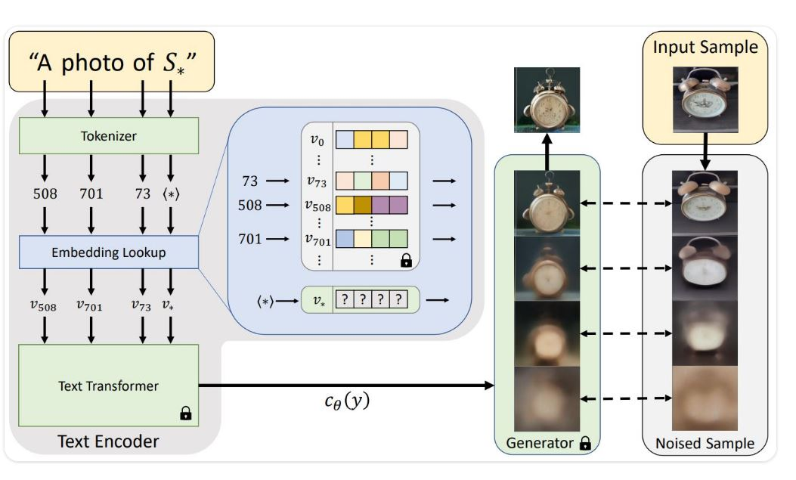

# [Textual Inversion](https://huggingface.co/docs/diffusers/training/text_inversion)

<br>

## Overview



## 试验

参照上述架构图，我用了几张鞋子的照片，做了类似尝试。关键词我就按照那个茶壶的关键词给，看一下试验效果。

关键词(虽然完全不是一回事，差的有点远)：
* Manga drawing of a *
* A * watering can
* * Death Star
* A poster for the movie 'The Teapot' starring *

原图类似这种：


四种提示的生成图如下(结果看客自己评价吧，不多说了)：
prompt = "Manga drawing of a <cat-toy>"


prompt = "A <cat-toy> watering can"


prompt = "<cat-toy> Death Star"


prompt = "A poster for the movie 'The Teapot' starring <cat-toy>"


<br>

## accelerate配置如下：

```
accelerate config
----------------------------------------------------------------------------------------------------------------------------------------------------In which compute environment are you running?
This machine
----------------------------------------------------------------------------------------------------------------------------------------------------Which type of machine are you using?
multi-GPU
How many different machines will you use (use more than 1 for multi-node training)? [1]:
Do you wish to optimize your script with torch dynamo?[yes/NO]:
Do you want to use DeepSpeed? [yes/NO]:
Do you want to use FullyShardedDataParallel? [yes/NO]:
Do you want to use Megatron-LM ? [yes/NO]:
How many GPU(s) should be used for distributed training? [1]:2
What GPU(s) (by id) should be used for training on this machine as a comma-seperated list? [all]:
----------------------------------------------------------------------------------------------------------------------------------------------------Do you wish to use FP16 or BF16 (mixed precision)?
bf16
accelerate configuration saved at /home/rtx/.cache/huggingface/accelerate/default_config.yaml

```

<br>

```

accelerate env

Copy-and-paste the text below in your GitHub issue

- `Accelerate` version: 0.17.0
- Platform: Linux-5.4.0-139-generic-x86_64-with-glibc2.17
- Python version: 3.8.16
- Numpy version: 1.24.2
- PyTorch version (GPU?): 1.13.1+cu117 (True)
- `Accelerate` default config:
        - compute_environment: LOCAL_MACHINE
        - distributed_type: MULTI_GPU
        - mixed_precision: bf16
        - use_cpu: False
        - num_processes: 2
        - machine_rank: 0
        - num_machines: 1
        - gpu_ids: all
        - rdzv_backend: static
        - same_network: True
        - main_training_function: main
        - deepspeed_config: {}
        - fsdp_config: {}
        - megatron_lm_config: {}
        - downcast_bf16: no
        - tpu_use_cluster: False
        - tpu_use_sudo: False
        - tpu_env: []
        - dynamo_config: {}

```

<br>

## 训练

* A full training run takes ~1 hour on one V100 GPU.
* 下面的训练是在两块rtxA6000上进行的，大约也是一个小时的训练时间。


```
git clone https://github.com/huggingface/diffusers.git

cd diffusers/examples/textual_inversion/


# prepare datasets
# 这里并没有下载到标准数据集，利用李宁鞋子的照片替代，但是名字还是用的猫的名字
mkdir cat_statue
cp /home/rtx/workspace/code/demo/nr/data/real/lining/images/DSC063*.jpg ./


export MODEL_NAME="runwayml/stable-diffusion-v1-5"
export DATA_DIR="cat_statue"

accelerate launch textual_inversion.py \
  --pretrained_model_name_or_path=$MODEL_NAME \
  --train_data_dir=$DATA_DIR \
  --learnable_property="object" \
  --placeholder_token="<cat-toy>" --initializer_token="toy" \
  --resolution=512 \
  --train_batch_size=1 \
  --gradient_accumulation_steps=4 \
  --max_train_steps=3000 \
  --learning_rate=5.0e-04 --scale_lr \
  --lr_scheduler="constant" \
  --lr_warmup_steps=0 \
  --output_dir="textual_inversion_cat"


# 解决完问题再次运行并将log写入log.tx

accelerate launch textual_inversion.py   --pretrained_model_name_or_path=$MODEL_NAME   --train_data_dir=$DATA_DIR   --learnable_property="object"   --placeholder_token="<cat-toy>" --initializer_token="toy"   --resolution=512   --train_batch_size=1   --gradient_accumulation_steps=4   --max_train_steps=3000   --learning_rate=5.0e-04 --scale_lr   --lr_scheduler="constant"   --lr_warmup_steps=0   --output_dir="textual_inversion_cat" | tee -a log.txt

```

<br>

```
accelerate launch textual_inversion.py --pretrained_model_name_or_path=$MODEL_NAME   --train_data_dir=$DATA_DIR   --learnable_property="object"   --placeholder_token="<cat-toy>" --initializer_token="toy$
   --resolution=512   --train_batch_size=1   --gradient_accumulation_steps=4   --max_train_steps=3000   --learning_rate=5.0e-04 --scale_lr   --lr_s$
heduler="constant"   --lr_warmup_steps=0   --output_dir="textual_inversion_cat" | tee -a log.txt

[10:48:16] WARNING  The following values were not passed to `accelerate launch` and had defaults used instead:                         launch.py:88$
                            `--dynamo_backend` was set to a value of `'no'`
                    To avoid this warning pass in values for each of the problematic parameters or run `accelerate config`.
/home/rtx/workspace/anaconda3/envs/lavis/lib/python3.8/site-packages/accelerate/accelerator.py:243: FutureWarning: `logging_dir` is deprecated and w
ill be removed in version 0.18.0 of 🤗 Accelerate. Use `project_dir` instead.
  warnings.warn(
/home/rtx/workspace/anaconda3/envs/lavis/lib/python3.8/site-packages/accelerate/accelerator.py:243: FutureWarning: `logging_dir` is deprecated and w
ill be removed in version 0.18.0 of 🤗 Accelerate. Use `project_dir` instead.
  warnings.warn(
03/13/2023 10:48:18 - INFO - __main__ - Distributed environment: MULTI_GPU  Backend: nccl
Num processes: 2
Process index: 0
Local process index: 0
Device: cuda:0

Mixed precision type: no

03/13/2023 10:48:18 - INFO - __main__ - Distributed environment: MULTI_GPU  Backend: nccl
Num processes: 2
Process index: 1
Local process index: 1
Device: cuda:1

Mixed precision type: no

{'dynamic_thresholding_ratio', 'prediction_type', 'clip_sample_range', 'variance_type', 'thresholding', 'sample_max_value'} was not found in config.
 Values will be initialized to default values.
{'scaling_factor'} was not found in config. Values will be initialized to default values.
{'resnet_time_scale_shift', 'timestep_post_act', 'mid_block_type', 'time_cond_proj_dim', 'num_class_embeds', 'use_linear_projection', 'conv_out_kern
el', 'dual_cross_attention', 'only_cross_attention', 'time_embedding_type', 'conv_in_kernel', 'upcast_attention', 'class_embed_type', 'projection_cl
ass_embeddings_input_dim'} was not found in config. Values will be initialized to default values.
03/13/2023 10:48:40 - INFO - __main__ - ***** Running training *****
03/13/2023 10:48:40 - INFO - __main__ -   Num examples = 1100
03/13/2023 10:48:40 - INFO - __main__ -   Num Epochs = 22
03/13/2023 10:48:40 - INFO - __main__ -   Instantaneous batch size per device = 1
03/13/2023 10:48:40 - INFO - __main__ -   Total train batch size (w. parallel, distributed & accumulation) = 8
03/13/2023 10:48:40 - INFO - __main__ -   Gradient Accumulation steps = 4
03/13/2023 10:48:40 - INFO - __main__ -   Total optimization steps = 3000
Steps:   0%|                                                                              | 1/3000 [00:20<17:26:08, 20.93s/it, loss=0.155, lr=0.004]
03/13/2023 10:49:01 - INFO - torch.nn.parallel.distributed - Reducer buckets have been rebuilt in this iteration.
03/13/2023 10:49:01 - INFO - torch.nn.parallel.distributed - Reducer buckets have been rebuilt in this iteration.
Steps:  17%|█████████████▏                                                                 | 500/3000 [09:58<48:29,  1.16s/it, loss=0.168, lr=0.004]
03/13/2023 10:58:39 - INFO - __main__ - Saving embeddings
03/13/2023 10:58:39 - INFO - accelerate.accelerator - Saving current state to textual_inversion_cat/checkpoint-500
03/13/2023 10:58:39 - INFO - accelerate.checkpointing - Model weights saved in textual_inversion_cat/checkpoint-500/pytorch_model.bin
03/13/2023 10:58:39 - INFO - accelerate.checkpointing - Optimizer state saved in textual_inversion_cat/checkpoint-500/optimizer.bin
03/13/2023 10:58:39 - INFO - accelerate.checkpointing - Scheduler state saved in textual_inversion_cat/checkpoint-500/scheduler.bin
03/13/2023 10:58:39 - INFO - accelerate.checkpointing - Random states saved in textual_inversion_cat/checkpoint-500/random_states_0.pkl
03/13/2023 10:58:39 - INFO - __main__ - Saved state to textual_inversion_cat/checkpoint-500
Steps:  33%|█████████████████████████▋                                                   | 1000/3000 [19:39<38:52,  1.17s/it, loss=0.0701, lr=0.004]
03/13/2023 11:08:20 - INFO - __main__ - Saving embeddings
03/13/2023 11:08:20 - INFO - accelerate.accelerator - Saving current state to textual_inversion_cat/checkpoint-1000
03/13/2023 11:08:20 - INFO - accelerate.checkpointing - Model weights saved in textual_inversion_cat/checkpoint-1000/pytorch_model.bin
03/13/2023 11:08:20 - INFO - accelerate.checkpointing - Optimizer state saved in textual_inversion_cat/checkpoint-1000/optimizer.bin
03/13/2023 11:08:20 - INFO - accelerate.checkpointing - Scheduler state saved in textual_inversion_cat/checkpoint-1000/scheduler.bin
03/13/2023 11:08:20 - INFO - accelerate.checkpointing - Random states saved in textual_inversion_cat/checkpoint-1000/random_states_0.pkl
03/13/2023 11:08:20 - INFO - __main__ - Saved state to textual_inversion_cat/checkpoint-1000
Steps:  50%|██████████████████████████████████████▌                                      | 1500/3000 [29:22<29:20,  1.17s/it, loss=0.0948, lr=0.004]
03/13/2023 11:18:02 - INFO - __main__ - Saving embeddings
03/13/2023 11:18:02 - INFO - accelerate.accelerator - Saving current state to textual_inversion_cat/checkpoint-1500
03/13/2023 11:18:03 - INFO - accelerate.checkpointing - Model weights saved in textual_inversion_cat/checkpoint-1500/pytorch_model.bin
03/13/2023 11:18:03 - INFO - accelerate.checkpointing - Optimizer state saved in textual_inversion_cat/checkpoint-1500/optimizer.bin
03/13/2023 11:18:03 - INFO - accelerate.checkpointing - Scheduler state saved in textual_inversion_cat/checkpoint-1500/scheduler.bin
03/13/2023 11:18:03 - INFO - accelerate.checkpointing - Random states saved in textual_inversion_cat/checkpoint-1500/random_states_0.pkl
03/13/2023 11:18:03 - INFO - __main__ - Saved state to textual_inversion_cat/checkpoint-1500
Steps:  67%|███████████████████████████████████████████████████▎                         | 2000/3000 [39:04<19:26,  1.17s/it, loss=0.0592, lr=0.004]
03/13/2023 11:27:44 - INFO - __main__ - Saving embeddings
03/13/2023 11:27:44 - INFO - accelerate.accelerator - Saving current state to textual_inversion_cat/checkpoint-2000
03/13/2023 11:27:45 - INFO - accelerate.checkpointing - Model weights saved in textual_inversion_cat/checkpoint-2000/pytorch_model.bin
03/13/2023 11:27:45 - INFO - accelerate.checkpointing - Optimizer state saved in textual_inversion_cat/checkpoint-2000/optimizer.bin
03/13/2023 11:27:45 - INFO - accelerate.checkpointing - Scheduler state saved in textual_inversion_cat/checkpoint-2000/scheduler.bin
03/13/2023 11:37:27 - INFO - accelerate.checkpointing - Random states saved in textual_inversion_cat/checkpoint-2500/random_states_0.pkl
03/13/2023 11:37:27 - INFO - __main__ - Saved state to textual_inversion_cat/checkpoint-2500
Steps: 100%|█████████████████████████████████████████████████████████████████████████████| 3000/3000 [58:30<00:00,  1.18s/it, loss=0.0188, lr=0.004]
03/13/2023 11:47:10 - INFO - __main__ - Saving embeddings
03/13/2023 11:47:10 - INFO - accelerate.accelerator - Saving current state to textual_inversion_cat/checkpoint-3000
03/13/2023 11:47:10 - INFO - accelerate.checkpointing - Model weights saved in textual_inversion_cat/checkpoint-3000/pytorch_model.bin
03/13/2023 11:47:11 - INFO - accelerate.checkpointing - Optimizer state saved in textual_inversion_cat/checkpoint-3000/optimizer.bin
03/13/2023 11:47:11 - INFO - accelerate.checkpointing - Scheduler state saved in textual_inversion_cat/checkpoint-3000/scheduler.bin
03/13/2023 11:47:11 - INFO - accelerate.checkpointing - Random states saved in textual_inversion_cat/checkpoint-3000/random_states_0.pkl
03/13/2023 11:47:11 - INFO - __main__ - Saved state to textual_inversion_cat/checkpoint-3000
Downloading pytorch_model.bin: 100%|███████████████████████████████████████████████████████████████████████████| 1.22G/1.22G [01:05<00:00, 18.6MB/s]
Fetching 15 files: 100%|████████████████████████████████████████████████████████████████████████████████████████████| 15/15 [01:07<00:00,  4.49s/it]
{'requires_safety_checker'} was not found in config. Values will be initialized to default values.                   | 4/15 [01:07<03:05, 16.84s/it]
{'prediction_type'} was not found in config. Values will be initialized to default values.
/home/rtx/workspace/anaconda3/envs/lavis/lib/python3.8/site-packages/transformers/models/clip/feature_extraction_clip.py:28: FutureWarning: The clas
s CLIPFeatureExtractor is deprecated and will be removed in version 5 of Transformers. Please use CLIPImageProcessor instead.
  warnings.warn(
Configuration saved in textual_inversion_cat/model_index.json
Configuration saved in textual_inversion_cat/vae/config.json
Model weights saved in textual_inversion_cat/vae/diffusion_pytorch_model.bin
Configuration saved in textual_inversion_cat/unet/config.json
Model weights saved in textual_inversion_cat/unet/diffusion_pytorch_model.bin
Configuration saved in textual_inversion_cat/scheduler/scheduler_config.json
03/13/2023 11:48:28 - INFO - __main__ - Saving embeddings
Steps: 100%|████████████████████████████████████████████████████████████████████████████| 3000/3000 [59:47<00:00,  1.20s/it, loss=0.00332, lr=0.004]
```


<br>

## 错误及解决方案

```

accelerate launch textual_inversion.py \
>   --pretrained_model_name_or_path=$MODEL_NAME \
>   --train_data_dir=$DATA_DIR \
>   --learnable_property="object" \
>   --placeholder_token="<cat-toy>" --initializer_token="toy" \
>   --resolution=512 \
>   --train_batch_size=1 \
>   --gradient_accumulation_steps=4 \
>   --max_train_steps=3000 \
>   --learning_rate=5.0e-04 --scale_lr \
>   --lr_scheduler="constant" \
>   --lr_warmup_steps=0 \
>   --output_dir="textual_inversion_cat"
╭─────────────────────────────── Traceback (most recent call last) ────────────────────────────────╮
│ /home/rtx/workspace/code/demo/diffusion/diffusers/examples/textual_inversion/textual_inversion.p │
│ y:81 in <module>                                                                                 │
│                                                                                                  │
│    78                                                                                            │
│    79                                                                                            │
│    80 # Will error if the minimal version of diffusers is not installed. Remove at your own ri   │
│ ❱  81 check_min_version("0.15.0.dev0")                                                           │
│    82                                                                                            │
│    83 logger = get_logger(__name__)                                                              │
│    84                                                                                            │
│                                                                                                  │
│ /home/rtx/workspace/anaconda3/envs/lavis/lib/python3.8/site-packages/diffusers/utils/__init__.py │
│ :105 in check_min_version                                                                        │
│                                                                                                  │
│   102 │   │   else:                                                                              │
│   103 │   │   │   error_message = f"This example requires a minimum version of {min_version},"   │
│   104 │   │   error_message += f" but the version found is {__version__}.\n"                     │
│ ❱ 105 │   │   raise ImportError(error_message)                                                   │
│   106                                                                                            │
╰──────────────────────────────────────────────────────────────────────────────────────────────────╯
ImportError: This example requires a source install from HuggingFace diffusers (see
`https://huggingface.co/docs/diffusers/installation#install-from-source`), but the version found is 0.14.0.

╭─────────────────────────────── Traceback (most recent call last) ────────────────────────────────╮
│ /home/rtx/workspace/code/demo/diffusion/diffusers/examples/textual_inversion/textual_inversion.p │
│ y:81 in <module>                                                                                 │
│                                                                                                  │
│    78                                                                                            │
│    79                                                                                            │
│    80 # Will error if the minimal version of diffusers is not installed. Remove at your own ri   │
│ ❱  81 check_min_version("0.15.0.dev0")                                                           │
│    82                                                                                            │
│    83 logger = get_logger(__name__)                                                              │
│    84                                                                                            │
│                                                                                                  │
│ /home/rtx/workspace/anaconda3/envs/lavis/lib/python3.8/site-packages/diffusers/utils/__init__.py │
│ :105 in check_min_version                                                                        │
│                                                                                                  │
│   102 │   │   else:                                                                              │
│   103 │   │   │   error_message = f"This example requires a minimum version of {min_version},"   │
│   104 │   │   error_message += f" but the version found is {__version__}.\n"                     │
│ ❱ 105 │   │   raise ImportError(error_message)                                                   │
│   106                                                                                            │
╰──────────────────────────────────────────────────────────────────────────────────────────────────╯
ImportError: This example requires a source install from HuggingFace diffusers (see
`https://huggingface.co/docs/diffusers/installation#install-from-source`), but the version found is 0.14.0.

[10:28:51] ERROR    failed (exitcode: 1) local_rank: 0 (pid: 8206) of binary: /home/rtx/workspace/anaconda3/envs/lavis/bin/python         api.py:673
╭─────────────────────────────── Traceback (most recent call last) ────────────────────────────────╮
│ /home/rtx/workspace/anaconda3/envs/lavis/bin/accelerate:8 in <module>                            │
│                                                                                                  │
│   5 from accelerate.commands.accelerate_cli import main                                          │
│   6 if __name__ == '__main__':                                                                   │
│   7 │   sys.argv[0] = re.sub(r'(-script\.pyw|\.exe)?$', '', sys.argv[0])                         │
│ ❱ 8 │   sys.exit(main())                                                                         │
│   9                                                                                              │
│                                                                                                  │
│ /home/rtx/workspace/anaconda3/envs/lavis/lib/python3.8/site-packages/accelerate/commands/acceler │
│ ate_cli.py:45 in main                                                                            │
│                                                                                                  │
│   42 │   │   exit(1)                                                                             │
│   43 │                                                                                           │
│   44 │   # Run                                                                                   │
│ ❱ 45 │   args.func(args)                                                                         │
│   46                                                                                             │
│   47                                                                                             │
│   48 if __name__ == "__main__":                                                                  │
│                                                                                                  │
│ /home/rtx/workspace/anaconda3/envs/lavis/lib/python3.8/site-packages/accelerate/commands/launch. │
│ py:906 in launch_command                                                                         │
│                                                                                                  │
│   903 │   elif args.use_megatron_lm and not args.cpu:                                            │
│   904 │   │   multi_gpu_launcher(args)                                                           │
│   905 │   elif args.multi_gpu and not args.cpu:                                                  │
│ ❱ 906 │   │   multi_gpu_launcher(args)                                                           │
│   907 │   elif args.tpu and not args.cpu:                                                        │
│   908 │   │   if args.tpu_cluster:                                                               │
│   909 │   │   │   tpu_pod_launcher(args)                                                         │
│                                                                                                  │
│ /home/rtx/workspace/anaconda3/envs/lavis/lib/python3.8/site-packages/accelerate/commands/launch. │
│ py:599 in multi_gpu_launcher                                                                     │
│                                                                                                  │
│   596 │   )                                                                                      │
│   597 │   with patch_environment(**current_env):                                                 │
│   598 │   │   try:                                                                               │
│ ❱ 599 │   │   │   distrib_run.run(args)                                                          │
│   600 │   │   except Exception:                                                                  │
│   601 │   │   │   if is_rich_available() and debug:                                              │
│   602 │   │   │   │   console = get_console()                                                    │
│                                                                                                  │
│ /home/rtx/workspace/anaconda3/envs/lavis/lib/python3.8/site-packages/torch/distributed/run.py:75 │
│ 3 in run                                                                                         │
│                                                                                                  │
│   750 │   │   )                                                                                  │
│   751 │                                                                                          │
│   752 │   config, cmd, cmd_args = config_from_args(args)                                         │
│ ❱ 753 │   elastic_launch(                                                                        │
│   754 │   │   config=config,                                                                     │
│   755 │   │   entrypoint=cmd,                                                                    │
│   756 │   )(*cmd_args)                                                                           │
│                                                                                                  │
│ /home/rtx/workspace/anaconda3/envs/lavis/lib/python3.8/site-packages/torch/distributed/launcher/ │
│ api.py:132 in __call__                                                                           │
│                                                                                                  │
│   129 │   │   self._entrypoint = entrypoint                                                      │
│   130 │                                                                                          │
│   131 │   def __call__(self, *args):                                                             │
│ ❱ 132 │   │   return launch_agent(self._config, self._entrypoint, list(args))                    │
│   133                                                                                            │
│   134                                                                                            │
│   135 def _get_entrypoint_name(                                                                  │
│                                                                                                  │
│ /home/rtx/workspace/anaconda3/envs/lavis/lib/python3.8/site-packages/torch/distributed/launcher/ │
│ api.py:246 in launch_agent                                                                       │
│                                                                                                  │
│   243 │   │   │   # if the error files for the failed children exist                             │
│   244 │   │   │   # @record will copy the first error (root cause)                               │
│   245 │   │   │   # to the error file of the launcher process.                                   │
│ ❱ 246 │   │   │   raise ChildFailedError(                                                        │
│   247 │   │   │   │   name=entrypoint_name,                                                      │
│   248 │   │   │   │   failures=result.failures,                                                  │
│   249 │   │   │   )                                                                              │
╰──────────────────────────────────────────────────────────────────────────────────────────────────╯
ChildFailedError:
============================================================
textual_inversion.py FAILED
------------------------------------------------------------
Failures:
[1]:
  time      : 2023-03-13_10:28:51
  host      : rtxA6000
  rank      : 1 (local_rank: 1)
  exitcode  : 1 (pid: 8207)
  error_file: <N/A>
  traceback : To enable traceback see: https://pytorch.org/docs/stable/elastic/errors.html
------------------------------------------------------------
Root Cause (first observed failure):
[0]:
  time      : 2023-03-13_10:28:51
  host      : rtxA6000
  rank      : 0 (local_rank: 0)
  exitcode  : 1 (pid: 8206)
  error_file: <N/A>
  traceback : To enable traceback see: https://pytorch.org/docs/stable/elastic/errors.html


```

1. 这里运行的程序并未完全按照参考网页，我们直接从github的源代码运行，从提示来看，我们需要从源码编译安装`diffusers`, `ImportError: This example requires a source install from HuggingFace diffusers (see
`https://huggingface.co/docs/diffusers/installation#install-from-source`), but the version found is 0.14.0.`
   * 参照：https://huggingface.co/docs/diffusers/installation#install-from-source
     * ```pip install git+https://github.com/huggingface/diffusers```


<br>

## 资源占用

```
nvidia-smi
Mon Mar 13 10:55:48 2023
+-----------------------------------------------------------------------------+
| NVIDIA-SMI 525.85.12    Driver Version: 525.85.12    CUDA Version: 12.0     |
|-------------------------------+----------------------+----------------------+
| GPU  Name        Persistence-M| Bus-Id        Disp.A | Volatile Uncorr. ECC |
| Fan  Temp  Perf  Pwr:Usage/Cap|         Memory-Usage | GPU-Util  Compute M. |
|                               |                      |               MIG M. |
|===============================+======================+======================|
|   0  NVIDIA RTX 6000...  On   | 00000000:01:00.0 Off |                  Off |
| 65%   86C    P2   265W / 300W |  12146MiB / 49140MiB |    100%      Default |
|                               |                      |                  N/A |
+-------------------------------+----------------------+----------------------+
|   1  NVIDIA RTX A6000    On   | 00000000:05:00.0 Off |                  Off |
| 69%   86C    P2   260W / 300W |  11868MiB / 49140MiB |     91%      Default |
|                               |                      |                  N/A |
+-------------------------------+----------------------+----------------------+

+-----------------------------------------------------------------------------+
| Processes:                                                                  |
|  GPU   GI   CI        PID   Type   Process name                  GPU Memory |
|        ID   ID                                                   Usage      |
|=============================================================================|
|    0   N/A  N/A     18353      C   ...da3/envs/lavis/bin/python    12120MiB |
|    0   N/A  N/A     29803      G   /usr/lib/xorg/Xorg                 22MiB |
|    1   N/A  N/A     18354      C   ...da3/envs/lavis/bin/python    11860MiB |
|    1   N/A  N/A     29803      G   /usr/lib/xorg/Xorg                  4MiB |
+-----------------------------------------------------------------------------+

```

<br>

## Inference

```
import torch

from diffusers import StableDiffusionPipeline

model_id = "path-to-your-trained-model"
pipe = StableDiffusionPipeline.from_pretrained(model_id, torch_dtype=torch.float16).to("cuda")

prompt = "A <cat-toy> backpack"

# prompt = "Manga drawing of a <cat-toy>"
# prompt = "A <cat-toy> watering can"
# prompt = "<cat-toy> Death Star"
# prompt = "A poster for the movie 'The Teapot' starring <cat-toy>"

image = pipe(prompt, num_inference_steps=50, guidance_scale=7.5).images[0]

image.save("cat-backpack.png")
```