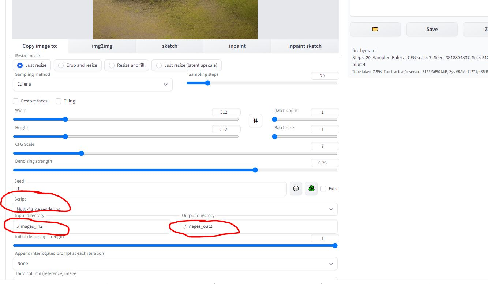

# [Multi-frame rendering](https://github.com/OedoSoldier/enhanced-img2img)

[(Beta) Multi-frame Video rendering for StableDiffusion](https://xanthius.itch.io/multi-frame-rendering-for-stablediffusion)

参考：
* [Extensions](https://github.com/AUTOMATIC1111/stable-diffusion-webui/wiki/Extensions)
* [Multi-frame rendering](https://github.com/OedoSoldier/enhanced-img2img): 原文的几个视频链接，**一定要看**。连续帧生产视频对原始输入的要求应该很高，我随便使用的视频，输入结果很差。
  * [AI动画制作指南【工具发布】](https://www.bilibili.com/video/BV1pv4y1o7An/?vd_source=2ef7e92f2d522c31939f486aea77a19e)
  * [【AI动画】多帧渲染法 介绍及使用](https://www.bilibili.com/video/BV1R54y1M7u5/?vd_source=2ef7e92f2d522c31939f486aea77a19e)


<br>

## 安装使用过程

1. 先要安装[AUTOMATIC1111/stable-diffusion-webui](https://github.com/AUTOMATIC1111/stable-diffusion-webui)
```
conda create --name webui python=3.10
conda activate webui

git clone https://github.com/AUTOMATIC1111/stable-diffusion-webui.git

cd stable-diffusion-webui

# 这个过程中会安装依赖并启动ui程序，过程中报错遇到缺失的库，pip安装一下即可
./webui.sh

```

2. [Multi-frame rendering](https://github.com/OedoSoldier/enhanced-img2img)是webui的一个扩展，只需要在：

```
# 切换到extension文件夹
# cd stable-diffusion-webui/extensions
# 或
cd extensions

# 在extensions文件夹下执行git clone操作
git clone https://github.com/OedoSoldier/enhanced-img2img
```

3. 如果需要再外网访问webui，修改`webui.py`文件中`def webui()`函数中`share=True`：
```

    app, local_url, share_url = shared.demo.launch(
        share=True,
        server_name=server_name,
        server_port=cmd_opts.port,
        ssl_keyfile=cmd_opts.tls_keyfile,
        ssl_certfile=cmd_opts.tls_certfile,
        debug=cmd_opts.gradio_debug,
        auth=[tuple(cred.split(':')) for cred in gradio_auth_creds] if gradio_auth_creds else None,
        inbrowser=cmd_opts.autolaunch,
        prevent_thread_lock=True
    )

```

4. 然后启动程序`webui.sh`，即可通过外网访问。

```
(webui) rtx@rtxA6000:~/workspace/code/demo/diffusion/stable-diffusion-webui$ ./webui.sh

################################################################
Install script for stable-diffusion + Web UI
Tested on Debian 11 (Bullseye)
################################################################

################################################################
Running on rtx user
################################################################

################################################################
Repo already cloned, using it as install directory
################################################################

################################################################
Create and activate python venv
################################################################

################################################################
Launching launch.py...
################################################################
Python 3.10.9 (main, Mar  8 2023, 10:47:38) [GCC 11.2.0]
Commit hash: dfeee786f903e392dbef1519c7c246b9856ebab3
Installing requirements for Web UI
Launching Web UI with arguments:
No module 'xformers'. Proceeding without it.
Loading weights [6ce0161689] from /home/rtx/workspace/code/demo/diffusion/stable-diffusion-webui/models/Stable-diffusion/v1-5-pruned-emaonly.safetensors
Creating model from config: /home/rtx/workspace/code/demo/diffusion/stable-diffusion-webui/configs/v1-inference.yaml
LatentDiffusion: Running in eps-prediction mode
DiffusionWrapper has 859.52 M params.
Applying cross attention optimization (Doggettx).
Textual inversion embeddings loaded(0):
Model loaded in 3.1s (create model: 0.3s, apply weights to model: 0.4s, apply half(): 0.3s, load VAE: 1.6s, move model to device: 0.5s).
Running on local URL:  http://127.0.0.1:7860
Running on public URL: https://5f089a60-3bc0-4437.gradio.live

This share link expires in 72 hours. For free permanent hosting and GPU upgrades (NEW!), check out Spaces: https://huggingface.co/spaces
Startup time: 8.3s (import gradio: 1.4s, import ldm: 0.3s, other imports: 1.0s, load scripts: 0.2s, load SD checkpoint: 3.1s, gradio launch: 2.3s).

```

<br>

## 准备数据

这里的数据，我采用先录制一段视频，然后利用`ffmpeg`抽帧成图像作为输入数据，处理完成的图像再利用`ffmpeg`拼装成视频。

参照：
* [FFMPEG- Convert video to images](https://stackoverflow.com/questions/40088222/ffmpeg-convert-video-to-images)
* [convert from jpg to mp4 by ffmpeg](https://stackoverflow.com/questions/22965569/convert-from-jpg-to-mp4-by-ffmpeg)


生成图像： 
```
# ffmpeg -i IMG_8244.MOV -vf fps=10 images_in2/*.jpg

ffmpeg -i videos/human.mp4 -vf fps=10 images_in/out%d.jpg
```

`fps=10`代表每秒抽取10帧。

结果合成图像：
```
# 抽帧后的输入和输出图像都合成结果，生产格式（avi,mp4,mov等都可以，用户可以按照需求指定）
ffmpeg -f image2 -i images_in2/out%d.jpg in2.avi
ffmpeg -f image2 -i images_out2/out%d.jpg out2.avi

```

## 视频生成

参考：[(Beta) Multi-frame Video rendering for StableDiffusion](https://xanthius.itch.io/multi-frame-rendering-for-stablediffusion)

1. 选择`img2img`选项卡，在`script`下选择`Multi-frame rendering`，并指定`Input directory`和`Output directory`;
2. 输入适当的prompt；
3. 其它设置可以参考上述连接，**这里需要细调，想调出好的结果并不容易**。



<br>

## 结果

实验的输入，我用的是绕消防栓拍了一圈，生成的视频如下：（效果很差，看来还有很长的路要走啊）

<video src="./images/multi-frame/out2.mp4" controls="controls" style="max-width: 730px;"></video>


