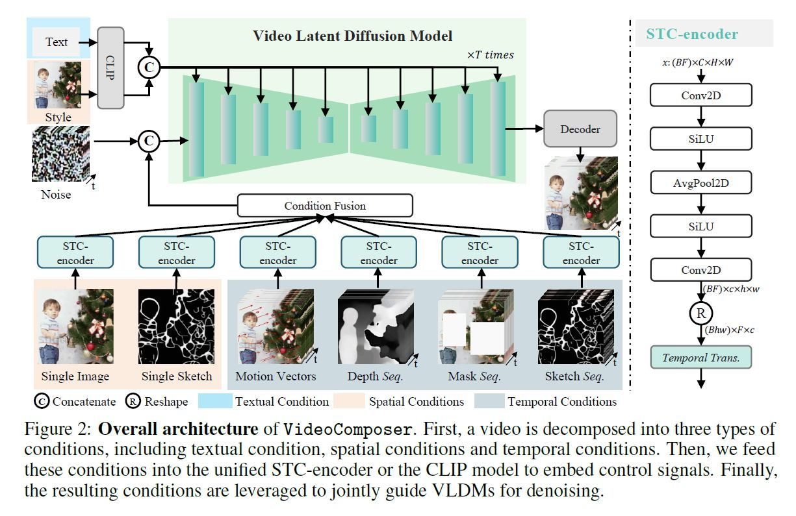

## [VideoComposer: Compositional Video Synthesis with Motion Controllability](https://videocomposer.github.io/)

> The pursuit of controllability as a higher standard of visual content creation has yielded remarkable progress in customizable image synthesis. However, achieving controllable video synthesis remains challenging due to the large variation of temporal dynamics and the requirement of cross-frame temporal consistency. Based on the paradigm of compositional generation, this work presents VideoCompoer that allows users to flexibly compose a video with textual conditions, spatial conditions, and more importantly temporal conditions. Specifically, considering the characteristic of video data, we introduce the motion vector from compressed videos as an explicit control signal to provide guidance regarding temporal dynamics. In addition, we develop a Spatio-Temporal Condition encoder (STC-encoder) that serves as a unified interface to effectively incorporate the spatial and temporal relations of sequential inputs, with which the model could make better use of temporal conditions and hence achieve higher inter-frame consistency. Extensive experimental results suggest that VideoCompoer is able to control the spatial and temporal patterns simultaneously within a synthesized video in various forms, such as text description, sketch sequence, reference video, or even simply hand-crafted motions. Code and models will be made publicly available.
>
> 关键词：VideoComposer, textual conditions, spatial conditions, temporal conditions, motion vector, Spatio-Temporal Condition encoder(STC-encoder)

**Video as composable conditions**
* **Textual condition**
  * Textual descriptions provide an intuitive indication of videos in terms of **coarse grained visual content and motions**
  * pre-trained text encoder from **OpenCLIP2 ViT-H/14** to obtain **semantic embeddings of text descriptions**
* **Spatial conditions**
  * To achieve **fine-grained** spatial control and diverse stylization, we apply three spatial conditions to provide structural and stylistic guidance
    * **Single Image**: select the first frame of a given video as a spatial condition to perform image-to-video generation.
    * **Single sketch**: extract sketch of the first video frame using PiDiNet.
    * **Style**: apply a pre-trained image encoder from OpenCLIP ViT-H/14 to extract the stylistic representation.
* **Temporal conditions**
  * finer control along the temporal dimension
    * **Motion vector**
    * **Depth Sequence**
    * **Mask Sequence**
    * **Sketch Sequence**
* **STC-encoder**
  * Specifically, a light-weight **spatial architecture** consisting of **two 2D convolutions and an average pooling layer** is first applied to the input sequences, aiming to **extract local spatial information**. 
  * Subsequently, the resulting condition sequence is fed into a **temporal Transformer layer for temporal modeling**.
  * It is worth noting that we **repeat the spatial conditions of a single image and single sketch along the temporal dimension** to ensure their consistency with temporal conditions, hence facilitating the condition fusion process. 

**Training and Inference**
* **Two-stage training strategy**
  * **first stage**: the first stage targets pre-training the model to specialize in temporal modeling through text-to-video generation. 
  * **second stage**: optimize VideoComposer to excel in video synthesis controlled by the diverse conditions through compositional training. 

**Datasets**
* WebVid10M and LAION-400M. 
* WebVid10M is a large-scale benchmark scrapped from the web that contains 10.3M video-caption pairs. LAION-400M is an imagecaption paired dataset, filtered using CLIP. 

**Conclusions**
* In this paper, we present VideoComposer, which aims to explore the compositionality within the realm of video synthesis, striving to obtain a flexible and controllable synthesis system. In particular, we explore the use of temporal conditions for videos, specifically motion vectors, as powerful control signals to provide guidance in terms of temporal dynamics. An STC-encoder is further designed as a unified interface to aggregate the spatial and temporal dependencies of the sequential inputs for inter-frame consistency. Our experiments, which involve the combination of various conditions to augment controllability, underscore the pivotal role of our design choices and reveal the impressive creativity of the proposed VideoComposer.

**More implementation details**
* In total, VideoComposer is pre-trained for **400k steps**, with the first and second stage being pre-trained for **132k steps** and **268k steps**, respectively. In terms of two-stage pre-training, we allocate **one fourth of GPUs** to perform **image pre-training**, while **the rest of the GPUs** are dedicated to **video pre-training**.
* use center crop and randomly sample video frames to compose the video **input whose F = 16, H = 256 and W = 256**.
* During the second stage pre-training, we adhere to [26], using a probability of 0.1 to keep all conditions, a probability of 0.1 to discard all conditions, and an independent probability of 0.5 to keep or discard a specific condition.
* **The structure of 3D UNet as ϵθ(·, ·, t)**
  * To leverage the benefits of LDMs pre-trained on web-scale
image data, i.e., Stable Diffusion3, we extend the 2D UNet to a 3D UNet by introducing temporal modeling layers. Specifically, within a single UNet block, we employ four essential building blocks: spatial convolution, temporal convolution, spatial transformer and temporal transformer. The spatial blocks are inherited from LDMs, while temporal processing blocks are newly introduced. Regarding temporal convolution, we stack four convolutions with 1 × 1 × 3 kernel, ensuring the temporal receptive field is ample for capturing temporal dependencies; regarding temporal transformer, we stack one Transformer layer and accelerate its inference using flash attention. 
  * **TODO:待有源码了，再补充这部分的细节** 

**Limitations**
* **Due to the absence of a publicly available large-scale and high-quality dataset, we have developed VideoComposer using the watermarked WebVid10M dataset.**
* Furthermore, in order to reduce the training cost, the resolution of the generated videos is limited to 256×256. Consequently, some delicate details might not be sufficiently clear. **In the future, we plan to utilize super-resolution models to expand the resolution of the generated videos to improve the visual quality**. 

  

