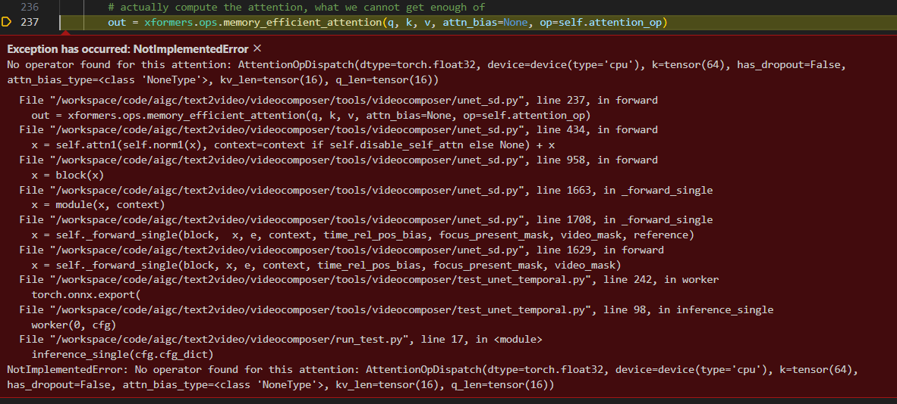
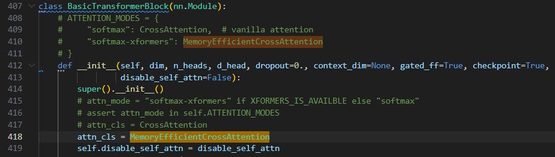
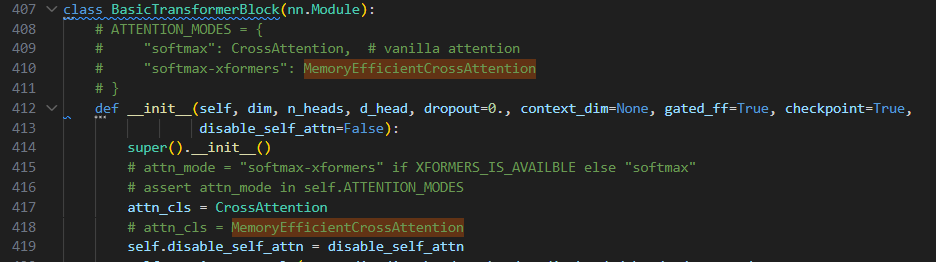
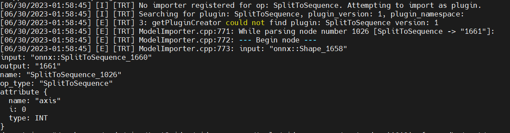
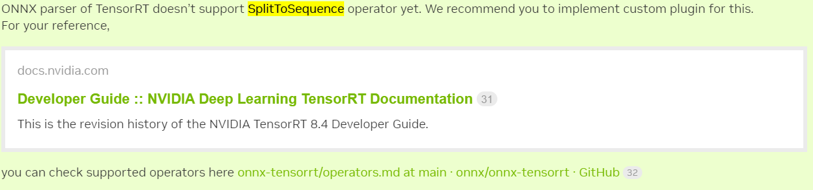
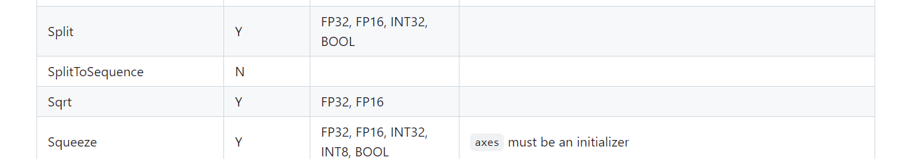

## VideoComposer环境构建

```

docker run --shm-size=10gb --gpus all -it --name TextComposer2 -p 6222:22 -p 6206:6006 -p 6264:6064 -p 6288:8888 -v /home/rtx/workspace/docker_workspace:/workspace nvcr.io/nvidia/cuda:11.3.0-cudnn8-devel-ubuntu20.04

cd /workspace/pkg/

source /root/anaconda3/etc/profile.d/conda.sh


cd cd /workspace/code/aigc/text2video/videocomposer/

# ref: https://github.com/damo-vilab/videocomposer/tree/main

conda env create -f environment.yaml

conda activate VideoComposer


#ref: https://pytorch.org/get-started/previous-versions/#linux-and-windows-9

pip install torch==1.12.0+cu113 torchvision==0.13.0+cu113 torchaudio==0.12.0 --extra-index-url https://download.pytorch.org/whl/cu113


pip install open-clip-torch==2.0.2
pip install transformers==4.18.0


# ref: https://www.digitalocean.com/community/tutorials/how-to-install-git-on-ubuntu-20-04

apt update
apt install git


pip install flash-attn==0.2
pip install xformers==0.0.13
pip install motion-vector-extractor==1.0.6


# dependency
pip install scikit-image
pip install scikit-video

apt-get install ffmpeg


pip install simplejson
pip install pynvml
pip install easydict
pip install fairscale
pip install oss2
pip install ipdb
pip install rotary_embedding_torch
pip install pytorch_lightning
pip install triton==2.0.0.dev20221120

# 这个很重要
pip install imageio==2.15.0 --upgrade

```

看情况使用：

```
pip install scikit-image==0.20.0
pip install scikit-video==1.1.11
pip install simplejson==3.18.4
pip install pynvml==11.5.0
pip install easydict==1.10
pip install fairscale==0.4.6
pip install oss2==2.17.0
pip install ipdb==0.13.13
pip install rotary_embedding_torch
pip install pytorch_lightning
pip install triton==2.0.0.dev20221120


pip install scikit-image==0.20.0 --upgrade
pip install scikit-video==1.1.11 --upgrade
pip install simplejson==3.18.4 --upgrade
pip install pynvml==11.5.0 --upgrade
pip install easydict==1.10 --upgrade
pip install fairscale==0.4.6 --upgrade
pip install oss2==2.17.0 --upgrade
pip install ipdb==0.13.13 --upgrade
pip install triton==2.0.0.dev20221120 --upgrade
pip install rotary_embedding_torch
pip install pytorch_lightning
```


远程连接vscode：

```
apt-get update    // 这一步视情况执行，有时不执行也不影响后续
apt-get install openssh-server 

passwd 

apt install vim
vim /etc/ssh/sshd_config

add: PermitRootLogin yes

service ssh restart

```

<br>

## `tools/videocomposer/unet_sd.py` TensorRT转换

文件路径：`tools/videocomposer/unet_sd.py`

### 1次尝试

pytorch version: 1.12

```
    model.eval()
    with torch.no_grad():
        torch.onnx.export(
            model, 
            tuple(dummy_inputs.values()), 
            onnx_path, 
            export_params=False, 
            verbose=True, 
            # opset_version=17, 
            do_constant_folding=True, 
            input_names=list(dummy_inputs.keys()), 
            output_names=output_names
        )
```

使用默认的`tools/videocomposer/unet_sd.py`代码，会出现如下错误：



**TODO: 有几件事情需要验证一下**

- [ ] `opset_version`，这里`opset_version`的版本不能设置太高，这是pytorch版本的限制还是其它原因
- [ ] 这是`xformer`的限制，还是`opset_version`的限制
- [ ] `pytorch`和`xformer`都更新到最新版本，这个问题是否还在？


目前的解决方案是需要修改`tools/videocomposer/unet_sd.py`的代码：



将`attn_cls = MemoryEfficientCrossAttention`修改为`attn_cls = CrossAttention`



接下来可以成功导出`onnx`文件：`tools/videocomposer/onnx/unetsd_temporal.onnx`，然后进行`TensorRT`转换的尝试：

TRT版本信息如下： `TensorRT.trtexec [TensorRT v8601] # trtexec`

转换命令：

```
trtexec --onnx=./onnx/unetsd_temporal.onnx --saveEngine=./engine/unetsd_temporal.plan
```

会出现如下错误：

```
[06/30/2023-01:58:45] [I] Start parsing network model.
[06/30/2023-01:58:45] [I] [TRT] ----------------------------------------------------------------
[06/30/2023-01:58:45] [I] [TRT] Input filename:   ./onnx/unetsd_temporal.onnx
[06/30/2023-01:58:45] [I] [TRT] ONNX IR version:  0.0.7
[06/30/2023-01:58:45] [I] [TRT] Opset version:    13
[06/30/2023-01:58:45] [I] [TRT] Producer name:    pytorch
[06/30/2023-01:58:45] [I] [TRT] Producer version: 1.12.0
[06/30/2023-01:58:45] [I] [TRT] Domain:
[06/30/2023-01:58:45] [I] [TRT] Model version:    0
[06/30/2023-01:58:45] [I] [TRT] Doc string:
[06/30/2023-01:58:45] [I] [TRT] ----------------------------------------------------------------
[06/30/2023-01:58:45] [W] [TRT] onnx2trt_utils.cpp:374: Your ONNX model has been generated with INT64 weights, while TensorRT does not natively support INT64. Attempting to cast down to INT32.
[06/30/2023-01:58:45] [I] [TRT] No importer registered for op: SplitToSequence. Attempting to import as plugin.
[06/30/2023-01:58:45] [I] [TRT] Searching for plugin: SplitToSequence, plugin_version: 1, plugin_namespace:
[06/30/2023-01:58:45] [E] [TRT] 3: getPluginCreator could not find plugin: SplitToSequence version: 1
[06/30/2023-01:58:45] [E] [TRT] ModelImporter.cpp:771: While parsing node number 1026 [SplitToSequence -> "1661"]:
[06/30/2023-01:58:45] [E] [TRT] ModelImporter.cpp:772: --- Begin node ---
[06/30/2023-01:58:45] [E] [TRT] ModelImporter.cpp:773: input: "onnx::Shape_1658"
input: "onnx::SplitToSequence_1660"
output: "1661"
name: "SplitToSequence_1026"
op_type: "SplitToSequence"
attribute {
  name: "axis"
  i: 0
  type: INT
}
doc_string: "/workspace/code/aigc/text2video/videocomposer/tools/videocomposer/unet_sd.py(1619): forward\n/root/anaconda3/envs/VideoComposer/lib/python3.8/site-packages/torch/nn/modules/module.py(1118): _slow_forward\n/root/anaconda3/envs/VideoComposer/lib/python3.8/site-packages/torch/nn/modules/module.py(1130): _call_impl\n/root/anaconda3/envs/VideoComposer/lib/python3.8/site-packages/torch/jit/_trace.py(118): wrapper\n/root/anaconda3/envs/VideoComposer/lib/python3.8/site-packages/torch/jit/_trace.py(127): forward\n/root/anaconda3/envs/VideoComposer/lib/python3.8/site-packages/torch/nn/modules/module.py(1130): _call_impl\n/root/anaconda3/envs/VideoComposer/lib/python3.8/site-packages/torch/jit/_trace.py(1175): _get_trace_graph\n/root/anaconda3/envs/VideoComposer/lib/python3.8/site-packages/torch/onnx/utils.py(517): _trace_and_get_graph_from_model\n/root/anaconda3/envs/VideoComposer/lib/python3.8/site-packages/torch/onnx/utils.py(602): _create_jit_graph\n/root/anaconda3/envs/VideoComposer/lib/python3.8/site-packages/torch/onnx/utils.py(727): _model_to_graph\n/root/anaconda3/envs/VideoComposer/lib/python3.8/site-packages/torch/onnx/utils.py(1074): _export\n/root/anaconda3/envs/VideoComposer/lib/python3.8/site-packages/torch/onnx/utils.py(163): export\n/root/anaconda3/envs/VideoComposer/lib/python3.8/site-packages/torch/onnx/__init__.py(350): export\n/workspace/code/aigc/text2video/videocomposer/tools/videocomposer/test_unet_temporal.py(242): worker\n/workspace/code/aigc/text2video/videocomposer/tools/videocomposer/test_unet_temporal.py(98): inference_single\n/workspace/code/aigc/text2video/videocomposer/run_test.py(17): <module>\n/root/.vscode-server/extensions/ms-python.python-2023.10.1/pythonFiles/lib/python/debugpy/_vendored/pydevd/_pydevd_bundle/pydevd_runpy.py(124): _run_code\n/root/.vscode-server/extensions/ms-python.python-2023.10.1/pythonFiles/lib/python/debugpy/_vendored/pydevd/_pydevd_bundle/pydevd_runpy.py(135): _run_module_code\n/root/.vscode-server/extensions/ms-python.python-2023.10.1/pythonFiles/lib/python/debugpy/_vendored/pydevd/_pydevd_bundle/pydevd_runpy.py(321): run_path\n/root/.vscode-server/extensions/ms-python.python-2023.10.1/pythonFiles/lib/python/debugpy/adapter/../../debugpy/launcher/../../debugpy/../debugpy/server/cli.py(284): run_file\n/root/.vscode-server/extensions/ms-python.python-2023.10.1/pythonFiles/lib/python/debugpy/adapter/../../debugpy/launcher/../../debugpy/../debugpy/server/cli.py(430): main\n/root/.vscode-server/extensions/ms-python.python-2023.10.1/pythonFiles/lib/python/debugpy/adapter/../../debugpy/launcher/../../debugpy/__main__.py(39): <module>\n/root/anaconda3/envs/VideoComposer/lib/python3.8/runpy.py(87): _run_code\n/root/anaconda3/envs/VideoComposer/lib/python3.8/runpy.py(194): _run_module_as_main\n"

[06/30/2023-01:58:45] [E] [TRT] ModelImporter.cpp:774: --- End node ---
[06/30/2023-01:58:45] [E] [TRT] ModelImporter.cpp:777: ERROR: builtin_op_importers.cpp:5402 In function importFallbackPluginImporter:
[8] Assertion failed: creator && "Plugin not found, are the plugin name, version, and namespace correct?"
[06/30/2023-01:58:45] [E] Failed to parse onnx file
[06/30/2023-01:58:45] [I] Finished parsing network model. Parse time: 0.269857
[06/30/2023-01:58:45] [E] Parsing model failed
[06/30/2023-01:58:45] [E] Failed to create engine from model or file.
[06/30/2023-01:58:45] [E] Engine set up failed
```



查找原因：
1. onnx中对`SplitToSequence`的支持，可以查看如下文件`https://github.com/onnx/onnx/blob/main/onnx/defs/operator_sets.h#L593`，会发现`class ONNX_OPERATOR_SET_SCHEMA_CLASS_NAME(Onnx, 11, SplitToSequence);`，在`opset_version=11`的时候就有支持。
2. 查找类似的错误：[Convert Mask-RCNN in PyTorch to TensorRT (SplitToSequence)](https://forums.developer.nvidia.com/t/convert-mask-rcnn-in-pytorch-to-tensorrt-splittosequence/178384)
   * > ONNX parser of TensorRT doesn’t support SplitToSequence operator yet. We recommend you to implement custom plugin for this.
   * 
   * 我们可以在如下文件 [Supported ONNX Operators](https://github.com/onnx/onnx-tensorrt/blob/main/docs/operators.md#supported-onnx-operators) 查找`ONNX-TensorRT`支持的`op`，会发现`SplitToSequence`的`op`还不支持；
   * 
   * 这个`op`需要我们自己实现才能解决问题。