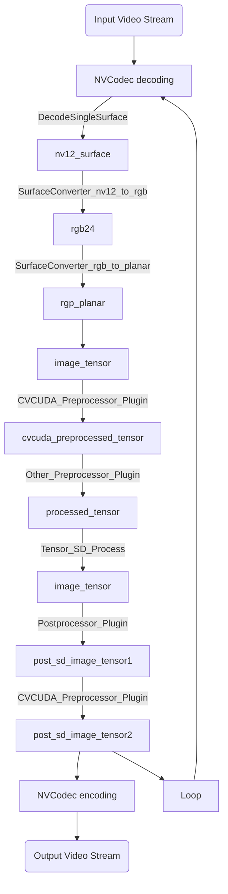

```mermaid
graph TB
    A(Input Video Stream) --> B[NVCodec decoding]

    B[NVCodec decoding] --DecodeSingleSurface--> C[nv12_surface]
    C[nv12_surface] --SurfaceConverter_nv12_to_rgb--> D[rgb24]
    D[rgb24] --SurfaceConverter_rgb_to_planar--> E[rgb_planar]
    E[rgp_planar] --> F[image_tensor]
    F[image_tensor] --CVCUDA_Preprocessor_Plugin--> G[cvcuda_preprocessed_tensor]
    G[cvcuda_preprocessed_tensor] --Other_Preprocessor_Plugin--> H[processed_tensor]
    H[processed_tensor] --Tensor_SD_Process--> I[sd_image_tensor]
    I[image_tensor] --Postprocessor_Plugin--> J[post_sd_image_tensor1]
    J[post_sd_image_tensor1] --CVCUDA_Preprocessor_Plugin--> K[post_sd_image_tensor2]

    K[post_sd_image_tensor2] --> L[NVCodec encoding] --> N(Output Video Stream)

    K[post_sd_image_tensor2] --> M[Loop] --> B[NVCodec decoding]

```
