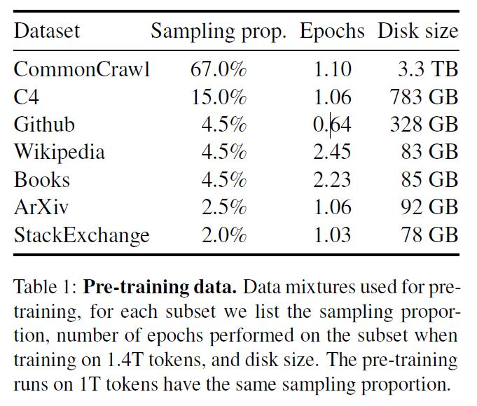

# LLaMA

## [Introducing LLaMA: A foundational, 65-billion-parameter large language model](https://ai.facebook.com/blog/large-language-model-llama-meta-ai/)
* 一个基础的、650 亿参数的大型语言模型
*  Foundation models train on a large set of unlabeled data, which makes them ideal for fine-tuning for a variety of tasks.
*   available at several sizes (7B, 13B, 33B, and 65B parameters) 
*   We trained LLaMA 65B and LLaMA 33B on 1.4 trillion tokens. 
*   Our smallest model, LLaMA 7B, is trained on one trillion tokens.
*   To train our model, we chose text from the 20 languages with the most speakers, focusing on those with Latin and Cyrillic alphabets.
*   为了训练我们的模型，我们从使用最多的 20 种语言中选择了文本，重点是那些使用拉丁字母和西里尔字母的语言。
*   To maintain integrity and prevent misuse, we are releasing our model under a noncommercial license focused on research use cases. Access to the model will be granted on a case-by-case basis to academic researchers; those affiliated with organizations in government, civil society, and academia; and industry research laboratories around the world.
*   为了保持完整性并防止滥用，我们将根据专注于研究用例的非商业许可发布我们的模型。 将根据具体情况授予学术研究人员访问该模型的权限； 隶属于政府、民间社会和学术界组织的人员； 和世界各地的行业研究实验室。

<br><br>

## [LLaMA: Open and Efficient Foundation Language Models](https://arxiv.org/pdf/2302.13971.pdf)
* LLaMA-13B outperforms GPT-3 (175B) on most benchmarks, and LLaMA-65B is competitive with the best models, Chinchilla-70B and PaLM-540B.
* LLaMA-13B 在大多数基准测试中都优于 GPT-3 (175B)，而 LLaMA-65B 可与最佳模型 Chinchilla-70B 和 PaLM-540B 竞争。
### **Pre-training Data**
* sampling proportion
* number of epochs performed on the subset when
training on 1.4T tokens
* disk size

* **问题：这里的epochs数量是什么意思？**
* We tokenize the data with the byte pair encoding (BPE) algorithm, using the implementation from Sentence-Piece
* Notably, we split all numbers into individual digits, and fallback to bytes to decompose unknown UTF-8 characters. 
* Overall, our entire training dataset contains roughly 1.4T tokens after tokenization. For most of our training data, each token is used only once during training, with the exception of the Wikipedia and Books domains, over which we perform approximately two epochs. **这里也间接回答了上面的问题。**

### Architecture

<br><br>

## Model

### 

```
class RMSNorm(torch.nn.Module):
    def __init__(self, dim: int, eps: float = 1e-6):
        super().__init__()
        self.eps = eps
        self.weight = nn.Parameter(torch.ones(dim))

    def _norm(self, x):
        return x * torch.rsqrt(x.pow(2).mean(-1, keepdim=True) + self.eps)

    def forward(self, x):
        output = self._norm(x.float()).type_as(x)
        return output * self.weight
```

