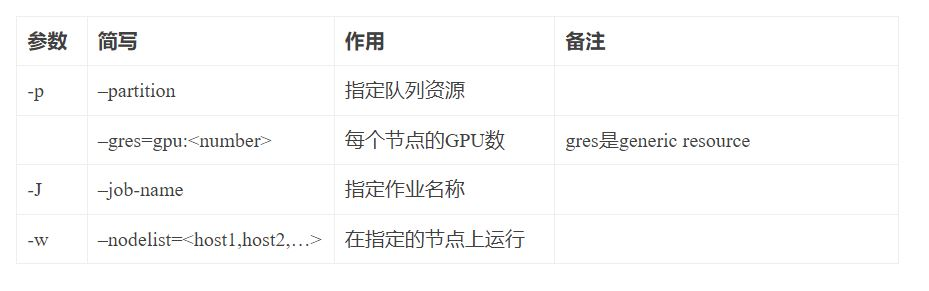
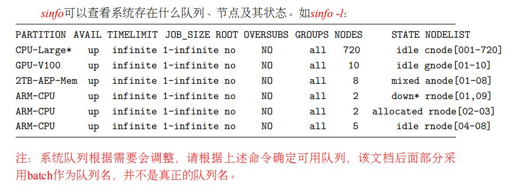
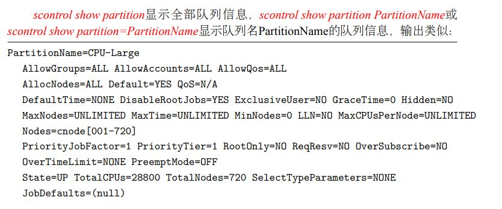
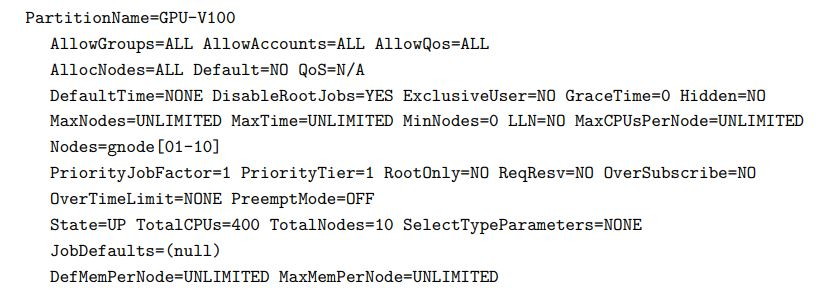
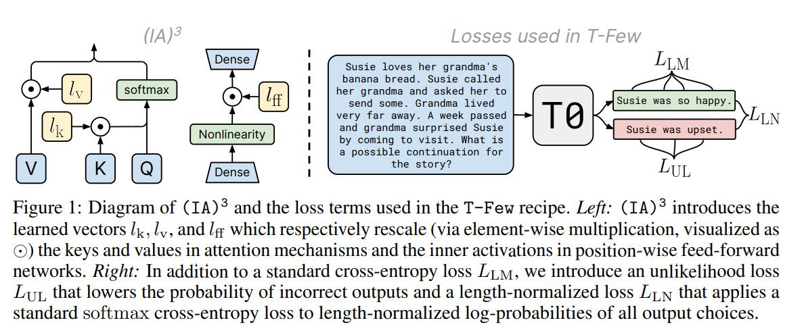

nemo/collections/nlp/modules/common/megatron/module.py
MegatronModule


## enroot, pyxis

### [用 NVIDIA Jetson Xavier NX 构建四节点集群](https://developer.nvidia.com/zh-cn/blog/building-a-four-node-cluster-with-nvidia-jetson-xavier-nx/)

### [【英伟达】使用 NVIDIA DGX SuperPOD 训练最先进的 ImageNet-1K 视觉 Transformer 模型](https://ngdcn.com/post/176.html)
* 对于 MNMG 训练案例，它需要将训练集群详细信息作为命令行输入的一部分。首先，我们根据节点和集群架构设置 CPU 、 MEM 、 IB 绑定。预训练阶段的集群是 DGX A100 POD ，每个 CPU 插槽有四个 NUMA 域，每个 A100 GPU 有一个 IB 端口，因此我们将每个列组绑定到 NUMA 节点中距离其 GPU 最近的所有 CPU 核。
* 对于内存绑定，我们将每个列组绑定到最近的 NUMA 节点。
* 对于 IB 绑定，我们为每个 GPU 绑定一个 IB 卡，或者尽可能接近这样的设置。

### [ubuntu环境下部署slurm+enroot+pyxis实现应用的调度及管理](https://blog.csdn.net/u010438035/article/details/128563753)
* 管理节点需要运行的slurm服务有slurmdbd(记账服务)、slurmctld(控制管理服务)。另外还需要在管理节点安装mysql数据库，用于slurmdbd(记账服务)存储数据
* 计算节点只需要运行slurmd(作业调度服务)即可。
* 所有节点均需要进行enroot和pyxis开源软件的安装。


### [Using enroot and pyxis in Bright Cluster Manager](https://kb.brightcomputing.com/knowledge-base/using-enroot-and-pyxis-in-bright-cluster-manager/)
* 可以仔细看


### [ENROOT](https://github.com/NVIDIA/enroot)
* A simple, yet powerful tool to turn traditional container/OS images into unprivileged sandboxes.
* Enroot can be thought of as an enhanced unprivileged chroot(1). It uses the same underlying technologies as containers but removes much of the isolation they inherently provide while preserving filesystem separation.
* This approach is generally preferred in high-performance environments or virtualized environments where portability and reproducibility is important, but extra isolation is not warranted.
* Enroot is also similar to other tools like proot(1) or fakeroot(1) but instead relies on more recent features from the Linux kernel (i.e. user and mount namespaces), and provides facilities to import well known container image formats (e.g. Docker).

### [NVIDIA/pyxis](https://github.com/NVIDIA/pyxis)
* 理解下来enroot,pyxis,slurm似乎配合解决了docker不适合做分布式的问题？？？？？？？
* Pyxis is a SPANK plugin for the Slurm Workload Manager. It allows unprivileged cluster users to run containerized tasks through the srun command.
* A pyxis is an ancient small box or container.
* Seamlessly execute the user's task in an unprivileged container.
* Simple command-line interface.
* Fast Docker image download with support for layers caching and layers sharing across users.
* Supports multi-node MPI jobs through PMI2 or PMIx (requires Slurm support).
* Allows users to install packages inside the container.
* Works with shared filesystems.
* Does not require cluster-wide management of subordinate user/group ids.
* **Pyxis requires the enroot container utility (version 3.1.0) to be installed.**
* Since Slurm 21.08, pyxis must be compiled against the release of Slurm that is going to be deployed on the cluster.
* **Pyxis being a SPANK plugin, the new command-line arguments it introduces are directly added to srun**

### [SLURM: Seamless Integration With Unprivileged Containers](https://slurm.schedmd.com/SLUG19/NVIDIA_Containers.pdf)

### [DeepOps](https://github.com/NVIDIA/deepops)
* Infrastructure automation tools for Kubernetes and Slurm clusters with NVIDIA GPUs.
* **Kubernetes**: Kubernetes (K8s) is an open-source system for automating deployment, scaling, and management of containerized applications. The instantiation of a Kubernetes cluster is done by Kubespray. Kubespray runs on bare metal and most clouds, using Ansible as its substrate for provisioning and orchestration. For people with familiarity with Ansible, existing Ansible deployments or the desire to run a Kubernetes cluster across multiple platforms, Kubespray is a good choice. Kubespray does generic configuration management tasks from the "OS operators" ansible world, plus some initial K8s clustering (with networking plugins included) and control plane bootstrapping. DeepOps provides additional playbooks for orchestration and optimization of GPU environments.
* **Slurm**: Slurm is an open-source cluster resource management and job scheduling system that strives to be simple, scalable, portable, fault-tolerant, and interconnect agnostic. Slurm currently has been tested only under Linux. As a cluster resource manager, Slurm provides three key functions. First, it allocates exclusive and/or non-exclusive access to resources (compute nodes) to users for some duration of time so they can perform work. Second, it provides a framework for starting, executing, and monitoring work (normally a parallel job) on the set of allocated nodes. Finally, it arbitrates conflicting requests for resources by managing a queue of pending work. Slurm cluster instantiation is achieved through SchedMD

<br><br>

## NUMA: NUMA（Non-Uniform Memory Access）

### [NVIDIA知乎精彩问答甄选（一）|探讨人工智能成为“新电力”的桎梏与突破点](https://www.eet-china.com/mp/a144874.html)

### [快手针对大型推荐模型的性能优化](https://www.infoq.cn/article/nou4kpza2au5dadx61z6)
* 调度器需要在内存密集型系统中考虑 NUMA 和 PCI-e 的亲和性。跨 NUMA 访问对系统延迟和吞吐的影响很大，调度器需要知道处理线程在哪个 CPU 上，并尽量把结果放在相应的 NUMA 节点上。根据测试，我们设计的调度器的吞吐量大约是 Tensorflow-Serving 的 2 倍。

### [GPU基本概念](https://blog.csdn.net/JackXuF/article/details/88675078)
*  现在的机器上都是有多个CPU和多个内存块的。以前我们都是将内存块看成是一大块内存，所有CPU到这个共享内存的访问消息是一样的。这就是之前普遍使用的SMP模型。但是随着处理器的增加，共享内存可能会导致内存访问冲突越来越厉害，且如果内存访问达到瓶颈的时候，性能就不能随之增加。NUMA（Non-Uniform Memory Access）就是这样的环境下引入的一个模型。比如一台机器是有2个处理器，有4个内存块。我们将1个处理器和两个内存块合起来，称为一个NUMA node，这样这个机器就会有两个NUMA node。在物理分布上，NUMA node的处理器和内存块的物理距离更小，因此访问也更快。比如这台机器会分左右两个处理器（cpu1, cpu2），在每个处理器两边放两个内存块(memory1.1, memory1.2, memory2.1,memory2.2)，这样NUMA node1的cpu1访问memory1.1和memory1.2就比访问memory2.1和memory2.2更快。所以使用NUMA的模式如果能尽量保证本node内的CPU只访问本node内的内存块，那这样的效率就是最高的。
*  GPU也存在于numa node中，我们现网的节点上分为两个numa node，每4个GPU分配在同一个numa node中。只有在同一个numa node下的GPU才可以使用GPU Director通信。

### [CPU specific optimizations](https://pytorch.org/tutorials/recipes/recipes/tuning_guide.html#gpu-specific-optimizations)
* NUMA or non-uniform memory access is a memory layout design used in data center machines meant to take advantage of locality of memory in multi-socket machines with multiple memory controllers and blocks. Generally speaking, all deep learning workloads, training or inference, get better performance without accessing hardware resources across NUMA nodes. Thus, inference can be run with multiple instances, each instance runs on one socket, to raise throughput. For training tasks on single node, distributed training is recommended to make each training process run on one socket.
* In general cases the following command executes a PyTorch script on cores on the Nth node only, and avoids cross-socket memory access to reduce memory access overhead.
```
# numactl --cpunodebind=N --membind=N python <pytorch_script>
```

### [NUMA架构详解](https://blog.csdn.net/qq_20817327/article/details/105925071)
* **内容很不错，可以好好看一下**

### [NUMA-Aware GPUs](https://research.nvidia.com/publication/2017-10_beyond-socket-numa-aware-gpus)
* GPUs achieve high throughput and power efficiency by employing many small single instruction multiple thread (SIMT) cores. To minimize scheduling logic and performance variance they utilize a uniform memory system and leverage strong data parallelism exposed via the programming model. With Moore's law slowing, for GPUs to continue scaling performance (which largely depends on SIMT core count) they are likely to embrace multi-socket designs where transistors are more readily available. However when moving to such designs, maintaining the illusion of a uniform memory system is increasingly difficult. In this work we investigate multi-socket non-uniform memory access (NUMA) GPU designs and show that significant changes are needed to both the GPU interconnect and cache architectures to achieve performance scalability. We show that application phase effects can be exploited allowing GPU sockets to dynamically optimize their individual interconnect and cache policies, minimizing the impact of NUMA effects. Our NUMA-aware GPU outperforms a single GPU by 1.5×, 2.3×, and 3.2× while achieving 89%, 84%, and 76% of theoretical application scalability in 2, 4, and 8 sockets designs respectively. Implementable today, NUMA-aware multi-socket GPUs may be a promising candidate for scaling GPU performance beyond a single socket.
* [Beyond the Socket: NUMA-Aware GPUs](https://d1qx31qr3h6wln.cloudfront.net/publications/MICRO_2017_TMG.pdf)


### [Linux内存管理之UMA模型和NUMA模型](https://blog.csdn.net/wwwlyj123321/article/details/128255568)


<br><br>

## BCM

### [slurm使用基础](https://xiaohan-wang.github.io/2020/06/05/slurm/)
* 

### [Slurm作业调度系统使用指南](http://hmli.ustc.edu.cn/doc/userguide/slurm-userguide.pdf)
* partition: 作业或作业步的队列。




## Adapter

### IA3: [Few-Shot Parameter-Efficient Fine-Tuning is Better and Cheaper than In-Context Learning](https://arxiv.org/pdf/2205.05638.pdf)



### Adapter