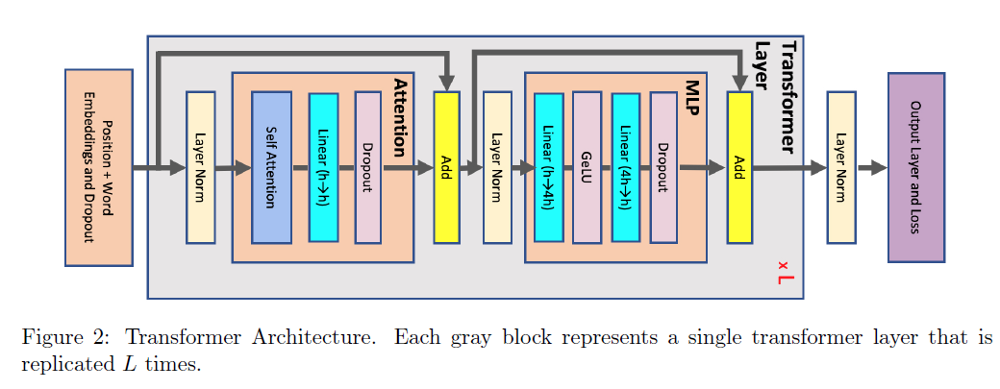

# 

## Memory

ref: [Reducing Activation Recomputation in Large Transformer Models](https://arxiv.org/pdf/2205.05198.pdf)

1. layernorm不考虑，layernorm需要mean和variant，2bs << bsh，bsh是输入，所以为了简单不考虑
2. Attention Block:
   * Q,K,V matrix multiplies：2bsh * 3
   * Q*KT: bsh*bhs=bs^2