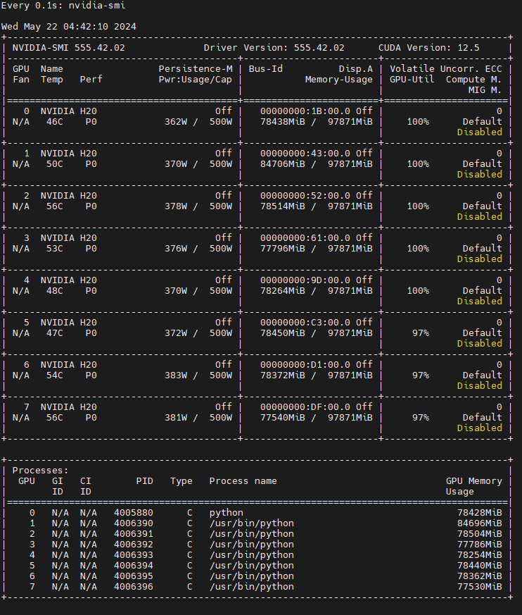
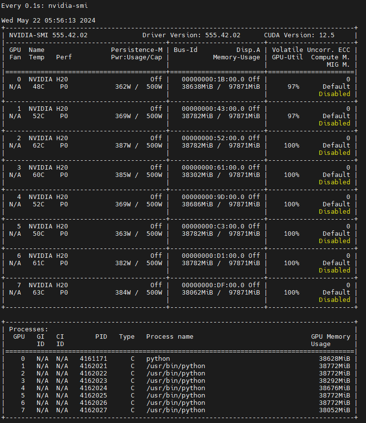
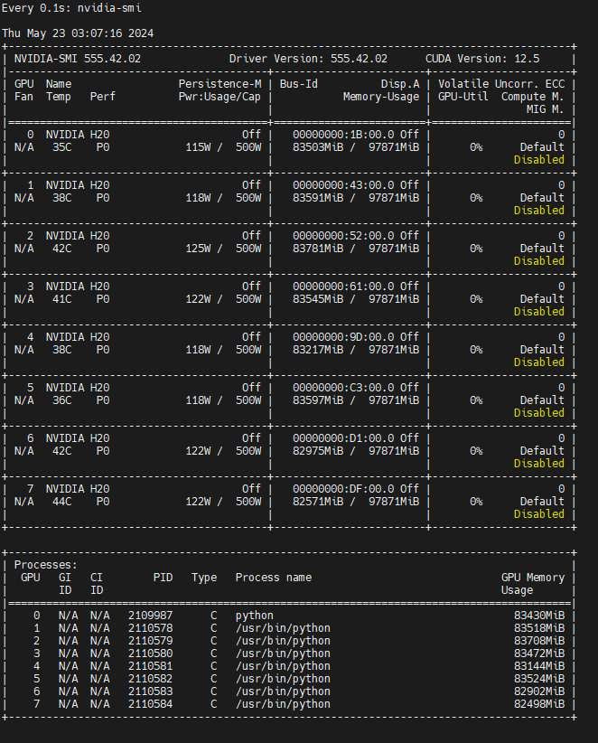
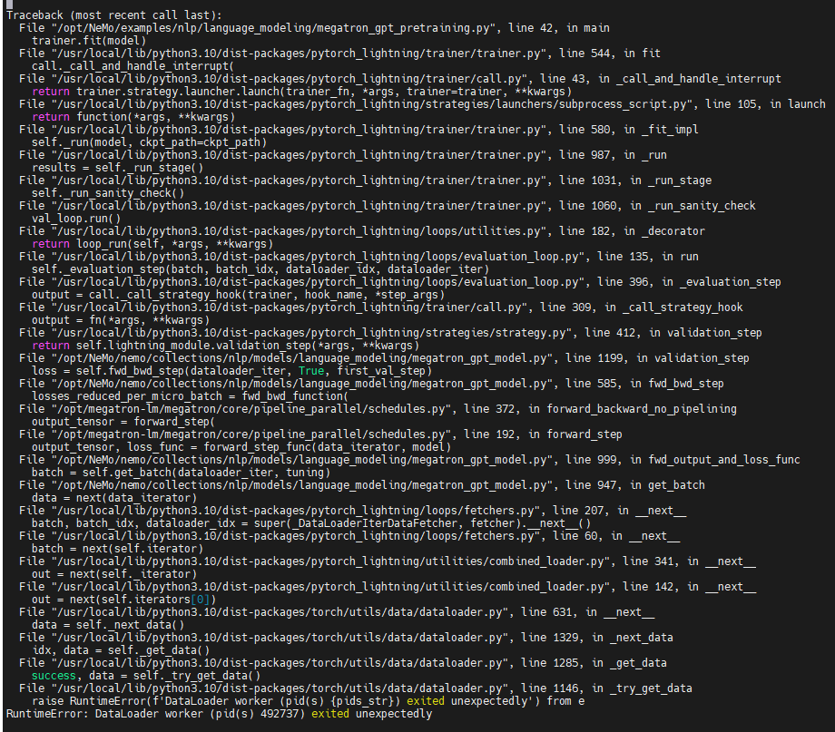

# Nemo


## Setup Env

ref: [NeMo Framework Training](https://registry.ngc.nvidia.com/orgs/ea-bignlp/teams/ga-participants/containers/nemofw-training/tags)

### Run Container

```
docker run --shm-size=20gb --ulimit memlock=-1 --ulimit stack=67108864 --gpus all -it --name Nemo_Features -p 8022:22 -p 8006:6006 -p 8064:6064 -p 8888:8888 -v /weidongz/data/weidongz/docker_workspace:/workspace nvcr.io/ea-bignlp/ga-participants/nemofw-training:24.03 bash
```

### LLAMA Configuration Set

```
python /opt/NeMo/examples/nlp/language_modeling/megatron_gpt_pretraining.py  \
    --config-path=/opt/NeMo/examples/nlp/language_modeling/conf \
    --config-name=megatron_llama_config \
    trainer.devices=8 \
    trainer.num_nodes=1 \
    model.micro_batch_size=4 \
    model.global_batch_size=192
```

### Run Test


```
NeMo_ROOT_FOLDER=/opt/NeMo

python /opt/NeMo/examples/nlp/language_modeling/megatron_gpt_pretraining.py  \
    --config-path=/opt/NeMo/examples/nlp/language_modeling/conf \
    --config-name=megatron_gpt_config \
    trainer.devices=8 \
    trainer.num_nodes=1 \
    model.micro_batch_size=4 \
    model.global_batch_size=192
```


## 试验1

**验证LLAMA 7B**

```
python /opt/NeMo/examples/nlp/language_modeling/megatron_gpt_pretraining.py  \
    --config-path=/opt/NeMo/examples/nlp/language_modeling/conf \
    --config-name=megatron_llama_config \
    trainer.devices=8 \
    trainer.num_nodes=1 \
    model.micro_batch_size=4 \
    model.global_batch_size=32 \
    model.tensor_model_parallel_size=4 \
    model.pipeline_model_parallel_size=1 
```

显存爆掉

```
python /opt/NeMo/examples/nlp/language_modeling/megatron_gpt_pretraining.py  \
    --config-path=/opt/NeMo/examples/nlp/language_modeling/conf \
    --config-name=megatron_llama_config \
    trainer.devices=8 \
    trainer.num_nodes=1 \
    model.micro_batch_size=2 \
    model.global_batch_size=4 \
    model.tensor_model_parallel_size=4 \
    model.pipeline_model_parallel_size=1 
```
显存爆掉

```
python /opt/NeMo/examples/nlp/language_modeling/megatron_gpt_pretraining.py  \
    --config-path=/opt/NeMo/examples/nlp/language_modeling/conf \
    --config-name=megatron_llama_config \
    trainer.devices=8 \
    trainer.num_nodes=1 \
    model.micro_batch_size=1 \
    model.global_batch_size=2 \
    model.tensor_model_parallel_size=4 \
    model.pipeline_model_parallel_size=1 
```



在此基础上引入SP

```
python /opt/NeMo/examples/nlp/language_modeling/megatron_gpt_pretraining.py  \
    --config-path=/opt/NeMo/examples/nlp/language_modeling/conf \
    --config-name=megatron_llama_config \
    trainer.devices=8 \
    trainer.num_nodes=1 \
    model.micro_batch_size=1 \
    model.global_batch_size=2 \
    model.tensor_model_parallel_size=4 \
    model.pipeline_model_parallel_size=1 \
    model.sequence_parallel=True
```


`Epoch 0: :   0%| | 77/100000 [01:28<31:55:24, v_num=6, reduced_train_loss=5.870, global_step=76.00, consumed_samples=154.0, train_step_timing in s=1.120]`

在此基础上引入full recompute, full recompute我是在配置文件中直接修改的，命令行会报无法overwrite的错误。

```
python /opt/NeMo/examples/nlp/language_modeling/megatron_gpt_pretraining.py  \
    --config-path=/opt/NeMo/examples/nlp/language_modeling/conf \
    --config-name=megatron_llama_config \
    trainer.devices=8 \
    trainer.num_nodes=1 \
    model.micro_batch_size=1 \
    model.global_batch_size=2 \
    model.tensor_model_parallel_size=4 \
    model.pipeline_model_parallel_size=1 \
    model.sequence_parallel=True
```

```
  activations_checkpoint_granularity: full # 'selective' or 'full' 
  activations_checkpoint_method: uniform # 'uniform', 'block'
  activations_checkpoint_num_layers: 16
```


`Epoch 0: :   0%| | 190/100000 [04:39<40:49:03, v_num=8, reduced_train_loss=4.900, global_step=188.0, consumed_samples=378.0, train_step_timing in s=1.450]`

修改full recompute，条件下的activations_checkpoint_num_layers=32

```
  activations_checkpoint_granularity: full # 'selective' or 'full' 
  activations_checkpoint_method: uniform # 'uniform', 'block'
  activations_checkpoint_num_layers: 32
```


`Epoch 0: :   0%|  | 135/100000 [03:18<40:49:50, v_num=9, reduced_train_loss=5.090, global_step=134.0, consumed_samples=270.0, tra
in_step_timing in s=1.450]`

修改full recompute，条件下的activations_checkpoint_num_layers=1

```
  activations_checkpoint_granularity: full # 'selective' or 'full' 
  activations_checkpoint_method: uniform # 'uniform', 'block'
  activations_checkpoint_num_layers: 1
```


`Epoch 0: :   0%|  | 122/100000 [02:59<40:52:54, v_num=10, reduced_train_loss=5.890, global_step=120.0, consumed_samples=242.0, train_step_timing in s=1.450]`

activations_checkpoint_num_layers从32->16->1，显存的使用大大减小，但是训练效率并没有降低，为什么？

ymal文件的注释是这么写的：

```
  activations_checkpoint_num_layers: 1
  # when using 'uniform' this creates groups of transformer layers to checkpoint. Usually set to 1. Increase to save more memory.
  # when using 'block' this this will checkpoint the first activations_checkpoint_num_layers per pipeline stage.
```

在此基础上，我们再用`distributed_fused_adam`:

```
python /opt/NeMo/examples/nlp/language_modeling/megatron_gpt_pretraining.py  \
    --config-path=/opt/NeMo/examples/nlp/language_modeling/conf \
    --config-name=megatron_llama_config \
    trainer.devices=8 \
    trainer.num_nodes=1 \
    model.micro_batch_size=1 \
    model.global_batch_size=2 \
    model.tensor_model_parallel_size=4 \
    model.pipeline_model_parallel_size=1 \
    model.sequence_parallel=True \
    model.optim.name=distributed_fused_adam
```



`Epoch 0: :   0%| | 103/100000 [02:40<43:15:10, v_num=11, reduced_train_loss=5.590, global_step=102.0, consumed_samples=206.0, train_step_timing in s=1.460]`

这一步显存使用减少的比较明显。

<br>

***

<br>

## 试验2

**验证LLAMA 13B**


同样的配置，切换到`llama13b`模型：
```
python /opt/NeMo/examples/nlp/language_modeling/megatron_gpt_pretraining.py  \
    --config-path=/opt/NeMo/examples/nlp/language_modeling/conf \
    --config-name=megatron_llama_config-13b \
    trainer.devices=8 \
    trainer.num_nodes=1 \
    model.micro_batch_size=1 \
    model.global_batch_size=2 \
    model.tensor_model_parallel_size=4 \
    model.pipeline_model_parallel_size=1 \
    model.sequence_parallel=True \
    model.optim.name=distributed_fused_adam
```


`Epoch 0: :   0%| | 60/100000 [02:46<76:56:05, v_num=12, reduced_train_loss=7.360, global_step=59.00, consumed_samples=120.0, train_step_timing in s=2.590]`

同样的配置，切换为`tp=8`:

```
python /opt/NeMo/examples/nlp/language_modeling/megatron_gpt_pretraining.py  \
    --config-path=/opt/NeMo/examples/nlp/language_modeling/conf \
    --config-name=megatron_llama_config-13b \
    trainer.devices=8 \
    trainer.num_nodes=1 \
    model.micro_batch_size=1 \
    model.global_batch_size=2 \
    model.tensor_model_parallel_size=8 \
    model.pipeline_model_parallel_size=1 \
    model.sequence_parallel=True \
    model.optim.name=distributed_fused_adam
```


`Epoch 0: :   0%| | 103/100000 [04:58<80:25:06, v_num=13, reduced_train_loss=5.720, global_step=102.0, consumed_samples=206.0, train_step_timing in s=2.860]`

显存进一步减少。

接下来增大sequence length，试一下单节点能支持的最大sequence length.

```
python /opt/NeMo/examples/nlp/language_modeling/megatron_gpt_pretraining.py  \
    --config-path=/opt/NeMo/examples/nlp/language_modeling/conf \
    --config-name=megatron_llama_config-13b \
    trainer.devices=8 \
    trainer.num_nodes=1 \
    model.micro_batch_size=1 \
    model.global_batch_size=2 \
    model.tensor_model_parallel_size=8 \
    model.pipeline_model_parallel_size=1 \
    model.sequence_parallel=True \
    model.optim.name=distributed_fused_adam \
    model.encoder_seq_length=16384
```


`Epoch 0: :   0%| | 27/100000 [08:10<504:54:13, v_num=14, reduced_train_loss=7.660, global_step=26.00, consumed_samples=54.00, train_step_timing in s=18.00]`

调整global_batch_size=1

```
python /opt/NeMo/examples/nlp/language_modeling/megatron_gpt_pretraining.py  \
    --config-path=/opt/NeMo/examples/nlp/language_modeling/conf \
    --config-name=megatron_llama_config-13b \
    trainer.devices=8 \
    trainer.num_nodes=1 \
    model.micro_batch_size=1 \
    model.global_batch_size=1 \
    model.tensor_model_parallel_size=8 \
    model.pipeline_model_parallel_size=1 \
    model.sequence_parallel=True \
    model.optim.name=distributed_fused_adam \
    model.encoder_seq_length=16384
```


`Epoch 0: :   0%| | 18/100000 [02:46<257:07:33, v_num=15, reduced_train_loss=8.160, global_step=17.00, consumed_samples=18.00, train_step_timing in s=9.030]`

```
python /opt/NeMo/examples/nlp/language_modeling/megatron_gpt_pretraining.py  \
    --config-path=/opt/NeMo/examples/nlp/language_modeling/conf \
    --config-name=megatron_llama_config-13b \
    trainer.devices=8 \
    trainer.num_nodes=1 \
    model.micro_batch_size=1 \
    model.global_batch_size=1 \
    model.tensor_model_parallel_size=8 \
    model.pipeline_model_parallel_size=1 \
    +model.context_parallel_size=2 \
    model.sequence_parallel=True \
    model.optim.name=distributed_fused_adam \
    model.encoder_seq_length=16384
```

会报错，单节点无法开tp8cp2，改为tp4pp2:

```
python /opt/NeMo/examples/nlp/language_modeling/megatron_gpt_pretraining.py  \
    --config-path=/opt/NeMo/examples/nlp/language_modeling/conf \
    --config-name=megatron_llama_config-13b \
    trainer.devices=8 \
    trainer.num_nodes=1 \
    model.micro_batch_size=1 \
    model.global_batch_size=1 \
    model.tensor_model_parallel_size=4 \
    model.pipeline_model_parallel_size=1 \
    +model.context_parallel_size=2 \
    model.sequence_parallel=True \
    model.optim.name=distributed_fused_adam \
    model.encoder_seq_length=16384
```

会报错：`AssertionError: Context parallelism is only implemented with Flash Attention and Fused Attention!`,让我们手动开启`use_flash_attention: True`

接着先看tp8pp1的情况：

```
python /opt/NeMo/examples/nlp/language_modeling/megatron_gpt_pretraining.py  \
    --config-path=/opt/NeMo/examples/nlp/language_modeling/conf \
    --config-name=megatron_llama_config-13b \
    trainer.devices=8 \
    trainer.num_nodes=1 \
    model.micro_batch_size=1 \
    model.global_batch_size=1 \
    model.tensor_model_parallel_size=8 \
    model.pipeline_model_parallel_size=1 \
    +model.context_parallel_size=1 \
    model.sequence_parallel=True \
    model.optim.name=distributed_fused_adam \
    +model.use_flash_attention=True \
    model.encoder_seq_length=16384
```


`Epoch 0: :   0%| | 17/100000 [02:36<256:28:33, v_num=17, reduced_train_loss=8.500, global_step=16.00, consumed_samples=17.00, train_step_timing in s=9.030]`


注意：在使用cp的时候需要`flash attention`或`fused attention`的支持，要想`flash attention`或`fused attention`生效，至少还需要`trainer.precision=bf16-mixed`和`megatron_amp_O2: True`的设置。

```
python /opt/NeMo/examples/nlp/language_modeling/megatron_gpt_pretraining.py  \
    --config-path=/opt/NeMo/examples/nlp/language_modeling/conf \
    --config-name=megatron_llama_config-13b \
    trainer.devices=8 \
    trainer.num_nodes=1 \
    trainer.precision=bf16-mixed \
    model.micro_batch_size=1 \
    model.global_batch_size=1 \
    model.tensor_model_parallel_size=2 \
    model.pipeline_model_parallel_size=1 \
    +model.context_parallel_size=4 \
    model.sequence_parallel=True \
    model.optim.name=distributed_fused_adam \
    model.transformer_engine=True \
    model.use_flash_attention=True \
    model.megatron_amp_O2=True \
    +model.rampup_batch_size=null \
    model.encoder_seq_length=16384
```


`Epoch 0: :   0%|  | 77/100000 [03:42<80:20:05, v_num=10, reduced_train_loss=6.110, global_step=76.00, consumed_samples=77.00, train_step_timing in s=2.480]`

尝试一下tp1cp8：

```
python /opt/NeMo/examples/nlp/language_modeling/megatron_gpt_pretraining.py  \
    --config-path=/opt/NeMo/examples/nlp/language_modeling/conf \
    --config-name=megatron_llama_config-13b \
    trainer.devices=8 \
    trainer.num_nodes=1 \
    trainer.precision=bf16-mixed \
    model.micro_batch_size=1 \
    model.global_batch_size=1 \
    model.tensor_model_parallel_size=1 \
    model.pipeline_model_parallel_size=1 \
    +model.context_parallel_size=8 \
    model.sequence_parallel=False \
    model.optim.name=distributed_fused_adam \
    model.transformer_engine=True \
    model.use_flash_attention=True \
    model.megatron_amp_O2=True \
    +model.rampup_batch_size=null \
    model.encoder_seq_length=16384
```

显存会爆掉。

我们再来尝试开启`cpu offloading`，填加如下的代码到配置文件：

```
  ##Offloading Activations/Weights to CPU
  cpu_offloading: False
  cpu_offloading_num_layers: ${sum:${.num_layers},-1} #This value should be between [1,num_layers-1] as we don't want to offload the final layer's activations and expose any offloading duration for the final layer
  cpu_offloading_activations: True
  cpu_offloading_weights: True
```
注意: CPU offloading does not work when activation recomputation is enabled
```
python /opt/NeMo/examples/nlp/language_modeling/megatron_gpt_pretraining.py  \
    --config-path=/opt/NeMo/examples/nlp/language_modeling/conf \
    --config-name=megatron_llama_config-13b \
    trainer.devices=8 \
    trainer.num_nodes=1 \
    trainer.precision=bf16-mixed \
    model.micro_batch_size=1 \
    model.global_batch_size=1 \
    model.tensor_model_parallel_size=2 \
    model.pipeline_model_parallel_size=1 \
    +model.context_parallel_size=4 \
    model.sequence_parallel=True \
    model.optim.name=distributed_fused_adam \
    model.transformer_engine=True \
    model.use_flash_attention=True \
    model.megatron_amp_O2=True \
    +model.rampup_batch_size=null \
    model.cpu_offloading=True \
    ~model.activations_checkpoint_granularity=null \
    model.encoder_seq_length=16384
```



`Epoch 0: :   0%| | 203/100000 [09:31<78:00:39, v_num=12, reduced_train_loss=4.680, global_step=202.0, consumed_samples=203.0, train_step_timing in s=2.480]`

TODO:进一步调参，cpu offloading的参数

开启`fsdp`，不用`cpu offload`，仍用`activation recompute`

将如下文件加入配置文件:

```
  # FSDP
  fsdp: False # Enable training with torch FSDP.
  fsdp_sharding_strategy: 'full' # Method to shard model states. Available options are 'full', 'hybrid', and 'grad'.
  fsdp_grad_reduce_dtype: 32 # Gradient reduction data type.
  fsdp_sharded_checkpoint: False # Store and load FSDP shared checkpoint.
```

```
python /opt/NeMo/examples/nlp/language_modeling/megatron_gpt_pretraining.py  \
    --config-path=/opt/NeMo/examples/nlp/language_modeling/conf \
    --config-name=megatron_llama_config-13b \
    trainer.devices=8 \
    trainer.num_nodes=1 \
    trainer.precision=bf16-mixed \
    model.micro_batch_size=1 \
    model.global_batch_size=1 \
    model.tensor_model_parallel_size=2 \
    model.pipeline_model_parallel_size=1 \
    +model.context_parallel_size=4 \
    model.sequence_parallel=True \
    model.optim.name=fused_adam \
    model.transformer_engine=True \
    model.use_flash_attention=True \
    model.megatron_amp_O2=True \
    model.fsdp=True \
    +model.rampup_batch_size=null \
    model.encoder_seq_length=16384
```


`Epoch 0: :   0%|  | 71/100000 [03:24<79:55:29, v_num=13, reduced_train_loss=6.590, global_step=70.00, consumed_samples=71.00, train_step_timing in s=2.650]`

上下文长度调整到`32k`

```
python /opt/NeMo/examples/nlp/language_modeling/megatron_gpt_pretraining.py  \
    --config-path=/opt/NeMo/examples/nlp/language_modeling/conf \
    --config-name=megatron_llama_config-13b \
    trainer.devices=8 \
    trainer.num_nodes=1 \
    trainer.precision=bf16-mixed \
    model.micro_batch_size=1 \
    model.global_batch_size=1 \
    model.tensor_model_parallel_size=2 \
    model.pipeline_model_parallel_size=1 \
    +model.context_parallel_size=4 \
    model.sequence_parallel=True \
    model.optim.name=fused_adam \
    model.transformer_engine=True \
    model.use_flash_attention=True \
    model.megatron_amp_O2=True \
    model.fsdp=True \
    +model.rampup_batch_size=null \
    model.encoder_seq_length=32768
```


`Epoch 0: :   0%|  | 42/100000 [04:28<177:35:08, v_num=14, reduced_train_loss=6.820, global_step=41.00, consumed_samples=42.00, train_step_timing in s=5.780]`

上下文长度直接增加到`128k`

```
python /opt/NeMo/examples/nlp/language_modeling/megatron_gpt_pretraining.py  \
    --config-path=/opt/NeMo/examples/nlp/language_modeling/conf \
    --config-name=megatron_llama_config-13b \
    trainer.devices=8 \
    trainer.num_nodes=1 \
    trainer.precision=bf16-mixed \
    model.micro_batch_size=1 \
    model.global_batch_size=1 \
    model.tensor_model_parallel_size=2 \
    model.pipeline_model_parallel_size=1 \
    +model.context_parallel_size=4 \
    model.sequence_parallel=True \
    model.optim.name=fused_adam \
    model.transformer_engine=True \
    model.use_flash_attention=True \
    model.megatron_amp_O2=True \
    model.fsdp=True \
    +model.rampup_batch_size=null \
    model.encoder_seq_length=131072
```



`DataLoader`扛不住了，`64k`上下文也是同样的问题。

我们增大mbs，看一下mbs的极限：

```
python /opt/NeMo/examples/nlp/language_modeling/megatron_gpt_pretraining.py  \
    --config-path=/opt/NeMo/examples/nlp/language_modeling/conf \
    --config-name=megatron_llama_config-13b \
    trainer.devices=8 \
    trainer.num_nodes=1 \
    trainer.precision=bf16-mixed \
    model.micro_batch_size=32 \
    model.global_batch_size=32 \
    model.tensor_model_parallel_size=2 \
    model.pipeline_model_parallel_size=1 \
    +model.context_parallel_size=4 \
    model.sequence_parallel=True \
    model.optim.name=fused_adam \
    model.transformer_engine=True \
    model.use_flash_attention=True \
    model.megatron_amp_O2=True \
    model.fsdp=True \
    +model.rampup_batch_size=null \
    model.encoder_seq_length=32768
```

DataLoader依然扛不住，我们再来切换一下fsdp的模式，`fsdp_sharding_strategy`

```
python /opt/NeMo/examples/nlp/language_modeling/megatron_gpt_pretraining.py  \
    --config-path=/opt/NeMo/examples/nlp/language_modeling/conf \
    --config-name=megatron_llama_config-13b \
    trainer.devices=8 \
    trainer.num_nodes=1 \
    trainer.precision=bf16-mixed \
    model.micro_batch_size=1 \
    model.global_batch_size=1 \
    model.tensor_model_parallel_size=2 \
    model.pipeline_model_parallel_size=1 \
    +model.context_parallel_size=4 \
    model.sequence_parallel=True \
    model.optim.name=fused_adam \
    model.transformer_engine=True \
    model.use_flash_attention=True \
    model.megatron_amp_O2=True \
    model.fsdp=True \
    model.fsdp_sharding_strategy=hybrid \
    +model.rampup_batch_size=null \
    model.encoder_seq_length=32768
```


测试tp4cp2+fsdp：

```
python /opt/NeMo/examples/nlp/language_modeling/megatron_gpt_pretraining.py  \
    --config-path=/opt/NeMo/examples/nlp/language_modeling/conf \
    --config-name=megatron_llama_config-13b \
    trainer.devices=8 \
    trainer.num_nodes=1 \
    trainer.precision=bf16-mixed \
    model.micro_batch_size=1 \
    model.global_batch_size=1 \
    model.tensor_model_parallel_size=4 \
    model.pipeline_model_parallel_size=1 \
    +model.context_parallel_size=2 \
    model.sequence_parallel=True \
    model.optim.name=fused_adam \
    model.transformer_engine=True \
    model.use_flash_attention=True \
    model.megatron_amp_O2=True \
    model.fsdp=True \
    +model.rampup_batch_size=null \
    model.encoder_seq_length=32768
```


`Epoch 0: :   0%| | 48/100000 [04:51<168:29:58, v_num=18, reduced_train_loss=7.430, global_step=47.00, consumed_samples=48.00, train_step_timing in s=5.600]`

接下来看关掉cp，只开tp的效果：

```
python /opt/NeMo/examples/nlp/language_modeling/megatron_gpt_pretraining.py  \
    --config-path=/opt/NeMo/examples/nlp/language_modeling/conf \
    --config-name=megatron_llama_config-13b \
    trainer.devices=8 \
    trainer.num_nodes=1 \
    trainer.precision=bf16-mixed \
    model.micro_batch_size=1 \
    model.global_batch_size=2 \
    model.tensor_model_parallel_size=4 \
    model.pipeline_model_parallel_size=1 \
    +model.context_parallel_size=1 \
    model.sequence_parallel=True \
    model.optim.name=fused_adam \
    model.transformer_engine=True \
    model.use_flash_attention=True \
    model.megatron_amp_O2=True \
    model.fsdp=True \
    +model.rampup_batch_size=null \
    model.encoder_seq_length=32768
```


`Epoch 0: :   0%| | 29/100000 [05:29<315:20:22, v_num=19, reduced_train_loss=8.180, global_step=28.00, consumed_samples=58.00, train_step_timing in s=10.70]`

接下来看tp2dp4的效果：

```
python /opt/NeMo/examples/nlp/language_modeling/megatron_gpt_pretraining.py  \
    --config-path=/opt/NeMo/examples/nlp/language_modeling/conf \
    --config-name=megatron_llama_config-13b \
    trainer.devices=8 \
    trainer.num_nodes=1 \
    trainer.precision=bf16-mixed \
    model.micro_batch_size=1 \
    model.global_batch_size=4 \
    model.tensor_model_parallel_size=2 \
    model.pipeline_model_parallel_size=1 \
    +model.context_parallel_size=1 \
    model.sequence_parallel=True \
    model.optim.name=fused_adam \
    model.transformer_engine=True \
    model.use_flash_attention=True \
    model.megatron_amp_O2=True \
    model.fsdp=True \
    +model.rampup_batch_size=null \
    model.encoder_seq_length=32768
```


`Epoch 0: :   0%|  | 23/100000 [08:13<596:20:15, v_num=20, reduced_train_loss=8.380, global_step=22.00, consumed_samples=92.00, train_step_timing in s=20.70]`

H20: TFLOPS 124.77, MFU 42.58%

尝试找到tp2dp4的极限，增大mbs：

```
python /opt/NeMo/examples/nlp/language_modeling/megatron_gpt_pretraining.py  \
    --config-path=/opt/NeMo/examples/nlp/language_modeling/conf \
    --config-name=megatron_llama_config-13b \
    trainer.devices=8 \
    trainer.num_nodes=1 \
    trainer.precision=bf16-mixed \
    model.micro_batch_size=2 \
    model.global_batch_size=8 \
    model.tensor_model_parallel_size=2 \
    model.pipeline_model_parallel_size=1 \
    +model.context_parallel_size=1 \
    model.sequence_parallel=True \
    model.optim.name=fused_adam \
    model.transformer_engine=True \
    model.use_flash_attention=True \
    model.megatron_amp_O2=True \
    model.fsdp=True \
    +model.rampup_batch_size=null \
    model.encoder_seq_length=32768
```

dataloader报错，看来是个bug

我们再试试关闭recompute

```
python /opt/NeMo/examples/nlp/language_modeling/megatron_gpt_pretraining.py  \
    --config-path=/opt/NeMo/examples/nlp/language_modeling/conf \
    --config-name=megatron_llama_config-13b \
    trainer.devices=8 \
    trainer.num_nodes=1 \
    trainer.precision=bf16-mixed \
    model.micro_batch_size=1 \
    model.global_batch_size=4 \
    model.tensor_model_parallel_size=2 \
    model.pipeline_model_parallel_size=1 \
    +model.context_parallel_size=1 \
    model.sequence_parallel=True \
    model.optim.name=fused_adam \
    model.transformer_engine=True \
    model.use_flash_attention=True \
    model.megatron_amp_O2=True \
    model.fsdp=True \
    model.activations_checkpoint_granularity=null \
    +model.rampup_batch_size=null \
    model.encoder_seq_length=32768
```
显存爆了，OOM

开启selective recomputation:

```
python /opt/NeMo/examples/nlp/language_modeling/megatron_gpt_pretraining.py  \
    --config-path=/opt/NeMo/examples/nlp/language_modeling/conf \
    --config-name=megatron_llama_config-13b \
    trainer.devices=8 \
    trainer.num_nodes=1 \
    trainer.precision=bf16-mixed \
    model.micro_batch_size=1 \
    model.global_batch_size=4 \
    model.tensor_model_parallel_size=2 \
    model.pipeline_model_parallel_size=1 \
    +model.context_parallel_size=1 \
    model.sequence_parallel=True \
    model.optim.name=fused_adam \
    model.transformer_engine=True \
    model.use_flash_attention=True \
    model.megatron_amp_O2=True \
    model.fsdp=True \
    model.activations_checkpoint_granularity=selective \
    model.activations_checkpoint_num_layers=null \
    +model.rampup_batch_size=null \
    model.encoder_seq_length=32768
```
显存接着爆，OOM

