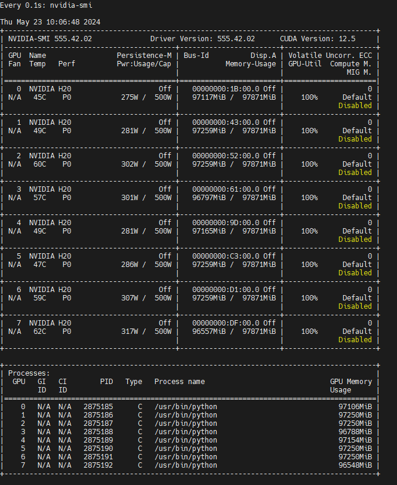

# Mcore DIT Best Practice


## Setup Env

### Run Container

```
docker run --shm-size=20gb --ulimit memlock=-1 --ulimit stack=67108864 --gpus all -it --name MCORE_DIT -p 6022:22 -p 6006:6006 -p 6064:6064 -p 6888:8888 -v /weidongz/data/weidongz/docker_workspace:/workspace nvcr.io/nvidia/pytorch:24.01-py3 bash
```

### Download code

```
mkdir -p /workspace/code/sora-like/mcore_dit/
cd /workspace/code/sora-like/mcore_dit/

git clone -b zhuoyaow/tp_pp https://gitlab-master.nvidia.com/mingyuanm/megatron-lm.git


pip install git+https://gitlab-master.nvidia.com/dl/gwe/torch_automated_profiler@release
```

```
git checkout -b c211a36eefb6f178a67d1175803ef4d2c98f0fd8
```

### DIT Performace

1. [DIT Performance H100](https://docs.google.com/spreadsheets/d/1plPV4y9kT7sARtebr2dgZ-vVLvcp-RrO-n8COvz5gC0/edit?usp=sharing)
2. 

## Test Run

```
cd /workspace/code/sora-like/mcore_dit/megatron-lm
./run_dit_train.sh


```

### [DIT performance](https://docs.google.com/spreadsheets/d/1plPV4y9kT7sARtebr2dgZ-vVLvcp-RrO-n8COvz5gC0/edit?usp=sharing)


### MFU

```
C4: p,      patch size
E4: gbs,    global batch size
F4: s,      sequence length
H4: l,      layer number
I4: h,      hidden size
J4: h2,     ffn size

```

```
E4*F4*H4*I4^2*((24+(12*(F4/I4)))+(12*(J4/I4))+(36/F4)+((12+(24*C4^2/I4))/H4)+((512+2*I4)/(F4*I4*H4)))
```

```
gbs*s*l*h^2*((24+(12*(s/h)))+(12*(h2/h))+(36/s)+((12+(24*p^2/h))/l)+((512+2*l)/(s*h*l)))
```

```
def forward(self, hidden_states,
            attention_mask=None,
            context=None,
            context_mask=None,
            rotary_pos_emb=None,
            inference_params=None,
            packed_seq_params=None,
            condition=None,):
    # ? bsh
    shift_msa, scale_msa, gate_msa, shift_mlp, scale_mlp, gate_mlp = self.adaLN_modulation(condition).chunk(6, dim=1)

    residual = hidden_states

    # ? bsh
    shifted_input_layernorm_output = self.modulated_layernorm(hidden_states, shift_msa, scale_msa)

    # 
    # Self attention.
    attention_output_with_bias = self.self_attention(
        shifted_input_layernorm_output,
        attention_mask=attention_mask,
        inference_params=inference_params,
        rotary_pos_emb=rotary_pos_emb,
        packed_seq_params=packed_seq_params,
    )


    x, bias = attention_output_with_bias

    residual, shifted_pre_mlp_layernorm_output = self.scaled_modulated_layernorm(residual, x, bias, gate_msa, shift_mlp, scale_mlp)

    mlp_output_with_bias = self.mlp(shifted_pre_mlp_layernorm_output)

    x, bias = mlp_output_with_bias

    hidden_states = self.scale_add(residual, x, bias, gate_mlp)

    return hidden_states, context
```

## 测试任务更新

1. 7B 模型不同配置下的最优TFLOPS，将设计试验如下：
tp4pp4/tp8pp2/tp2pp8
2. DIT-XL:
tp4pp1dp2:

3. 3B 模型跨界点性能，开启PP
* 64k长度，mbs1,gbs8,测试了tp8pp2/tp4pp4/tp2pp8（OOM），发现tp8/tp4对性能影响不大
* 16k长度，m2g16,我们进一步看tp2/tp4/tp8的影响
