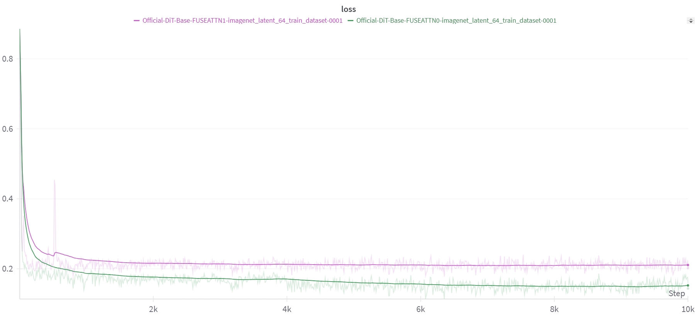
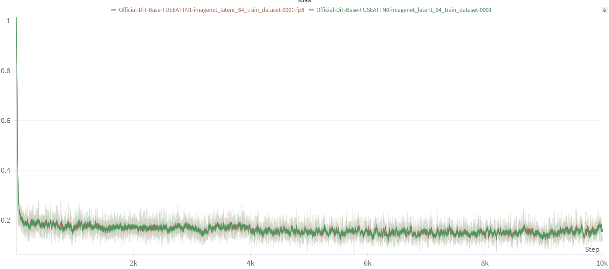

# Mcore Official DIT Best Practice


## Setup Env

### Run Container

```
docker run --shm-size=20gb --ulimit memlock=-1 --ulimit stack=67108864 --gpus all -it --name MCORE_OFFICIAL_DIT -p 5022:22 -p 5006:6006 -p 5064:6064 -p 5888:8888 -v /data/weidongz/docker_workspace:/workspace nvcr.io/nvidia/pytorch:24.08-py3 bash
```

On PDX:

```
srun -w h20-[1-8] -N 1 --gres=gpu:8 --container-image=nvcr.io/nvidia/pytorch:24.08-py3 --container-save=/home/weidongz/docker_workspace/images/official_dit.pytorch2408.sqsh --container-mounts=/home/weidongz/docker_workspace:/workspace --container-writable --pty bash
```

```
srun -w h20-[1-8] -N 1 --gres=gpu:8 --container-image=/home/weidongz/docker_workspace/images/official_dit.pytorch2408.sqsh --container-save=/home/weidongz/docker_workspace/images/official_dit.pytorch2408-bk.sqsh --container-mounts=/home/weidongz/docker_workspace:/workspace --container-writable --pty bash
```

### Code

```
https://gitlab-master.nvidia.com/dl/nemo/mcore-vfm/-/blob/zhuoyaow/official_dit_convergence/examples/pretrain_official_dit_distributed_with_mp.sh
```

```
mkdir -p /workspace/code/sora-like/official_dit
cd /workspace/code/sora-like/official_dit

git clone -b zhuoyaow/official_dit_convergence https://gitlab-master.nvidia.com/dl/nemo/mcore-vfm.git
```

### Data

Data位于如下路径：

computelab路径：

```
 /home/scratch.weidongz_wwfo/cached_latent.tar.gz
```

```
mkdir -p /workspace/data/
cd /workspace/data/

scp -r weidongz@computelab:/home/scratch.weidongz_wwfo/cached_latent.tar.gz ./

tar -xzvf cached_latent.tar.gz

/workspace/data/imagenet_latent_64_train
```
数据如下, 1000个样本：

```
root@e6770aa7a2b8:/workspace/data/imagenet_latent_64_train# ls
0000  0040  0080  0120  0160  0200  0240  0280  0320  0360  0400  0440  0480  0520  0560  0600  0640  0680  0720  0760  0800  0840  0880  0920  0960
0001  0041  0081  0121  0161  0201  0241  0281  0321  0361  0401  0441  0481  0521  0561  0601  0641  0681  0721  0761  0801  0841  0881  0921  0961
0002  0042  0082  0122  0162  0202  0242  0282  0322  0362  0402  0442  0482  0522  0562  0602  0642  0682  0722  0762  0802  0842  0882  0922  0962
0003  0043  0083  0123  0163  0203  0243  0283  0323  0363  0403  0443  0483  0523  0563  0603  0643  0683  0723  0763  0803  0843  0883  0923  0963
0004  0044  0084  0124  0164  0204  0244  0284  0324  0364  0404  0444  0484  0524  0564  0604  0644  0684  0724  0764  0804  0844  0884  0924  0964
0005  0045  0085  0125  0165  0205  0245  0285  0325  0365  0405  0445  0485  0525  0565  0605  0645  0685  0725  0765  0805  0845  0885  0925  0965
0006  0046  0086  0126  0166  0206  0246  0286  0326  0366  0406  0446  0486  0526  0566  0606  0646  0686  0726  0766  0806  0846  0886  0926  0966
0007  0047  0087  0127  0167  0207  0247  0287  0327  0367  0407  0447  0487  0527  0567  0607  0647  0687  0727  0767  0807  0847  0887  0927  0967
0008  0048  0088  0128  0168  0208  0248  0288  0328  0368  0408  0448  0488  0528  0568  0608  0648  0688  0728  0768  0808  0848  0888  0928  0968
0009  0049  0089  0129  0169  0209  0249  0289  0329  0369  0409  0449  0489  0529  0569  0609  0649  0689  0729  0769  0809  0849  0889  0929  0969
0010  0050  0090  0130  0170  0210  0250  0290  0330  0370  0410  0450  0490  0530  0570  0610  0650  0690  0730  0770  0810  0850  0890  0930  0970
0011  0051  0091  0131  0171  0211  0251  0291  0331  0371  0411  0451  0491  0531  0571  0611  0651  0691  0731  0771  0811  0851  0891  0931  0971
0012  0052  0092  0132  0172  0212  0252  0292  0332  0372  0412  0452  0492  0532  0572  0612  0652  0692  0732  0772  0812  0852  0892  0932  0972
0013  0053  0093  0133  0173  0213  0253  0293  0333  0373  0413  0453  0493  0533  0573  0613  0653  0693  0733  0773  0813  0853  0893  0933  0973
0014  0054  0094  0134  0174  0214  0254  0294  0334  0374  0414  0454  0494  0534  0574  0614  0654  0694  0734  0774  0814  0854  0894  0934  0974
0015  0055  0095  0135  0175  0215  0255  0295  0335  0375  0415  0455  0495  0535  0575  0615  0655  0695  0735  0775  0815  0855  0895  0935  0975
0016  0056  0096  0136  0176  0216  0256  0296  0336  0376  0416  0456  0496  0536  0576  0616  0656  0696  0736  0776  0816  0856  0896  0936  0976
0017  0057  0097  0137  0177  0217  0257  0297  0337  0377  0417  0457  0497  0537  0577  0617  0657  0697  0737  0777  0817  0857  0897  0937  0977
0018  0058  0098  0138  0178  0218  0258  0298  0338  0378  0418  0458  0498  0538  0578  0618  0658  0698  0738  0778  0818  0858  0898  0938  0978
0019  0059  0099  0139  0179  0219  0259  0299  0339  0379  0419  0459  0499  0539  0579  0619  0659  0699  0739  0779  0819  0859  0899  0939  0979
0020  0060  0100  0140  0180  0220  0260  0300  0340  0380  0420  0460  0500  0540  0580  0620  0660  0700  0740  0780  0820  0860  0900  0940  0980
0021  0061  0101  0141  0181  0221  0261  0301  0341  0381  0421  0461  0501  0541  0581  0621  0661  0701  0741  0781  0821  0861  0901  0941  0981
0022  0062  0102  0142  0182  0222  0262  0302  0342  0382  0422  0462  0502  0542  0582  0622  0662  0702  0742  0782  0822  0862  0902  0942  0982
0023  0063  0103  0143  0183  0223  0263  0303  0343  0383  0423  0463  0503  0543  0583  0623  0663  0703  0743  0783  0823  0863  0903  0943  0983
0024  0064  0104  0144  0184  0224  0264  0304  0344  0384  0424  0464  0504  0544  0584  0624  0664  0704  0744  0784  0824  0864  0904  0944  0984
0025  0065  0105  0145  0185  0225  0265  0305  0345  0385  0425  0465  0505  0545  0585  0625  0665  0705  0745  0785  0825  0865  0905  0945  0985
0026  0066  0106  0146  0186  0226  0266  0306  0346  0386  0426  0466  0506  0546  0586  0626  0666  0706  0746  0786  0826  0866  0906  0946  0986
0027  0067  0107  0147  0187  0227  0267  0307  0347  0387  0427  0467  0507  0547  0587  0627  0667  0707  0747  0787  0827  0867  0907  0947  0987
0028  0068  0108  0148  0188  0228  0268  0308  0348  0388  0428  0468  0508  0548  0588  0628  0668  0708  0748  0788  0828  0868  0908  0948  0988
0029  0069  0109  0149  0189  0229  0269  0309  0349  0389  0429  0469  0509  0549  0589  0629  0669  0709  0749  0789  0829  0869  0909  0949  0989
0030  0070  0110  0150  0190  0230  0270  0310  0350  0390  0430  0470  0510  0550  0590  0630  0670  0710  0750  0790  0830  0870  0910  0950  0990
0031  0071  0111  0151  0191  0231  0271  0311  0351  0391  0431  0471  0511  0551  0591  0631  0671  0711  0751  0791  0831  0871  0911  0951  0991
0032  0072  0112  0152  0192  0232  0272  0312  0352  0392  0432  0472  0512  0552  0592  0632  0672  0712  0752  0792  0832  0872  0912  0952  0992
0033  0073  0113  0153  0193  0233  0273  0313  0353  0393  0433  0473  0513  0553  0593  0633  0673  0713  0753  0793  0833  0873  0913  0953  0993
0034  0074  0114  0154  0194  0234  0274  0314  0354  0394  0434  0474  0514  0554  0594  0634  0674  0714  0754  0794  0834  0874  0914  0954  0994
0035  0075  0115  0155  0195  0235  0275  0315  0355  0395  0435  0475  0515  0555  0595  0635  0675  0715  0755  0795  0835  0875  0915  0955  0995
0036  0076  0116  0156  0196  0236  0276  0316  0356  0396  0436  0476  0516  0556  0596  0636  0676  0716  0756  0796  0836  0876  0916  0956  0996
0037  0077  0117  0157  0197  0237  0277  0317  0357  0397  0437  0477  0517  0557  0597  0637  0677  0717  0757  0797  0837  0877  0917  0957  0997
0038  0078  0118  0158  0198  0238  0278  0318  0358  0398  0438  0478  0518  0558  0598  0638  0678  0718  0758  0798  0838  0878  0918  0958  0998
0039  0079  0119  0159  0199  0239  0279  0319  0359  0399  0439  0479  0519  0559  0599  0639  0679  0719  0759  0799  0839  0879  0919  0959  0999


```

## Run Script

报错：
```
ImportError: cannot import name 'packaging' from 'pkg_resources' (/usr/local/lib/python3.10/dist-packages/pkg_resources/__init__.py)
```
解决方案：
```
pip install setuptools -U
```

需要升级TE到1.10版本，参照：[Installation (from source)](https://docs.nvidia.com/deeplearning/transformer-engine/user-guide/installation.html#installation-from-source)


```
mkdir -p /workspace/code/sora-like/official_dit
cd /workspace/code/sora-like/official_dit

git clone --branch v1.10 --recursive https://github.com/NVIDIA/TransformerEngine.git


cd TransformerEngine
export NVTE_FRAMEWORK=pytorch   # Optionally set framework
pip install .                   # Build and install
```


运行：

```
cd /workspace/code/sora-like/official_dit/mcore-vfm/examples

./pretrain_official_dit_distributed_with_mp.sh
```

训练loss收敛曲线如下：




## Performance Test

### FP8 Support

```
    --fp8-format hybrid \
    --fp8-amax-history-len 1024 \
    --fp8-amax-compute-algo max
```

FP8的loss与BF16训练的loss基本能对齐 (H20)：



**H20 tp1pp1cp1情况下**：FP8 vs BF16的加速比 120.4%

|FP8 time/iter|BF16 time/iter|Speedup|
|:-:|:-:|:-:|
|1093 ms|1316 ms|120.4%|

### Flash Attn vs Fused Attn

|FlashA time/iter|FusedA time/iter|Speedup (Fused/Flash)|
|:-:|:-:|:-:|
|1522.4 ms|1482.9 ms|102.7%|

#### Default config (cp disabled)

```
CP_SIZE=1
TP_SIZE=1
PP_SIZE=1
VPP_SIZE=1

GPUS_PER_NODE=8
MB=32
let GB=${MB}*${GPUS_PER_NODE}
```

**Flash Atten**:

```
NAME="Official-DiT-Base-FUSEATTN0-${DATASET}_dataset-${JOB_ID}-bf16-flashattn-vs-fusedattn"

NVTE_FUSED_ATTN=0
```

```
 [2024-11-06 09:50:49] iteration      200/   10000 | consumed samples:        51200 | elapsed time per iteration (ms): 1521.9 | throughput per GPU (TFLOP/s/GPU): 76.8 | learning rate: 1.000000E-04 | global batch size:   256 | loss: 1.927525E-01 | loss scale: 1.0 | grad norm: 0.214 | number of skipped iterations:   0 | number of nan iterations:   0 |
 [2024-11-06 09:53:22] iteration      300/   10000 | consumed samples:        76800 | elapsed time per iteration (ms): 1524.6 | throughput per GPU (TFLOP/s/GPU): 76.7 | learning rate: 1.000000E-04 | global batch size:   256 | loss: 1.921382E-01 | loss scale: 1.0 | grad norm: 0.173 | number of skipped iterations:   0 | number of nan iterations:   0 |
 [2024-11-06 09:55:54] iteration      400/   10000 | consumed samples:       102400 | elapsed time per iteration (ms): 1527.4 | throughput per GPU (TFLOP/s/GPU): 76.5 | learning rate: 1.000000E-04 | global batch size:   256 | loss: 1.830679E-01 | loss scale: 1.0 | grad norm: 0.175 | number of skipped iterations:   0 | number of nan iterations:   0 |
 [2024-11-06 09:58:27] iteration      500/   10000 | consumed samples:       128000 | elapsed time per iteration (ms): 1522.4 | throughput per GPU (TFLOP/s/GPU): 76.8 | learning rate: 1.000000E-04 | global batch size:   256 | loss: 1.787374E-01 | loss scale: 1.0 | grad norm: 0.251 | number of skipped iterations:   0 | number of nan iterations:   0 |
 [2024-11-06 10:01:01] iteration      600/   10000 | consumed samples:       153600 | elapsed time per iteration (ms): 1541.3 | throughput per GPU (TFLOP/s/GPU): 75.9 | learning rate: 1.000000E-04 | global batch size:   256 | loss: 1.793828E-01 | loss scale: 1.0 | grad norm: 0.138 | number of skipped iterations:   0 | number of nan iterations:   0 |
 [2024-11-06 10:03:34] iteration      700/   10000 | consumed samples:       179200 | elapsed time per iteration (ms): 1532.1 | throughput per GPU (TFLOP/s/GPU): 76.3 | learning rate: 1.000000E-04 | global batch size:   256 | loss: 1.821270E-01 | loss scale: 1.0 | grad norm: 0.195 | number of skipped iterations:   0 | number of nan iterations:   0 |
 [2024-11-06 10:06:08] iteration      800/   10000 | consumed samples:       204800 | elapsed time per iteration (ms): 1535.6 | throughput per GPU (TFLOP/s/GPU): 76.1 | learning rate: 1.000000E-04 | global batch size:   256 | loss: 1.734681E-01 | loss scale: 1.0 | grad norm: 0.186 | number of skipped iterations:   0 | number of nan iterations:   0 |

```

**Fused Atten**:

```
NAME="Official-DiT-Base-FUSEATTN1-${DATASET}_dataset-${JOB_ID}-bf16-flashattn-vs-fusedattn"

NVTE_FUSED_ATTN=1
```

```

 [2024-11-06 10:30:14] iteration      200/   10000 | consumed samples:        51200 | elapsed time per iteration (ms): 1484.3 | throughput per GPU (TFLOP/s/GPU): 78.8 | learning rate: 1.000000E-04 | global batch size:   256 | loss: 1.926066E-01 | loss scale: 1.0 | grad norm: 0.812 | number of skipped iterations:   0 | number of nan iterations:   0 |
 [2024-11-06 10:32:43] iteration      300/   10000 | consumed samples:        76800 | elapsed time per iteration (ms): 1487.0 | throughput per GPU (TFLOP/s/GPU): 78.6 | learning rate: 1.000000E-04 | global batch size:   256 | loss: 1.921367E-01 | loss scale: 1.0 | grad norm: 0.243 | number of skipped iterations:   0 | number of nan iterations:   0 |
 [2024-11-06 10:35:11] iteration      400/   10000 | consumed samples:       102400 | elapsed time per iteration (ms): 1482.9 | throughput per GPU (TFLOP/s/GPU): 78.8 | learning rate: 1.000000E-04 | global batch size:   256 | loss: 1.830459E-01 | loss scale: 1.0 | grad norm: 0.336 | number of skipped iterations:   0 | number of nan iterations:   0 |
 [2024-11-06 10:37:40] iteration      500/   10000 | consumed samples:       128000 | elapsed time per iteration (ms): 1492.2 | throughput per GPU (TFLOP/s/GPU): 78.4 | learning rate: 1.000000E-04 | global batch size:   256 | loss: 1.788824E-01 | loss scale: 1.0 | grad norm: 0.239 | number of skipped iterations:   0 | number of nan iterations:   0 |

```


#### Default config (cp enabled)

**Flash Atten**:
```
NAME="Official-DiT-Base-FUSEATTN0-${DATASET}_dataset-${JOB_ID}-bf16-flashattn-vs-fusedattn-cp2"

NVTE_FUSED_ATTN=1
```

```


```

**Fused Atten**:
```
NAME="Official-DiT-Base-FUSEATTN1-${DATASET}_dataset-${JOB_ID}-bf16-flashattn-vs-fusedattn-cp2"

NVTE_FUSED_ATTN=1
```

```
 [2024-11-06 10:49:37] iteration      200/   10000 | consumed samples:        51200 | elapsed time per iteration (ms): 2187.4 | throughput per GPU (TFLOP/s/GPU): 53.5 | learning rate: 1.000000E-04 | global batch size:   256 | loss: 2.170999E-01 | loss scale: 1.0 | grad norm: 0.372 | number of skipped iterations:   0 | number of nan iterations:   0 |
 [2024-11-06 10:53:14] iteration      300/   10000 | consumed samples:        76800 | elapsed time per iteration (ms): 2167.5 | throughput per GPU (TFLOP/s/GPU): 53.9 | learning rate: 1.000000E-04 | global batch size:   256 | loss: 2.169537E-01 | loss scale: 1.0 | grad norm: 1.028 | number of skipped iterations:   0 | number of nan iterations:   0 |
 [2024-11-06 10:56:54] iteration      400/   10000 | consumed samples:       102400 | elapsed time per iteration (ms): 2198.9 | throughput per GPU (TFLOP/s/GPU): 53.2 | learning rate: 1.000000E-04 | global batch size:   256 | loss: 2.150569E-01 | loss scale: 1.0 | grad norm: 0.406 | number of skipped iterations:   0 | number of nan iterations:   0 |

```