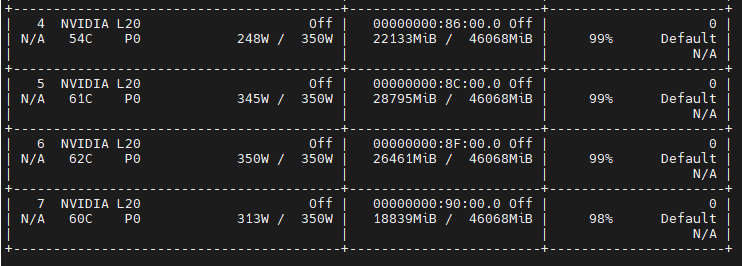

# UNEVEN_PP Features Test

ref:https://gitlab-master.nvidia.com/ADLR/megatron-lm/-/merge_requests/1881

## ENV:
```
docker run --shm-size=20gb --ulimit memlock=-1 --ulimit stack=67108864 --gpus all -it --name UNEVEN -p 5022:22 -p 5006:6006 -p 5064:6064 -p 5888:8888 -v /tmp_data/weidongz/docker_workspace:/workspace nvcr.io/nvidia/pytorch:24.08-py3 bash

pip install sentencepiece


```

## Code

```
mkdir -p /workspace/code/mcore/mcore_uneven_pp
cd /workspace/code/mcore/mcore_uneven_pp

git clone https://github.com/NVIDIA/Megatron-LM.git
```

代码：[run_uneven_pp_dense.sh](./run_uneven_pp_dense.sh)


## Data

```
mkdir -p /tmp_data/weidongz/docker_workspace/data/mm/llama2/7b
cd /tmp_data/weidongz/docker_workspace/data/mm/llama2/7b
```

## Run

加入超参：

```
--decoder-first-pipeline-num-layers 3 \
--decoder-last-pipeline-num-layers 3 \
```

```
CUDA_VISIBLE_DEVICES=4,5,6,7 ./run_uneven_pp_dense.sh
```



可以成功设置第一个和最后一个pipeline rank的layer数量。

