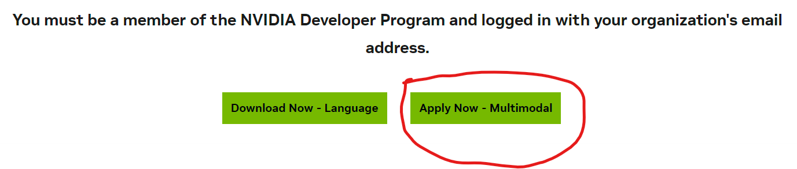
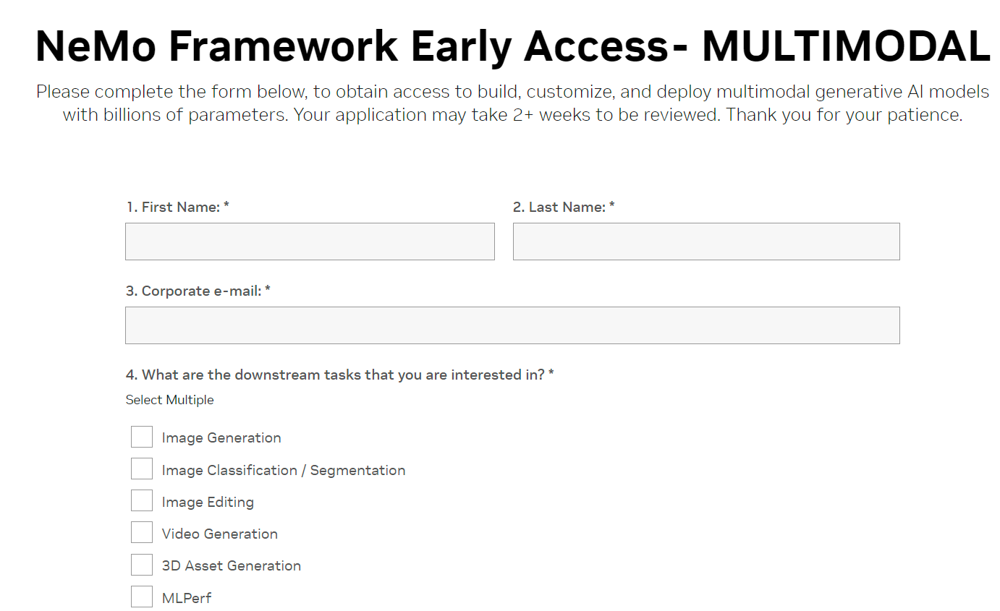
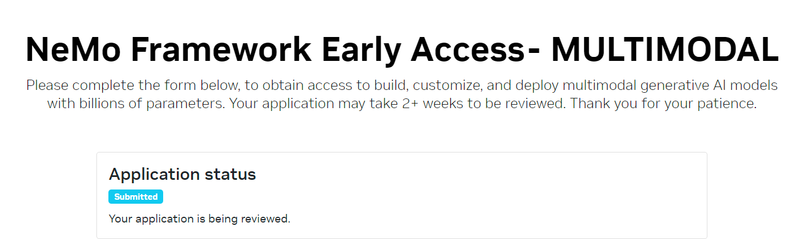

# 如何申请NemoFramework Multimodal

**内部代码：[NeMo-Megatron-Launcher
](https://gitlab-master.nvidia.com/dl/JoC/NeMo-Megatron-Launcher/-/tree/internal/main?ref_type=heads)**
* 这里要十分注意，这和NemoFramework的launcher并不是一个repo，需要区分；

## 访问权限申请

**申请链接：[Get Access to NeMo Framework](https://developer.nvidia.com/nemo-framework)**

点击如下：`Apply Now - Multimodal`, **注意：如果申请LLM大模型相关点击Language，这里申请Multimodal，点击`Apply Now - Multimodal`**

进入申请页面：[NeMo Framework Early Access- MULTIMODAL](https://developer.nvidia.com/nemo-framework-multimodal-early-access), 按要求填入申请信息。

填写完申请信息会进入如下等待审批页面：

