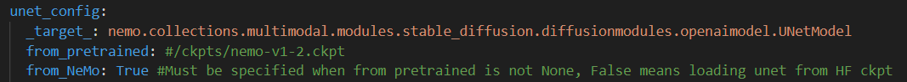
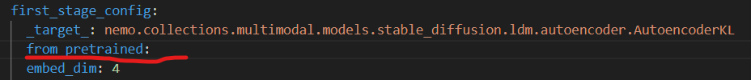
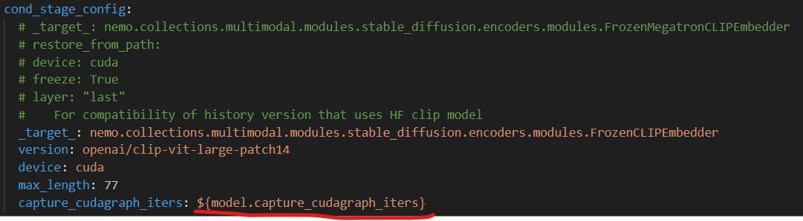
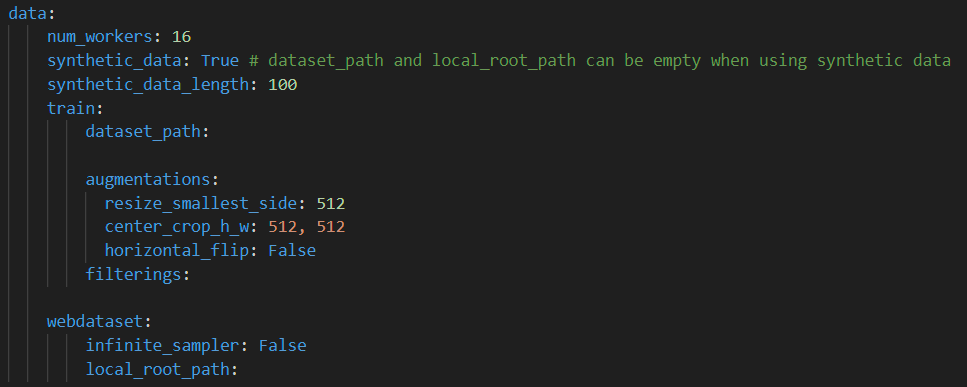

# Nemo Framework MultiModal - Stable Diffusion Best Practice (单机运行版本)

<br><br>

## TASK TO DO

<br><br>

## Setup Env

### 1. Install NVIDIA Driver (Optional)

Ref: [Container Setup](https://docs.omniverse.nvidia.com/isaacsim/latest/installation/install_container.html#container-setup)

驱动下载：[https://www.nvidia.com/en-us/drivers/unix/linux-amd64-display-archive/](https://www.nvidia.com/en-us/drivers/unix/linux-amd64-display-archive/)

安装驱动过程中遇到的问题，可以参照：[How to install a driver](https://docs.omniverse.nvidia.com/dev-guide/latest/linux-troubleshooting.html#q1-how-to-install-a-driver)

安装参照：[重新安装驱动(optional)](https://github.com/searobbersduck/AIGC_Note/blob/main/LLM/NemoFramework/Nemo-RLHF-23.08.03.md#%E9%87%8D%E6%96%B0%E5%AE%89%E8%A3%85%E9%A9%B1%E5%8A%A8optional)

```
sudo nvidia-uninstall

sudo apt-get remove --purge nvidia-*
sudo apt autoremove
sudo apt autoclean

# 重启
sudo reboot

# 选择下载好的驱动进行安装
sudo ./NVIDIA-Linux-x86_64-535.54.03.run

# 重启
sudo reboot
```

<br>

### 可能出现的问题解决 (Optional)

* [nvidia-fabricmanager.service can not start due to CUDA Version mismatch](https://github.com/NVIDIA/gpu-operator/issues/544)

  ```
  I was also facing the same issue of fabric manager mismatch.

  I think Ubuntu package manager updates fabric-manager which causes Nvidia driver and fabric manager version mismatch.
  Once the fabric manager is updated, you cannot reinstall the previous version as it is removed from ubuntu package manager.

  The only way to solve this is to either install old fabric manager from the link shared by @shivamerla
  Or
  reinstall the latest Nvidia Driver which matches the fabric manager available on Ubuntu (535.129.03 worked for me)
  ```
  * 这里我遇到的问题及解决方案是将驱动版本降到和能安装的fabricmanager版本一致；
* 如何安装`fabricmanager`
  * ref: [Installation](https://github.com/NVIDIA/apt-packaging-fabric-manager?tab=readme-ov-file#installation)
  
  ```
  apt-get install cuda-drivers-fabricmanager-535
  ```
* [[Docker] 错误之Error response from daemon: could not select device driver ““ with capabilities: [[gpu]]](https://blog.csdn.net/dou3516/article/details/108314908)


<br>

### 2. Run Container

```
docker run --shm-size=20gb --ulimit memlock=-1 --ulimit stack=67108864 --gpus all -it --name SD -p 6022:22 -p 6006:6006 -p 6064:6064 -p 6888:8888 -v /data/weidongz/docker_workspace:/workspace nvcr.io/ea-bignlp/ea-mm-participants/bignlp-mm:23.08-py3 bash
```


<br><br>

## How to Run a simple demo

### 1. Modify the config file

以`/opt/NeMo/examples/multimodal/generative/stable_diffusion/sd_train.py`为例，运行时对应的配置文件为`/opt/NeMo/examples/multimodal/generative/stable_diffusion/conf/sd_train.yaml`.

具体选用哪个配置文件，可以通过修改`/opt/NeMo/examples/multimodal/generative/stable_diffusion/sd_train.py`中的`@hydra_runner(config_path='conf', config_name='sd_train')`进行修改，`config_name='sd_train'`对应的就是配置文件的名字。

以`/opt/NeMo/examples/multimodal/generative/stable_diffusion/conf/sd_train.yaml`为例，最简单的demo需要修改哪些内容呢？

* `model`的`from_pretrained`，要指定具体的路径，如果没有路径，这部分空白，如下：
  * 
  * 
  * 
    * 此处需要注意默认的配置文件的里面的`capture_cudagraph_iters: ${model.capture_cudagraph_iters}`有错误；
* 最简单的demo，可以先使用合成数据，修改如下：
  * 


具体最简单的demo运行的配置文件设置，见附录（单节点、单卡、）

<br><br>

## Benchmark

|GPU Type|Task|precision|Datasets|Devices|Nodes|Micro Batch|Global Batch|samples/gpu/s|samples|time consume|command|Memory|
|:-:|:-:|:-:|:-:|:-:|:-:|:-:|:-:|:-:|:-:|:-:|:-:|:-:|
|H800 PCIE|SD_V1|16|Synthetic|1|1|1|1|1e5/(261*60+48)=6.37|100k|4:21:48|CUDA_VISIBLE_DEVICES=0 python sd_train.py --config-name 'sd_train_v1_m1g1'|
|H800 PCIE|SD_V1|16|Synthetic|1|1|4|4|69564/(48*60+10)=24.07|69564|48:10|CUDA_VISIBLE_DEVICES=1 python sd_train.py --config-name 'sd_train_v1_m4g4'|
|H800 PCIE|SD_V1|16|Synthetic|1|1|4|16|28784/(15*60+27)=31.05|28784|15:27|CUDA_VISIBLE_DEVICES=0 python sd_train.py --config-name 'sd_train_v1_m4g16'|21047MiB / 81559MiB|
|H800 PCIE|SD_V1|16|Synthetic|1|1|8|8|37256/(18*60+39)=33.29|37256|18:39|CUDA_VISIBLE_DEVICES=1 python sd_train_v1.py --config-name 'sd_train_v1_m4g4' model.micro_batch_size=8 model.global_batch_size=8|24929MiB / 81559MiB|
|H800 PCIE|SD_V1|16|Synthetic|1|1|8|16|49136/(22*60+36)=36.24|49136|22:36|CUDA_VISIBLE_DEVICES=0 python sd_train.py --config-name 'sd_train_v1_m4g4' model.micro_batch_size=8 model.global_batch_size=16|24889MiB / 81559MiB|
|H800 PCIE|SD_V1|16|Synthetic|1|1|16|16|1e5/(43*60)=38.76|100k|43:00|CUDA_VISIBLE_DEVICES=1 python sd_train.py --config-name 'sd_train_v1_m4g4' model.micro_batch_size=16 model.global_batch_size=16|32893MiB / 81559MiB|
|H800 PCIE|SD_V1|16|Synthetic|1|1|32|32|1e5/(39*60+19)=42.39|100k|39:19|CUDA_VISIBLE_DEVICES=1 python sd_train.py --config-name 'sd_train_v1_m4g4' model.micro_batch_size=32 model.global_batch_size=32|48787MiB / 81559MiB|
|H800 PCIE|SD_V1|16|Synthetic|1|1|64|64|1e5/(37*60+49)=44.07|100k|37:49|CUDA_VISIBLE_DEVICES=0 python sd_train.py --config-name 'sd_train_v1_m4g4' model.micro_batch_size=64 model.global_batch_size=64|80747MiB / 81559MiB|
|H800 PCIE|SD_V1|16|Synthetic|2|1|64|128|2e5/(39*60+5)/2=85.29/2=42.64|200k|39:05|CUDA_VISIBLE_DEVICES=0 python sd_train.py --config-name 'sd_train_v1_m4g4' model.micro_batch_size=64 model.global_batch_size=128 trainer.devices=2|80139MiB / 81559MiB, 80507MiB / 81559MiB|
|L20 emulated by L40|SD_V1|16|Synthetic|1|1|16|16|16.60|xx|xx|CUDA_VISIBLE_DEVICES=0 python sd_train.py --config-name 'sd_train_v1_m4g4' model.micro_batch_size=16 model.global_batch_size=16 trainer.devices=1|32480MiB / 46068MiB|
|L20 emulated by L40|SD_V1|16|Synthetic|1|1|24|24|16.20|xx|xx|CUDA_VISIBLE_DEVICES=0 python sd_train.py --config-name 'sd_train_v1_m4g4' model.micro_batch_size=24 model.global_batch_size=24 trainer.devices=1|40428MiB / 46068MiB|
|L20 emulated by L40|SD_V1|16|Synthetic|1|1|28|28|16.40|xx|xx|CUDA_VISIBLE_DEVICES=0 python sd_train.py --config-name 'sd_train_v1_m4g4' model.micro_batch_size=28 model.global_batch_size=28 trainer.devices=1|44412MiB / 46068MiB|
|L20 emulated by L40|SD_V1|16|Synthetic|1|1|30|30||xx|xx|CUDA_VISIBLE_DEVICES=0 python sd_train.py --config-name 'sd_train_v1_m4g4' model.micro_batch_size=30 model.global_batch_size=30 trainer.devices=1|OOM / 46068MiB|
|:-:|:-:|:-:|:-:|:-:|:-:|:-:|:-:|:-:|:-:|:-:|:-:|:-:|
|A100 40G NVLINK|SD_V1|16|Synthetic|1|1|16|16|29.00|xx|xx|CUDA_VISIBLE_DEVICES=0 python sd_train.py --config-name 'sd_train_v1_m4g4' model.micro_batch_size=16 model.global_batch_size=16 trainer.devices=1|32573MiB / 40960MiB|
|A100 40G NVLINK|SD_V1|16|Synthetic|1|1|8|8|25.50|xx|xx|CUDA_VISIBLE_DEVICES=1 python sd_train.py --config-name 'sd_train_v1_m4g4' model.micro_batch_size=8 model.global_batch_size=8 trainer.devices=1|24609MiB / 40960MiB|
|A100 40G NVLINK|SD_V1|16|Synthetic|1|1|24|24|30.50|xx|xx|CUDA_VISIBLE_DEVICES=2 python sd_train.py --config-name 'sd_train_v1_m4g4' model.micro_batch_size=24 model.global_batch_size=24 trainer.devices=1|40295MiB / 40960MiB|
|A100 40G NVLINK|SD_V1|16|Synthetic|4|1|16|64|4e5/(59*60+9)/4=28.18|4e5|59:09|CUDA_VISIBLE_DEVICES=2 python sd_train.py --config-name 'sd_train_v1_m4g4' model.micro_batch_size=24 model.global_batch_size=24 trainer.devices=1|40295MiB / 40960MiB|

<br>

### Ablation Exp

|GPU Type|Task|precision|Datasets|Devices|Nodes|Micro Batch|Global Batch|samples/gpu/s|samples|time consume|command|Memory|
|:-:|:-:|:-:|:-:|:-:|:-:|:-:|:-:|:-:|:-:|:-:|:-:|:-:|
|A100 40G NVLINK|SD_V1|16|Synthetic|1|1|16|16|28.80|xx|xx|CUDA_VISIBLE_DEVICES=0 python sd_train.py --config-name 'sd_train_v1_m4g4' model.micro_batch_size=16 model.global_batch_size=16 trainer.devices=1 model.unet_config.use_flash_attention=True|32557MiB / 40960MiB|
|A100 40G NVLINK|SD_V1|16|Synthetic|1|1|2|2|9.92|xx|xx|CUDA_VISIBLE_DEVICES=1 python sd_train.py --config-name 'sd_train_v1_m4g4' model.micro_batch_size=2 model.global_batch_size=2 trainer.devices=1 model.unet_config.use_flash_attention=False|29531MiB / 40960MiB|
|A100 40G NVLINK|SD_V1|16|Synthetic|1|1|16|16|29.00|xx|xx|CUDA_VISIBLE_DEVICES=2 python sd_train.py --config-name 'sd_train_v1_m4g4' model.micro_batch_size=16 model.global_batch_size=16 trainer.devices=1 model.inductor=True|29667MiB / 40960MiB|
|A100 40G NVLINK|SD_V1|16|Synthetic|1|1|16|16|29.00|1e5|57:29|CUDA_VISIBLE_DEVICES=3 python sd_train.py --config-name 'sd_train_v1_m4g4' model.micro_batch_size=16 model.global_batch_size=16 trainer.devices=1 model.inductor_cudagraphs=True|32557MiB / 40960MiB|
|A100 40G NVLINK|SD_V1|16|Synthetic|1|1|16|16|28.87|1e5|57:44|CUDA_VISIBLE_DEVICES=4 python sd_train.py --config-name 'sd_train_v1_m4g4' model.micro_batch_size=16 model.global_batch_size=16 trainer.devices=1 model.fused_opt=False| 32573MiB / 40960MiB|
|A100 40G NVLINK|SD_V1|16|Synthetic|1|1|16|16|29.10|4884*16|44:45|CUDA_VISIBLE_DEVICES=5 python sd_train.py --config-name 'sd_train_v1_m4g4' model.micro_batch_size=16 model.global_batch_size=16 trainer.devices=1 model.use_ema=True|32573MiB / 40960MiB|
|A100 40G NVLINK|SD_V1|16|Synthetic|1|1|16|16|28.90|4735*16|43:41|CUDA_VISIBLE_DEVICES=6 python sd_train.py --config-name 'sd_train_v1_m4g4' model.micro_batch_size=16 model.global_batch_size=16 trainer.devices=1 model.concat_mode=False|32573MiB / 40960MiB|
|A100 40G NVLINK|SD_V1|16|Synthetic|1|1|16|16|28.55|4432*16|41:24|CUDA_VISIBLE_DEVICES=7 python sd_train.py --config-name 'sd_train_v1_m4g4' model.micro_batch_size=16 model.global_batch_size=16 trainer.devices=1 model.unet_config.enable_amp_o2_fp16=False|38957MiB / 40960MiB|

<br>

## Benchmark Version 1

**Docker image: nvcr.io/ea-bignlp/ea-mm-participants/bignlp-mm:23.08-py3**

****

|GPU Type|Task|precision|Datasets|Devices|Nodes|Micro Batch|Global Batch|samples/gpu/s|command|Memory|
|:-:|:-:|:-:|:-:|:-:|:-:|:-:|:-:|:-:|:-:|:-:|
|H800 PCIE|SD_V1|16|Synthetic|1|1|1|1|6.37|CUDA_VISIBLE_DEVICES=0 python sd_train.py --config-name 'sd_train_v1_m1g1'|
|H800 PCIE|SD_V1|16|Synthetic|1|1|4|4|24.07|CUDA_VISIBLE_DEVICES=1 python sd_train.py --config-name 'sd_train_v1_m4g4'|
|H800 PCIE|SD_V1|16|Synthetic|1|1|4|16|31.05|CUDA_VISIBLE_DEVICES=0 python sd_train.py --config-name 'sd_train_v1_m4g16'|21047MiB / 81559MiB|
|H800 PCIE|SD_V1|16|Synthetic|1|1|8|8|33.29|CUDA_VISIBLE_DEVICES=1 python sd_train_v1.py --config-name 'sd_train_v1_m4g4' model.micro_batch_size=8 model.global_batch_size=8|24929MiB / 81559MiB|
|H800 PCIE|SD_V1|16|Synthetic|1|1|8|16|49136/36.24|CUDA_VISIBLE_DEVICES=0 python sd_train.py --config-name 'sd_train_v1_m4g4' model.micro_batch_size=8 model.global_batch_size=16|24889MiB / 81559MiB|
|H800 PCIE|SD_V1|16|Synthetic|1|1|16|16|38.76|CUDA_VISIBLE_DEVICES=1 python sd_train.py --config-name 'sd_train_v1_m4g4' model.micro_batch_size=16 model.global_batch_size=16|32893MiB / 81559MiB|
|H800 PCIE|SD_V1|16|Synthetic|1|1|32|32|42.39|CUDA_VISIBLE_DEVICES=1 python sd_train.py --config-name 'sd_train_v1_m4g4' model.micro_batch_size=32 model.global_batch_size=32|48787MiB / 81559MiB|
|H800 PCIE|SD_V1|16|Synthetic|1|1|64|64|44.07|CUDA_VISIBLE_DEVICES=0 python sd_train.py --config-name 'sd_train_v1_m4g4' model.micro_batch_size=64 model.global_batch_size=64|80747MiB / 81559MiB|
|H800 PCIE|SD_V1|16|Synthetic|2|1|64|128|42.64|CUDA_VISIBLE_DEVICES=0 python sd_train.py --config-name 'sd_train_v1_m4g4' model.micro_batch_size=64 model.global_batch_size=128 trainer.devices=2|80139MiB / 81559MiB, 80507MiB / 81559MiB|
||||||||||||
|L20 emulated by L40|SD_V1|16|Synthetic|1|1|16|16|16.60|CUDA_VISIBLE_DEVICES=0 python sd_train.py --config-name 'sd_train_v1_m4g4' model.micro_batch_size=16 model.global_batch_size=16 trainer.devices=1|32480MiB / 46068MiB|
|L20 emulated by L40|SD_V1|16|Synthetic|1|1|24|24|16.20|CUDA_VISIBLE_DEVICES=0 python sd_train.py --config-name 'sd_train_v1_m4g4' model.micro_batch_size=24 model.global_batch_size=24 trainer.devices=1|40428MiB / 46068MiB|
|L20 emulated by L40|SD_V1|16|Synthetic|1|1|28|28|16.40|CUDA_VISIBLE_DEVICES=0 python sd_train.py --config-name 'sd_train_v1_m4g4' model.micro_batch_size=28 model.global_batch_size=28 trainer.devices=1|44412MiB / 46068MiB|
|L20 emulated by L40|SD_V1|16|Synthetic|1|1|30|30||CUDA_VISIBLE_DEVICES=0 python sd_train.py --config-name 'sd_train_v1_m4g4' model.micro_batch_size=30 model.global_batch_size=30 trainer.devices=1|OOM / 46068MiB|
||||||||||||
|A100 40G NVLINK|SD_V1|16|Synthetic|1|1|16|16|29.00|CUDA_VISIBLE_DEVICES=0 python sd_train.py --config-name 'sd_train_v1_m4g4' model.micro_batch_size=16 model.global_batch_size=16 trainer.devices=1|32573MiB / 40960MiB|
|A100 40G NVLINK|SD_V1|16|Synthetic|1|1|8|8|25.50|CUDA_VISIBLE_DEVICES=1 python sd_train.py --config-name 'sd_train_v1_m4g4' model.micro_batch_size=8 model.global_batch_size=8 trainer.devices=1|24609MiB / 40960MiB|
|A100 40G NVLINK|SD_V1|16|Synthetic|1|1|24|24|30.50|CUDA_VISIBLE_DEVICES=2 python sd_train.py --config-name 'sd_train_v1_m4g4' model.micro_batch_size=24 model.global_batch_size=24 trainer.devices=1|40295MiB / 40960MiB|
|A100 40G NVLINK|SD_V1|16|Synthetic|1|4|16|64|28.18|CUDA_VISIBLE_DEVICES=2 python sd_train.py --config-name 'sd_train_v1_m4g4' model.micro_batch_size=24 model.global_batch_size=24 trainer.devices=1|40295MiB / 40960MiB|

<br>

- [ ] **TODO: 8 GPU L20 vs A100**

<br><br>

## For Test
```
docker exec -it 6b9937651457 /bin/bash
cd /opt/NeMo/examples/multimodal/generative/stable_diffusion

CUDA_VISIBLE_DEVICES=0 python sd_train.py --config-name 'sd_train_v1_m4g4' model.micro_batch_size=8 model.global_batch_size=16
```

CUDA_VISIBLE_DEVICES=0 python sd_train.py --config-name 'sd_train_v1_m4g4' model.micro_batch_size=8 model.global_batch_size=16


