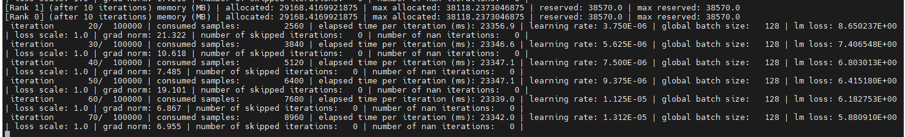

# 基本的NF启动测试

## Setup Env

### Run Container

```
docker run --shm-size=20gb --ulimit memlock=-1 --ulimit stack=67108864 --gpus all -it --name NF -p 6022:22 -p 6006:6006 -p 6064:6064 -p 6888:8888 -v /weidongz/data/weidongz/docker_workspace:/workspace nvcr.io/ea-bignlp/ga-participants/nemofw-training:24.01 bash
```


### 2.1 Process data ：Anthropic

* Preprocess data: ref: [https://github.com/NVIDIA/Megatron-LM#data-preprocessing](https://github.com/NVIDIA/Megatron-LM#data-preprocessing)

* ref: [datasets](https://github.com/searobbersduck/AIGC_Note/blob/main/LLM/NemoFramework/Nemo-RLHF-handson.md#datasets)

```
pip install datasets

mkdir -p /workspace/code/llm/common/common_utils
cd /workspace/code/llm/common/common_utils

touch process_anthropic_hh.py

# 该函数会自动下载数据，并保存在当前路径下
# python process_anthropic_hh.py

cd /workspace/data/llm/
mkdir -p /workspace/data/llm/Anthropic
cd /workspace/data/llm/Anthropic
cp /workspace/code/llm/common/common_utils/process_anthropic_hh.py /workspace/data/llm/Anthropic/

python process_anthropic_hh.py

```

```
DS_PATH=/workspace/data/llm/Anthropic
GPT2_DATA_PATH=/workspace/data/llm/gpt2-data
DS_OUT_PATH=$GPT2_DATA_PATH/datasets

MAGATRON_LM_CODE_PATH=/opt/megatron-lm/

mkdir -p $DS_OUT_PATH

python $MAGATRON_LM_CODE_PATH/tools/preprocess_data.py \
       --input $DS_PATH/train_comparisons.jsonl \
       --output-prefix $DS_OUT_PATH/my-gpt2 \
       --vocab-file $GPT2_DATA_PATH/gpt2-vocab.json \
       --tokenizer-type GPT2BPETokenizer \
       --merge-file $GPT2_DATA_PATH/gpt2-merges.txt \
       --workers 30 \
       --append-eod


# or
python $MAGATRON_LM_CODE_PATH/tools/preprocess_data.py \
       --input $DS_PATH/train_comparisons.jsonl \
       --output-prefix $DS_OUT_PATH/my-gpt2 \
       --vocab-file $GPT2_DATA_PATH/gpt2-vocab.json \
       --tokenizer-type Llama2Tokenizer \
       --tokenizer-model /workspace/data/mm/llama2/7b/llama-2-7b-chat-hf/tokenizer.model \
       --merge-file $GPT2_DATA_PATH/gpt2-merges.txt \
       --workers 30 \
       --append-eod
```


```
MAGATRON_PATH=/workspace/code/llm/moe/megatron-lm/
```


```
MODEL="/workspace/data/mm/llama2/7b/llama2-7b.nemo"
TRAIN_DS="[/workspace/data/llm/databricks/databricks-dolly-15k/training.jsonl]"
VALID_DS="[/workspace/data/llm/databricks/databricks-dolly-15k/validation.jsonl]"
TEST_DS="[/workspace/data/llm/databricks/databricks-dolly-15k/test.jsonl]"
VALID_NAMES="[databricks-dolly-15k]"


CONCAT_SAMPLING_PROBS="[1]"
TP_SIZE=8
PP_SIZE=1

```

```
python /opt/NeMo/examples/nlp/language_modeling/tuning/megatron_gpt_sft.py \
   trainer.precision=bf16 \
   trainer.devices=8 \
   trainer.num_nodes=1 \
   trainer.val_check_interval=0.1 \
   trainer.max_steps=50 \
   model.restore_from_path=${MODEL} \
   model.micro_batch_size=1 \
   model.global_batch_size=128 \
   model.tensor_model_parallel_size=${TP_SIZE} \
   model.pipeline_model_parallel_size=${PP_SIZE} \
   model.megatron_amp_O2=True \
   model.sequence_parallel=True \
   model.activations_checkpoint_granularity=selective \
   model.activations_checkpoint_method=uniform \
   model.optim.name=distributed_fused_adam \
   model.optim.lr=5e-6 \
   model.answer_only_loss=True \
   model.data.train_ds.file_names=${TRAIN_DS} \
   model.data.validation_ds.file_names=${VALID_DS} \
   model.data.test_ds.file_names=${TEST_DS} \
   model.data.train_ds.concat_sampling_probabilities=${CONCAT_SAMPLING_PROBS} \
   model.data.train_ds.max_seq_length=2048 \
   model.data.validation_ds.max_seq_length=2048 \
   model.data.train_ds.micro_batch_size=1 \
   model.data.train_ds.global_batch_size=128 \
   model.data.validation_ds.micro_batch_size=1 \
   model.data.validation_ds.global_batch_size=128 \
   model.data.test_ds.micro_batch_size=1 \
   model.data.test_ds.global_batch_size=256 \
   model.data.train_ds.num_workers=0 \
   model.data.validation_ds.num_workers=0 \
   model.data.test_ds.num_workers=0 \
   model.data.validation_ds.metric.name=loss \
   model.data.test_ds.metric.name=loss \
   model.ub_tp_comm_overlap=True \
   model.transformer_engine=True \
   exp_manager.create_wandb_logger=False \
   exp_manager.explicit_log_dir=/results \
   exp_manager.resume_if_exists=True \
   exp_manager.resume_ignore_no_checkpoint=True \
   exp_manager.create_checkpoint_callback=True \
   exp_manager.checkpoint_callback_params.monitor=validation_loss \
   exp_manager.checkpoint_callback_params.save_best_model=False \
   exp_manager.checkpoint_callback_params.save_nemo_on_train_end=True
```




