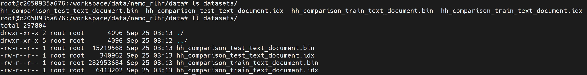
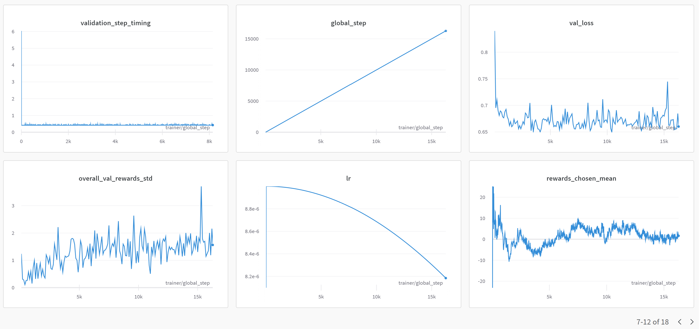

# Nemo RLHF Hands-on

**Ref: &ensp;  [5.16. Reinforcement Learning from Human Feedback](https://github.com/NVIDIA/NeMo-Megatron-Launcher#516-reinforcement-learning-from-human-feedback)**
* NeMo-RLHF supports **only GPT models** and implements the Proximal Policy Optimization (PPO) algorithm.
* Support for **other models** and RL algorithms will be added **in future releases**.

<br>

## Datasets

* **Install dependency**
* ref:  `https://stackoverflow.com/questions/48734119/git-lfs-is-not-a-git-command-unclear`

    ```
    curl -s https://packagecloud.io/install/repositories/github/git-lfs/script.deb.sh
    sudo apt-get install git-lfs
    ```

* **REF: [NeMo Framework Reward Modeling](https://gitlab-master.nvidia.com/ai-sae/nemo-llm-playbooks/-/blob/dev-RewardModeling/llm_model_customization/Customization_-_Nemo_Framework_Train_Reward_Model.md)**

* **[Step 1: Download the 2B GPT model](https://gitlab-master.nvidia.com/ai-sae/nemo-llm-playbooks/-/blob/dev-RewardModeling/llm_model_customization/Customization_-_Nemo_Framework_Train_Reward_Model.md#step-1-download-the-2b-gpt-model)**: 
    ```
    mkdir -p /workspace/data/nemo_rlhf/data
    cd /workspace/data/nemo_rlhf/data
    git  lfs  clone https://huggingface.co/nvidia/GPT-2B-001
    mkdir -p /workspace/data/nemo_rlhf/data/models
    mv GPT-2B-001/GPT-2B-001_bf16_tp1.nemo models/GPT-2B-001_bf16_tp1.nemo
    tar -xvf models/GPT-2B-001_bf16_tp1.nemo

    ls models/GPT-2B-001_bf16_tp1.nemo *.model
    ```
    

    

    
* **[Step 2: Dataset processing](https://gitlab-master.nvidia.com/ai-sae/nemo-llm-playbooks/-/blob/dev-RewardModeling/llm_model_customization/Customization_-_Nemo_Framework_Train_Reward_Model.md#step-2-dataset-processing)**: 
```
pip install datasets
```


**Task: Create process_anthropic_hh.py with following content for converting Anthropic hh-rlhf dataset to Nemo Framework reward model training jsonl format.**

**Task: Convert Anthropic hh-rlhf dataset to Nemo Framework reward model training jsonl format**

```
touch process_anthropic_hh.py
# 填入如下内容并运行
python process_anthropic_hh.py
```

```
"""A script to process the Anthropic Dataset"""
import argparse
import json
import warnings
from pathlib import Path

from datasets import load_dataset


def prepare_args():
    parser = argparse.ArgumentParser(description="generate dataset")
    parser.add_argument(
        "--output-dir", type=str, default="./",
    )
    return parser.parse_args()


START_PROMPT_FORMAT = "User: {body}\n\nAssistant: {response}"
PROMPT_CONTINUATION_FORMAT = "{text}\n\nUser: {body}\n\nAssistant: {response}"


def process_hh(split):
    if split == "validation":
        warnings.warn("anthropic HHH has no validation set, so using test set instead")
        split = "test"

    ds = load_dataset("Anthropic/hh-rlhf")[split]

    def convert_string_format(string):
        split_string = string.split("\n\nHuman: ")

        string_to_use = ""
        prompt_string_to_use = ""

        for item in split_string:
            if len(item) == 0:
                continue

            output = item.split("\n\nAssistant: ")

            if len(output) != 2:
                return None
            else:
                body, response = output

            if len(string_to_use) == 0:
                prompt_string_to_use = START_PROMPT_FORMAT.format(body=body, response="")
                string_to_use = START_PROMPT_FORMAT.format(body=body, response=response)
            else:
                prompt_string_to_use = PROMPT_CONTINUATION_FORMAT.format(text=string_to_use, body=body, response="")
                string_to_use = PROMPT_CONTINUATION_FORMAT.format(text=string_to_use, body=body, response=response)

        # for prompt, remove the space at the end
        return string_to_use, prompt_string_to_use[:-1]

    list_of_dicts = []

    chosen = list(map(convert_string_format, ds["chosen"]))
    rejected = list(map(convert_string_format, ds["rejected"]))

    for c, r in zip(chosen, rejected):
        if c is None or r is None:
            continue

        chosen_response, chosen_prompt = c
        rejected_response, rejected_prompt = r

        if chosen_prompt != rejected_prompt:
            continue

        comparison_dict = {
            "prompt": chosen_prompt,
            "chosen": chosen_response,
            "rejected": rejected_response,
        }

        list_of_dicts.append(comparison_dict)

    return list_of_dicts


def convert_list_of_dict_to_jsonl(list_of_dict):
    return "\n".join(json.dumps(item) for item in list_of_dict)


def save_dataset(list_of_dict, split, save_dir):
    prompts_to_save = convert_list_of_dict_to_jsonl({"text": item["prompt"]} for item in list_of_dict)

    with open(Path(save_dir) / f"{split}_prompts.jsonl", "w") as f:
        f.write(prompts_to_save)

    comparisons_to_save = []

    for item in list_of_dict:
        comparisons_to_save.append({"text": item["chosen"]})
        comparisons_to_save.append({"text": item["rejected"]})

    comparisons_to_save = convert_list_of_dict_to_jsonl(comparisons_to_save)

    with open(Path(save_dir) / f"{split}_comparisons.jsonl", "w") as f:
        f.write(comparisons_to_save)


if __name__ == "__main__":
    args = prepare_args()

    for split in ["train", "test"]:
        list_of_dicts = process_hh(split)
        save_dataset(list_of_dicts, split, args.output_dir)

```


**Task: Convert dataset from jsonl to mmap binary format**

```
# cd ${WORK_DIR}
cd /workspace/data/nemo_rlhf/data

mkdir datasets
python3 /opt/NeMo/scripts/nlp_language_modeling/preprocess_data_for_megatron.py \
--input "train_comparisons.jsonl" \
--output-prefix "./datasets/hh_comparison_train" \
--tokenizer-model 2053796188904e679f7e2754a2a1f280_mt_nlg_plus_multilingual_ja_zh_the_stack_frac_015_256k.model \
--tokenizer-library=sentencepiece \
--json-keys text \
--dataset-impl mmap \
--workers 30 \
--chunk_size=100 \
--append-eod

python3 /opt/NeMo/scripts/nlp_language_modeling/preprocess_data_for_megatron.py \
--input "test_comparisons.jsonl" \
--output-prefix "./datasets/hh_comparison_test" \
--tokenizer-model 2053796188904e679f7e2754a2a1f280_mt_nlg_plus_multilingual_ja_zh_the_stack_frac_015_256k.model \
--tokenizer-library=sentencepiece \
--json-keys text \
--dataset-impl mmap \
--workers 30 \
--chunk_size=100 \
--append-eod

```


```
ls datasets
```




## Training: Reward Model

**[Step 3: Customize config file for reward model training](https://gitlab-master.nvidia.com/ai-sae/nemo-llm-playbooks/-/blob/dev-RewardModeling/llm_model_customization/Customization_-_Nemo_Framework_Train_Reward_Model.md#step-3-customize-config-file-for-reward-model-training)**
如下的内容要添加到配置文件当中，非常重要，默认的配置文件可能没有`rampup_batch_size: null`


**Task: Customize the default config file /opt/nemo-rlhf examples/nlp/gpt/conf/training_rm.yaml**
* It's highly recommended to use 1 epoch for reward model training to avoid overfitting.
* Make sure "always_save_nemo: True" and "save_nemo_on_train_end: True" in the config file.
* Add "rampup_batch_size: null" in the config file as following: (This is just a workaround for 23.07 container, should not used in the future release.)

**[Step 4: Train reward model](https://gitlab-master.nvidia.com/ai-sae/nemo-llm-playbooks/-/blob/dev-RewardModeling/llm_model_customization/Customization_-_Nemo_Framework_Train_Reward_Model.md#step-4-train-reward-model)**


**设置环境变量**

```
WORK_DIR="/workspace/data/nemo_rlhf/data"
CONFIG_PATH="/opt/nemo-rlhf/examples/nlp/gpt/conf"
CONFIG_NAME="training_rm"

DATASET="TEST"
JOB_ID="0001"
NAME="RM-nemo2b-${DATASET}_dataset-${JOB_ID}"


# Train/Valid datasets:
DATA_DIR="${WORK_DIR}/datasets"
# for test purpose, use a small dataset for validation/test
TRAIN_DATA_PATH="${DATA_DIR}/hh_comparison_train_text_document"
VALID_DATA_PATH="${DATA_DIR}/hh_comparison_test_text_document"


# pretrained model
MODEL_DIR="${WORK_DIR}/models"
PRETRAINED_CHECKPOINT_NEMO_FILE="${MODEL_DIR}/GPT-2B-001_bf16_tp1.nemo"

# W&B
WANDB="your wandb key"
WANDB_PROJECT="nemo_rlhf_RM_test"

RESULTS="${WORK_DIR}/results_${NAME}"
mkdir -p ${RESULTS}

GLOBAL_BATCH_SIZE=4
VALID_GLOBAL_BATCH_SIZE=4
MICRO_BATCH_SIZE=1


cd ${WORK_DIR} \
&& export NCCL_ALGO=Ring \
&& export PYTHONPATH="/opt/nemo-rlhf:${PYTHONPATH}" \
&& export HYDRA_FULL_ERROR=1 \
&& sed -i "99c\            if index != len(self.monitor):" /opt/NeMo/nemo/utils/callbacks/nemo_model_checkpoint.py \
&& sed -i "178i\        return" /opt/NeMo/nemo/utils/callbacks/nemo_model_checkpoint.py 

wandb login

```

**运行Reward Model的训练**

```
CUDA_VISIBLE_DEVICES=0,1 python /opt/nemo-rlhf/examples/nlp/gpt/train_reward_model.py \
    --config-path=${CONFIG_PATH} \
    --config-name=${CONFIG_NAME} \
    trainer.num_nodes=1 \
    trainer.devices=2 \
    model.pretrained_checkpoint.restore_from_path=${PRETRAINED_CHECKPOINT_NEMO_FILE} \
    "model.data.data_prefix={train: [${TRAIN_DATA_PATH}], validation: [${VALID_DATA_PATH}], test: [${VALID_DATA_PATH}]}" \
    model.optim.name=distributed_fused_adam \
    ++model.optim.bucket_cap_mb=200 \
    ++model.optim.overlap_grad_sync=False \
    ++model.optim.contiguous_grad_buffer=True \
    model.activations_checkpoint_granularity=selective \
    model.activations_checkpoint_method=uniform \
    model.micro_batch_size=${MICRO_BATCH_SIZE} \
    model.global_batch_size=${GLOBAL_BATCH_SIZE} \
    exp_manager.explicit_log_dir=${RESULTS} \
    exp_manager.create_wandb_logger=True \
    exp_manager.wandb_logger_kwargs.name=${NAME} \
    exp_manager.wandb_logger_kwargs.project=${WANDB_PROJECT}

```

运行显示如附录：


用户可以在浏览器输入如上链接查看，如`https://wandb.ai/searobbersandduck/nemo_rlhf_RM_test` 或 `https://wandb.ai/searobbersandduck/nemo_rlhf_RM_test/runs/a17k6ne3`

训练过程显示如下：（注：这里采用了程序默认的配置，但从图标可以看出，其实很早就可以停止训练了）





结果如下：


```
root@c2050935a676:/workspace/data/nemo_rlhf/data# CUDA_VISIBLE_DEVICES=0,1 python /opt/nemo-rlhf/examples/nlp/gpt/train_reward_model.py     --config-path=${CONFIG_PATH}     --config-name=${CONFIG_NAME}     trainer.num_nodes=1     trainer.devices=2     model.pretrained_checkpoint.restore_from_path=${PRETRAINED_CHECKPOINT_NEMO_FILE}     "model.data.data_prefix={train: [${TRAIN_DATA_PATH}], validation: [${VALID_DATA_PATH}], test: [${VALID_DATA_PATH}]}"     model.optim.name=distributed_fused_adam     ++model.optim.bucket_cap_mb=200     ++model.optim.overlap_grad_sync=False     ++model.optim.contiguous_grad_buffer=True     model.activations_checkpoint_granularity=selective     model.activations_checkpoint_method=uniform     model.micro_batch_size=${MICRO_BATCH_SIZE}     model.global_batch_size=${GLOBAL_BATCH_SIZE}     exp_manager.explicit_log_dir=${RESULTS}     exp_manager.create_wandb_logger=True     exp_manager.wandb_logger_kwargs.name=${NAME}     exp_manager.wandb_logger_kwargs.project=${WANDB_PROJECT}
/usr/local/lib/python3.8/dist-packages/requests/__init__.py:102: RequestsDependencyWarning: urllib3 (1.26.15) or chardet (5.2.0)/charset_normalizer (2.0.12) doesn't match a supported version!
  warnings.warn("urllib3 ({}) or chardet ({})/charset_normalizer ({}) doesn't match a supported "
[NeMo W 2023-09-25 08:42:47 nemo_logging:349] /usr/local/lib/python3.8/dist-packages/pandas/core/computation/expressions.py:20: UserWarning: Pandas requires version '2.7.3' or newer of 'numexpr' (version '2.7.2' currently installed).
      from pandas.core.computation.check import NUMEXPR_INSTALLED

[NeMo W 2023-09-25 08:42:57 nemo_logging:349] /usr/local/lib/python3.8/dist-packages/hydra/_internal/hydra.py:119: UserWarning: Future Hydra versions will no longer change working directory at job runtime by default.
    See https://hydra.cc/docs/next/upgrades/1.1_to_1.2/changes_to_job_working_dir/ for more information.
      ret = run_job(

[NeMo I 2023-09-25 08:42:57 train_reward_model:43]

    ************** Experiment configuration ***********
[NeMo I 2023-09-25 08:42:57 train_reward_model:44]
    trainer:
      num_nodes: 1
      devices: 2
      accelerator: gpu
      precision: bf16
      logger: false
      enable_checkpointing: false
      replace_sampler_ddp: false
      max_epochs: 1
      max_time: 00:10:00:00
      log_every_n_steps: 10
      val_check_interval: 100
      limit_val_batches: 50
      limit_test_batches: 50
      accumulate_grad_batches: 1
      gradient_clip_val: 1.0
    exp_manager:
      explicit_log_dir: /workspace/data/nemo_rlhf/data/results_RM-nemo2b-TEST_dataset-0001
      exp_dir: null
      name: megatron_gpt
      max_time_per_run: 00:03:45:00
      create_wandb_logger: true
      wandb_logger_kwargs:
        project: nemo_rlhf_RM_test
        name: RM-nemo2b-TEST_dataset-0001
      resume_if_exists: true
      resume_ignore_no_checkpoint: true
      create_checkpoint_callback: true
      checkpoint_callback_params:
        monitor: val_loss
        save_top_k: 1
        mode: min
        always_save_nemo: false
        save_nemo_on_train_end: false
        filename: megatron_gpt--{val_loss:.2f}-{step}-{consumed_samples}
        model_parallel_size: ${multiply:${model.tensor_model_parallel_size}, ${model.pipeline_model_parallel_size}}
      log_step_timing: true
      step_timing_kwargs:
        sync_cuda: true
        buffer_size: 5
    model:
      rampup_batch_size: null
      micro_batch_size: 1
      global_batch_size: 4
      tensor_model_parallel_size: 1
      pipeline_model_parallel_size: 1
      virtual_pipeline_model_parallel_size: null
      resume_from_checkpoint: null
      output_sequence: false
      use_avg_pool: false
      encoder_seq_length: 4096
      max_position_embeddings: 4096
      num_layers: 24
      hidden_size: 2048
      ffn_hidden_size: 5440
      num_attention_heads: 16
      init_method_std: 0.014
      use_scaled_init_method: true
      hidden_dropout: 0.0
      attention_dropout: 0.0
      ffn_dropout: 0.0
      kv_channels: null
      apply_query_key_layer_scaling: true
      normalization: layernorm1p
      layernorm_epsilon: 1.0e-05
      do_layer_norm_weight_decay: false
      make_vocab_size_divisible_by: 128
      pre_process: true
      post_process: true
      persist_layer_norm: true
      gradient_as_bucket_view: true
      bias: false
      activation: fast-swiglu
      headscale: false
      transformer_block_type: pre_ln
      openai_gelu: false
      normalize_attention_scores: true
      position_embedding_type: rope
      rotary_percentage: 0.5
      attention_type: multihead
      share_embeddings_and_output_weights: false
      grad_div_ar_fusion: true
      gradient_accumulation_fusion: false
      bias_activation_fusion: false
      bias_dropout_add_fusion: false
      masked_softmax_fusion: true
      activations_checkpoint_granularity: selective
      activations_checkpoint_method: uniform
      activations_checkpoint_num_layers: null
      num_micro_batches_with_partial_activation_checkpoints: null
      activations_checkpoint_layers_per_pipeline: null
      sequence_parallel: false
      tokenizer:
        library: sentencepiece
        type: null
        model: nemo:2053796188904e679f7e2754a2a1f280_mt_nlg_plus_multilingual_ja_zh_the_stack_frac_015_256k.model
        delimiter: null
        vocab_file: null
        merge_file: null
        sentencepiece_legacy: false
        tokenizer_model: nemo:a919114446344e349e73a0d807d9af98_mt_nlg_plus_multilingual_ja_zh_the_stack_frac_015_256k.model
      native_amp_init_scale: 4294967296
      native_amp_growth_interval: 1000
      hysteresis: 2
      fp32_residual_connection: false
      fp16_lm_cross_entropy: false
      megatron_amp_O2: false
      grad_allreduce_chunk_size_mb: 125
      transformer_engine: false
      fp8: false
      fp8_e4m3: false
      fp8_hybrid: false
      fp8_margin: 0
      fp8_interval: 1
      fp8_amax_history_len: 1
      fp8_amax_compute_algo: most_recent
      use_emha: false
      seed: 1234
      sync_batch_comm: false
      use_cpu_initialization: false
      onnx_safe: false
      apex_transformer_log_level: 30
      nsys_profile:
        enabled: false
        trace:
        - nvtx
        - cuda
        start_step: 10
        end_step: 10
        ranks:
        - 0
        gen_shape: false
      pretrained_checkpoint:
        restore_from_path: /workspace/data/nemo_rlhf/data/models/GPT-2B-001_bf16_tp1.nemo
        checkpoint_dir: null
        checkpoint_name: null
      optim:
        name: distributed_fused_adam
        bucket_cap_mb: 200
        overlap_grad_sync: false
        contiguous_grad_buffer: true
        lr: 9.0e-06
        weight_decay: 0.1
        betas:
        - 0.9
        - 0.98
        sched:
          name: CosineAnnealing
          warmup_steps: 10
          constant_steps: 1000
          min_lr: 9.0e-07
      data:
        data_impl: mmap
        splits_string: null
        seq_length: 4096
        skip_warmup: true
        num_workers: 2
        dataloader_type: single
        reset_position_ids: false
        reset_attention_mask: false
        eod_mask_loss: false
        index_mapping_dir: null
        data_prefix:
          train:
          - /workspace/data/nemo_rlhf/data/datasets/hh_comparison_train_text_document
          validation:
          - /workspace/data/nemo_rlhf/data/datasets/hh_comparison_test_text_document
          test:
          - /workspace/data/nemo_rlhf/data/datasets/hh_comparison_test_text_document

[NeMo W 2023-09-25 08:42:57 nemo_logging:349] /usr/local/lib/python3.8/dist-packages/pytorch_lightning/plugins/precision/native_amp.py:131: LightningDeprecationWarning: The `NativeMixedPrecisionPlugin` class has been renamed in v1.9.0 and will be removed in v2.0.0. Please use `pytorch_lightning.plugins.MixedPrecisionPlugin` instead.
      rank_zero_deprecation(

GPU available: True (cuda), used: True
TPU available: False, using: 0 TPU cores
IPU available: False, using: 0 IPUs
HPU available: False, using: 0 HPUs
[NeMo W 2023-09-25 08:42:58 exp_manager:568] There was no checkpoint folder at checkpoint_dir :/workspace/data/nemo_rlhf/data/results_RM-nemo2b-TEST_dataset-0001/checkpoints. Training from scratch.
[NeMo I 2023-09-25 08:42:58 exp_manager:374] Experiments will be logged at /workspace/data/nemo_rlhf/data/results_RM-nemo2b-TEST_dataset-0001
[NeMo I 2023-09-25 08:42:58 exp_manager:797] TensorboardLogger has been set up
/usr/local/lib/python3.8/dist-packages/requests/__init__.py:102: RequestsDependencyWarning: urllib3 (1.26.15) or chardet (5.2.0)/charset_normalizer (2.0.12) doesn't match a supported version!
  warnings.warn("urllib3 ({}) or chardet ({})/charset_normalizer ({}) doesn't match a supported "
wandb: Currently logged in as: searobbersandduck. Use `wandb login --relogin` to force relogin
wandb: wandb version 0.15.11 is available!  To upgrade, please run:
wandb:  $ pip install wandb --upgrade
wandb: Tracking run with wandb version 0.15.3
wandb: Run data is saved locally in /workspace/data/nemo_rlhf/data/results_RM-nemo2b-TEST_dataset-0001/wandb/run-20230925_084300-cvk7cmbh
wandb: Run `wandb offline` to turn off syncing.
wandb: Syncing run RM-nemo2b-TEST_dataset-0001
wandb: ⭐️ View project at https://wandb.ai/searobbersandduck/nemo_rlhf_RM_test
wandb: 🚀 View run at https://wandb.ai/searobbersandduck/nemo_rlhf_RM_test/runs/cvk7cmbh
[NeMo I 2023-09-25 08:43:01 exp_manager:812] WandBLogger has been set up
[NeMo W 2023-09-25 08:43:01 exp_manager:464] Found a PTL Timer callback, replacing with a StatelessTimer callback. This will happen if you set trainer.max_time as well as exp_manager.max_time_per_run.
[NeMo I 2023-09-25 08:43:01 train_reward_model:81] Resuming training from checkpoint: None
[NeMo I 2023-09-25 08:43:12 megatron_init:234] Rank 0 has data parallel group: [0, 1]
[NeMo I 2023-09-25 08:43:12 megatron_init:237] All data parallel group ranks: [[0, 1]]
[NeMo I 2023-09-25 08:43:12 megatron_init:238] Ranks 0 has data parallel rank: 0
[NeMo I 2023-09-25 08:43:12 megatron_init:246] Rank 0 has model parallel group: [0]
[NeMo I 2023-09-25 08:43:12 megatron_init:247] All model parallel group ranks: [[0], [1]]
[NeMo I 2023-09-25 08:43:12 megatron_init:257] Rank 0 has tensor model parallel group: [0]
[NeMo I 2023-09-25 08:43:12 megatron_init:261] All tensor model parallel group ranks: [[0], [1]]
[NeMo I 2023-09-25 08:43:12 megatron_init:262] Rank 0 has tensor model parallel rank: 0
[NeMo I 2023-09-25 08:43:12 megatron_init:276] Rank 0 has pipeline model parallel group: [0]
[NeMo I 2023-09-25 08:43:12 megatron_init:288] Rank 0 has embedding group: [0]
[NeMo I 2023-09-25 08:43:12 megatron_init:294] All pipeline model parallel group ranks: [[0], [1]]
[NeMo I 2023-09-25 08:43:12 megatron_init:295] Rank 0 has pipeline model parallel rank 0
[NeMo I 2023-09-25 08:43:12 megatron_init:296] All embedding group ranks: [[0], [1]]
[NeMo I 2023-09-25 08:43:12 megatron_init:297] Rank 0 has embedding rank: 0
23-09-25 08:43:12 - PID:31108 - rank:(0, 0, 0, 0) - microbatches.py:39 - INFO - setting number of micro-batches to constant 2
[NeMo I 2023-09-25 08:43:12 tokenizer_utils:191] Getting SentencePiece with model: /tmp/tmpuqvhein3/2053796188904e679f7e2754a2a1f280_mt_nlg_plus_multilingual_ja_zh_the_stack_frac_015_256k.model
[NeMo I 2023-09-25 08:43:12 megatron_base_model:264] Padded vocab_size: 256000, original vocab_size: 256000, dummy tokens: 0.
[NeMo I 2023-09-25 08:43:12 transformer:985] Using uniform activation checkpointing with granularity selective forces all layers to use checkpointing.
[NeMo I 2023-09-25 08:43:19 nlp_overrides:401] Model MegatronGPTRewardModel was successfully restored from /workspace/data/nemo_rlhf/data/models/GPT-2B-001_bf16_tp1.nemo.
[NeMo W 2023-09-25 08:43:19 nemo_logging:349] /usr/local/lib/python3.8/dist-packages/pytorch_lightning/trainer/configuration_validator.py:175: UserWarning: The `batch_idx` argument in `MegatronGPTRewardModel.on_train_batch_start` hook may not match with the actual batch index when using a `dataloader_iter` argument in your `training_step`.
      rank_zero_warn(

[NeMo W 2023-09-25 08:43:19 nemo_logging:349] /usr/local/lib/python3.8/dist-packages/pytorch_lightning/trainer/configuration_validator.py:175: UserWarning: The `batch_idx` argument in `MegatronGPTRewardModel.on_train_batch_end` hook may not match with the actual batch index when using a `dataloader_iter` argument in your `training_step`.
      rank_zero_warn(

Initializing distributed: GLOBAL_RANK: 0, MEMBER: 1/2
/usr/local/lib/python3.8/dist-packages/requests/__init__.py:102: RequestsDependencyWarning: urllib3 (1.26.15) or chardet (5.2.0)/charset_normalizer (2.0.12) doesn't match a supported version!
  warnings.warn("urllib3 ({}) or chardet ({})/charset_normalizer ({}) doesn't match a supported "
Initializing distributed: GLOBAL_RANK: 1, MEMBER: 2/2
Added key: store_based_barrier_key:1 to store for rank: 1
Added key: store_based_barrier_key:1 to store for rank: 0
Rank 0: Completed store-based barrier for key:store_based_barrier_key:1 with 2 nodes.
----------------------------------------------------------------------------------------------------
distributed_backend=nccl
All distributed processes registered. Starting with 2 processes
----------------------------------------------------------------------------------------------------

Added key: store_based_barrier_key:2 to store for rank: 0
Rank 1: Completed store-based barrier for key:store_based_barrier_key:1 with 2 nodes.
Added key: store_based_barrier_key:2 to store for rank: 1
Rank 1: Completed store-based barrier for key:store_based_barrier_key:2 with 2 nodes.
Rank 0: Completed store-based barrier for key:store_based_barrier_key:2 with 2 nodes.
Added key: store_based_barrier_key:3 to store for rank: 0
Added key: store_based_barrier_key:3 to store for rank: 1
Rank 0: Completed store-based barrier for key:store_based_barrier_key:3 with 2 nodes.
Rank 1: Completed store-based barrier for key:store_based_barrier_key:3 with 2 nodes.
Added key: store_based_barrier_key:4 to store for rank: 1
Added key: store_based_barrier_key:4 to store for rank: 0
Rank 1: Completed store-based barrier for key:store_based_barrier_key:4 with 2 nodes.
Rank 0: Completed store-based barrier for key:store_based_barrier_key:4 with 2 nodes.
Added key: store_based_barrier_key:5 to store for rank: 0
Added key: store_based_barrier_key:5 to store for rank: 1
Rank 1: Completed store-based barrier for key:store_based_barrier_key:5 with 2 nodes.
Added key: store_based_barrier_key:6 to store for rank: 1
Rank 0: Completed store-based barrier for key:store_based_barrier_key:5 with 2 nodes.
Added key: store_based_barrier_key:6 to store for rank: 0
Rank 0: Completed store-based barrier for key:store_based_barrier_key:6 with 2 nodes.
Rank 1: Completed store-based barrier for key:store_based_barrier_key:6 with 2 nodes.
Added key: store_based_barrier_key:7 to store for rank: 0
Added key: store_based_barrier_key:7 to store for rank: 1
Rank 1: Completed store-based barrier for key:store_based_barrier_key:7 with 2 nodes.
Added key: store_based_barrier_key:8 to store for rank: 1
Rank 0: Completed store-based barrier for key:store_based_barrier_key:7 with 2 nodes.
Added key: store_based_barrier_key:8 to store for rank: 0
Rank 1: Completed store-based barrier for key:store_based_barrier_key:8 with 2 nodes.
Rank 0: Completed store-based barrier for key:store_based_barrier_key:8 with 2 nodes.
Added key: store_based_barrier_key:9 to store for rank: 1
Added key: store_based_barrier_key:9 to store for rank: 0
Rank 0: Completed store-based barrier for key:store_based_barrier_key:9 with 2 nodes.
Added key: store_based_barrier_key:10 to store for rank: 0
Rank 1: Completed store-based barrier for key:store_based_barrier_key:9 with 2 nodes.
Added key: store_based_barrier_key:10 to store for rank: 1
Rank 1: Completed store-based barrier for key:store_based_barrier_key:10 with 2 nodes.
Added key: store_based_barrier_key:11 to store for rank: 1
Rank 0: Completed store-based barrier for key:store_based_barrier_key:10 with 2 nodes.
Added key: store_based_barrier_key:11 to store for rank: 0
Rank 0: Completed store-based barrier for key:store_based_barrier_key:11 with 2 nodes.
Added key: store_based_barrier_key:12 to store for rank: 0
Rank 1: Completed store-based barrier for key:store_based_barrier_key:11 with 2 nodes.
Added key: store_based_barrier_key:12 to store for rank: 1
Rank 1: Completed store-based barrier for key:store_based_barrier_key:12 with 2 nodes.
Rank 0: Completed store-based barrier for key:store_based_barrier_key:12 with 2 nodes.
Added key: store_based_barrier_key:13 to store for rank: 1
Added key: store_based_barrier_key:13 to store for rank: 0
Rank 0: Completed store-based barrier for key:store_based_barrier_key:13 with 2 nodes.
Rank 1: Completed store-based barrier for key:store_based_barrier_key:13 with 2 nodes.
[1695631433.421841] [c2050935a676:31108:f]        vfs_fuse.c:281  UCX  ERROR inotify_add_watch(/tmp) failed: No space left on device
[1695631433.441397] [c2050935a676:31375:f]        vfs_fuse.c:281  UCX  ERROR inotify_add_watch(/tmp) failed: No space left on device
[NeMo I 2023-09-25 08:43:54 megatron_gpt_model:1020] Pipeline model parallel rank: 0, Tensor model parallel rank: 0, Number of model parameters on device: 2.25e+09. Total number of model parameters: 2.25e+09.
[NeMo I 2023-09-25 08:43:54 megatron_gpt_reward_model:143] Building GPT datasets.
[NeMo I 2023-09-25 08:43:54 gpt_reward_model_dataset:261]  > building dataset index ...
[NeMo I 2023-09-25 08:43:54 indexed_dataset:454]     reading sizes...
[NeMo I 2023-09-25 08:43:54 indexed_dataset:456]     reading pointers...
[NeMo I 2023-09-25 08:43:54 indexed_dataset:460]     reading document index...
[NeMo I 2023-09-25 08:43:54 indexed_dataset:523]     creating numpy buffer of mmap...
[NeMo I 2023-09-25 08:43:54 indexed_dataset:525]     creating memory view of numpy buffer...
[NeMo I 2023-09-25 08:43:54 gpt_reward_model_dataset:265]  > finished creating indexed dataset in 0.002228 seconds
[NeMo I 2023-09-25 08:43:54 gpt_reward_model_dataset:266]     number of documents: 320658
[NeMo I 2023-09-25 08:43:54 gpt_reward_model_dataset:44]  > dataset split:
[NeMo I 2023-09-25 08:43:54 gpt_reward_model_dataset:45]      Total train documents is : 320658
[NeMo I 2023-09-25 08:43:54 gpt_reward_model_dataset:261]  > building dataset index ...
[NeMo I 2023-09-25 08:43:54 indexed_dataset:454]     reading sizes...
[NeMo I 2023-09-25 08:43:54 indexed_dataset:456]     reading pointers...
[NeMo I 2023-09-25 08:43:54 indexed_dataset:460]     reading document index...
[NeMo I 2023-09-25 08:43:54 indexed_dataset:523]     creating numpy buffer of mmap...
[NeMo I 2023-09-25 08:43:54 indexed_dataset:525]     creating memory view of numpy buffer...
[NeMo I 2023-09-25 08:43:54 gpt_reward_model_dataset:265]  > finished creating indexed dataset in 0.000790 seconds
[NeMo I 2023-09-25 08:43:54 gpt_reward_model_dataset:266]     number of documents: 17046
[NeMo I 2023-09-25 08:43:54 gpt_reward_model_dataset:44]  > dataset split:
[NeMo I 2023-09-25 08:43:54 gpt_reward_model_dataset:45]      Total valid documents is : 17046
[NeMo I 2023-09-25 08:43:54 gpt_reward_model_dataset:261]  > building dataset index ...
[NeMo I 2023-09-25 08:43:54 indexed_dataset:454]     reading sizes...
[NeMo I 2023-09-25 08:43:54 indexed_dataset:456]     reading pointers...
[NeMo I 2023-09-25 08:43:54 indexed_dataset:460]     reading document index...
[NeMo I 2023-09-25 08:43:54 indexed_dataset:523]     creating numpy buffer of mmap...
[NeMo I 2023-09-25 08:43:54 indexed_dataset:525]     creating memory view of numpy buffer...
[NeMo I 2023-09-25 08:43:54 gpt_reward_model_dataset:265]  > finished creating indexed dataset in 0.000786 seconds
[NeMo I 2023-09-25 08:43:54 gpt_reward_model_dataset:266]     number of documents: 17046
[NeMo I 2023-09-25 08:43:54 gpt_reward_model_dataset:44]  > dataset split:
[NeMo I 2023-09-25 08:43:54 gpt_reward_model_dataset:45]      Total test documents is : 17046
[NeMo I 2023-09-25 08:43:54 megatron_gpt_reward_model:175] Length of train dataset: 160329
[NeMo I 2023-09-25 08:43:54 megatron_gpt_reward_model:177] Length of val dataset: 8523
[NeMo I 2023-09-25 08:43:54 megatron_gpt_reward_model:179] Length of test dataset: 8523
[NeMo I 2023-09-25 08:43:54 megatron_gpt_reward_model:180] Finished building GPT datasets.
[NeMo I 2023-09-25 08:43:54 megatron_gpt_model:1074] Setting up train dataloader with len(len(self._train_ds)): 160329 and consumed samples: 0
[NeMo I 2023-09-25 08:43:54 megatron_gpt_model:972] Building dataloader with consumed samples: 0
[NeMo I 2023-09-25 08:43:54 data_samplers:77] Instantiating MegatronPretrainingSampler with total_samples: 160329 and consumed_samples: 0
[NeMo I 2023-09-25 08:43:54 megatron_gpt_model:1082] Setting up validation dataloader with len(len(self._validation_ds)): 8523 and consumed samples: 0
[NeMo I 2023-09-25 08:43:54 megatron_gpt_model:972] Building dataloader with consumed samples: 0
[NeMo I 2023-09-25 08:43:54 data_samplers:77] Instantiating MegatronPretrainingSampler with total_samples: 8523 and consumed_samples: 0
[NeMo I 2023-09-25 08:43:54 megatron_gpt_model:1102] Setting up test dataloader with len(len(self._test_ds)): 8523 and consumed samples: 0
[NeMo I 2023-09-25 08:43:54 megatron_gpt_model:972] Building dataloader with consumed samples: 0
[NeMo I 2023-09-25 08:43:54 data_samplers:77] Instantiating MegatronPretrainingSampler with total_samples: 8523 and consumed_samples: 0
LOCAL_RANK: 0 - CUDA_VISIBLE_DEVICES: [0,1]
LOCAL_RANK: 1 - CUDA_VISIBLE_DEVICES: [0,1]
[NeMo I 2023-09-25 08:43:54 modelPT:721] Optimizer config = MegatronDistributedFusedAdam (
    Parameter Group 0
        betas: [0.9, 0.98]
        bias_correction: True
        eps: 1e-08
        lr: 9e-06
        weight_decay: 0.1

    Parameter Group 1
        betas: [0.9, 0.98]
        bias_correction: True
        eps: 1e-08
        lr: 9e-06
        weight_decay: 0.0
    )
[NeMo I 2023-09-25 08:43:54 lr_scheduler:910] Scheduler "<nemo.core.optim.lr_scheduler.CosineAnnealing object at 0x7f523620aa30>"
    will be used during training (effective maximum steps = 80165) -
    Parameters :
    (warmup_steps: 10
    constant_steps: 1000
    min_lr: 9.0e-07
    max_steps: 80165
    )

  | Name  | Type           | Params
-----------------------------------------
0 | model | GPTRewardModel | 2.3 B
-----------------------------------------
2.3 B     Trainable params
0         Non-trainable params
2.3 B     Total params
9,014.370 Total estimated model params size (MB)
Sanity Checking: 0it [00:00, ?it/s][NeMo W 2023-09-25 08:43:55 nemo_logging:349] /usr/local/lib/python3.8/dist-packages/pytorch_lightning/trainer/connectors/data_connector.py:224: PossibleUserWarning: The dataloader, val_dataloader 0, does not have many workers which may be a bottleneck. Consider increasing the value of the `num_workers` argument` (try 96 which is the number of cpus on this machine) in the `DataLoader` init to improve performance.
      rank_zero_warn(

[NeMo W 2023-09-25 08:43:55 nemo_logging:349] /usr/local/lib/python3.8/dist-packages/pytorch_lightning/loops/dataloader/evaluation_loop.py:401: UserWarning: Found `dataloader_iter` argument in the `validation_step`. Note that the support for this signature is experimental and the behavior is subject to change.
      rank_zero_warn(

Sanity Checking DataLoader 0:   0%|                                                                                                     | 0/2 [00:00<?, ?it/s]/usr/local/lib/python3.8/dist-packages/requests/__init__.py:102: RequestsDependencyWarning: urllib3 (1.26.15) or chardet (5.2.0)/charset_normalizer (2.0.12) doesn't match a supported version!
  warnings.warn("urllib3 ({}) or chardet ({})/charset_normalizer ({}) doesn't match a supported "
/usr/local/lib/python3.8/dist-packages/requests/__init__.py:102: RequestsDependencyWarning: urllib3 (1.26.15) or chardet (5.2.0)/charset_normalizer (2.0.12) doesn't match a supported version!
  warnings.warn("urllib3 ({}) or chardet ({})/charset_normalizer ({}) doesn't match a supported "
/usr/local/lib/python3.8/dist-packages/requests/__init__.py:102: RequestsDependencyWarning: urllib3 (1.26.15) or chardet (5.2.0)/charset_normalizer (2.0.12) doesn't match a supported version!
  warnings.warn("urllib3 ({}) or chardet ({})/charset_normalizer ({}) doesn't match a supported "
/usr/local/lib/python3.8/dist-packages/requests/__init__.py:102: RequestsDependencyWarning: urllib3 (1.26.15) or chardet (5.2.0)/charset_normalizer (2.0.12) doesn't match a supported version!
  warnings.warn("urllib3 ({}) or chardet ({})/charset_normalizer ({}) doesn't match a supported "
[NeMo W 2023-09-25 08:44:00 nemo_logging:349] /usr/local/lib/python3.8/dist-packages/pandas/core/computation/expressions.py:20: UserWarning: Pandas requires version '2.7.3' or newer of 'numexpr' (version '2.7.2' currently installed).
      from pandas.core.computation.check import NUMEXPR_INSTALLED

[NeMo W 2023-09-25 08:44:01 nemo_logging:349] /usr/local/lib/python3.8/dist-packages/pandas/core/computation/expressions.py:20: UserWarning: Pandas requires version '2.7.3' or newer of 'numexpr' (version '2.7.2' currently installed).
      from pandas.core.computation.check import NUMEXPR_INSTALLED

[NeMo I 2023-09-25 08:44:11 indexed_dataset:454]     reading sizes...
[NeMo I 2023-09-25 08:44:11 indexed_dataset:456]     reading pointers...
[NeMo I 2023-09-25 08:44:11 indexed_dataset:460]     reading document index...
[NeMo I 2023-09-25 08:44:11 indexed_dataset:523]     creating numpy buffer of mmap...
[NeMo I 2023-09-25 08:44:11 indexed_dataset:525]     creating memory view of numpy buffer...
[NeMo I 2023-09-25 08:44:11 indexed_dataset:454]     reading sizes...
[NeMo I 2023-09-25 08:44:11 indexed_dataset:456]     reading pointers...
[NeMo I 2023-09-25 08:44:11 indexed_dataset:460]     reading document index...
[NeMo I 2023-09-25 08:44:11 indexed_dataset:523]     creating numpy buffer of mmap...
[NeMo I 2023-09-25 08:44:11 indexed_dataset:525]     creating memory view of numpy buffer...
Sanity Checking DataLoader 0: 100%|█████████████████████████████████████████████████████████████████████████████████████████████| 2/2 [00:17<00:00,  8.69s/it][NeMo W 2023-09-25 08:44:12 nemo_logging:349] /usr/local/lib/python3.8/dist-packages/pytorch_lightning/trainer/connectors/logger_connector/result.py:536: PossibleUserWarning: It is recommended to use `self.log('val_loss', ..., sync_dist=True)` when logging on epoch level in distributed setting to accumulate the metric across devices.
      warning_cache.warn(

[NeMo W 2023-09-25 08:44:12 nemo_logging:349] /usr/local/lib/python3.8/dist-packages/pytorch_lightning/trainer/connectors/logger_connector/result.py:536: PossibleUserWarning: It is recommended to use `self.log('val_accuracy', ..., sync_dist=True)` when logging on epoch level in distributed setting to accumulate the metric across devices.
      warning_cache.warn(

[NeMo W 2023-09-25 08:44:12 nemo_logging:349] /usr/local/lib/python3.8/dist-packages/pytorch_lightning/trainer/connectors/logger_connector/result.py:536: PossibleUserWarning: It is recommended to use `self.log('overall_val_rewards_mean', ..., sync_dist=True)` when logging on epoch level in distributed setting to accumulate the metric across devices.
      warning_cache.warn(

[NeMo W 2023-09-25 08:44:12 nemo_logging:349] /usr/local/lib/python3.8/dist-packages/pytorch_lightning/trainer/connectors/logger_connector/result.py:536: PossibleUserWarning: It is recommended to use `self.log('overall_val_rewards_std', ..., sync_dist=True)` when logging on epoch level in distributed setting to accumulate the metric across devices.
      warning_cache.warn(

[NeMo W 2023-09-25 08:44:12 nemo_logging:349] /usr/local/lib/python3.8/dist-packages/pytorch_lightning/trainer/connectors/data_connector.py:224: PossibleUserWarning: The dataloader, train_dataloader, does not have many workers which may be a bottleneck. Consider increasing the value of the `num_workers` argument` (try 96 which is the number of cpus on this machine) in the `DataLoader` init to improve performance.
      rank_zero_warn(

[NeMo W 2023-09-25 08:44:12 nemo_logging:349] /usr/local/lib/python3.8/dist-packages/pytorch_lightning/loops/fit_loop.py:344: UserWarning: Found `dataloader_iter` argument in the `training_step`. Note that the support for this signature is experimental and the behavior is subject to change.
      rank_zero_warn(

Epoch 0:   0%|                                                                                                                      | 0/60082 [00:00<?, ?it/s]/usr/local/lib/python3.8/dist-packages/requests/__init__.py:102: RequestsDependencyWarning: urllib3 (1.26.15) or chardet (5.2.0)/charset_normalizer (2.0.12) doesn't match a supported version!
  warnings.warn("urllib3 ({}) or chardet ({})/charset_normalizer ({}) doesn't match a supported "
/usr/local/lib/python3.8/dist-packages/requests/__init__.py:102: RequestsDependencyWarning: urllib3 (1.26.15) or chardet (5.2.0)/charset_normalizer (2.0.12) doesn't match a supported version!
  warnings.warn("urllib3 ({}) or chardet ({})/charset_normalizer ({}) doesn't match a supported "
[NeMo W 2023-09-25 08:44:18 nemo_logging:349] /usr/local/lib/python3.8/dist-packages/pandas/core/computation/expressions.py:20: UserWarning: Pandas requires version '2.7.3' or newer of 'numexpr' (version '2.7.2' currently installed).
      from pandas.core.computation.check import NUMEXPR_INSTALLED

[NeMo I 2023-09-25 08:44:28 indexed_dataset:454]     reading sizes...
[NeMo I 2023-09-25 08:44:28 indexed_dataset:456]     reading pointers...
[NeMo I 2023-09-25 08:44:28 indexed_dataset:460]     reading document index...
[NeMo I 2023-09-25 08:44:28 indexed_dataset:523]     creating numpy buffer of mmap...
[NeMo I 2023-09-25 08:44:28 indexed_dataset:525]     creating memory view of numpy buffer...
/usr/local/lib/python3.8/dist-packages/requests/__init__.py:102: RequestsDependencyWarning: urllib3 (1.26.15) or chardet (5.2.0)/charset_normalizer (2.0.12) doesn't match a supported version!
  warnings.warn("urllib3 ({}) or chardet ({})/charset_normalizer ({}) doesn't match a supported "
/usr/local/lib/python3.8/dist-packages/requests/__init__.py:102: RequestsDependencyWarning: urllib3 (1.26.15) or chardet (5.2.0)/charset_normalizer (2.0.12) doesn't match a supported version!
  warnings.warn("urllib3 ({}) or chardet ({})/charset_normalizer ({}) doesn't match a supported "
[NeMo W 2023-09-25 08:44:34 nemo_logging:349] /usr/local/lib/python3.8/dist-packages/pandas/core/computation/expressions.py:20: UserWarning: Pandas requires version '2.7.3' or newer of 'numexpr' (version '2.7.2' currently installed).
      from pandas.core.computation.check import NUMEXPR_INSTALLED

[NeMo I 2023-09-25 08:44:44 indexed_dataset:454]     reading sizes...
[NeMo I 2023-09-25 08:44:44 indexed_dataset:456]     reading pointers...
[NeMo I 2023-09-25 08:44:44 indexed_dataset:460]     reading document index...
[NeMo I 2023-09-25 08:44:44 indexed_dataset:523]     creating numpy buffer of mmap...
[NeMo I 2023-09-25 08:44:44 indexed_dataset:525]     creating memory view of numpy buffer...
[NeMo W 2023-09-25 08:44:46 nemo_logging:349] /usr/local/lib/python3.8/dist-packages/pytorch_lightning/trainer/connectors/logger_connector/result.py:232: UserWarning: You called `self.log('global_step', ...)` in your `training_step` but the value needs to be floating point. Converting it to torch.float32.
      warning_cache.warn(

[NeMo W 2023-09-25 08:44:46 nemo_logging:349] /usr/local/lib/python3.8/dist-packages/pytorch_lightning/trainer/connectors/logger_connector/result.py:232: UserWarning: You called `self.log('consumed_samples', ...)` in your `training_step` but the value needs to be floating point. Converting it to torch.float32.
      warning_cache.warn(

Epoch 0:   5%| | 3225/60082 [1:20:11<23:33:44,  1.49s/it, loss=0.722, v_num=u5g0, reduced_train_loss=0.719, train_accuracy=0.000, global_step=2174.0, rewards_Epoch 0:   5%| | 3226/60082 [1:
20:13<23:33:51,  1.49s/it, loss=0.722, v_num=u5g0, reduced_train_loss=0.719, train_accuracy=0.000, global_step=2174.0, rewards_Epoch Epoch 0:  36%|▎| 21918/60082 [8:58:54<15:38:21,  1.48s/i
t, loss=0.68, v_num=u5g0, reduced_train_loss=0.824, train_accuracy=0.250, global_step=14617.0, rewards_chwandb: ERROR Error while calling W&B API: graphql: panic occurred: runtime error: in
valid memory address or nil pointer dereference (<Response [500]>)
Epoch 0:  36%|▎| 21926/60082 [8:59:10<15:38:16,  1.48s/it, loss=0.699, v_num=u5g0, reduced_train_loss=0.484, train_accuracy=1.000, global_step=14625.0, rewards_cwandb: ERROR Error while cal
ling W&B API: graphql: panic occurred: runtime error: invalid memory address or nil pointer dereference (<Response [500]>)
Epoch 0:  36%|▎| 21928/60082 [8:59:14<15:38:15,  1.48s/it, loss=0.667, v_num=u5g0, reduced_train_loss=0.457, train_accuracy=1.000, global_step=14627.0, rewards_cwandb: ERROR Error while cal
ling W&B API: graphql: panic occurred: runtime error: invalid memory address or nil pointer dereference (<Response [500]>)
Epoch 0:  36%|▎| 21929/60082 [8:59:16<15:38:14,  1.48s/it, loss=0.677, v_num=u5g0, reduced_train_loss=1.020, train_accuracy=0.000, global_step=14628.0, rewards_cwandb: ERROR Error while cal
ling W&B API: graphql: panic occurred: runtime error: invalid memory address or nil pointer dereference (<Response [500]>)
Epoch 0:  37%|▎| 21932/60082 [8:59:22<15:38:13,  1.48s/it, loss=0.664, v_num=u5g0, reduced_train_loss=0.598, train_accuracy=0.750, global_step=14631.0, rewards_cwandb: ERROR Error while cal
ling W&B API: graphql: panic occurred: runtime error: invalid memory address or nil pointer dereference (<Response [500]>)
Epoch 0:  37%|▎| 21937/60082 [8:59:32<15:38:10,  1.48s/it, loss=0.644, v_num=u5g0, reduced_train_loss=0.603, train_accuracy=0.750, global_step=14636.0, rewards_cwandb: ERROR Error while cal
ling W&B API: graphql: panic occurred: runtime error: invalid memory address or nil pointer dereference (<Response [500]>)
Epoch 0:  37%|▎| 21947/60082 [8:59:52<15:38:04,  1.48s/it, loss=0.614, v_num=u5g0, reduced_train_loss=0.577, train_accuracy=0.500, global_step=14646.0, rewards_cwandb: ERROR Error while cal
ling W&B API: graphql: panic occurred: runtime error: invalid memory address or nil pointer dereference (<Response [500]>)
Epoch 0:  37%|▎| 21965/60082 [9:00:28<15:37:54,  1.48s/it, loss=0.741, v_num=u5g0, reduced_train_loss=1.340, train_accuracy=0.500, global_step=14664.0, rewards_cwandb: ERROR Error while cal
ling W&B API: graphql: panic occurred: runtime error: invalid memory address or nil pointer dereference (<Response [500]>)
Epoch 0:  37%|▎| 22006/60082 [9:01:40<15:37:14,  1.48s/it, loss=0.715, v_num=u5g0, reduced_train_loss=0.780, train_accuracy=0.500, global_step=14699.0, rewards_cwandb: ERROR Error while cal
ling W&B API: graphql: panic occurred: runtime error: invalid memory address or nil pointer dereference (<Response [500]>)  2.18it/s]
Epoch 0:  41%|▍| 24380/60082 [9:59:58<14:38:36,  1.48s/it, loss=0.747, v_num=u5g0, reduced_train_loss=0.578, train_accuracy=0.500, global_step=16279.0, rewards_cTime limit reached. Elapsed
time is 10:00:00. Signaling Trainer to stop.
Epoch 0:  41%|▍| 24431/60082 [10:00:21<14:36:05,  1.47s/it, loss=0.728, v_num=u5g0, reduced_train_loss=0.475, train_accuracy=1.000, global_step=16280.0, rewards_`Trainer.fit` stopped: `max_
epochs=1` reached.
Epoch 0:  41%|▍| 24431/60082 [10:00:21<14:36:05,  1.47s/it, loss=0.728, v_num=u5g0, reduced_train_loss=0.475, train_accuracy=1.000, global_step=16280.0, rewards_


wandb: Waiting for W&B process to finish... (success).
wandb: / 0.082 MB of 0.082 MB uploaded (0.000 MB deduped)
wandb: Run history:
wandb:         consumed_samples ▁▁▁▁▂▂▂▂▂▃▃▃▃▃▃▄▄▄▄▄▅▅▅▅▅▅▆▆▆▆▆▇▇▇▇▇▇███
wandb:                    epoch ▁▁▁▁▁▁▁▁▁▁▁▁▁▁▁▁▁▁▁▁▁▁▁▁▁▁▁▁▁▁▁▁▁▁▁▁▁▁▁▁
wandb:              global_step ▁▁▁▁▂▂▂▂▂▃▃▃▃▃▃▄▄▄▄▄▅▅▅▅▅▅▆▆▆▆▆▇▇▇▇▇▇███
wandb:                grad_norm █▂▁▁▂▂▂▃▁▂▁▂▁▁▃▂▂▁▃▂▂▂▂▁▂▂▁▁▃▁▂▂▃▂▂▃▁▃▂▃
wandb:                       lr ███████████▇▇▇▇▇▇▇▆▆▆▆▆▆▅▅▅▅▄▄▄▄▃▃▃▂▂▂▁▁
wandb:     overall_rewards_mean █▅▄▂▃▃▄▃▂▁▁▃▃▃▅▄▄▅▇▆▅▄▅▄▃▄▅▅▅▅▆▄▄▄▃▄▄▄▄▄
wandb:      overall_rewards_std █▂▁▃▃▂▄█▃▄▃▃▄▄▄▄▅▃█▄▇▂▇▆▃▃▅▄▄▄▆▂▃▃▅▅▄▃▆▅
wandb: overall_val_rewards_mean ▇█▂▁▂▄▄▃▁▁▁▂▃▃▄▄▄▆▆▆▅▅▆▆▃▅▆▅▅▅▆▅▅▄▄▄▄▄▄▄
wandb:  overall_val_rewards_std ▁▁▁▃▂▄▃▄▃▄▄▅▄▃▃▄▅▄▅▅▄▅▄█▃▄▅▄▅▅▃▅▅▅▆▆▅▅▅▇
wandb:       reduced_train_loss ▄▅▄▄▅▆▃▄▄▅▃▃▄▃▃▃▄▄▇▇▁▅▄▃▅▃▄▄▅▃▄▃▅▄▄▆▃█▄▄
wandb:      rewards_chosen_mean █▄▄▂▂▃▄▃▂▁▁▃▃▃▅▄▄▅▇▆▆▄▅▄▃▄▅▅▅▅▆▄▄▄▃▄▄▃▄▄
wandb:    rewards_rejected_mean █▅▄▂▃▃▄▃▂▂▁▃▃▃▅▄▄▅▇▆▅▄▅▄▃▄▅▅▅▅▆▄▄▄▃▄▄▄▄▄
wandb:           train_accuracy ▅▃▅▆▆▃▆▅▆▅▆█▆█▆█▅▅▅▁▆▅▆█▃▆▃▅▆▆▆▆▆▆▅▁█▆▅▅
wandb:    train_backward_timing ▄▄▃▄▃▄▄▅▃▃▅▂█▅▄▄▃▃▃▄▃▂▁▃▃▃▂▂▃▃▃▃▃▃▃▇▃▁▂▂
wandb:        train_step_timing ▂▂▁▂▁▂▂▂▁▂█▂▂▂▂▂▃▂▃▂▂▂▃▃▄▃▃▃▃▄▄▃▃▃▄▄▄▂▃█
wandb:      trainer/global_step ▁▁▁▁▁▁▂▂▂▂▂▃▂▂▃▃▅▃▃▃▃▆▃▄▄▄▇▄▄▄▄█▅▅▅▅▅▅▅▅
wandb:             val_accuracy ▂▁▃▆▆▇▇▆▆▆▆▇▆▇█▆▇▆▆▇▆▇▇▆▆▆▆▆▆▇▄▅▅▅▅▆▆▆▇▆
wandb:                 val_loss ▆▆▅▂▄▂▃▄▃▃▂▄▄▂▂▃▃▃▃▃▃▄▃█▃▁▆▄▄▃▃▅▃▄▆▅▄▆▄▅
wandb:   validation_step_timing ▁▁▁▁▁▁▁▁▁▁▁█▁█▁▁▁▁▂▂▁█▁▂▂▂▂▂▂▂▂▂▂▂▂▂▂▂▂▂
wandb:                                                                                                                                                                                       wandb: Run summary:
wandb:         consumed_samples 65120.0                                                                                                                                                      wandb:                    epoch 0
wandb:              global_step 16280.0                                                                                                                                                      wandb:                grad_norm 5.68486
wandb:                       lr 1e-05                                                                                                                                                        wandb:     overall_rewards_mean 1.37537
wandb:      overall_rewards_std 1.18902
wandb: overall_val_rewards_mean 2.49412
wandb:  overall_val_rewards_std 1.56299
wandb:       reduced_train_loss 0.47503
wandb:      rewards_chosen_mean 1.6355
wandb:    rewards_rejected_mean 1.11523
wandb:           train_accuracy 1.0
wandb:    train_backward_timing 7e-05
wandb:        train_step_timing 1.98977
wandb:      trainer/global_step 16280
wandb:             val_accuracy 0.615
wandb:                 val_loss 0.66012
wandb:   validation_step_timing 0.42358
wandb:
wandb: 🚀 View run RM-nemo2b-TEST_dataset-0001 at: https://wandb.ai/searobbersandduck/uncategorized/runs/nlghu5g0
wandb: Synced 5 W&B file(s), 0 media file(s), 0 artifact file(s) and 0 other file(s)
wandb: Find logs at: ./results_RM-nemo2b-TEST_dataset-0001/wandb/run-20230925_094201-nlghu5g0/logs


```