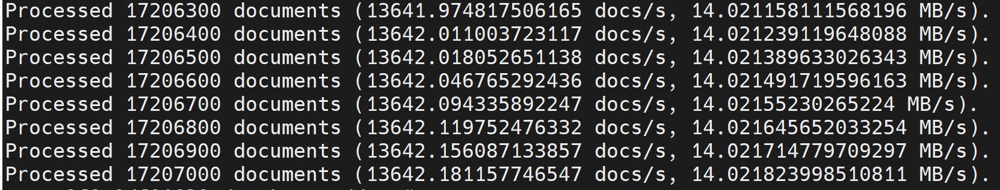

# Nemo Framework

## DOCKER 环境配置

**启动NemoFramework的Docker**

docker链接： https://registry.ngc.nvidia.com/orgs/ea-bignlp/containers/nemofw-training

```
docker run --shm-size=10gb --gpus all -it --name NEMOFRAMEWORK_LLAMA2 -p 6022:22 -p 6006:6006 -p 6064:6064 -p 6888:8888 -v /root/weidongz/docker_workspace:/workspace nvcr.io/ea-bignlp/nemofw-training:23.07-py3 bash
```

**如果单机测试，可以启动Nemo的Docker(optional)**

```
docker run --shm-size=10gb --gpus all -it --name NEMO_LLAMA2 -p 7022:22 -p 7006:6006 -p 7064:6064 -p 7888:8888 -v /root/weidongz/docker_workspace:/workspace nvcr.io/nvidia/nemo:23.06 bash
```

**配置Docker的ssh链接**: 远程连接vscode：

```
apt-get update    // 这一步视情况执行，有时不执行也不影响后续
apt-get install openssh-server 

passwd 

apt install vim
vim /etc/ssh/sshd_config

add: PermitRootLogin yes

service ssh restart

```

**VSCode链接服务器时的，ssh配置如下**

**NemoFramework Server:**

```
Host H800_NemoFramework_LLAMA2
    HostName 10.23.206.92
    User root
    Port 6022
```

**Nemo Server:**

```
Host H800_Nemo_LLAMA2
    HostName 10.23.206.92
    User root
    Port 7022
```

<br><br>

## 数据准备

ref: https://docs.nvidia.com/deeplearning/nemo/user-guide/docs/en/stable/nlp/nemo_megatron/gpt/gpt_training.html

```
wget https://dumps.wikimedia.org/enwiki/latest/enwiki-latest-pages-articles.xml.bz2
```

```
pip install wikiextractor
python -m wikiextractor.WikiExtractor enwiki-latest-pages-articles.xml.bz2 --json
find text -name 'wiki_*' -exec cat {} \; > train_data.jsonl
```

```
sudo apt install jq
jq .text train_data.jsonl >> text_for_tokenizer.txt
spm_train --input=text_for_tokenizer.txt \
     --model_prefix=spm_32k_wiki \
     --vocab_size=32768 \
     --character_coverage=0.9999 \
     --model_type=bpe \
     --byte_fallback=true \
     --pad_id=0 --unk_id=1 --bos_id=2 --eos_id=3 \
     --split_digits true
```

```
python /opt/NeMo/scripts/nlp_language_modeling/preprocess_data_for_megatron.py \
--input=train_data.jsonl \
--json-keys=text \
--tokenizer-library=sentencepiece \
--tokenizer-model=spm_32k_wiki.model \
--output-prefix=gpt_training_data \
--append-eod \
--workers=32
```



