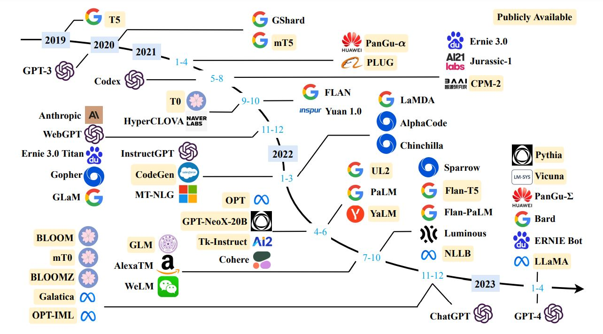
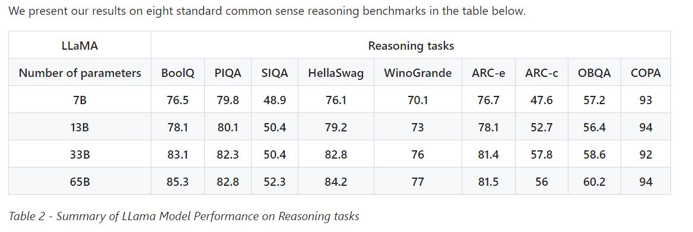
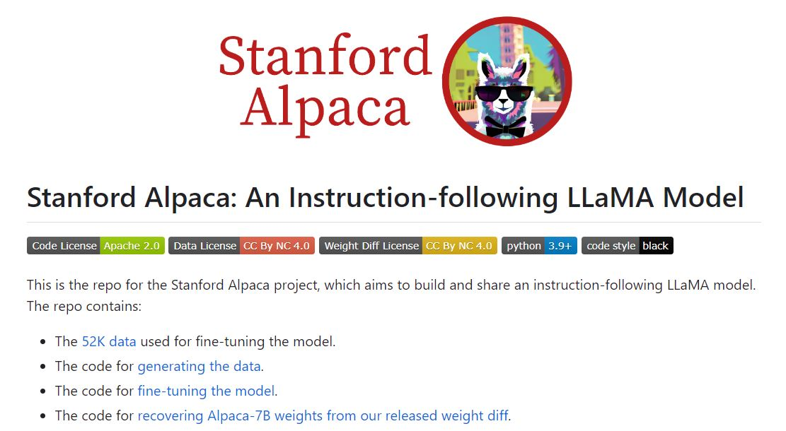
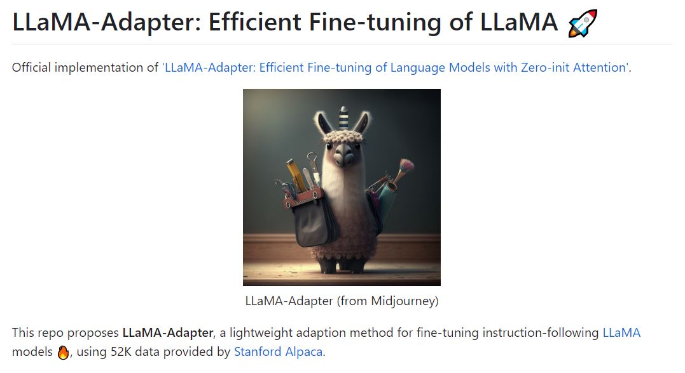
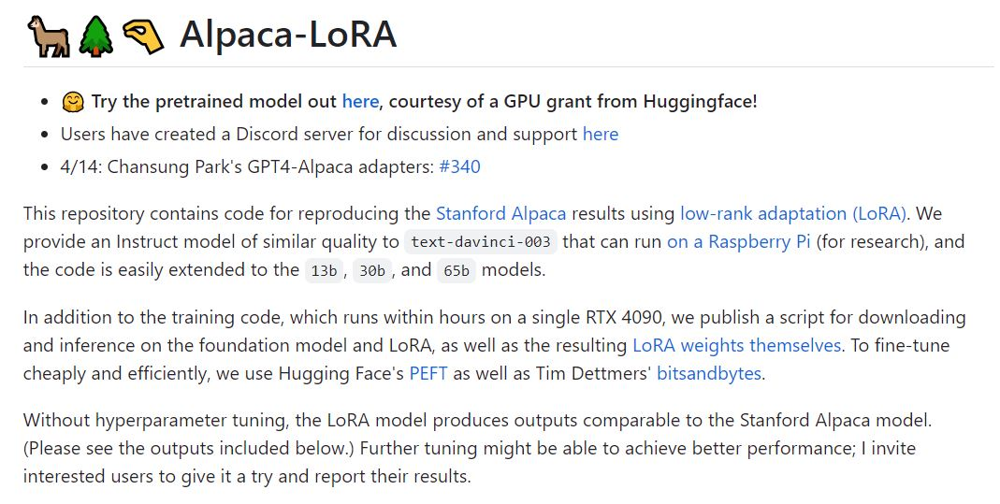

## [A Survey of Large Language Models](https://arxiv.org/pdf/2303.18223.pdf)

  
***
  

## [LLaMA](https://github.com/facebookresearch/llama/tree/57b0eb62de0636e75af471e49e2f1862d908d9d8)

* This repository is intended as a minimal, hackable and readable example to load LLaMA (arXiv) models and run inference. 

* [LLaMA Model Card](https://github.com/facebookresearch/llama/blob/57b0eb62de0636e75af471e49e2f1862d908d9d8/MODEL_CARD.md)

  
***
  

## [Stanford Alpaca: An Instruction-following LLaMA Model](https://github.com/tatsu-lab/stanford_alpaca)

Alpaca 7B的代码是可以直接运行的，具体步骤参加链接。

This produced an instruction-following dataset with 52K examples obtained at a much lower cost (less than $500). In a preliminary study, we also find our 52K generated data to be much more diverse than the data released by self-instruct. We plot the below figure (in the style of Figure 2 in the self-instruct paper to demonstrate the diversity of our data. The inner circle of the plot represents the root verb of the instructions, and the outer circle represents the direct objects.

  
***
  

## [LLaMA-Adapter](https://github.com/zrrskywalker/llama-adapter)

**Demos (LLaMA-Adapter V2)**

  
***
  

## [Alpaca-LoRA](https://github.com/tloen/alpaca-lora)

### Resources

- [alpaca.cpp](https://github.com/antimatter15/alpaca.cpp), a native client for running Alpaca models on the CPU
- [Alpaca-LoRA-Serve](https://github.com/deep-diver/Alpaca-LoRA-Serve), a ChatGPT-style interface for Alpaca models
- [AlpacaDataCleaned](https://github.com/gururise/AlpacaDataCleaned), a project to improve the quality of the Alpaca dataset
- [GPT-4 Alpaca Data](https://github.com/Instruction-Tuning-with-GPT-4/GPT-4-LLM) a project to port synthetic data creation to GPT-4
- [dolly-15k-instruction-alpaca-format](https://huggingface.co/datasets/c-s-ale/dolly-15k-instruction-alpaca-format), an Alpaca-compatible version of [Databricks' Dolly 15k human-generated instruct dataset](https://github.com/databrickslabs/dolly/tree/master/data) (see [blog](https://www.databricks.com/blog/2023/04/12/dolly-first-open-commercially-viable-instruction-tuned-llm))
- [Alpaca-LoRA MT](https://github.com/juletx/alpaca-lora-mt), a project to finetune models with [machine-translated Alpaca data](https://huggingface.co/datasets/HiTZ/alpaca_mt) in 6 Iberian languages: Portuguese, Spanish, Catalan, Basque, Galician and Asturian.
- Various adapter weights (download at own risk):
  - 7B:
    - 3️⃣ <https://huggingface.co/tloen/alpaca-lora-7b>
    - 3️⃣ <https://huggingface.co/samwit/alpaca7B-lora>
    - **4️⃣ <https://huggingface.co/chansung/gpt4-alpaca-lora-7b>**
    - 🚀 <https://huggingface.co/nomic-ai/gpt4all-lora>
    - 🇧🇷 <https://huggingface.co/22h/cabrita-lora-v0-1>
    - 🇨🇳 <https://huggingface.co/qychen/luotuo-lora-7b-0.1>
    - 🇨🇳 <https://huggingface.co/ziqingyang/chinese-alpaca-lora-7b>
    - 🇯🇵 <https://huggingface.co/kunishou/Japanese-Alapaca-LoRA-7b-v0>
    - 🇫🇷 <https://huggingface.co/bofenghuang/vigogne-lora-7b>
    - 🇹🇭 <https://huggingface.co/Thaweewat/thai-buffala-lora-7b-v0-1>
    - 🇩🇪 <https://huggingface.co/thisserand/alpaca_lora_german>
    - 🇵🇱 <https://huggingface.co/mmosiolek/polpaca-lora-7b>
    - 🇵🇱 <https://huggingface.co/chrisociepa/alpaca-lora-7b-pl>
    - 🇮🇹 <https://huggingface.co/teelinsan/camoscio-7b-llama>
    - 🇷🇺 <https://huggingface.co/IlyaGusev/llama_7b_ru_turbo_alpaca_lora>
    - 🇺🇦 <https://huggingface.co/robinhad/ualpaca-7b-llama>
    - 🇮🇹 <https://huggingface.co/mchl-labs/stambecco-7b-plus>
    - 🇪🇸 <https://huggingface.co/plncmm/guanaco-lora-7b>
    - 🇬🇧 🇪🇸 🇵🇹 <https://huggingface.co/HiTZ/alpaca-lora-7b-en-pt-es-ca-eu-gl-at>
  - 13B:
    - 3️⃣ <https://huggingface.co/Angainor/alpaca-lora-13b>
    - 3️⃣ <https://huggingface.co/chansung/alpaca-lora-13b>
    - 3️⃣ <https://huggingface.co/mattreid/alpaca-lora-13b>
    - 3️⃣ <https://huggingface.co/samwit/alpaca13B-lora>
    - **4️⃣ <https://huggingface.co/chansung/gpt4-alpaca-lora-13b>**
    - 🇯🇵 <https://huggingface.co/kunishou/Japanese-Alapaca-LoRA-13b-v0>
    - 🇰🇷 <https://huggingface.co/chansung/koalpaca-lora-13b>
    - 🇨🇳 <https://huggingface.co/facat/alpaca-lora-cn-13b>
    - 🇨🇳 <https://huggingface.co/ziqingyang/chinese-alpaca-lora-13b>
    - 🇪🇸 <https://huggingface.co/plncmm/guanaco-lora-13b>
    - 🇮🇹 <https://huggingface.co/mchl-labs/stambecco-13b-plus>
    - 🇬🇧 🇪🇸 🇵🇹 <https://huggingface.co/HiTZ/alpaca-lora-13b-en-pt-es-ca-eu-gl-at>
  - 30B:
    - 3️⃣ <https://huggingface.co/baseten/alpaca-30b>
    - 3️⃣ <https://huggingface.co/chansung/alpaca-lora-30b>
    - **4️⃣ <https://huggingface.co/chansung/gpt4-alpaca-lora-30b>**
    - 🇯🇵 <https://huggingface.co/kunishou/Japanese-Alapaca-LoRA-30b-v0>
    - 🇬🇧 🇪🇸 🇵🇹 <https://huggingface.co/HiTZ/alpaca-lora-30b-en-pt-es-ca-eu-gl-at>
  - 65B
    - <https://huggingface.co/chansung/alpaca-lora-65b>
    - 🇬🇧 🇪🇸 🇵🇹 <https://huggingface.co/HiTZ/alpaca-lora-65b-en-pt-es-ca>
- [alpaca-native](https://huggingface.co/chavinlo/alpaca-native), a replication using the original Alpaca code
- [llama.onnx](https://github.com/tpoisonooo/llama.onnx), a project to inference alpaca with onnx format

    ### Example outputs

    **Instruction**: Tell me about alpacas.

    **Alpaca-LoRA**: Alpacas are members of the camelid family and are native to the Andes Mountains of South America. They are known for their soft, luxurious fleece, which is used to make clothing, blankets, and other items. Alpacas are herbivores and graze on grasses and other plants. They are social animals and live in herds of up to 20 individuals.

    **Stanford Alpaca**: Alpacas are small, fluffy animals related to camels and llamas. They are native to Peru and Bolivia, and were first domesticated around 5,000 years ago. They are kept mainly for their fine, soft fleece, which is used to make knitwear and other garments. Alpacas are herd animals and live in small family groups, led by an older male. They are highly social animals and can form strong bonds with their owners.

    **text-davinci-003**: Alpacas are a domesticated species of South American camelid, similar to llamas. They are native to the Andes Mountains in South America and are kept as livestock for their soft, luxurious wool. Alpacas are social animals and live in herds of up to 20 individuals. They are typically kept in small herds of two to five animals, and are relatively easy to care for. Alpacas are herbivores and feed on grass, hay, and other vegetation. They are also known for their gentle and friendly nature, making them popular as pets.

  
***
  