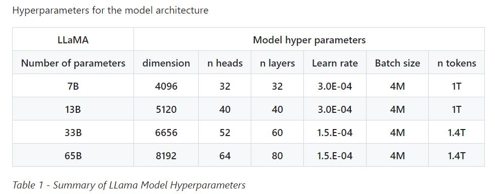

## [A Survey of Large Language Models](https://arxiv.org/pdf/2303.18223.pdf)

  

## [LLaMA](https://github.com/facebookresearch/llama/tree/57b0eb62de0636e75af471e49e2f1862d908d9d8)

* This repository is intended as a minimal, hackable and readable example to load LLaMA (arXiv) models and run inference. 

* [LLaMA Model Card](https://github.com/facebookresearch/llama/blob/57b0eb62de0636e75af471e49e2f1862d908d9d8/MODEL_CARD.md)

  

## [Stanford Alpaca: An Instruction-following LLaMA Model](https://github.com/tatsu-lab/stanford_alpaca)

Alpaca 7B的代码是可以直接运行的，具体步骤参加链接。

This produced an instruction-following dataset with 52K examples obtained at a much lower cost (less than $500). In a preliminary study, we also find our 52K generated data to be much more diverse than the data released by self-instruct. We plot the below figure (in the style of Figure 2 in the self-instruct paper to demonstrate the diversity of our data. The inner circle of the plot represents the root verb of the instructions, and the outer circle represents the direct objects.

  

## [LLaMA-Adapter](https://github.com/zrrskywalker/llama-adapter)

**Demos (LLaMA-Adapter V2)**

  

## [Alpaca-LoRA](https://github.com/tloen/alpaca-lora)

