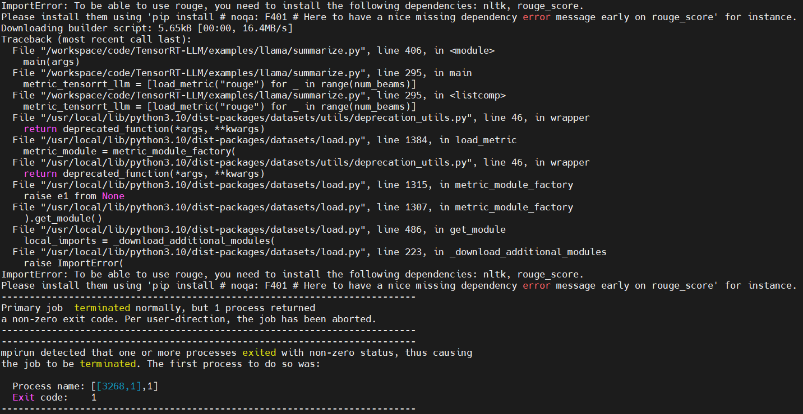
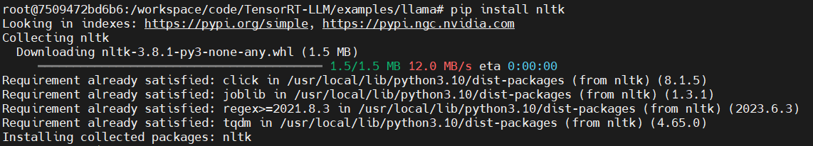
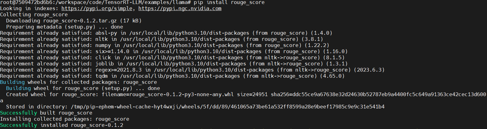

## 下载数据

[如何下载huggingface的模型和权重](https://blog.csdn.net/zhuikefeng/article/details/133312376)

这里以 **[llama-7b-hf](https://huggingface.co/luodian/llama-7b-hf)** 权重下载为例，权重路径 **[weights](https://huggingface.co/luodian/llama-7b-hf/tree/main)**

下载命令如下：

```
git clone https://huggingface.co/luodian/llama-7b-hf
```

下载文件如下：

```
tree -L 2
.
└── llama-7b-hf
    ├── config.json
    ├── generation_config.json
    ├── LICENSE
    ├── pytorch_model-00001-of-00002.bin
    ├── pytorch_model-00002-of-00002.bin
    ├── pytorch_model.bin.index.json
    ├── README.md
    ├── special_tokens_map.json
    ├── tokenizer_config.json
    ├── tokenizer.json
    └── tokenizer.model

1 directory, 11 files

```

<br><br>

## 启动TRT-LLM镜像

```
docker run --shm-size=20gb --ulimit memlock=-1 --ulimit stack=67108864 --gpus all -it --name trtllm_l20 -p 7022:22 -p 7006:6006 -p 7064:6064 -p 7888:8888 -v /data/weidongz/docker_workspace/:/workspace tensorrt_llm/release:latest bash
```

<br><br>

## 走通llama-7b流程

```
cd /workspace/code/TensorRT-LLM/examples/llama/
```

测试GPTQ INT4量化：**[GPTQ](https://github.com/NVIDIA/TensorRT-LLM/tree/release/0.5.0/examples/llama#gptq)**

### 将**huggingface**权重转换为**GPTQ INT4**权重：

```
cd /workspace/code

git clone https://github.com/qwopqwop200/GPTQ-for-LLaMa.git
cd GPTQ-for-LLaMa
pip install -r requirements.txt


python llama.py /workspace/data/llama-7b-hf/ c4 --wbits 4 --true-sequential --groupsize 128 --save_safetensors ./llama-7b-4bit-gs128.safetensors
```

执行完上述代码会在`/workspace/code/GPTQ-for-LLaMa`下生成`INT`权重文件`llama-7b-4bit-gs128.safetensors`

### [Build Engine]()

```
cd /workspace/code/TensorRT-LLM/examples/llama/

# Build the LLaMA 7B model using 2-way tensor parallelism and apply INT4 GPTQ quantization.
# Compressed checkpoint safetensors are generated seperately from GPTQ.
python build.py --model_dir /workspace/data/llama-7b-hf/ \
                --quant_ckpt_path /workspace/code/GPTQ-for-LLaMa/llama-7b-4bit-gs128.safetensors \
                --dtype float16 \
                --remove_input_padding \
                --use_gpt_attention_plugin float16 \
                --enable_context_fmha \
                --use_gemm_plugin float16 \
                --use_weight_only \
                --weight_only_precision int4_gptq \
                --per_group \
                --world_size 2 \
                --tp_size 2 \
                --output_dir ./tmp/llama/7B/trt_engines/int4_GPTQ/2-gpu/
```

### [Run](https://github.com/NVIDIA/TensorRT-LLM/tree/release/0.5.0/examples/llama#run)

**由于上面build engine时设置了tp=2，即两卡并行，因此如下代码运行时需要加上 `mpirun -n 2 --allow-run-as-root`**

```
mpirun -n 2 --allow-run-as-root \
    python3 run.py --max_output_len=50 \
               --tokenizer_dir /workspace/data/llama-7b-hf/ \
               --engine_dir=./tmp/llama/7B/trt_engines/int4_GPTQ/2-gpu/
```
输出：

```
root@7509472bd6b6:/workspace/code/TensorRT-LLM/examples/llama# mpirun -n 2 --allow-run-as-root \
    python3 run.py --max_output_len=50 \
               --tokenizer_dir /workspace/data/llama-7b-hf/ \
               --engine_dir=./tmp/llama/7B/trt_engines/int4_GPTQ/2-gpu/

Running the float16 engine ...
Input: "Born in north-east France, Soyer trained as a"
Output: "chef in Paris, and worked in the kitchens of the Hotel Meurice and the Hotel de Crillon. He was a chef at the Hotel de la Paix in Paris, and then at the Hotel de Londres in London. He was"

```

### [Summarization using the LLaMA model](https://github.com/NVIDIA/TensorRT-LLM/tree/release/0.5.0/benchmarks/python#2-multi-gpu-benchmark)

```
# Run summarization using the LLaMA 7B model in FP16 using two GPUs.
mpirun -n 2 --allow-run-as-root \
    python summarize.py --test_trt_llm \
                        --hf_model_location /workspace/data/llama-7b-hf/ \
                        --data_type fp16 \
                        --engine_dir ./tmp/llama/7B/trt_engines/int4_GPTQ/2-gpu/
```

遇到如下错误：



按照相应文件：

```
pip install nltk
pip install rouge_score
```





继续运行：

```
# Run summarization using the LLaMA 7B model in FP16 using two GPUs.
mpirun -n 2 --allow-run-as-root \
    python summarize.py --test_trt_llm \
                        --hf_model_location /workspace/data/llama-7b-hf/ \
                        --data_type fp16 \
                        --engine_dir ./tmp/llama/7B/trt_engines/int4_GPTQ/2-gpu/
```

运行结果见**附录3**


<br><br>

## CodeLlama-34B测试

参考：[codellama_perf分支](https://github.com/StudyingShao/TensorRT-LLM/tree/jiangs/codellama_perf)

下载代码：

```
cd /data/weidongz/docker_workspace/code

mkdir codellama_test

cd codellama_test/

git clone -b codellama_perf https://github.com/StudyingShao/TensorRT-LLM.git

cd TensorRT-LLM/

```

### 权重下载并转换

这里以 **[CodeLlama-34b-Instruct-hf](https://huggingface.co/codellama/CodeLlama-34b-Instruct-hf)** 权重下载为例，权重路径 **[weights](https://huggingface.co/codellama/CodeLlama-34b-Instruct-hf/tree/main)**

下载命令如下：

```
cd /workspace/data

git clone https://huggingface.co/codellama/CodeLlama-34b-Instruct-hf
```

下载文件如下：

```
tree -L 2
.
├── config.json
├── generation_config.json
├── pytorch_model-00001-of-00007.bin
├── pytorch_model-00002-of-00007.bin
├── pytorch_model-00003-of-00007.bin
├── pytorch_model-00004-of-00007.bin
├── pytorch_model-00005-of-00007.bin
├── pytorch_model-00006-of-00007.bin
├── pytorch_model-00007-of-00007.bin?download=true
├── pytorch_model.bin.index.json
├── README.md
├── special_tokens_map.json
├── tokenizer_config.json
├── tokenizer.json
└── tokenizer.model

0 directories, 15 files
```

**注意：上述文件太大，如果下载过程中safetensor相关的文件没有下载完全，那么可以将safetensor相关的文件都手动删除，包括config和weights文件**


### 将**huggingface**权重转换为**GPTQ INT4**权重：**[GPTQ](https://github.com/NVIDIA/TensorRT-LLM/tree/release/0.5.0/examples/llama#gptq)**

```
cd /workspace/code

git clone https://github.com/qwopqwop200/GPTQ-for-LLaMa.git
cd GPTQ-for-LLaMa
pip install -r requirements.txt


python llama.py /workspace/data/CodeLlama-34b-Instruct-hf/ c4 --wbits 4 --true-sequential --groupsize 128 --save_safetensors ./codellama-34b-4bit-gs128.safetensors
```

执行完上述代码会在`/workspace/code/GPTQ-for-LLaMa`下生成`INT`权重文件`codellama-34b-4bit-gs128.safetensors`


### [Build Engine]()

**参照：[TensorRT-LLM/examples/llama/oct_test
/perf_test.sh](https://github.com/StudyingShao/TensorRT-LLM/blob/jiangs/codellama_perf/examples/llama/oct_test/perf_test.sh)**

**tp=1:**

```
cd /workspace/code/TensorRT-LLM/examples/llama/

python build.py --model_dir /workspace/data/CodeLlama-34b-Instruct-hf/ \
                --quant_ckpt_path /workspace/code/GPTQ-for-LLaMa/codellama-34b-4bit-gs128.safetensors  \
                --dtype float16 \
                --remove_input_padding \
                --use_gpt_attention_plugin float16 \
                --enable_context_fmha \
                --use_gemm_plugin float16 \
                --use_rmsnorm_plugin float16 \
                --rotary_base 1000000 \
                --vocab_size 32000 \
                --use_weight_only \
                --weight_only_precision int4_gptq \
                --per_group \
                --world_size 1 \
                --tp_size 1 \
                --max_batch_size 16 \
                --max_input_len 1024 \
                --max_output_len 512 \
                --output_dir ./codellama_34b/tp_1_b16_i1024_o512/

```

**tp=2:**

```
python build.py --model_dir /workspace/data/CodeLlama-34b-Instruct-hf/ \
                --quant_ckpt_path /workspace/code/GPTQ-for-LLaMa/codellama-34b-4bit-gs128.safetensors \
                --dtype float16 \
                --remove_input_padding \
                --use_gpt_attention_plugin float16 \
                --enable_context_fmha \
                --use_gemm_plugin float16 \
                --use_rmsnorm_plugin float16 \
                --rotary_base 1000000 \
                --vocab_size 32000 \
                --use_weight_only \
                --weight_only_precision int4_gptq \
                --per_group \
                --world_size 2 \
                --tp_size 2 \
                --max_batch_size 16 \
                --max_input_len 1024 \
                --max_output_len 512 \
                --output_dir ./codellama_34b/tp_2_b16_i1024_o512/
```


<br><br>

## 附录

### 1. GPTQ INT4 权重转换：

```
root@7509472bd6b6:/workspace/code/GPTQ-for-LLaMa# python llama.py /workspace/data/llama-7b-hf/ c4 --wbits 4 --true-sequential --groupsize 128 --save_safetensors ./llama-7b-4bit-gs128.safetensors
Loading checkpoint shards: 100%|████████████████████████████████████████████████████████████████████████████████████████████████| 2/2 [00:08<00:00,  4.35s/it]
Downloading readme: 100%|████████████████████████████████████████████████████████████████████████████████████████████████| 2.38k/2.38k [00:00<00:00, 15.1MB/s]
Downloading and preparing dataset json/allenai--c4 to /root/.cache/huggingface/datasets/allenai___json/allenai--c4-6fbe877195f42de5/0.0.0/0f7e3662623656454fcd2b650f34e886a7db4b9104504885bd462096cc7a9f51...
Downloading data: 100%|████████████████████████████████████████████████████████████████████████████████████████████████████| 319M/319M [00:16<00:00, 19.3MB/s]
Downloading data files: 100%|███████████████████████████████████████████████████████████████████████████████████████████████████| 1/1 [00:19<00:00, 19.06s/it]
Extracting data files: 100%|████████████████████████████████████████████████████████████████████████████████████████████████████| 1/1 [00:06<00:00,  6.37s/it]
Dataset json downloaded and prepared to /root/.cache/huggingface/datasets/allenai___json/allenai--c4-6fbe877195f42de5/0.0.0/0f7e3662623656454fcd2b650f34e886a7db4b9104504885bd462096cc7a9f51. Subsequent calls will reuse this data.
Downloading and preparing dataset json/allenai--c4 to /root/.cache/huggingface/datasets/allenai___json/allenai--c4-efc3d4f4606f44bd/0.0.0/0f7e3662623656454fcd2b650f34e886a7db4b9104504885bd462096cc7a9f51...
Downloading data: 100%|██████████████████████████████████████████████████████████████████████████████████████████████████| 40.5M/40.5M [00:09<00:00, 4.10MB/s]
Downloading data files: 100%|███████████████████████████████████████████████████████████████████████████████████████████████████| 1/1 [00:12<00:00, 12.14s/it]
Extracting data files: 100%|████████████████████████████████████████████████████████████████████████████████████████████████████| 1/1 [00:00<00:00,  1.20it/s]
Dataset json downloaded and prepared to /root/.cache/huggingface/datasets/allenai___json/allenai--c4-efc3d4f4606f44bd/0.0.0/0f7e3662623656454fcd2b650f34e886a7db4b9104504885bd462096cc7a9f51. Subsequent calls will reuse this data.
You are using the default legacy behaviour of the <class 'transformers.models.llama.tokenization_llama.LlamaTokenizer'>. This is expected, and simply means that the `legacy` (previous) behavior will be used so nothing changes for you. If you want to use the new behaviour, set `legacy=False`. This should only be set if you understand what it means, and thouroughly read the reason why this was added as explained in https://github.com/huggingface/transformers/pull/24565
Starting ...
Ready.
Quantizing layer 1/32..
+------------------+--------------+------------+-----------+-------+
|       name       | weight_error | fp_inp_SNR | q_inp_SNR | time  |
+==================+==============+============+===========+=======+
| self_attn.k_proj | 330.424      | -          | -         | 1.867 |
| self_attn.v_proj | 38.754       | -          | -         | 1.389 |
| self_attn.q_proj | 346.193      | -          | -         | 1.393 |
| self_attn.o_proj | 1.560        | -          | -         | 1.674 |
| mlp.up_proj      | 213.722      | -          | -         | 1.716 |
| mlp.gate_proj    | 228.854      | -          | -         | 1.413 |
| mlp.down_proj    | 7.615        | -          | -         | 4.551 |
+------------------+--------------+------------+-----------+-------+


Quantizing layer 2/32..
+------------------+--------------+------------+-----------+-------+
|       name       | weight_error | fp_inp_SNR | q_inp_SNR | time  |
+==================+==============+============+===========+=======+
| self_attn.k_proj | 2089.491     | -          | -         | 1.702 |
| self_attn.v_proj | 175.328      | -          | -         | 1.400 |
| self_attn.q_proj | 1871.890     | -          | -         | 1.390 |
| self_attn.o_proj | 12.791       | -          | -         | 1.673 |
| mlp.up_proj      | 840.302      | -          | -         | 1.719 |
| mlp.gate_proj    | 934.250      | -          | -         | 1.393 |
| mlp.down_proj    | 41.194       | -          | -         | 4.498 |
+------------------+--------------+------------+-----------+-------+


Quantizing layer 3/32..
+------------------+--------------+------------+-----------+-------+
|       name       | weight_error | fp_inp_SNR | q_inp_SNR | time  |
+==================+==============+============+===========+=======+
| self_attn.k_proj | 3541.782     | -          | -         | 1.690 |
| self_attn.v_proj | 424.945      | -          | -         | 1.389 |
| self_attn.q_proj | 3212.958     | -          | -         | 1.382 |
| self_attn.o_proj | 28.538       | -          | -         | 1.674 |
| mlp.up_proj      | 2085.705     | -          | -         | 1.725 |
| mlp.gate_proj    | 2508.749     | -          | -         | 1.408 |
| mlp.down_proj    | 6464.774     | -          | -         | 4.525 |
+------------------+--------------+------------+-----------+-------+


Quantizing layer 4/32..
+------------------+--------------+------------+-----------+-------+
|       name       | weight_error | fp_inp_SNR | q_inp_SNR | time  |
+==================+==============+============+===========+=======+
| self_attn.k_proj | 6979.499     | -          | -         | 1.692 |
| self_attn.v_proj | 1839.687     | -          | -         | 1.373 |
| self_attn.q_proj | 6445.922     | -          | -         | 1.376 |
| self_attn.o_proj | 46.753       | -          | -         | 1.673 |
| mlp.up_proj      | 3484.437     | -          | -         | 1.724 |
| mlp.gate_proj    | 4121.120     | -          | -         | 1.409 |
| mlp.down_proj    | 179.270      | -          | -         | 4.495 |
+------------------+--------------+------------+-----------+-------+


Quantizing layer 5/32..
+------------------+--------------+------------+-----------+-------+
|       name       | weight_error | fp_inp_SNR | q_inp_SNR | time  |
+==================+==============+============+===========+=======+
| self_attn.k_proj | 9573.466     | -          | -         | 1.695 |
| self_attn.v_proj | 2651.417     | -          | -         | 1.388 |
| self_attn.q_proj | 9570.137     | -          | -         | 1.387 |
| self_attn.o_proj | 76.437       | -          | -         | 1.672 |
| mlp.up_proj      | 5060.314     | -          | -         | 1.734 |
| mlp.gate_proj    | 6100.289     | -          | -         | 1.414 |
| mlp.down_proj    | 296.687      | -          | -         | 4.546 |
+------------------+--------------+------------+-----------+-------+


Quantizing layer 6/32..
+------------------+--------------+------------+-----------+-------+
|       name       | weight_error | fp_inp_SNR | q_inp_SNR | time  |
+==================+==============+============+===========+=======+
| self_attn.k_proj | 13027.824    | -          | -         | 1.689 |
| self_attn.v_proj | 4229.269     | -          | -         | 1.379 |
| self_attn.q_proj | 12918.896    | -          | -         | 1.374 |
| self_attn.o_proj | 105.079      | -          | -         | 1.676 |
| mlp.up_proj      | 6380.702     | -          | -         | 1.727 |
| mlp.gate_proj    | 8065.544     | -          | -         | 1.405 |
| mlp.down_proj    | 461.569      | -          | -         | 4.530 |
+------------------+--------------+------------+-----------+-------+


Quantizing layer 7/32..
+------------------+--------------+------------+-----------+-------+
|       name       | weight_error | fp_inp_SNR | q_inp_SNR | time  |
+==================+==============+============+===========+=======+
| self_attn.k_proj | 13964.247    | -          | -         | 1.694 |
| self_attn.v_proj | 4402.686     | -          | -         | 1.377 |
| self_attn.q_proj | 13431.347    | -          | -         | 1.386 |
| self_attn.o_proj | 169.529      | -          | -         | 1.664 |
| mlp.up_proj      | 7423.638     | -          | -         | 1.719 |
| mlp.gate_proj    | 8909.758     | -          | -         | 1.404 |
| mlp.down_proj    | 597.644      | -          | -         | 4.497 |
+------------------+--------------+------------+-----------+-------+


Quantizing layer 8/32..
+------------------+--------------+------------+-----------+-------+
|       name       | weight_error | fp_inp_SNR | q_inp_SNR | time  |
+==================+==============+============+===========+=======+
| self_attn.k_proj | 14226.279    | -          | -         | 1.693 |
| self_attn.v_proj | 5062.244     | -          | -         | 1.378 |
| self_attn.q_proj | 14037.104    | -          | -         | 1.386 |
| self_attn.o_proj | 223.474      | -          | -         | 1.680 |
| mlp.up_proj      | 8433.669     | -          | -         | 1.717 |
| mlp.gate_proj    | 9850.119     | -          | -         | 1.404 |
| mlp.down_proj    | 772.989      | -          | -         | 4.509 |
+------------------+--------------+------------+-----------+-------+


Quantizing layer 9/32..
+------------------+--------------+------------+-----------+-------+
|       name       | weight_error | fp_inp_SNR | q_inp_SNR | time  |
+==================+==============+============+===========+=======+
| self_attn.k_proj | 15727.979    | -          | -         | 1.695 |
| self_attn.v_proj | 5769.757     | -          | -         | 1.389 |
| self_attn.q_proj | 15727.557    | -          | -         | 1.389 |
| self_attn.o_proj | 363.036      | -          | -         | 1.682 |
| mlp.up_proj      | 9031.502     | -          | -         | 1.732 |
| mlp.gate_proj    | 10495.294    | -          | -         | 1.399 |
| mlp.down_proj    | 882.485      | -          | -         | 4.521 |
+------------------+--------------+------------+-----------+-------+


Quantizing layer 10/32..
+------------------+--------------+------------+-----------+-------+
|       name       | weight_error | fp_inp_SNR | q_inp_SNR | time  |
+==================+==============+============+===========+=======+
| self_attn.k_proj | 16851.750    | -          | -         | 1.698 |
| self_attn.v_proj | 6445.168     | -          | -         | 1.391 |
| self_attn.q_proj | 16676.410    | -          | -         | 1.391 |
| self_attn.o_proj | 416.495      | -          | -         | 1.673 |
| mlp.up_proj      | 9921.550     | -          | -         | 1.729 |
| mlp.gate_proj    | 11048.393    | -          | -         | 1.407 |
| mlp.down_proj    | 1060.510     | -          | -         | 4.517 |
+------------------+--------------+------------+-----------+-------+


Quantizing layer 11/32..
+------------------+--------------+------------+-----------+-------+
|       name       | weight_error | fp_inp_SNR | q_inp_SNR | time  |
+==================+==============+============+===========+=======+
| self_attn.k_proj | 18278.863    | -          | -         | 1.702 |
| self_attn.v_proj | 7433.582     | -          | -         | 1.395 |
| self_attn.q_proj | 17876.535    | -          | -         | 1.392 |
| self_attn.o_proj | 550.996      | -          | -         | 1.682 |
| mlp.up_proj      | 11182.053    | -          | -         | 1.729 |
| mlp.gate_proj    | 11966.713    | -          | -         | 1.407 |
| mlp.down_proj    | 1282.691     | -          | -         | 4.515 |
+------------------+--------------+------------+-----------+-------+


Quantizing layer 12/32..
+------------------+--------------+------------+-----------+-------+
|       name       | weight_error | fp_inp_SNR | q_inp_SNR | time  |
+==================+==============+============+===========+=======+
| self_attn.k_proj | 16952.332    | -          | -         | 1.692 |
| self_attn.v_proj | 7113.187     | -          | -         | 1.391 |
| self_attn.q_proj | 16397.387    | -          | -         | 1.376 |
| self_attn.o_proj | 832.412      | -          | -         | 1.681 |
| mlp.up_proj      | 11977.785    | -          | -         | 1.729 |
| mlp.gate_proj    | 12595.477    | -          | -         | 1.417 |
| mlp.down_proj    | 1600.682     | -          | -         | 4.508 |
+------------------+--------------+------------+-----------+-------+


Quantizing layer 13/32..
+------------------+--------------+------------+-----------+-------+
|       name       | weight_error | fp_inp_SNR | q_inp_SNR | time  |
+==================+==============+============+===========+=======+
| self_attn.k_proj | 20650.566    | -          | -         | 1.721 |
| self_attn.v_proj | 8913.912     | -          | -         | 1.427 |
| self_attn.q_proj | 19966.646    | -          | -         | 1.397 |
| self_attn.o_proj | 889.844      | -          | -         | 1.681 |
| mlp.up_proj      | 13904.256    | -          | -         | 1.726 |
| mlp.gate_proj    | 14607.520    | -          | -         | 1.415 |
| mlp.down_proj    | 2030.120     | -          | -         | 4.507 |
+------------------+--------------+------------+-----------+-------+


Quantizing layer 14/32..
+------------------+--------------+------------+-----------+-------+
|       name       | weight_error | fp_inp_SNR | q_inp_SNR | time  |
+==================+==============+============+===========+=======+
| self_attn.k_proj | 21789.344    | -          | -         | 1.694 |
| self_attn.v_proj | 10789.633    | -          | -         | 1.392 |
| self_attn.q_proj | 21097.184    | -          | -         | 1.383 |
| self_attn.o_proj | 874.434      | -          | -         | 1.671 |
| mlp.up_proj      | 15486.279    | -          | -         | 1.718 |
| mlp.gate_proj    | 15827.352    | -          | -         | 1.406 |
| mlp.down_proj    | 2461.255     | -          | -         | 4.525 |
+------------------+--------------+------------+-----------+-------+


Quantizing layer 15/32..
+------------------+--------------+------------+-----------+-------+
|       name       | weight_error | fp_inp_SNR | q_inp_SNR | time  |
+==================+==============+============+===========+=======+
| self_attn.k_proj | 21416.490    | -          | -         | 1.730 |
| self_attn.v_proj | 10746.576    | -          | -         | 1.426 |
| self_attn.q_proj | 21092.367    | -          | -         | 1.424 |
| self_attn.o_proj | 1057.595     | -          | -         | 1.704 |
| mlp.up_proj      | 17457.170    | -          | -         | 1.728 |
| mlp.gate_proj    | 17655.230    | -          | -         | 1.404 |
| mlp.down_proj    | 2947.229     | -          | -         | 4.486 |
+------------------+--------------+------------+-----------+-------+


Quantizing layer 16/32..
+------------------+--------------+------------+-----------+-------+
|       name       | weight_error | fp_inp_SNR | q_inp_SNR | time  |
+==================+==============+============+===========+=======+
| self_attn.k_proj | 22107.551    | -          | -         | 1.741 |
| self_attn.v_proj | 10937.150    | -          | -         | 1.426 |
| self_attn.q_proj | 21310.119    | -          | -         | 1.425 |
| self_attn.o_proj | 1342.978     | -          | -         | 1.713 |
| mlp.up_proj      | 18823.816    | -          | -         | 1.763 |
| mlp.gate_proj    | 19038.707    | -          | -         | 1.439 |
| mlp.down_proj    | 3654.169     | -          | -         | 4.499 |
+------------------+--------------+------------+-----------+-------+


Quantizing layer 17/32..
+------------------+--------------+------------+-----------+-------+
|       name       | weight_error | fp_inp_SNR | q_inp_SNR | time  |
+==================+==============+============+===========+=======+
| self_attn.k_proj | 21728.402    | -          | -         | 1.715 |
| self_attn.v_proj | 12354.107    | -          | -         | 1.392 |
| self_attn.q_proj | 20714.812    | -          | -         | 1.376 |
| self_attn.o_proj | 1318.644     | -          | -         | 1.694 |
| mlp.up_proj      | 21264.547    | -          | -         | 1.753 |
| mlp.gate_proj    | 21976.871    | -          | -         | 1.425 |
| mlp.down_proj    | 4878.033     | -          | -         | 4.525 |
+------------------+--------------+------------+-----------+-------+


Quantizing layer 18/32..
+------------------+--------------+------------+-----------+-------+
|       name       | weight_error | fp_inp_SNR | q_inp_SNR | time  |
+==================+==============+============+===========+=======+
| self_attn.k_proj | 22921.883    | -          | -         | 1.714 |
| self_attn.v_proj | 13888.104    | -          | -         | 1.391 |
| self_attn.q_proj | 22016.008    | -          | -         | 1.388 |
| self_attn.o_proj | 1760.775     | -          | -         | 1.693 |
| mlp.up_proj      | 23916.207    | -          | -         | 1.732 |
| mlp.gate_proj    | 24664.781    | -          | -         | 1.401 |
| mlp.down_proj    | 6170.547     | -          | -         | 4.521 |
+------------------+--------------+------------+-----------+-------+


Quantizing layer 19/32..
+------------------+--------------+------------+-----------+-------+
|       name       | weight_error | fp_inp_SNR | q_inp_SNR | time  |
+==================+==============+============+===========+=======+
| self_attn.k_proj | 23288.961    | -          | -         | 1.694 |
| self_attn.v_proj | 14557.121    | -          | -         | 1.385 |
| self_attn.q_proj | 22755.574    | -          | -         | 1.391 |
| self_attn.o_proj | 2020.831     | -          | -         | 1.678 |
| mlp.up_proj      | 26600.887    | -          | -         | 1.726 |
| mlp.gate_proj    | 28071.344    | -          | -         | 1.413 |
| mlp.down_proj    | 7219.033     | -          | -         | 4.495 |
+------------------+--------------+------------+-----------+-------+


Quantizing layer 20/32..
+------------------+--------------+------------+-----------+-------+
|       name       | weight_error | fp_inp_SNR | q_inp_SNR | time  |
+==================+==============+============+===========+=======+
| self_attn.k_proj | 22035.664    | -          | -         | 1.696 |
| self_attn.v_proj | 15725.357    | -          | -         | 1.382 |
| self_attn.q_proj | 21590.758    | -          | -         | 1.380 |
| self_attn.o_proj | 1809.760     | -          | -         | 1.681 |
| mlp.up_proj      | 28594.080    | -          | -         | 1.721 |
| mlp.gate_proj    | 30648.084    | -          | -         | 1.405 |
| mlp.down_proj    | 8528.789     | -          | -         | 4.511 |
+------------------+--------------+------------+-----------+-------+


Quantizing layer 21/32..
+------------------+--------------+------------+-----------+-------+
|       name       | weight_error | fp_inp_SNR | q_inp_SNR | time  |
+==================+==============+============+===========+=======+
| self_attn.k_proj | 24278.867    | -          | -         | 1.702 |
| self_attn.v_proj | 17867.984    | -          | -         | 1.384 |
| self_attn.q_proj | 23743.127    | -          | -         | 1.388 |
| self_attn.o_proj | 2387.006     | -          | -         | 1.662 |
| mlp.up_proj      | 30857.955    | -          | -         | 1.717 |
| mlp.gate_proj    | 33372.805    | -          | -         | 1.407 |
| mlp.down_proj    | 10353.252    | -          | -         | 4.525 |
+------------------+--------------+------------+-----------+-------+


Quantizing layer 22/32..
+------------------+--------------+------------+-----------+-------+
|       name       | weight_error | fp_inp_SNR | q_inp_SNR | time  |
+==================+==============+============+===========+=======+
| self_attn.k_proj | 23324.379    | -          | -         | 1.694 |
| self_attn.v_proj | 18707.875    | -          | -         | 1.387 |
| self_attn.q_proj | 22984.641    | -          | -         | 1.392 |
| self_attn.o_proj | 2219.146     | -          | -         | 1.675 |
| mlp.up_proj      | 33321.375    | -          | -         | 1.714 |
| mlp.gate_proj    | 36491.523    | -          | -         | 1.400 |
| mlp.down_proj    | 11611.766    | -          | -         | 4.514 |
+------------------+--------------+------------+-----------+-------+


Quantizing layer 23/32..
+------------------+--------------+------------+-----------+-------+
|       name       | weight_error | fp_inp_SNR | q_inp_SNR | time  |
+==================+==============+============+===========+=======+
| self_attn.k_proj | 25339.592    | -          | -         | 1.692 |
| self_attn.v_proj | 19543.297    | -          | -         | 1.384 |
| self_attn.q_proj | 25177.141    | -          | -         | 1.374 |
| self_attn.o_proj | 1448.008     | -          | -         | 1.675 |
| mlp.up_proj      | 35858.500    | -          | -         | 1.766 |
| mlp.gate_proj    | 39057.859    | -          | -         | 1.442 |
| mlp.down_proj    | 12356.773    | -          | -         | 4.554 |
+------------------+--------------+------------+-----------+-------+


Quantizing layer 24/32..
+------------------+--------------+------------+-----------+-------+
|       name       | weight_error | fp_inp_SNR | q_inp_SNR | time  |
+==================+==============+============+===========+=======+
| self_attn.k_proj | 24567.918    | -          | -         | 1.694 |
| self_attn.v_proj | 21952.604    | -          | -         | 1.387 |
| self_attn.q_proj | 24560.115    | -          | -         | 1.383 |
| self_attn.o_proj | 2413.307     | -          | -         | 1.694 |
| mlp.up_proj      | 37935.832    | -          | -         | 1.727 |
| mlp.gate_proj    | 41331.516    | -          | -         | 1.405 |
| mlp.down_proj    | 13374.597    | -          | -         | 4.504 |
+------------------+--------------+------------+-----------+-------+


Quantizing layer 25/32..
+------------------+--------------+------------+-----------+-------+
|       name       | weight_error | fp_inp_SNR | q_inp_SNR | time  |
+==================+==============+============+===========+=======+
| self_attn.k_proj | 26677.393    | -          | -         | 1.692 |
| self_attn.v_proj | 24186.865    | -          | -         | 1.381 |
| self_attn.q_proj | 26520.381    | -          | -         | 1.378 |
| self_attn.o_proj | 2364.280     | -          | -         | 1.671 |
| mlp.up_proj      | 40676.391    | -          | -         | 1.730 |
| mlp.gate_proj    | 43926.254    | -          | -         | 1.410 |
| mlp.down_proj    | 14165.217    | -          | -         | 4.519 |
+------------------+--------------+------------+-----------+-------+


Quantizing layer 26/32..
+------------------+--------------+------------+-----------+-------+
|       name       | weight_error | fp_inp_SNR | q_inp_SNR | time  |
+==================+==============+============+===========+=======+
| self_attn.k_proj | 29662.660    | -          | -         | 1.692 |
| self_attn.v_proj | 25529.342    | -          | -         | 1.384 |
| self_attn.q_proj | 29266.539    | -          | -         | 1.380 |
| self_attn.o_proj | 2744.473     | -          | -         | 1.671 |
| mlp.up_proj      | 43253.574    | -          | -         | 1.724 |
| mlp.gate_proj    | 46578.852    | -          | -         | 1.418 |
| mlp.down_proj    | 15349.590    | -          | -         | 4.501 |
+------------------+--------------+------------+-----------+-------+


Quantizing layer 27/32..
+------------------+--------------+------------+-----------+-------+
|       name       | weight_error | fp_inp_SNR | q_inp_SNR | time  |
+==================+==============+============+===========+=======+
| self_attn.k_proj | 31224.859    | -          | -         | 1.695 |
| self_attn.v_proj | 29473.963    | -          | -         | 1.386 |
| self_attn.q_proj | 30881.070    | -          | -         | 1.385 |
| self_attn.o_proj | 2469.022     | -          | -         | 1.672 |
| mlp.up_proj      | 46233.391    | -          | -         | 1.718 |
| mlp.gate_proj    | 49043.750    | -          | -         | 1.407 |
| mlp.down_proj    | 16634.371    | -          | -         | 4.523 |
+------------------+--------------+------------+-----------+-------+


Quantizing layer 28/32..
+------------------+--------------+------------+-----------+-------+
|       name       | weight_error | fp_inp_SNR | q_inp_SNR | time  |
+==================+==============+============+===========+=======+
| self_attn.k_proj | 31251.613    | -          | -         | 1.699 |
| self_attn.v_proj | 30699.383    | -          | -         | 1.390 |
| self_attn.q_proj | 31391.793    | -          | -         | 1.385 |
| self_attn.o_proj | 2072.042     | -          | -         | 1.681 |
| mlp.up_proj      | 49008.410    | -          | -         | 1.727 |
| mlp.gate_proj    | 51508.762    | -          | -         | 1.407 |
| mlp.down_proj    | 18222.387    | -          | -         | 4.532 |
+------------------+--------------+------------+-----------+-------+


Quantizing layer 29/32..
+------------------+--------------+------------+-----------+-------+
|       name       | weight_error | fp_inp_SNR | q_inp_SNR | time  |
+==================+==============+============+===========+=======+
| self_attn.k_proj | 28180.469    | -          | -         | 1.694 |
| self_attn.v_proj | 29195.369    | -          | -         | 1.383 |
| self_attn.q_proj | 28265.600    | -          | -         | 1.395 |
| self_attn.o_proj | 3578.500     | -          | -         | 1.672 |
| mlp.up_proj      | 51445.285    | -          | -         | 1.720 |
| mlp.gate_proj    | 53011.383    | -          | -         | 1.404 |
| mlp.down_proj    | 20885.711    | -          | -         | 4.511 |
+------------------+--------------+------------+-----------+-------+


Quantizing layer 30/32..
+------------------+--------------+------------+-----------+-------+
|       name       | weight_error | fp_inp_SNR | q_inp_SNR | time  |
+==================+==============+============+===========+=======+
| self_attn.k_proj | 28784.926    | -          | -         | 1.696 |
| self_attn.v_proj | 32159.824    | -          | -         | 1.382 |
| self_attn.q_proj | 28791.648    | -          | -         | 1.392 |
| self_attn.o_proj | 3938.156     | -          | -         | 1.684 |
| mlp.up_proj      | 52832.234    | -          | -         | 1.735 |
| mlp.gate_proj    | 54067.246    | -          | -         | 1.441 |
| mlp.down_proj    | 26163.391    | -          | -         | 4.529 |
+------------------+--------------+------------+-----------+-------+


Quantizing layer 31/32..
+------------------+--------------+------------+-----------+-------+
|       name       | weight_error | fp_inp_SNR | q_inp_SNR | time  |
+==================+==============+============+===========+=======+
| self_attn.k_proj | 26572.738    | -          | -         | 1.700 |
| self_attn.v_proj | 28261.555    | -          | -         | 1.392 |
| self_attn.q_proj | 26821.990    | -          | -         | 1.396 |
| self_attn.o_proj | 3987.414     | -          | -         | 1.684 |
| mlp.up_proj      | 52044.672    | -          | -         | 1.730 |
| mlp.gate_proj    | 52944.887    | -          | -         | 1.405 |
| mlp.down_proj    | 44744.844    | -          | -         | 4.529 |
+------------------+--------------+------------+-----------+-------+


Quantizing layer 32/32..
+------------------+--------------+------------+-----------+-------+
|       name       | weight_error | fp_inp_SNR | q_inp_SNR | time  |
+==================+==============+============+===========+=======+
| self_attn.k_proj | 17818.887    | -          | -         | 1.686 |
| self_attn.v_proj | 14454.121    | -          | -         | 1.396 |
| self_attn.q_proj | 17191.893    | -          | -         | 1.391 |
| self_attn.o_proj | 2826.623     | -          | -         | 1.680 |
| mlp.up_proj      | 42428.324    | -          | -         | 1.742 |
| mlp.gate_proj    | 43384.930    | -          | -         | 1.418 |
| mlp.down_proj    | 116239.703   | -          | -         | 4.522 |
+------------------+--------------+------------+-----------+-------+


819.1599471569061
Packing ...
model.layers.0.self_attn.k_proj
model.layers.0.self_attn.o_proj
model.layers.0.self_attn.q_proj
model.layers.0.self_attn.v_proj
model.layers.0.mlp.down_proj
model.layers.0.mlp.gate_proj
model.layers.0.mlp.up_proj
model.layers.1.self_attn.k_proj
model.layers.1.self_attn.o_proj
model.layers.1.self_attn.q_proj
model.layers.1.self_attn.v_proj
model.layers.1.mlp.down_proj
model.layers.1.mlp.gate_proj
model.layers.1.mlp.up_proj
model.layers.2.self_attn.k_proj
model.layers.2.self_attn.o_proj
model.layers.2.self_attn.q_proj
model.layers.2.self_attn.v_proj
model.layers.2.mlp.down_proj
model.layers.2.mlp.gate_proj
model.layers.2.mlp.up_proj
model.layers.3.self_attn.k_proj
model.layers.3.self_attn.o_proj
model.layers.3.self_attn.q_proj
model.layers.3.self_attn.v_proj
model.layers.3.mlp.down_proj
model.layers.3.mlp.gate_proj
model.layers.3.mlp.up_proj
model.layers.4.self_attn.k_proj
model.layers.4.self_attn.o_proj
model.layers.4.self_attn.q_proj
model.layers.4.self_attn.v_proj
model.layers.4.mlp.down_proj
model.layers.4.mlp.gate_proj
model.layers.4.mlp.up_proj
model.layers.5.self_attn.k_proj
model.layers.5.self_attn.o_proj
model.layers.5.self_attn.q_proj
model.layers.5.self_attn.v_proj
model.layers.5.mlp.down_proj
model.layers.5.mlp.gate_proj
model.layers.5.mlp.up_proj
model.layers.6.self_attn.k_proj
model.layers.6.self_attn.o_proj
model.layers.6.self_attn.q_proj
model.layers.6.self_attn.v_proj
model.layers.6.mlp.down_proj
model.layers.6.mlp.gate_proj
model.layers.6.mlp.up_proj
model.layers.7.self_attn.k_proj
model.layers.7.self_attn.o_proj
model.layers.7.self_attn.q_proj
model.layers.7.self_attn.v_proj
model.layers.7.mlp.down_proj
model.layers.7.mlp.gate_proj
model.layers.7.mlp.up_proj
model.layers.8.self_attn.k_proj
model.layers.8.self_attn.o_proj
model.layers.8.self_attn.q_proj
model.layers.8.self_attn.v_proj
model.layers.8.mlp.down_proj
model.layers.8.mlp.gate_proj
model.layers.8.mlp.up_proj
model.layers.9.self_attn.k_proj
model.layers.9.self_attn.o_proj
model.layers.9.self_attn.q_proj
model.layers.9.self_attn.v_proj
model.layers.9.mlp.down_proj
model.layers.9.mlp.gate_proj
model.layers.9.mlp.up_proj
model.layers.10.self_attn.k_proj
model.layers.10.self_attn.o_proj
model.layers.10.self_attn.q_proj
model.layers.10.self_attn.v_proj
model.layers.10.mlp.down_proj
model.layers.10.mlp.gate_proj
model.layers.10.mlp.up_proj
model.layers.11.self_attn.k_proj
model.layers.11.self_attn.o_proj
model.layers.11.self_attn.q_proj
model.layers.11.self_attn.v_proj
model.layers.11.mlp.down_proj
model.layers.11.mlp.gate_proj
model.layers.11.mlp.up_proj
model.layers.12.self_attn.k_proj
model.layers.12.self_attn.o_proj
model.layers.12.self_attn.q_proj
model.layers.12.self_attn.v_proj
model.layers.12.mlp.down_proj
model.layers.12.mlp.gate_proj
model.layers.12.mlp.up_proj
model.layers.13.self_attn.k_proj
model.layers.13.self_attn.o_proj
model.layers.13.self_attn.q_proj
model.layers.13.self_attn.v_proj
model.layers.13.mlp.down_proj
model.layers.13.mlp.gate_proj
model.layers.13.mlp.up_proj
model.layers.14.self_attn.k_proj
model.layers.14.self_attn.o_proj
model.layers.14.self_attn.q_proj
model.layers.14.self_attn.v_proj
model.layers.14.mlp.down_proj
model.layers.14.mlp.gate_proj
model.layers.14.mlp.up_proj
model.layers.15.self_attn.k_proj
model.layers.15.self_attn.o_proj
model.layers.15.self_attn.q_proj
model.layers.15.self_attn.v_proj
model.layers.15.mlp.down_proj
model.layers.15.mlp.gate_proj
model.layers.15.mlp.up_proj
model.layers.16.self_attn.k_proj
model.layers.16.self_attn.o_proj
model.layers.16.self_attn.q_proj
model.layers.16.self_attn.v_proj
model.layers.16.mlp.down_proj
model.layers.16.mlp.gate_proj
model.layers.16.mlp.up_proj
model.layers.17.self_attn.k_proj
model.layers.17.self_attn.o_proj
model.layers.17.self_attn.q_proj
model.layers.17.self_attn.v_proj
model.layers.17.mlp.down_proj
model.layers.17.mlp.gate_proj
model.layers.17.mlp.up_proj
model.layers.18.self_attn.k_proj
model.layers.18.self_attn.o_proj
model.layers.18.self_attn.q_proj
model.layers.18.self_attn.v_proj
model.layers.18.mlp.down_proj
model.layers.18.mlp.gate_proj
model.layers.18.mlp.up_proj
model.layers.19.self_attn.k_proj
model.layers.19.self_attn.o_proj
model.layers.19.self_attn.q_proj
model.layers.19.self_attn.v_proj
model.layers.19.mlp.down_proj
model.layers.19.mlp.gate_proj
model.layers.19.mlp.up_proj
model.layers.20.self_attn.k_proj
model.layers.20.self_attn.o_proj
model.layers.20.self_attn.q_proj
model.layers.20.self_attn.v_proj
model.layers.20.mlp.down_proj
model.layers.20.mlp.gate_proj
model.layers.20.mlp.up_proj
model.layers.21.self_attn.k_proj
model.layers.21.self_attn.o_proj
model.layers.21.self_attn.q_proj
model.layers.21.self_attn.v_proj
model.layers.21.mlp.down_proj
model.layers.21.mlp.gate_proj
model.layers.21.mlp.up_proj
model.layers.22.self_attn.k_proj
model.layers.22.self_attn.o_proj
model.layers.22.self_attn.q_proj
model.layers.22.self_attn.v_proj
model.layers.22.mlp.down_proj
model.layers.22.mlp.gate_proj
model.layers.22.mlp.up_proj
model.layers.23.self_attn.k_proj
model.layers.23.self_attn.o_proj
model.layers.23.self_attn.q_proj
model.layers.23.self_attn.v_proj
model.layers.23.mlp.down_proj
model.layers.23.mlp.gate_proj
model.layers.23.mlp.up_proj
model.layers.24.self_attn.k_proj
model.layers.24.self_attn.o_proj
model.layers.24.self_attn.q_proj
model.layers.24.self_attn.v_proj
model.layers.24.mlp.down_proj
model.layers.24.mlp.gate_proj
model.layers.24.mlp.up_proj
model.layers.25.self_attn.k_proj
model.layers.25.self_attn.o_proj
model.layers.25.self_attn.q_proj
model.layers.25.self_attn.v_proj
model.layers.25.mlp.down_proj
model.layers.25.mlp.gate_proj
model.layers.25.mlp.up_proj
model.layers.26.self_attn.k_proj
model.layers.26.self_attn.o_proj
model.layers.26.self_attn.q_proj
model.layers.26.self_attn.v_proj
model.layers.26.mlp.down_proj
model.layers.26.mlp.gate_proj
model.layers.26.mlp.up_proj
model.layers.27.self_attn.k_proj
model.layers.27.self_attn.o_proj
model.layers.27.self_attn.q_proj
model.layers.27.self_attn.v_proj
model.layers.27.mlp.down_proj
model.layers.27.mlp.gate_proj
model.layers.27.mlp.up_proj
model.layers.28.self_attn.k_proj
model.layers.28.self_attn.o_proj
model.layers.28.self_attn.q_proj
model.layers.28.self_attn.v_proj
model.layers.28.mlp.down_proj
model.layers.28.mlp.gate_proj
model.layers.28.mlp.up_proj
model.layers.29.self_attn.k_proj
model.layers.29.self_attn.o_proj
model.layers.29.self_attn.q_proj
model.layers.29.self_attn.v_proj
model.layers.29.mlp.down_proj
model.layers.29.mlp.gate_proj
model.layers.29.mlp.up_proj
model.layers.30.self_attn.k_proj
model.layers.30.self_attn.o_proj
model.layers.30.self_attn.q_proj
model.layers.30.self_attn.v_proj
model.layers.30.mlp.down_proj
model.layers.30.mlp.gate_proj
model.layers.30.mlp.up_proj
model.layers.31.self_attn.k_proj
model.layers.31.self_attn.o_proj
model.layers.31.self_attn.q_proj
model.layers.31.self_attn.v_proj
model.layers.31.mlp.down_proj
model.layers.31.mlp.gate_proj
model.layers.31.mlp.up_proj
Done.

```

### 2. Build Engine (llama-7b)

```
root@7509472bd6b6:/workspace/code/TensorRT-LLM/examples/llama# python build.py --model_dir /workspace/data/llama-7b-hf/ \
                --quant_ckpt_path /workspace/code/GPTQ-for-LLaMa/llama-7b-4bit-gs128.safetensors \
                --dtype float16 \
                --remove_input_padding \
                --use_gpt_attention_plugin float16 \
                --enable_context_fmha \
                --use_gemm_plugin float16 \
                --use_weight_only \
                --weight_only_precision int4_gptq \
                --per_group \
                --world_size 2 \
                --tp_size 2 \
                --output_dir ./tmp/llama/7B/trt_engines/int4_GPTQ/2-gpu/
[11/14/2023-10:32:08] [TRT-LLM] [I] Serially build TensorRT engines.
[11/14/2023-10:32:08] [TRT] [I] [MemUsageChange] Init CUDA: CPU +13, GPU +0, now: CPU 125, GPU 436 (MiB)
[11/14/2023-10:32:11] [TRT] [I] [MemUsageChange] Init builder kernel library: CPU +1809, GPU +316, now: CPU 2070, GPU 752 (MiB)
[11/14/2023-10:32:11] [TRT-LLM] [W] Invalid timing cache, using freshly created one
[11/14/2023-10:32:16] [TRT-LLM] [I] Loading weights from groupwise GPTQ LLaMA safetensors...
[11/14/2023-10:32:57] [TRT-LLM] [I] Weights loaded. Total time: 00:00:41
[11/14/2023-10:32:57] [TRT-LLM] [I] Context FMHA Enabled
[11/14/2023-10:32:57] [TRT-LLM] [I] Remove Padding Enabled
[11/14/2023-10:32:57] [TRT] [W] A shape layer can only run in INT32 precision
[11/14/2023-10:32:57] [TRT] [W] IElementWiseLayer with inputs LLaMAForCausalLM/vocab_embedding/GATHER_0_output_0 and LLaMAForCausalLM/layers/0/input_layernorm/SHUFFLE_0_output_0: first input has type Half but second input has type Float.
[11/14/2023-10:32:57] [TRT] [W] A shape layer can only run in INT32 precision
[11/14/2023-10:32:57] [TRT] [W] IElementWiseLayer with inputs LLaMAForCausalLM/layers/0/input_layernorm/REDUCE_AVG_0_output_0 and LLaMAForCausalLM/layers/0/input_layernorm/SHUFFLE_1_output_0: first input has type Half but second input has type Float.
[11/14/2023-10:32:57] [TRT] [W] A shape layer can only run in INT32 precision
[11/14/2023-10:32:57] [TRT] [W] IElementWiseLayer with inputs LLaMAForCausalLM/layers/0/ELEMENTWISE_SUM_0_output_0 and LLaMAForCausalLM/layers/0/post_layernorm/SHUFFLE_0_output_0: first input has type Half but second input has type Float.
[11/14/2023-10:32:57] [TRT] [W] A shape layer can only run in INT32 precision
[11/14/2023-10:32:57] [TRT] [W] IElementWiseLayer with inputs LLaMAForCausalLM/layers/0/post_layernorm/REDUCE_AVG_0_output_0 and LLaMAForCausalLM/layers/0/post_layernorm/SHUFFLE_1_output_0: first input has type Half but second input has type Float.
[11/14/2023-10:32:57] [TRT] [W] A shape layer can only run in INT32 precision
[11/14/2023-10:32:57] [TRT] [W] IElementWiseLayer with inputs LLaMAForCausalLM/layers/0/ELEMENTWISE_SUM_1_output_0 and LLaMAForCausalLM/layers/1/input_layernorm/SHUFFLE_0_output_0: first input has type Half but second input has type Float.
[11/14/2023-10:32:57] [TRT] [W] A shape layer can only run in INT32 precision
[11/14/2023-10:32:57] [TRT] [W] IElementWiseLayer with inputs LLaMAForCausalLM/layers/1/input_layernorm/REDUCE_AVG_0_output_0 and LLaMAForCausalLM/layers/1/input_layernorm/SHUFFLE_1_output_0: first input has type Half but second input has type Float.
[11/14/2023-10:32:57] [TRT] [W] A shape layer can only run in INT32 precision
[11/14/2023-10:32:57] [TRT] [W] IElementWiseLayer with inputs LLaMAForCausalLM/layers/1/ELEMENTWISE_SUM_0_output_0 and LLaMAForCausalLM/layers/1/post_layernorm/SHUFFLE_0_output_0: first input has type Half but second input has type Float.
[11/14/2023-10:32:57] [TRT] [W] A shape layer can only run in INT32 precision
[11/14/2023-10:32:57] [TRT] [W] IElementWiseLayer with inputs LLaMAForCausalLM/layers/1/post_layernorm/REDUCE_AVG_0_output_0 and LLaMAForCausalLM/layers/1/post_layernorm/SHUFFLE_1_output_0: first input has type Half but second input has type Float.
[11/14/2023-10:32:57] [TRT] [W] A shape layer can only run in INT32 precision
[11/14/2023-10:32:57] [TRT] [W] IElementWiseLayer with inputs LLaMAForCausalLM/layers/1/ELEMENTWISE_SUM_1_output_0 and LLaMAForCausalLM/layers/2/input_layernorm/SHUFFLE_0_output_0: first input has type Half but second input has type Float.
[11/14/2023-10:32:57] [TRT] [W] A shape layer can only run in INT32 precision
[11/14/2023-10:32:57] [TRT] [W] IElementWiseLayer with inputs LLaMAForCausalLM/layers/2/input_layernorm/REDUCE_AVG_0_output_0 and LLaMAForCausalLM/layers/2/input_layernorm/SHUFFLE_1_output_0: first input has type Half but second input has type Float.
[11/14/2023-10:32:57] [TRT] [W] A shape layer can only run in INT32 precision
[11/14/2023-10:32:57] [TRT] [W] IElementWiseLayer with inputs LLaMAForCausalLM/layers/2/ELEMENTWISE_SUM_0_output_0 and LLaMAForCausalLM/layers/2/post_layernorm/SHUFFLE_0_output_0: first input has type Half but second input has type Float.
[11/14/2023-10:32:57] [TRT] [W] A shape layer can only run in INT32 precision
[11/14/2023-10:32:57] [TRT] [W] IElementWiseLayer with inputs LLaMAForCausalLM/layers/2/post_layernorm/REDUCE_AVG_0_output_0 and LLaMAForCausalLM/layers/2/post_layernorm/SHUFFLE_1_output_0: first input has type Half but second input has type Float.
[11/14/2023-10:32:57] [TRT] [W] A shape layer can only run in INT32 precision
[11/14/2023-10:32:57] [TRT] [W] IElementWiseLayer with inputs LLaMAForCausalLM/layers/2/ELEMENTWISE_SUM_1_output_0 and LLaMAForCausalLM/layers/3/input_layernorm/SHUFFLE_0_output_0: first input has type Half but second input has type Float.
[11/14/2023-10:32:57] [TRT] [W] A shape layer can only run in INT32 precision
[11/14/2023-10:32:57] [TRT] [W] IElementWiseLayer with inputs LLaMAForCausalLM/layers/3/input_layernorm/REDUCE_AVG_0_output_0 and LLaMAForCausalLM/layers/3/input_layernorm/SHUFFLE_1_output_0: first input has type Half but second input has type Float.
[11/14/2023-10:32:57] [TRT] [W] A shape layer can only run in INT32 precision
[11/14/2023-10:32:57] [TRT] [W] IElementWiseLayer with inputs LLaMAForCausalLM/layers/3/ELEMENTWISE_SUM_0_output_0 and LLaMAForCausalLM/layers/3/post_layernorm/SHUFFLE_0_output_0: first input has type Half but second input has type Float.
[11/14/2023-10:32:57] [TRT] [W] A shape layer can only run in INT32 precision
[11/14/2023-10:32:57] [TRT] [W] IElementWiseLayer with inputs LLaMAForCausalLM/layers/3/post_layernorm/REDUCE_AVG_0_output_0 and LLaMAForCausalLM/layers/3/post_layernorm/SHUFFLE_1_output_0: first input has type Half but second input has type Float.
[11/14/2023-10:32:57] [TRT] [W] A shape layer can only run in INT32 precision
[11/14/2023-10:32:57] [TRT] [W] IElementWiseLayer with inputs LLaMAForCausalLM/layers/3/ELEMENTWISE_SUM_1_output_0 and LLaMAForCausalLM/layers/4/input_layernorm/SHUFFLE_0_output_0: first input has type Half but second input has type Float.
[11/14/2023-10:32:57] [TRT] [W] A shape layer can only run in INT32 precision
[11/14/2023-10:32:57] [TRT] [W] IElementWiseLayer with inputs LLaMAForCausalLM/layers/4/input_layernorm/REDUCE_AVG_0_output_0 and LLaMAForCausalLM/layers/4/input_layernorm/SHUFFLE_1_output_0: first input has type Half but second input has type Float.
[11/14/2023-10:32:57] [TRT] [W] A shape layer can only run in INT32 precision
[11/14/2023-10:32:57] [TRT] [W] IElementWiseLayer with inputs LLaMAForCausalLM/layers/4/ELEMENTWISE_SUM_0_output_0 and LLaMAForCausalLM/layers/4/post_layernorm/SHUFFLE_0_output_0: first input has type Half but second input has type Float.
[11/14/2023-10:32:57] [TRT] [W] A shape layer can only run in INT32 precision
[11/14/2023-10:32:57] [TRT] [W] IElementWiseLayer with inputs LLaMAForCausalLM/layers/4/post_layernorm/REDUCE_AVG_0_output_0 and LLaMAForCausalLM/layers/4/post_layernorm/SHUFFLE_1_output_0: first input has type Half but second input has type Float.
[11/14/2023-10:32:57] [TRT] [W] A shape layer can only run in INT32 precision
[11/14/2023-10:32:57] [TRT] [W] IElementWiseLayer with inputs LLaMAForCausalLM/layers/4/ELEMENTWISE_SUM_1_output_0 and LLaMAForCausalLM/layers/5/input_layernorm/SHUFFLE_0_output_0: first input has type Half but second input has type Float.
[11/14/2023-10:32:57] [TRT] [W] A shape layer can only run in INT32 precision
[11/14/2023-10:32:57] [TRT] [W] IElementWiseLayer with inputs LLaMAForCausalLM/layers/5/input_layernorm/REDUCE_AVG_0_output_0 and LLaMAForCausalLM/layers/5/input_layernorm/SHUFFLE_1_output_0: first input has type Half but second input has type Float.
[11/14/2023-10:32:57] [TRT] [W] A shape layer can only run in INT32 precision
[11/14/2023-10:32:57] [TRT] [W] IElementWiseLayer with inputs LLaMAForCausalLM/layers/5/ELEMENTWISE_SUM_0_output_0 and LLaMAForCausalLM/layers/5/post_layernorm/SHUFFLE_0_output_0: first input has type Half but second input has type Float.
[11/14/2023-10:32:57] [TRT] [W] A shape layer can only run in INT32 precision
[11/14/2023-10:32:57] [TRT] [W] IElementWiseLayer with inputs LLaMAForCausalLM/layers/5/post_layernorm/REDUCE_AVG_0_output_0 and LLaMAForCausalLM/layers/5/post_layernorm/SHUFFLE_1_output_0: first input has type Half but second input has type Float.
[11/14/2023-10:32:57] [TRT] [W] A shape layer can only run in INT32 precision
[11/14/2023-10:32:57] [TRT] [W] IElementWiseLayer with inputs LLaMAForCausalLM/layers/5/ELEMENTWISE_SUM_1_output_0 and LLaMAForCausalLM/layers/6/input_layernorm/SHUFFLE_0_output_0: first input has type Half but second input has type Float.
[11/14/2023-10:32:57] [TRT] [W] A shape layer can only run in INT32 precision
[11/14/2023-10:32:57] [TRT] [W] IElementWiseLayer with inputs LLaMAForCausalLM/layers/6/input_layernorm/REDUCE_AVG_0_output_0 and LLaMAForCausalLM/layers/6/input_layernorm/SHUFFLE_1_output_0: first input has type Half but second input has type Float.
[11/14/2023-10:32:57] [TRT] [W] A shape layer can only run in INT32 precision
[11/14/2023-10:32:57] [TRT] [W] IElementWiseLayer with inputs LLaMAForCausalLM/layers/6/ELEMENTWISE_SUM_0_output_0 and LLaMAForCausalLM/layers/6/post_layernorm/SHUFFLE_0_output_0: first input has type Half but second input has type Float.
[11/14/2023-10:32:57] [TRT] [W] A shape layer can only run in INT32 precision
[11/14/2023-10:32:57] [TRT] [W] IElementWiseLayer with inputs LLaMAForCausalLM/layers/6/post_layernorm/REDUCE_AVG_0_output_0 and LLaMAForCausalLM/layers/6/post_layernorm/SHUFFLE_1_output_0: first input has type Half but second input has type Float.
[11/14/2023-10:32:57] [TRT] [W] A shape layer can only run in INT32 precision
[11/14/2023-10:32:57] [TRT] [W] IElementWiseLayer with inputs LLaMAForCausalLM/layers/6/ELEMENTWISE_SUM_1_output_0 and LLaMAForCausalLM/layers/7/input_layernorm/SHUFFLE_0_output_0: first input has type Half but second input has type Float.
[11/14/2023-10:32:57] [TRT] [W] A shape layer can only run in INT32 precision
[11/14/2023-10:32:57] [TRT] [W] IElementWiseLayer with inputs LLaMAForCausalLM/layers/7/input_layernorm/REDUCE_AVG_0_output_0 and LLaMAForCausalLM/layers/7/input_layernorm/SHUFFLE_1_output_0: first input has type Half but second input has type Float.
[11/14/2023-10:32:57] [TRT] [W] A shape layer can only run in INT32 precision
[11/14/2023-10:32:57] [TRT] [W] IElementWiseLayer with inputs LLaMAForCausalLM/layers/7/ELEMENTWISE_SUM_0_output_0 and LLaMAForCausalLM/layers/7/post_layernorm/SHUFFLE_0_output_0: first input has type Half but second input has type Float.
[11/14/2023-10:32:57] [TRT] [W] A shape layer can only run in INT32 precision
[11/14/2023-10:32:57] [TRT] [W] IElementWiseLayer with inputs LLaMAForCausalLM/layers/7/post_layernorm/REDUCE_AVG_0_output_0 and LLaMAForCausalLM/layers/7/post_layernorm/SHUFFLE_1_output_0: first input has type Half but second input has type Float.
[11/14/2023-10:32:57] [TRT] [W] A shape layer can only run in INT32 precision
[11/14/2023-10:32:57] [TRT] [W] IElementWiseLayer with inputs LLaMAForCausalLM/layers/7/ELEMENTWISE_SUM_1_output_0 and LLaMAForCausalLM/layers/8/input_layernorm/SHUFFLE_0_output_0: first input has type Half but second input has type Float.
[11/14/2023-10:32:57] [TRT] [W] A shape layer can only run in INT32 precision
[11/14/2023-10:32:57] [TRT] [W] IElementWiseLayer with inputs LLaMAForCausalLM/layers/8/input_layernorm/REDUCE_AVG_0_output_0 and LLaMAForCausalLM/layers/8/input_layernorm/SHUFFLE_1_output_0: first input has type Half but second input has type Float.
[11/14/2023-10:32:57] [TRT] [W] A shape layer can only run in INT32 precision
[11/14/2023-10:32:57] [TRT] [W] IElementWiseLayer with inputs LLaMAForCausalLM/layers/8/ELEMENTWISE_SUM_0_output_0 and LLaMAForCausalLM/layers/8/post_layernorm/SHUFFLE_0_output_0: first input has type Half but second input has type Float.
[11/14/2023-10:32:57] [TRT] [W] A shape layer can only run in INT32 precision
[11/14/2023-10:32:57] [TRT] [W] IElementWiseLayer with inputs LLaMAForCausalLM/layers/8/post_layernorm/REDUCE_AVG_0_output_0 and LLaMAForCausalLM/layers/8/post_layernorm/SHUFFLE_1_output_0: first input has type Half but second input has type Float.
[11/14/2023-10:32:57] [TRT] [W] A shape layer can only run in INT32 precision
[11/14/2023-10:32:57] [TRT] [W] IElementWiseLayer with inputs LLaMAForCausalLM/layers/8/ELEMENTWISE_SUM_1_output_0 and LLaMAForCausalLM/layers/9/input_layernorm/SHUFFLE_0_output_0: first input has type Half but second input has type Float.
[11/14/2023-10:32:57] [TRT] [W] A shape layer can only run in INT32 precision
[11/14/2023-10:32:57] [TRT] [W] IElementWiseLayer with inputs LLaMAForCausalLM/layers/9/input_layernorm/REDUCE_AVG_0_output_0 and LLaMAForCausalLM/layers/9/input_layernorm/SHUFFLE_1_output_0: first input has type Half but second input has type Float.
[11/14/2023-10:32:57] [TRT] [W] A shape layer can only run in INT32 precision
[11/14/2023-10:32:57] [TRT] [W] IElementWiseLayer with inputs LLaMAForCausalLM/layers/9/ELEMENTWISE_SUM_0_output_0 and LLaMAForCausalLM/layers/9/post_layernorm/SHUFFLE_0_output_0: first input has type Half but second input has type Float.
[11/14/2023-10:32:57] [TRT] [W] A shape layer can only run in INT32 precision
[11/14/2023-10:32:57] [TRT] [W] IElementWiseLayer with inputs LLaMAForCausalLM/layers/9/post_layernorm/REDUCE_AVG_0_output_0 and LLaMAForCausalLM/layers/9/post_layernorm/SHUFFLE_1_output_0: first input has type Half but second input has type Float.
[11/14/2023-10:32:57] [TRT] [W] A shape layer can only run in INT32 precision
[11/14/2023-10:32:57] [TRT] [W] IElementWiseLayer with inputs LLaMAForCausalLM/layers/9/ELEMENTWISE_SUM_1_output_0 and LLaMAForCausalLM/layers/10/input_layernorm/SHUFFLE_0_output_0: first input has type Half but second input has type Float.
[11/14/2023-10:32:57] [TRT] [W] A shape layer can only run in INT32 precision
[11/14/2023-10:32:57] [TRT] [W] IElementWiseLayer with inputs LLaMAForCausalLM/layers/10/input_layernorm/REDUCE_AVG_0_output_0 and LLaMAForCausalLM/layers/10/input_layernorm/SHUFFLE_1_output_0: first input has type Half but second input has type Float.
[11/14/2023-10:32:57] [TRT] [W] A shape layer can only run in INT32 precision
[11/14/2023-10:32:57] [TRT] [W] IElementWiseLayer with inputs LLaMAForCausalLM/layers/10/ELEMENTWISE_SUM_0_output_0 and LLaMAForCausalLM/layers/10/post_layernorm/SHUFFLE_0_output_0: first input has type Half but second input has type Float.
[11/14/2023-10:32:57] [TRT] [W] A shape layer can only run in INT32 precision
[11/14/2023-10:32:57] [TRT] [W] IElementWiseLayer with inputs LLaMAForCausalLM/layers/10/post_layernorm/REDUCE_AVG_0_output_0 and LLaMAForCausalLM/layers/10/post_layernorm/SHUFFLE_1_output_0: first input has type Half but second input has type Float.
[11/14/2023-10:32:57] [TRT] [W] A shape layer can only run in INT32 precision
[11/14/2023-10:32:57] [TRT] [W] IElementWiseLayer with inputs LLaMAForCausalLM/layers/10/ELEMENTWISE_SUM_1_output_0 and LLaMAForCausalLM/layers/11/input_layernorm/SHUFFLE_0_output_0: first input has type Half but second input has type Float.
[11/14/2023-10:32:57] [TRT] [W] A shape layer can only run in INT32 precision
[11/14/2023-10:32:57] [TRT] [W] IElementWiseLayer with inputs LLaMAForCausalLM/layers/11/input_layernorm/REDUCE_AVG_0_output_0 and LLaMAForCausalLM/layers/11/input_layernorm/SHUFFLE_1_output_0: first input has type Half but second input has type Float.
[11/14/2023-10:32:57] [TRT] [W] A shape layer can only run in INT32 precision
[11/14/2023-10:32:57] [TRT] [W] IElementWiseLayer with inputs LLaMAForCausalLM/layers/11/ELEMENTWISE_SUM_0_output_0 and LLaMAForCausalLM/layers/11/post_layernorm/SHUFFLE_0_output_0: first input has type Half but second input has type Float.
[11/14/2023-10:32:57] [TRT] [W] A shape layer can only run in INT32 precision
[11/14/2023-10:32:57] [TRT] [W] IElementWiseLayer with inputs LLaMAForCausalLM/layers/11/post_layernorm/REDUCE_AVG_0_output_0 and LLaMAForCausalLM/layers/11/post_layernorm/SHUFFLE_1_output_0: first input has type Half but second input has type Float.
[11/14/2023-10:32:57] [TRT] [W] A shape layer can only run in INT32 precision
[11/14/2023-10:32:57] [TRT] [W] IElementWiseLayer with inputs LLaMAForCausalLM/layers/11/ELEMENTWISE_SUM_1_output_0 and LLaMAForCausalLM/layers/12/input_layernorm/SHUFFLE_0_output_0: first input has type Half but second input has type Float.
[11/14/2023-10:32:57] [TRT] [W] A shape layer can only run in INT32 precision
[11/14/2023-10:32:57] [TRT] [W] IElementWiseLayer with inputs LLaMAForCausalLM/layers/12/input_layernorm/REDUCE_AVG_0_output_0 and LLaMAForCausalLM/layers/12/input_layernorm/SHUFFLE_1_output_0: first input has type Half but second input has type Float.
[11/14/2023-10:32:57] [TRT] [W] A shape layer can only run in INT32 precision
[11/14/2023-10:32:57] [TRT] [W] IElementWiseLayer with inputs LLaMAForCausalLM/layers/12/ELEMENTWISE_SUM_0_output_0 and LLaMAForCausalLM/layers/12/post_layernorm/SHUFFLE_0_output_0: first input has type Half but second input has type Float.
[11/14/2023-10:32:57] [TRT] [W] A shape layer can only run in INT32 precision
[11/14/2023-10:32:57] [TRT] [W] IElementWiseLayer with inputs LLaMAForCausalLM/layers/12/post_layernorm/REDUCE_AVG_0_output_0 and LLaMAForCausalLM/layers/12/post_layernorm/SHUFFLE_1_output_0: first input has type Half but second input has type Float.
[11/14/2023-10:32:57] [TRT] [W] A shape layer can only run in INT32 precision
[11/14/2023-10:32:57] [TRT] [W] IElementWiseLayer with inputs LLaMAForCausalLM/layers/12/ELEMENTWISE_SUM_1_output_0 and LLaMAForCausalLM/layers/13/input_layernorm/SHUFFLE_0_output_0: first input has type Half but second input has type Float.
[11/14/2023-10:32:57] [TRT] [W] A shape layer can only run in INT32 precision
[11/14/2023-10:32:57] [TRT] [W] IElementWiseLayer with inputs LLaMAForCausalLM/layers/13/input_layernorm/REDUCE_AVG_0_output_0 and LLaMAForCausalLM/layers/13/input_layernorm/SHUFFLE_1_output_0: first input has type Half but second input has type Float.
[11/14/2023-10:32:57] [TRT] [W] A shape layer can only run in INT32 precision
[11/14/2023-10:32:57] [TRT] [W] IElementWiseLayer with inputs LLaMAForCausalLM/layers/13/ELEMENTWISE_SUM_0_output_0 and LLaMAForCausalLM/layers/13/post_layernorm/SHUFFLE_0_output_0: first input has type Half but second input has type Float.
[11/14/2023-10:32:57] [TRT] [W] A shape layer can only run in INT32 precision
[11/14/2023-10:32:57] [TRT] [W] IElementWiseLayer with inputs LLaMAForCausalLM/layers/13/post_layernorm/REDUCE_AVG_0_output_0 and LLaMAForCausalLM/layers/13/post_layernorm/SHUFFLE_1_output_0: first input has type Half but second input has type Float.
[11/14/2023-10:32:57] [TRT] [W] A shape layer can only run in INT32 precision
[11/14/2023-10:32:57] [TRT] [W] IElementWiseLayer with inputs LLaMAForCausalLM/layers/13/ELEMENTWISE_SUM_1_output_0 and LLaMAForCausalLM/layers/14/input_layernorm/SHUFFLE_0_output_0: first input has type Half but second input has type Float.
[11/14/2023-10:32:57] [TRT] [W] A shape layer can only run in INT32 precision
[11/14/2023-10:32:57] [TRT] [W] IElementWiseLayer with inputs LLaMAForCausalLM/layers/14/input_layernorm/REDUCE_AVG_0_output_0 and LLaMAForCausalLM/layers/14/input_layernorm/SHUFFLE_1_output_0: first input has type Half but second input has type Float.
[11/14/2023-10:32:57] [TRT] [W] A shape layer can only run in INT32 precision
[11/14/2023-10:32:57] [TRT] [W] IElementWiseLayer with inputs LLaMAForCausalLM/layers/14/ELEMENTWISE_SUM_0_output_0 and LLaMAForCausalLM/layers/14/post_layernorm/SHUFFLE_0_output_0: first input has type Half but second input has type Float.
[11/14/2023-10:32:57] [TRT] [W] A shape layer can only run in INT32 precision
[11/14/2023-10:32:57] [TRT] [W] IElementWiseLayer with inputs LLaMAForCausalLM/layers/14/post_layernorm/REDUCE_AVG_0_output_0 and LLaMAForCausalLM/layers/14/post_layernorm/SHUFFLE_1_output_0: first input has type Half but second input has type Float.
[11/14/2023-10:32:57] [TRT] [W] A shape layer can only run in INT32 precision
[11/14/2023-10:32:57] [TRT] [W] IElementWiseLayer with inputs LLaMAForCausalLM/layers/14/ELEMENTWISE_SUM_1_output_0 and LLaMAForCausalLM/layers/15/input_layernorm/SHUFFLE_0_output_0: first input has type Half but second input has type Float.
[11/14/2023-10:32:57] [TRT] [W] A shape layer can only run in INT32 precision
[11/14/2023-10:32:57] [TRT] [W] IElementWiseLayer with inputs LLaMAForCausalLM/layers/15/input_layernorm/REDUCE_AVG_0_output_0 and LLaMAForCausalLM/layers/15/input_layernorm/SHUFFLE_1_output_0: first input has type Half but second input has type Float.
[11/14/2023-10:32:57] [TRT] [W] A shape layer can only run in INT32 precision
[11/14/2023-10:32:57] [TRT] [W] IElementWiseLayer with inputs LLaMAForCausalLM/layers/15/ELEMENTWISE_SUM_0_output_0 and LLaMAForCausalLM/layers/15/post_layernorm/SHUFFLE_0_output_0: first input has type Half but second input has type Float.
[11/14/2023-10:32:57] [TRT] [W] A shape layer can only run in INT32 precision
[11/14/2023-10:32:57] [TRT] [W] IElementWiseLayer with inputs LLaMAForCausalLM/layers/15/post_layernorm/REDUCE_AVG_0_output_0 and LLaMAForCausalLM/layers/15/post_layernorm/SHUFFLE_1_output_0: first input has type Half but second input has type Float.
[11/14/2023-10:32:57] [TRT] [W] A shape layer can only run in INT32 precision
[11/14/2023-10:32:57] [TRT] [W] IElementWiseLayer with inputs LLaMAForCausalLM/layers/15/ELEMENTWISE_SUM_1_output_0 and LLaMAForCausalLM/layers/16/input_layernorm/SHUFFLE_0_output_0: first input has type Half but second input has type Float.
[11/14/2023-10:32:57] [TRT] [W] A shape layer can only run in INT32 precision
[11/14/2023-10:32:57] [TRT] [W] IElementWiseLayer with inputs LLaMAForCausalLM/layers/16/input_layernorm/REDUCE_AVG_0_output_0 and LLaMAForCausalLM/layers/16/input_layernorm/SHUFFLE_1_output_0: first input has type Half but second input has type Float.
[11/14/2023-10:32:57] [TRT] [W] A shape layer can only run in INT32 precision
[11/14/2023-10:32:57] [TRT] [W] IElementWiseLayer with inputs LLaMAForCausalLM/layers/16/ELEMENTWISE_SUM_0_output_0 and LLaMAForCausalLM/layers/16/post_layernorm/SHUFFLE_0_output_0: first input has type Half but second input has type Float.
[11/14/2023-10:32:57] [TRT] [W] A shape layer can only run in INT32 precision
[11/14/2023-10:32:57] [TRT] [W] IElementWiseLayer with inputs LLaMAForCausalLM/layers/16/post_layernorm/REDUCE_AVG_0_output_0 and LLaMAForCausalLM/layers/16/post_layernorm/SHUFFLE_1_output_0: first input has type Half but second input has type Float.
[11/14/2023-10:32:57] [TRT] [W] A shape layer can only run in INT32 precision
[11/14/2023-10:32:57] [TRT] [W] IElementWiseLayer with inputs LLaMAForCausalLM/layers/16/ELEMENTWISE_SUM_1_output_0 and LLaMAForCausalLM/layers/17/input_layernorm/SHUFFLE_0_output_0: first input has type Half but second input has type Float.
[11/14/2023-10:32:57] [TRT] [W] A shape layer can only run in INT32 precision
[11/14/2023-10:32:57] [TRT] [W] IElementWiseLayer with inputs LLaMAForCausalLM/layers/17/input_layernorm/REDUCE_AVG_0_output_0 and LLaMAForCausalLM/layers/17/input_layernorm/SHUFFLE_1_output_0: first input has type Half but second input has type Float.
[11/14/2023-10:32:57] [TRT] [W] A shape layer can only run in INT32 precision
[11/14/2023-10:32:57] [TRT] [W] IElementWiseLayer with inputs LLaMAForCausalLM/layers/17/ELEMENTWISE_SUM_0_output_0 and LLaMAForCausalLM/layers/17/post_layernorm/SHUFFLE_0_output_0: first input has type Half but second input has type Float.
[11/14/2023-10:32:57] [TRT] [W] A shape layer can only run in INT32 precision
[11/14/2023-10:32:57] [TRT] [W] IElementWiseLayer with inputs LLaMAForCausalLM/layers/17/post_layernorm/REDUCE_AVG_0_output_0 and LLaMAForCausalLM/layers/17/post_layernorm/SHUFFLE_1_output_0: first input has type Half but second input has type Float.
[11/14/2023-10:32:57] [TRT] [W] A shape layer can only run in INT32 precision
[11/14/2023-10:32:57] [TRT] [W] IElementWiseLayer with inputs LLaMAForCausalLM/layers/17/ELEMENTWISE_SUM_1_output_0 and LLaMAForCausalLM/layers/18/input_layernorm/SHUFFLE_0_output_0: first input has type Half but second input has type Float.
[11/14/2023-10:32:57] [TRT] [W] A shape layer can only run in INT32 precision
[11/14/2023-10:32:57] [TRT] [W] IElementWiseLayer with inputs LLaMAForCausalLM/layers/18/input_layernorm/REDUCE_AVG_0_output_0 and LLaMAForCausalLM/layers/18/input_layernorm/SHUFFLE_1_output_0: first input has type Half but second input has type Float.
[11/14/2023-10:32:57] [TRT] [W] A shape layer can only run in INT32 precision
[11/14/2023-10:32:57] [TRT] [W] IElementWiseLayer with inputs LLaMAForCausalLM/layers/18/ELEMENTWISE_SUM_0_output_0 and LLaMAForCausalLM/layers/18/post_layernorm/SHUFFLE_0_output_0: first input has type Half but second input has type Float.
[11/14/2023-10:32:57] [TRT] [W] A shape layer can only run in INT32 precision
[11/14/2023-10:32:57] [TRT] [W] IElementWiseLayer with inputs LLaMAForCausalLM/layers/18/post_layernorm/REDUCE_AVG_0_output_0 and LLaMAForCausalLM/layers/18/post_layernorm/SHUFFLE_1_output_0: first input has type Half but second input has type Float.
[11/14/2023-10:32:57] [TRT] [W] A shape layer can only run in INT32 precision
[11/14/2023-10:32:57] [TRT] [W] IElementWiseLayer with inputs LLaMAForCausalLM/layers/18/ELEMENTWISE_SUM_1_output_0 and LLaMAForCausalLM/layers/19/input_layernorm/SHUFFLE_0_output_0: first input has type Half but second input has type Float.
[11/14/2023-10:32:57] [TRT] [W] A shape layer can only run in INT32 precision
[11/14/2023-10:32:57] [TRT] [W] IElementWiseLayer with inputs LLaMAForCausalLM/layers/19/input_layernorm/REDUCE_AVG_0_output_0 and LLaMAForCausalLM/layers/19/input_layernorm/SHUFFLE_1_output_0: first input has type Half but second input has type Float.
[11/14/2023-10:32:57] [TRT] [W] A shape layer can only run in INT32 precision
[11/14/2023-10:32:57] [TRT] [W] IElementWiseLayer with inputs LLaMAForCausalLM/layers/19/ELEMENTWISE_SUM_0_output_0 and LLaMAForCausalLM/layers/19/post_layernorm/SHUFFLE_0_output_0: first input has type Half but second input has type Float.
[11/14/2023-10:32:57] [TRT] [W] A shape layer can only run in INT32 precision
[11/14/2023-10:32:57] [TRT] [W] IElementWiseLayer with inputs LLaMAForCausalLM/layers/19/post_layernorm/REDUCE_AVG_0_output_0 and LLaMAForCausalLM/layers/19/post_layernorm/SHUFFLE_1_output_0: first input has type Half but second input has type Float.
[11/14/2023-10:32:57] [TRT] [W] A shape layer can only run in INT32 precision
[11/14/2023-10:32:57] [TRT] [W] IElementWiseLayer with inputs LLaMAForCausalLM/layers/19/ELEMENTWISE_SUM_1_output_0 and LLaMAForCausalLM/layers/20/input_layernorm/SHUFFLE_0_output_0: first input has type Half but second input has type Float.
[11/14/2023-10:32:57] [TRT] [W] A shape layer can only run in INT32 precision
[11/14/2023-10:32:57] [TRT] [W] IElementWiseLayer with inputs LLaMAForCausalLM/layers/20/input_layernorm/REDUCE_AVG_0_output_0 and LLaMAForCausalLM/layers/20/input_layernorm/SHUFFLE_1_output_0: first input has type Half but second input has type Float.
[11/14/2023-10:32:58] [TRT] [W] A shape layer can only run in INT32 precision
[11/14/2023-10:32:58] [TRT] [W] IElementWiseLayer with inputs LLaMAForCausalLM/layers/20/ELEMENTWISE_SUM_0_output_0 and LLaMAForCausalLM/layers/20/post_layernorm/SHUFFLE_0_output_0: first input has type Half but second input has type Float.
[11/14/2023-10:32:58] [TRT] [W] A shape layer can only run in INT32 precision
[11/14/2023-10:32:58] [TRT] [W] IElementWiseLayer with inputs LLaMAForCausalLM/layers/20/post_layernorm/REDUCE_AVG_0_output_0 and LLaMAForCausalLM/layers/20/post_layernorm/SHUFFLE_1_output_0: first input has type Half but second input has type Float.
[11/14/2023-10:32:58] [TRT] [W] A shape layer can only run in INT32 precision
[11/14/2023-10:32:58] [TRT] [W] IElementWiseLayer with inputs LLaMAForCausalLM/layers/20/ELEMENTWISE_SUM_1_output_0 and LLaMAForCausalLM/layers/21/input_layernorm/SHUFFLE_0_output_0: first input has type Half but second input has type Float.
[11/14/2023-10:32:58] [TRT] [W] A shape layer can only run in INT32 precision
[11/14/2023-10:32:58] [TRT] [W] IElementWiseLayer with inputs LLaMAForCausalLM/layers/21/input_layernorm/REDUCE_AVG_0_output_0 and LLaMAForCausalLM/layers/21/input_layernorm/SHUFFLE_1_output_0: first input has type Half but second input has type Float.
[11/14/2023-10:32:58] [TRT] [W] A shape layer can only run in INT32 precision
[11/14/2023-10:32:58] [TRT] [W] IElementWiseLayer with inputs LLaMAForCausalLM/layers/21/ELEMENTWISE_SUM_0_output_0 and LLaMAForCausalLM/layers/21/post_layernorm/SHUFFLE_0_output_0: first input has type Half but second input has type Float.
[11/14/2023-10:32:58] [TRT] [W] A shape layer can only run in INT32 precision
[11/14/2023-10:32:58] [TRT] [W] IElementWiseLayer with inputs LLaMAForCausalLM/layers/21/post_layernorm/REDUCE_AVG_0_output_0 and LLaMAForCausalLM/layers/21/post_layernorm/SHUFFLE_1_output_0: first input has type Half but second input has type Float.
[11/14/2023-10:32:58] [TRT] [W] A shape layer can only run in INT32 precision
[11/14/2023-10:32:58] [TRT] [W] IElementWiseLayer with inputs LLaMAForCausalLM/layers/21/ELEMENTWISE_SUM_1_output_0 and LLaMAForCausalLM/layers/22/input_layernorm/SHUFFLE_0_output_0: first input has type Half but second input has type Float.
[11/14/2023-10:32:58] [TRT] [W] A shape layer can only run in INT32 precision
[11/14/2023-10:32:58] [TRT] [W] IElementWiseLayer with inputs LLaMAForCausalLM/layers/22/input_layernorm/REDUCE_AVG_0_output_0 and LLaMAForCausalLM/layers/22/input_layernorm/SHUFFLE_1_output_0: first input has type Half but second input has type Float.
[11/14/2023-10:32:58] [TRT] [W] A shape layer can only run in INT32 precision
[11/14/2023-10:32:58] [TRT] [W] IElementWiseLayer with inputs LLaMAForCausalLM/layers/22/ELEMENTWISE_SUM_0_output_0 and LLaMAForCausalLM/layers/22/post_layernorm/SHUFFLE_0_output_0: first input has type Half but second input has type Float.
[11/14/2023-10:32:58] [TRT] [W] A shape layer can only run in INT32 precision
[11/14/2023-10:32:58] [TRT] [W] IElementWiseLayer with inputs LLaMAForCausalLM/layers/22/post_layernorm/REDUCE_AVG_0_output_0 and LLaMAForCausalLM/layers/22/post_layernorm/SHUFFLE_1_output_0: first input has type Half but second input has type Float.
[11/14/2023-10:32:58] [TRT] [W] A shape layer can only run in INT32 precision
[11/14/2023-10:32:58] [TRT] [W] IElementWiseLayer with inputs LLaMAForCausalLM/layers/22/ELEMENTWISE_SUM_1_output_0 and LLaMAForCausalLM/layers/23/input_layernorm/SHUFFLE_0_output_0: first input has type Half but second input has type Float.
[11/14/2023-10:32:58] [TRT] [W] A shape layer can only run in INT32 precision
[11/14/2023-10:32:58] [TRT] [W] IElementWiseLayer with inputs LLaMAForCausalLM/layers/23/input_layernorm/REDUCE_AVG_0_output_0 and LLaMAForCausalLM/layers/23/input_layernorm/SHUFFLE_1_output_0: first input has type Half but second input has type Float.
[11/14/2023-10:32:58] [TRT] [W] A shape layer can only run in INT32 precision
[11/14/2023-10:32:58] [TRT] [W] IElementWiseLayer with inputs LLaMAForCausalLM/layers/23/ELEMENTWISE_SUM_0_output_0 and LLaMAForCausalLM/layers/23/post_layernorm/SHUFFLE_0_output_0: first input has type Half but second input has type Float.
[11/14/2023-10:32:58] [TRT] [W] A shape layer can only run in INT32 precision
[11/14/2023-10:32:58] [TRT] [W] IElementWiseLayer with inputs LLaMAForCausalLM/layers/23/post_layernorm/REDUCE_AVG_0_output_0 and LLaMAForCausalLM/layers/23/post_layernorm/SHUFFLE_1_output_0: first input has type Half but second input has type Float.
[11/14/2023-10:32:58] [TRT] [W] A shape layer can only run in INT32 precision
[11/14/2023-10:32:58] [TRT] [W] IElementWiseLayer with inputs LLaMAForCausalLM/layers/23/ELEMENTWISE_SUM_1_output_0 and LLaMAForCausalLM/layers/24/input_layernorm/SHUFFLE_0_output_0: first input has type Half but second input has type Float.
[11/14/2023-10:32:58] [TRT] [W] A shape layer can only run in INT32 precision
[11/14/2023-10:32:58] [TRT] [W] IElementWiseLayer with inputs LLaMAForCausalLM/layers/24/input_layernorm/REDUCE_AVG_0_output_0 and LLaMAForCausalLM/layers/24/input_layernorm/SHUFFLE_1_output_0: first input has type Half but second input has type Float.
[11/14/2023-10:32:58] [TRT] [W] A shape layer can only run in INT32 precision
[11/14/2023-10:32:58] [TRT] [W] IElementWiseLayer with inputs LLaMAForCausalLM/layers/24/ELEMENTWISE_SUM_0_output_0 and LLaMAForCausalLM/layers/24/post_layernorm/SHUFFLE_0_output_0: first input has type Half but second input has type Float.
[11/14/2023-10:32:58] [TRT] [W] A shape layer can only run in INT32 precision
[11/14/2023-10:32:58] [TRT] [W] IElementWiseLayer with inputs LLaMAForCausalLM/layers/24/post_layernorm/REDUCE_AVG_0_output_0 and LLaMAForCausalLM/layers/24/post_layernorm/SHUFFLE_1_output_0: first input has type Half but second input has type Float.
[11/14/2023-10:32:58] [TRT] [W] A shape layer can only run in INT32 precision
[11/14/2023-10:32:58] [TRT] [W] IElementWiseLayer with inputs LLaMAForCausalLM/layers/24/ELEMENTWISE_SUM_1_output_0 and LLaMAForCausalLM/layers/25/input_layernorm/SHUFFLE_0_output_0: first input has type Half but second input has type Float.
[11/14/2023-10:32:58] [TRT] [W] A shape layer can only run in INT32 precision
[11/14/2023-10:32:58] [TRT] [W] IElementWiseLayer with inputs LLaMAForCausalLM/layers/25/input_layernorm/REDUCE_AVG_0_output_0 and LLaMAForCausalLM/layers/25/input_layernorm/SHUFFLE_1_output_0: first input has type Half but second input has type Float.
[11/14/2023-10:32:58] [TRT] [W] A shape layer can only run in INT32 precision
[11/14/2023-10:32:58] [TRT] [W] IElementWiseLayer with inputs LLaMAForCausalLM/layers/25/ELEMENTWISE_SUM_0_output_0 and LLaMAForCausalLM/layers/25/post_layernorm/SHUFFLE_0_output_0: first input has type Half but second input has type Float.
[11/14/2023-10:32:58] [TRT] [W] A shape layer can only run in INT32 precision
[11/14/2023-10:32:58] [TRT] [W] IElementWiseLayer with inputs LLaMAForCausalLM/layers/25/post_layernorm/REDUCE_AVG_0_output_0 and LLaMAForCausalLM/layers/25/post_layernorm/SHUFFLE_1_output_0: first input has type Half but second input has type Float.
[11/14/2023-10:32:58] [TRT] [W] A shape layer can only run in INT32 precision
[11/14/2023-10:32:58] [TRT] [W] IElementWiseLayer with inputs LLaMAForCausalLM/layers/25/ELEMENTWISE_SUM_1_output_0 and LLaMAForCausalLM/layers/26/input_layernorm/SHUFFLE_0_output_0: first input has type Half but second input has type Float.
[11/14/2023-10:32:58] [TRT] [W] A shape layer can only run in INT32 precision
[11/14/2023-10:32:58] [TRT] [W] IElementWiseLayer with inputs LLaMAForCausalLM/layers/26/input_layernorm/REDUCE_AVG_0_output_0 and LLaMAForCausalLM/layers/26/input_layernorm/SHUFFLE_1_output_0: first input has type Half but second input has type Float.
[11/14/2023-10:32:58] [TRT] [W] A shape layer can only run in INT32 precision
[11/14/2023-10:32:58] [TRT] [W] IElementWiseLayer with inputs LLaMAForCausalLM/layers/26/ELEMENTWISE_SUM_0_output_0 and LLaMAForCausalLM/layers/26/post_layernorm/SHUFFLE_0_output_0: first input has type Half but second input has type Float.
[11/14/2023-10:32:58] [TRT] [W] A shape layer can only run in INT32 precision
[11/14/2023-10:32:58] [TRT] [W] IElementWiseLayer with inputs LLaMAForCausalLM/layers/26/post_layernorm/REDUCE_AVG_0_output_0 and LLaMAForCausalLM/layers/26/post_layernorm/SHUFFLE_1_output_0: first input has type Half but second input has type Float.
[11/14/2023-10:32:58] [TRT] [W] A shape layer can only run in INT32 precision
[11/14/2023-10:32:58] [TRT] [W] IElementWiseLayer with inputs LLaMAForCausalLM/layers/26/ELEMENTWISE_SUM_1_output_0 and LLaMAForCausalLM/layers/27/input_layernorm/SHUFFLE_0_output_0: first input has type Half but second input has type Float.
[11/14/2023-10:32:58] [TRT] [W] A shape layer can only run in INT32 precision
[11/14/2023-10:32:58] [TRT] [W] IElementWiseLayer with inputs LLaMAForCausalLM/layers/27/input_layernorm/REDUCE_AVG_0_output_0 and LLaMAForCausalLM/layers/27/input_layernorm/SHUFFLE_1_output_0: first input has type Half but second input has type Float.
[11/14/2023-10:32:58] [TRT] [W] A shape layer can only run in INT32 precision
[11/14/2023-10:32:58] [TRT] [W] IElementWiseLayer with inputs LLaMAForCausalLM/layers/27/ELEMENTWISE_SUM_0_output_0 and LLaMAForCausalLM/layers/27/post_layernorm/SHUFFLE_0_output_0: first input has type Half but second input has type Float.
[11/14/2023-10:32:58] [TRT] [W] A shape layer can only run in INT32 precision
[11/14/2023-10:32:58] [TRT] [W] IElementWiseLayer with inputs LLaMAForCausalLM/layers/27/post_layernorm/REDUCE_AVG_0_output_0 and LLaMAForCausalLM/layers/27/post_layernorm/SHUFFLE_1_output_0: first input has type Half but second input has type Float.
[11/14/2023-10:32:58] [TRT] [W] A shape layer can only run in INT32 precision
[11/14/2023-10:32:58] [TRT] [W] IElementWiseLayer with inputs LLaMAForCausalLM/layers/27/ELEMENTWISE_SUM_1_output_0 and LLaMAForCausalLM/layers/28/input_layernorm/SHUFFLE_0_output_0: first input has type Half but second input has type Float.
[11/14/2023-10:32:58] [TRT] [W] A shape layer can only run in INT32 precision
[11/14/2023-10:32:58] [TRT] [W] IElementWiseLayer with inputs LLaMAForCausalLM/layers/28/input_layernorm/REDUCE_AVG_0_output_0 and LLaMAForCausalLM/layers/28/input_layernorm/SHUFFLE_1_output_0: first input has type Half but second input has type Float.
[11/14/2023-10:32:58] [TRT] [W] A shape layer can only run in INT32 precision
[11/14/2023-10:32:58] [TRT] [W] IElementWiseLayer with inputs LLaMAForCausalLM/layers/28/ELEMENTWISE_SUM_0_output_0 and LLaMAForCausalLM/layers/28/post_layernorm/SHUFFLE_0_output_0: first input has type Half but second input has type Float.
[11/14/2023-10:32:58] [TRT] [W] A shape layer can only run in INT32 precision
[11/14/2023-10:32:58] [TRT] [W] IElementWiseLayer with inputs LLaMAForCausalLM/layers/28/post_layernorm/REDUCE_AVG_0_output_0 and LLaMAForCausalLM/layers/28/post_layernorm/SHUFFLE_1_output_0: first input has type Half but second input has type Float.
[11/14/2023-10:32:58] [TRT] [W] A shape layer can only run in INT32 precision
[11/14/2023-10:32:58] [TRT] [W] IElementWiseLayer with inputs LLaMAForCausalLM/layers/28/ELEMENTWISE_SUM_1_output_0 and LLaMAForCausalLM/layers/29/input_layernorm/SHUFFLE_0_output_0: first input has type Half but second input has type Float.
[11/14/2023-10:32:58] [TRT] [W] A shape layer can only run in INT32 precision
[11/14/2023-10:32:58] [TRT] [W] IElementWiseLayer with inputs LLaMAForCausalLM/layers/29/input_layernorm/REDUCE_AVG_0_output_0 and LLaMAForCausalLM/layers/29/input_layernorm/SHUFFLE_1_output_0: first input has type Half but second input has type Float.
[11/14/2023-10:32:58] [TRT] [W] A shape layer can only run in INT32 precision
[11/14/2023-10:32:58] [TRT] [W] IElementWiseLayer with inputs LLaMAForCausalLM/layers/29/ELEMENTWISE_SUM_0_output_0 and LLaMAForCausalLM/layers/29/post_layernorm/SHUFFLE_0_output_0: first input has type Half but second input has type Float.
[11/14/2023-10:32:58] [TRT] [W] A shape layer can only run in INT32 precision
[11/14/2023-10:32:58] [TRT] [W] IElementWiseLayer with inputs LLaMAForCausalLM/layers/29/post_layernorm/REDUCE_AVG_0_output_0 and LLaMAForCausalLM/layers/29/post_layernorm/SHUFFLE_1_output_0: first input has type Half but second input has type Float.
[11/14/2023-10:32:58] [TRT] [W] A shape layer can only run in INT32 precision
[11/14/2023-10:32:58] [TRT] [W] IElementWiseLayer with inputs LLaMAForCausalLM/layers/29/ELEMENTWISE_SUM_1_output_0 and LLaMAForCausalLM/layers/30/input_layernorm/SHUFFLE_0_output_0: first input has type Half but second input has type Float.
[11/14/2023-10:32:58] [TRT] [W] A shape layer can only run in INT32 precision
[11/14/2023-10:32:58] [TRT] [W] IElementWiseLayer with inputs LLaMAForCausalLM/layers/30/input_layernorm/REDUCE_AVG_0_output_0 and LLaMAForCausalLM/layers/30/input_layernorm/SHUFFLE_1_output_0: first input has type Half but second input has type Float.
[11/14/2023-10:32:58] [TRT] [W] A shape layer can only run in INT32 precision
[11/14/2023-10:32:58] [TRT] [W] IElementWiseLayer with inputs LLaMAForCausalLM/layers/30/ELEMENTWISE_SUM_0_output_0 and LLaMAForCausalLM/layers/30/post_layernorm/SHUFFLE_0_output_0: first input has type Half but second input has type Float.
[11/14/2023-10:32:58] [TRT] [W] A shape layer can only run in INT32 precision
[11/14/2023-10:32:58] [TRT] [W] IElementWiseLayer with inputs LLaMAForCausalLM/layers/30/post_layernorm/REDUCE_AVG_0_output_0 and LLaMAForCausalLM/layers/30/post_layernorm/SHUFFLE_1_output_0: first input has type Half but second input has type Float.
[11/14/2023-10:32:58] [TRT] [W] A shape layer can only run in INT32 precision
[11/14/2023-10:32:58] [TRT] [W] IElementWiseLayer with inputs LLaMAForCausalLM/layers/30/ELEMENTWISE_SUM_1_output_0 and LLaMAForCausalLM/layers/31/input_layernorm/SHUFFLE_0_output_0: first input has type Half but second input has type Float.
[11/14/2023-10:32:58] [TRT] [W] A shape layer can only run in INT32 precision
[11/14/2023-10:32:58] [TRT] [W] IElementWiseLayer with inputs LLaMAForCausalLM/layers/31/input_layernorm/REDUCE_AVG_0_output_0 and LLaMAForCausalLM/layers/31/input_layernorm/SHUFFLE_1_output_0: first input has type Half but second input has type Float.
[11/14/2023-10:32:58] [TRT] [W] A shape layer can only run in INT32 precision
[11/14/2023-10:32:58] [TRT] [W] IElementWiseLayer with inputs LLaMAForCausalLM/layers/31/ELEMENTWISE_SUM_0_output_0 and LLaMAForCausalLM/layers/31/post_layernorm/SHUFFLE_0_output_0: first input has type Half but second input has type Float.
[11/14/2023-10:32:58] [TRT] [W] A shape layer can only run in INT32 precision
[11/14/2023-10:32:58] [TRT] [W] IElementWiseLayer with inputs LLaMAForCausalLM/layers/31/post_layernorm/REDUCE_AVG_0_output_0 and LLaMAForCausalLM/layers/31/post_layernorm/SHUFFLE_1_output_0: first input has type Half but second input has type Float.
[11/14/2023-10:32:58] [TRT] [W] A shape layer can only run in INT32 precision
[11/14/2023-10:32:58] [TRT] [W] IElementWiseLayer with inputs LLaMAForCausalLM/layers/31/ELEMENTWISE_SUM_1_output_0 and LLaMAForCausalLM/ln_f/SHUFFLE_0_output_0: first input has type Half but second input has type Float.
[11/14/2023-10:32:58] [TRT] [W] A shape layer can only run in INT32 precision
[11/14/2023-10:32:58] [TRT] [W] IElementWiseLayer with inputs LLaMAForCausalLM/ln_f/REDUCE_AVG_0_output_0 and LLaMAForCausalLM/ln_f/SHUFFLE_1_output_0: first input has type Half but second input has type Float.
[11/14/2023-10:32:58] [TRT-LLM] [I] Build TensorRT engine llama_float16_tp2_rank0.engine
[11/14/2023-10:32:58] [TRT] [W] Unused Input: position_ids
[11/14/2023-10:32:58] [TRT] [W] Detected layernorm nodes in FP16.
[11/14/2023-10:32:58] [TRT] [W] Running layernorm after self-attention in FP16 may cause overflow. Exporting the model to the latest available ONNX opset (later than opset 17) to use the INormalizationLayer, or forcing layernorm layers to run in FP32 precision can help with preserving accuracy.
[11/14/2023-10:32:58] [TRT] [W] [RemoveDeadLayers] Input Tensor position_ids is unused or used only at compile-time, but is not being removed.
[11/14/2023-10:32:58] [TRT] [I] [MemUsageChange] Init cuBLAS/cuBLASLt: CPU +0, GPU +8, now: CPU 4296, GPU 4868 (MiB)
[11/14/2023-10:32:58] [TRT] [I] [MemUsageChange] Init cuDNN: CPU +2, GPU +10, now: CPU 4298, GPU 4878 (MiB)
[11/14/2023-10:32:58] [TRT] [I] Global timing cache in use. Profiling results in this builder pass will be stored.
[11/14/2023-10:33:18] [TRT] [I] [GraphReduction] The approximate region cut reduction algorithm is called.
[11/14/2023-10:33:18] [TRT] [I] Detected 41 inputs and 35 output network tensors.
[11/14/2023-10:33:22] [TRT] [I] Total Host Persistent Memory: 84800
[11/14/2023-10:33:22] [TRT] [I] Total Device Persistent Memory: 0
[11/14/2023-10:33:22] [TRT] [I] Total Scratch Memory: 268500992
[11/14/2023-10:33:22] [TRT] [I] [BlockAssignment] Started assigning block shifts. This will take 619 steps to complete.
[11/14/2023-10:33:22] [TRT] [I] [BlockAssignment] Algorithm ShiftNTopDown took 51.8181ms to assign 11 blocks to 619 nodes requiring 897649664 bytes.
[11/14/2023-10:33:22] [TRT] [I] Total Activation Memory: 897649664
[11/14/2023-10:33:23] [TRT] [I] Total Weights Memory: 2113938472
[11/14/2023-10:33:23] [TRT] [I] [MemUsageChange] Init cuBLAS/cuBLASLt: CPU +0, GPU +8, now: CPU 4614, GPU 6910 (MiB)
[11/14/2023-10:33:23] [TRT] [I] [MemUsageChange] Init cuDNN: CPU +1, GPU +10, now: CPU 4615, GPU 6920 (MiB)
[11/14/2023-10:33:27] [TRT] [I] [MemUsageStats] Peak memory usage of TRT CPU/GPU memory allocators: CPU 500 MiB, GPU 33024 MiB
[11/14/2023-10:33:27] [TRT] [I] [MemUsageChange] TensorRT-managed allocation in building engine: CPU +0, GPU +2017, now: CPU 0, GPU 2017 (MiB)
[11/14/2023-10:33:28] [TRT] [I] [MemUsageStats] Peak memory usage during Engine building and serialization: CPU: 10549 MiB
[11/14/2023-10:33:28] [TRT-LLM] [I] Total time of building llama_float16_tp2_rank0.engine: 00:00:30
[11/14/2023-10:33:28] [TRT-LLM] [I] Config saved to ./tmp/llama/7B/trt_engines/int4_GPTQ/2-gpu/config.json.
[11/14/2023-10:33:28] [TRT-LLM] [I] Serializing engine to ./tmp/llama/7B/trt_engines/int4_GPTQ/2-gpu/llama_float16_tp2_rank0.engine...
[11/14/2023-10:33:31] [TRT-LLM] [I] Engine serialized. Total time: 00:00:02
[11/14/2023-10:33:37] [TRT-LLM] [I] Loading weights from groupwise GPTQ LLaMA safetensors...
[11/14/2023-10:34:17] [TRT-LLM] [I] Weights loaded. Total time: 00:00:40
[11/14/2023-10:34:17] [TRT-LLM] [I] Context FMHA Enabled
[11/14/2023-10:34:17] [TRT-LLM] [I] Remove Padding Enabled
[11/14/2023-10:34:17] [TRT] [W] A shape layer can only run in INT32 precision
[11/14/2023-10:34:17] [TRT] [W] IElementWiseLayer with inputs LLaMAForCausalLM/vocab_embedding/GATHER_0_output_0 and LLaMAForCausalLM/layers/0/input_layernorm/SHUFFLE_0_output_0: first input has type Half but second input has type Float.
[11/14/2023-10:34:17] [TRT] [W] A shape layer can only run in INT32 precision
[11/14/2023-10:34:17] [TRT] [W] IElementWiseLayer with inputs LLaMAForCausalLM/layers/0/input_layernorm/REDUCE_AVG_0_output_0 and LLaMAForCausalLM/layers/0/input_layernorm/SHUFFLE_1_output_0: first input has type Half but second input has type Float.
[11/14/2023-10:34:17] [TRT] [W] A shape layer can only run in INT32 precision
[11/14/2023-10:34:17] [TRT] [W] IElementWiseLayer with inputs LLaMAForCausalLM/layers/0/ELEMENTWISE_SUM_0_output_0 and LLaMAForCausalLM/layers/0/post_layernorm/SHUFFLE_0_output_0: first input has type Half but second input has type Float.
[11/14/2023-10:34:17] [TRT] [W] A shape layer can only run in INT32 precision
[11/14/2023-10:34:17] [TRT] [W] IElementWiseLayer with inputs LLaMAForCausalLM/layers/0/post_layernorm/REDUCE_AVG_0_output_0 and LLaMAForCausalLM/layers/0/post_layernorm/SHUFFLE_1_output_0: first input has type Half but second input has type Float.
[11/14/2023-10:34:17] [TRT] [W] A shape layer can only run in INT32 precision
[11/14/2023-10:34:17] [TRT] [W] IElementWiseLayer with inputs LLaMAForCausalLM/layers/0/ELEMENTWISE_SUM_1_output_0 and LLaMAForCausalLM/layers/1/input_layernorm/SHUFFLE_0_output_0: first input has type Half but second input has type Float.
[11/14/2023-10:34:17] [TRT] [W] A shape layer can only run in INT32 precision
[11/14/2023-10:34:17] [TRT] [W] IElementWiseLayer with inputs LLaMAForCausalLM/layers/1/input_layernorm/REDUCE_AVG_0_output_0 and LLaMAForCausalLM/layers/1/input_layernorm/SHUFFLE_1_output_0: first input has type Half but second input has type Float.
[11/14/2023-10:34:17] [TRT] [W] A shape layer can only run in INT32 precision
[11/14/2023-10:34:17] [TRT] [W] IElementWiseLayer with inputs LLaMAForCausalLM/layers/1/ELEMENTWISE_SUM_0_output_0 and LLaMAForCausalLM/layers/1/post_layernorm/SHUFFLE_0_output_0: first input has type Half but second input has type Float.
[11/14/2023-10:34:17] [TRT] [W] A shape layer can only run in INT32 precision
[11/14/2023-10:34:17] [TRT] [W] IElementWiseLayer with inputs LLaMAForCausalLM/layers/1/post_layernorm/REDUCE_AVG_0_output_0 and LLaMAForCausalLM/layers/1/post_layernorm/SHUFFLE_1_output_0: first input has type Half but second input has type Float.
[11/14/2023-10:34:17] [TRT] [W] A shape layer can only run in INT32 precision
[11/14/2023-10:34:17] [TRT] [W] IElementWiseLayer with inputs LLaMAForCausalLM/layers/1/ELEMENTWISE_SUM_1_output_0 and LLaMAForCausalLM/layers/2/input_layernorm/SHUFFLE_0_output_0: first input has type Half but second input has type Float.
[11/14/2023-10:34:17] [TRT] [W] A shape layer can only run in INT32 precision
[11/14/2023-10:34:17] [TRT] [W] IElementWiseLayer with inputs LLaMAForCausalLM/layers/2/input_layernorm/REDUCE_AVG_0_output_0 and LLaMAForCausalLM/layers/2/input_layernorm/SHUFFLE_1_output_0: first input has type Half but second input has type Float.
[11/14/2023-10:34:17] [TRT] [W] A shape layer can only run in INT32 precision
[11/14/2023-10:34:17] [TRT] [W] IElementWiseLayer with inputs LLaMAForCausalLM/layers/2/ELEMENTWISE_SUM_0_output_0 and LLaMAForCausalLM/layers/2/post_layernorm/SHUFFLE_0_output_0: first input has type Half but second input has type Float.
[11/14/2023-10:34:17] [TRT] [W] A shape layer can only run in INT32 precision
[11/14/2023-10:34:17] [TRT] [W] IElementWiseLayer with inputs LLaMAForCausalLM/layers/2/post_layernorm/REDUCE_AVG_0_output_0 and LLaMAForCausalLM/layers/2/post_layernorm/SHUFFLE_1_output_0: first input has type Half but second input has type Float.
[11/14/2023-10:34:17] [TRT] [W] A shape layer can only run in INT32 precision
[11/14/2023-10:34:17] [TRT] [W] IElementWiseLayer with inputs LLaMAForCausalLM/layers/2/ELEMENTWISE_SUM_1_output_0 and LLaMAForCausalLM/layers/3/input_layernorm/SHUFFLE_0_output_0: first input has type Half but second input has type Float.
[11/14/2023-10:34:17] [TRT] [W] A shape layer can only run in INT32 precision
[11/14/2023-10:34:17] [TRT] [W] IElementWiseLayer with inputs LLaMAForCausalLM/layers/3/input_layernorm/REDUCE_AVG_0_output_0 and LLaMAForCausalLM/layers/3/input_layernorm/SHUFFLE_1_output_0: first input has type Half but second input has type Float.
[11/14/2023-10:34:17] [TRT] [W] A shape layer can only run in INT32 precision
[11/14/2023-10:34:17] [TRT] [W] IElementWiseLayer with inputs LLaMAForCausalLM/layers/3/ELEMENTWISE_SUM_0_output_0 and LLaMAForCausalLM/layers/3/post_layernorm/SHUFFLE_0_output_0: first input has type Half but second input has type Float.
[11/14/2023-10:34:17] [TRT] [W] A shape layer can only run in INT32 precision
[11/14/2023-10:34:17] [TRT] [W] IElementWiseLayer with inputs LLaMAForCausalLM/layers/3/post_layernorm/REDUCE_AVG_0_output_0 and LLaMAForCausalLM/layers/3/post_layernorm/SHUFFLE_1_output_0: first input has type Half but second input has type Float.
[11/14/2023-10:34:17] [TRT] [W] A shape layer can only run in INT32 precision
[11/14/2023-10:34:17] [TRT] [W] IElementWiseLayer with inputs LLaMAForCausalLM/layers/3/ELEMENTWISE_SUM_1_output_0 and LLaMAForCausalLM/layers/4/input_layernorm/SHUFFLE_0_output_0: first input has type Half but second input has type Float.
[11/14/2023-10:34:17] [TRT] [W] A shape layer can only run in INT32 precision
[11/14/2023-10:34:17] [TRT] [W] IElementWiseLayer with inputs LLaMAForCausalLM/layers/4/input_layernorm/REDUCE_AVG_0_output_0 and LLaMAForCausalLM/layers/4/input_layernorm/SHUFFLE_1_output_0: first input has type Half but second input has type Float.
[11/14/2023-10:34:17] [TRT] [W] A shape layer can only run in INT32 precision
[11/14/2023-10:34:17] [TRT] [W] IElementWiseLayer with inputs LLaMAForCausalLM/layers/4/ELEMENTWISE_SUM_0_output_0 and LLaMAForCausalLM/layers/4/post_layernorm/SHUFFLE_0_output_0: first input has type Half but second input has type Float.
[11/14/2023-10:34:17] [TRT] [W] A shape layer can only run in INT32 precision
[11/14/2023-10:34:17] [TRT] [W] IElementWiseLayer with inputs LLaMAForCausalLM/layers/4/post_layernorm/REDUCE_AVG_0_output_0 and LLaMAForCausalLM/layers/4/post_layernorm/SHUFFLE_1_output_0: first input has type Half but second input has type Float.
[11/14/2023-10:34:17] [TRT] [W] A shape layer can only run in INT32 precision
[11/14/2023-10:34:17] [TRT] [W] IElementWiseLayer with inputs LLaMAForCausalLM/layers/4/ELEMENTWISE_SUM_1_output_0 and LLaMAForCausalLM/layers/5/input_layernorm/SHUFFLE_0_output_0: first input has type Half but second input has type Float.
[11/14/2023-10:34:17] [TRT] [W] A shape layer can only run in INT32 precision
[11/14/2023-10:34:17] [TRT] [W] IElementWiseLayer with inputs LLaMAForCausalLM/layers/5/input_layernorm/REDUCE_AVG_0_output_0 and LLaMAForCausalLM/layers/5/input_layernorm/SHUFFLE_1_output_0: first input has type Half but second input has type Float.
[11/14/2023-10:34:17] [TRT] [W] A shape layer can only run in INT32 precision
[11/14/2023-10:34:17] [TRT] [W] IElementWiseLayer with inputs LLaMAForCausalLM/layers/5/ELEMENTWISE_SUM_0_output_0 and LLaMAForCausalLM/layers/5/post_layernorm/SHUFFLE_0_output_0: first input has type Half but second input has type Float.
[11/14/2023-10:34:17] [TRT] [W] A shape layer can only run in INT32 precision
[11/14/2023-10:34:17] [TRT] [W] IElementWiseLayer with inputs LLaMAForCausalLM/layers/5/post_layernorm/REDUCE_AVG_0_output_0 and LLaMAForCausalLM/layers/5/post_layernorm/SHUFFLE_1_output_0: first input has type Half but second input has type Float.
[11/14/2023-10:34:17] [TRT] [W] A shape layer can only run in INT32 precision
[11/14/2023-10:34:17] [TRT] [W] IElementWiseLayer with inputs LLaMAForCausalLM/layers/5/ELEMENTWISE_SUM_1_output_0 and LLaMAForCausalLM/layers/6/input_layernorm/SHUFFLE_0_output_0: first input has type Half but second input has type Float.
[11/14/2023-10:34:17] [TRT] [W] A shape layer can only run in INT32 precision
[11/14/2023-10:34:17] [TRT] [W] IElementWiseLayer with inputs LLaMAForCausalLM/layers/6/input_layernorm/REDUCE_AVG_0_output_0 and LLaMAForCausalLM/layers/6/input_layernorm/SHUFFLE_1_output_0: first input has type Half but second input has type Float.
[11/14/2023-10:34:17] [TRT] [W] A shape layer can only run in INT32 precision
[11/14/2023-10:34:17] [TRT] [W] IElementWiseLayer with inputs LLaMAForCausalLM/layers/6/ELEMENTWISE_SUM_0_output_0 and LLaMAForCausalLM/layers/6/post_layernorm/SHUFFLE_0_output_0: first input has type Half but second input has type Float.
[11/14/2023-10:34:17] [TRT] [W] A shape layer can only run in INT32 precision
[11/14/2023-10:34:17] [TRT] [W] IElementWiseLayer with inputs LLaMAForCausalLM/layers/6/post_layernorm/REDUCE_AVG_0_output_0 and LLaMAForCausalLM/layers/6/post_layernorm/SHUFFLE_1_output_0: first input has type Half but second input has type Float.
[11/14/2023-10:34:17] [TRT] [W] A shape layer can only run in INT32 precision
[11/14/2023-10:34:17] [TRT] [W] IElementWiseLayer with inputs LLaMAForCausalLM/layers/6/ELEMENTWISE_SUM_1_output_0 and LLaMAForCausalLM/layers/7/input_layernorm/SHUFFLE_0_output_0: first input has type Half but second input has type Float.
[11/14/2023-10:34:17] [TRT] [W] A shape layer can only run in INT32 precision
[11/14/2023-10:34:17] [TRT] [W] IElementWiseLayer with inputs LLaMAForCausalLM/layers/7/input_layernorm/REDUCE_AVG_0_output_0 and LLaMAForCausalLM/layers/7/input_layernorm/SHUFFLE_1_output_0: first input has type Half but second input has type Float.
[11/14/2023-10:34:17] [TRT] [W] A shape layer can only run in INT32 precision
[11/14/2023-10:34:17] [TRT] [W] IElementWiseLayer with inputs LLaMAForCausalLM/layers/7/ELEMENTWISE_SUM_0_output_0 and LLaMAForCausalLM/layers/7/post_layernorm/SHUFFLE_0_output_0: first input has type Half but second input has type Float.
[11/14/2023-10:34:17] [TRT] [W] A shape layer can only run in INT32 precision
[11/14/2023-10:34:17] [TRT] [W] IElementWiseLayer with inputs LLaMAForCausalLM/layers/7/post_layernorm/REDUCE_AVG_0_output_0 and LLaMAForCausalLM/layers/7/post_layernorm/SHUFFLE_1_output_0: first input has type Half but second input has type Float.
[11/14/2023-10:34:17] [TRT] [W] A shape layer can only run in INT32 precision
[11/14/2023-10:34:17] [TRT] [W] IElementWiseLayer with inputs LLaMAForCausalLM/layers/7/ELEMENTWISE_SUM_1_output_0 and LLaMAForCausalLM/layers/8/input_layernorm/SHUFFLE_0_output_0: first input has type Half but second input has type Float.
[11/14/2023-10:34:17] [TRT] [W] A shape layer can only run in INT32 precision
[11/14/2023-10:34:17] [TRT] [W] IElementWiseLayer with inputs LLaMAForCausalLM/layers/8/input_layernorm/REDUCE_AVG_0_output_0 and LLaMAForCausalLM/layers/8/input_layernorm/SHUFFLE_1_output_0: first input has type Half but second input has type Float.
[11/14/2023-10:34:17] [TRT] [W] A shape layer can only run in INT32 precision
[11/14/2023-10:34:17] [TRT] [W] IElementWiseLayer with inputs LLaMAForCausalLM/layers/8/ELEMENTWISE_SUM_0_output_0 and LLaMAForCausalLM/layers/8/post_layernorm/SHUFFLE_0_output_0: first input has type Half but second input has type Float.
[11/14/2023-10:34:17] [TRT] [W] A shape layer can only run in INT32 precision
[11/14/2023-10:34:17] [TRT] [W] IElementWiseLayer with inputs LLaMAForCausalLM/layers/8/post_layernorm/REDUCE_AVG_0_output_0 and LLaMAForCausalLM/layers/8/post_layernorm/SHUFFLE_1_output_0: first input has type Half but second input has type Float.
[11/14/2023-10:34:17] [TRT] [W] A shape layer can only run in INT32 precision
[11/14/2023-10:34:17] [TRT] [W] IElementWiseLayer with inputs LLaMAForCausalLM/layers/8/ELEMENTWISE_SUM_1_output_0 and LLaMAForCausalLM/layers/9/input_layernorm/SHUFFLE_0_output_0: first input has type Half but second input has type Float.
[11/14/2023-10:34:17] [TRT] [W] A shape layer can only run in INT32 precision
[11/14/2023-10:34:17] [TRT] [W] IElementWiseLayer with inputs LLaMAForCausalLM/layers/9/input_layernorm/REDUCE_AVG_0_output_0 and LLaMAForCausalLM/layers/9/input_layernorm/SHUFFLE_1_output_0: first input has type Half but second input has type Float.
[11/14/2023-10:34:17] [TRT] [W] A shape layer can only run in INT32 precision
[11/14/2023-10:34:17] [TRT] [W] IElementWiseLayer with inputs LLaMAForCausalLM/layers/9/ELEMENTWISE_SUM_0_output_0 and LLaMAForCausalLM/layers/9/post_layernorm/SHUFFLE_0_output_0: first input has type Half but second input has type Float.
[11/14/2023-10:34:17] [TRT] [W] A shape layer can only run in INT32 precision
[11/14/2023-10:34:17] [TRT] [W] IElementWiseLayer with inputs LLaMAForCausalLM/layers/9/post_layernorm/REDUCE_AVG_0_output_0 and LLaMAForCausalLM/layers/9/post_layernorm/SHUFFLE_1_output_0: first input has type Half but second input has type Float.
[11/14/2023-10:34:17] [TRT] [W] A shape layer can only run in INT32 precision
[11/14/2023-10:34:17] [TRT] [W] IElementWiseLayer with inputs LLaMAForCausalLM/layers/9/ELEMENTWISE_SUM_1_output_0 and LLaMAForCausalLM/layers/10/input_layernorm/SHUFFLE_0_output_0: first input has type Half but second input has type Float.
[11/14/2023-10:34:17] [TRT] [W] A shape layer can only run in INT32 precision
[11/14/2023-10:34:17] [TRT] [W] IElementWiseLayer with inputs LLaMAForCausalLM/layers/10/input_layernorm/REDUCE_AVG_0_output_0 and LLaMAForCausalLM/layers/10/input_layernorm/SHUFFLE_1_output_0: first input has type Half but second input has type Float.
[11/14/2023-10:34:17] [TRT] [W] A shape layer can only run in INT32 precision
[11/14/2023-10:34:17] [TRT] [W] IElementWiseLayer with inputs LLaMAForCausalLM/layers/10/ELEMENTWISE_SUM_0_output_0 and LLaMAForCausalLM/layers/10/post_layernorm/SHUFFLE_0_output_0: first input has type Half but second input has type Float.
[11/14/2023-10:34:17] [TRT] [W] A shape layer can only run in INT32 precision
[11/14/2023-10:34:17] [TRT] [W] IElementWiseLayer with inputs LLaMAForCausalLM/layers/10/post_layernorm/REDUCE_AVG_0_output_0 and LLaMAForCausalLM/layers/10/post_layernorm/SHUFFLE_1_output_0: first input has type Half but second input has type Float.
[11/14/2023-10:34:17] [TRT] [W] A shape layer can only run in INT32 precision
[11/14/2023-10:34:17] [TRT] [W] IElementWiseLayer with inputs LLaMAForCausalLM/layers/10/ELEMENTWISE_SUM_1_output_0 and LLaMAForCausalLM/layers/11/input_layernorm/SHUFFLE_0_output_0: first input has type Half but second input has type Float.
[11/14/2023-10:34:17] [TRT] [W] A shape layer can only run in INT32 precision
[11/14/2023-10:34:17] [TRT] [W] IElementWiseLayer with inputs LLaMAForCausalLM/layers/11/input_layernorm/REDUCE_AVG_0_output_0 and LLaMAForCausalLM/layers/11/input_layernorm/SHUFFLE_1_output_0: first input has type Half but second input has type Float.
[11/14/2023-10:34:17] [TRT] [W] A shape layer can only run in INT32 precision
[11/14/2023-10:34:17] [TRT] [W] IElementWiseLayer with inputs LLaMAForCausalLM/layers/11/ELEMENTWISE_SUM_0_output_0 and LLaMAForCausalLM/layers/11/post_layernorm/SHUFFLE_0_output_0: first input has type Half but second input has type Float.
[11/14/2023-10:34:17] [TRT] [W] A shape layer can only run in INT32 precision
[11/14/2023-10:34:17] [TRT] [W] IElementWiseLayer with inputs LLaMAForCausalLM/layers/11/post_layernorm/REDUCE_AVG_0_output_0 and LLaMAForCausalLM/layers/11/post_layernorm/SHUFFLE_1_output_0: first input has type Half but second input has type Float.
[11/14/2023-10:34:17] [TRT] [W] A shape layer can only run in INT32 precision
[11/14/2023-10:34:17] [TRT] [W] IElementWiseLayer with inputs LLaMAForCausalLM/layers/11/ELEMENTWISE_SUM_1_output_0 and LLaMAForCausalLM/layers/12/input_layernorm/SHUFFLE_0_output_0: first input has type Half but second input has type Float.
[11/14/2023-10:34:17] [TRT] [W] A shape layer can only run in INT32 precision
[11/14/2023-10:34:17] [TRT] [W] IElementWiseLayer with inputs LLaMAForCausalLM/layers/12/input_layernorm/REDUCE_AVG_0_output_0 and LLaMAForCausalLM/layers/12/input_layernorm/SHUFFLE_1_output_0: first input has type Half but second input has type Float.
[11/14/2023-10:34:17] [TRT] [W] A shape layer can only run in INT32 precision
[11/14/2023-10:34:17] [TRT] [W] IElementWiseLayer with inputs LLaMAForCausalLM/layers/12/ELEMENTWISE_SUM_0_output_0 and LLaMAForCausalLM/layers/12/post_layernorm/SHUFFLE_0_output_0: first input has type Half but second input has type Float.
[11/14/2023-10:34:17] [TRT] [W] A shape layer can only run in INT32 precision
[11/14/2023-10:34:17] [TRT] [W] IElementWiseLayer with inputs LLaMAForCausalLM/layers/12/post_layernorm/REDUCE_AVG_0_output_0 and LLaMAForCausalLM/layers/12/post_layernorm/SHUFFLE_1_output_0: first input has type Half but second input has type Float.
[11/14/2023-10:34:17] [TRT] [W] A shape layer can only run in INT32 precision
[11/14/2023-10:34:17] [TRT] [W] IElementWiseLayer with inputs LLaMAForCausalLM/layers/12/ELEMENTWISE_SUM_1_output_0 and LLaMAForCausalLM/layers/13/input_layernorm/SHUFFLE_0_output_0: first input has type Half but second input has type Float.
[11/14/2023-10:34:17] [TRT] [W] A shape layer can only run in INT32 precision
[11/14/2023-10:34:17] [TRT] [W] IElementWiseLayer with inputs LLaMAForCausalLM/layers/13/input_layernorm/REDUCE_AVG_0_output_0 and LLaMAForCausalLM/layers/13/input_layernorm/SHUFFLE_1_output_0: first input has type Half but second input has type Float.
[11/14/2023-10:34:17] [TRT] [W] A shape layer can only run in INT32 precision
[11/14/2023-10:34:17] [TRT] [W] IElementWiseLayer with inputs LLaMAForCausalLM/layers/13/ELEMENTWISE_SUM_0_output_0 and LLaMAForCausalLM/layers/13/post_layernorm/SHUFFLE_0_output_0: first input has type Half but second input has type Float.
[11/14/2023-10:34:17] [TRT] [W] A shape layer can only run in INT32 precision
[11/14/2023-10:34:17] [TRT] [W] IElementWiseLayer with inputs LLaMAForCausalLM/layers/13/post_layernorm/REDUCE_AVG_0_output_0 and LLaMAForCausalLM/layers/13/post_layernorm/SHUFFLE_1_output_0: first input has type Half but second input has type Float.
[11/14/2023-10:34:17] [TRT] [W] A shape layer can only run in INT32 precision
[11/14/2023-10:34:17] [TRT] [W] IElementWiseLayer with inputs LLaMAForCausalLM/layers/13/ELEMENTWISE_SUM_1_output_0 and LLaMAForCausalLM/layers/14/input_layernorm/SHUFFLE_0_output_0: first input has type Half but second input has type Float.
[11/14/2023-10:34:17] [TRT] [W] A shape layer can only run in INT32 precision
[11/14/2023-10:34:17] [TRT] [W] IElementWiseLayer with inputs LLaMAForCausalLM/layers/14/input_layernorm/REDUCE_AVG_0_output_0 and LLaMAForCausalLM/layers/14/input_layernorm/SHUFFLE_1_output_0: first input has type Half but second input has type Float.
[11/14/2023-10:34:17] [TRT] [W] A shape layer can only run in INT32 precision
[11/14/2023-10:34:17] [TRT] [W] IElementWiseLayer with inputs LLaMAForCausalLM/layers/14/ELEMENTWISE_SUM_0_output_0 and LLaMAForCausalLM/layers/14/post_layernorm/SHUFFLE_0_output_0: first input has type Half but second input has type Float.
[11/14/2023-10:34:17] [TRT] [W] A shape layer can only run in INT32 precision
[11/14/2023-10:34:17] [TRT] [W] IElementWiseLayer with inputs LLaMAForCausalLM/layers/14/post_layernorm/REDUCE_AVG_0_output_0 and LLaMAForCausalLM/layers/14/post_layernorm/SHUFFLE_1_output_0: first input has type Half but second input has type Float.
[11/14/2023-10:34:17] [TRT] [W] A shape layer can only run in INT32 precision
[11/14/2023-10:34:17] [TRT] [W] IElementWiseLayer with inputs LLaMAForCausalLM/layers/14/ELEMENTWISE_SUM_1_output_0 and LLaMAForCausalLM/layers/15/input_layernorm/SHUFFLE_0_output_0: first input has type Half but second input has type Float.
[11/14/2023-10:34:17] [TRT] [W] A shape layer can only run in INT32 precision
[11/14/2023-10:34:17] [TRT] [W] IElementWiseLayer with inputs LLaMAForCausalLM/layers/15/input_layernorm/REDUCE_AVG_0_output_0 and LLaMAForCausalLM/layers/15/input_layernorm/SHUFFLE_1_output_0: first input has type Half but second input has type Float.
[11/14/2023-10:34:17] [TRT] [W] A shape layer can only run in INT32 precision
[11/14/2023-10:34:17] [TRT] [W] IElementWiseLayer with inputs LLaMAForCausalLM/layers/15/ELEMENTWISE_SUM_0_output_0 and LLaMAForCausalLM/layers/15/post_layernorm/SHUFFLE_0_output_0: first input has type Half but second input has type Float.
[11/14/2023-10:34:17] [TRT] [W] A shape layer can only run in INT32 precision
[11/14/2023-10:34:17] [TRT] [W] IElementWiseLayer with inputs LLaMAForCausalLM/layers/15/post_layernorm/REDUCE_AVG_0_output_0 and LLaMAForCausalLM/layers/15/post_layernorm/SHUFFLE_1_output_0: first input has type Half but second input has type Float.
[11/14/2023-10:34:17] [TRT] [W] A shape layer can only run in INT32 precision
[11/14/2023-10:34:17] [TRT] [W] IElementWiseLayer with inputs LLaMAForCausalLM/layers/15/ELEMENTWISE_SUM_1_output_0 and LLaMAForCausalLM/layers/16/input_layernorm/SHUFFLE_0_output_0: first input has type Half but second input has type Float.
[11/14/2023-10:34:17] [TRT] [W] A shape layer can only run in INT32 precision
[11/14/2023-10:34:17] [TRT] [W] IElementWiseLayer with inputs LLaMAForCausalLM/layers/16/input_layernorm/REDUCE_AVG_0_output_0 and LLaMAForCausalLM/layers/16/input_layernorm/SHUFFLE_1_output_0: first input has type Half but second input has type Float.
[11/14/2023-10:34:17] [TRT] [W] A shape layer can only run in INT32 precision
[11/14/2023-10:34:17] [TRT] [W] IElementWiseLayer with inputs LLaMAForCausalLM/layers/16/ELEMENTWISE_SUM_0_output_0 and LLaMAForCausalLM/layers/16/post_layernorm/SHUFFLE_0_output_0: first input has type Half but second input has type Float.
[11/14/2023-10:34:17] [TRT] [W] A shape layer can only run in INT32 precision
[11/14/2023-10:34:17] [TRT] [W] IElementWiseLayer with inputs LLaMAForCausalLM/layers/16/post_layernorm/REDUCE_AVG_0_output_0 and LLaMAForCausalLM/layers/16/post_layernorm/SHUFFLE_1_output_0: first input has type Half but second input has type Float.
[11/14/2023-10:34:17] [TRT] [W] A shape layer can only run in INT32 precision
[11/14/2023-10:34:17] [TRT] [W] IElementWiseLayer with inputs LLaMAForCausalLM/layers/16/ELEMENTWISE_SUM_1_output_0 and LLaMAForCausalLM/layers/17/input_layernorm/SHUFFLE_0_output_0: first input has type Half but second input has type Float.
[11/14/2023-10:34:17] [TRT] [W] A shape layer can only run in INT32 precision
[11/14/2023-10:34:17] [TRT] [W] IElementWiseLayer with inputs LLaMAForCausalLM/layers/17/input_layernorm/REDUCE_AVG_0_output_0 and LLaMAForCausalLM/layers/17/input_layernorm/SHUFFLE_1_output_0: first input has type Half but second input has type Float.
[11/14/2023-10:34:17] [TRT] [W] A shape layer can only run in INT32 precision
[11/14/2023-10:34:17] [TRT] [W] IElementWiseLayer with inputs LLaMAForCausalLM/layers/17/ELEMENTWISE_SUM_0_output_0 and LLaMAForCausalLM/layers/17/post_layernorm/SHUFFLE_0_output_0: first input has type Half but second input has type Float.
[11/14/2023-10:34:17] [TRT] [W] A shape layer can only run in INT32 precision
[11/14/2023-10:34:17] [TRT] [W] IElementWiseLayer with inputs LLaMAForCausalLM/layers/17/post_layernorm/REDUCE_AVG_0_output_0 and LLaMAForCausalLM/layers/17/post_layernorm/SHUFFLE_1_output_0: first input has type Half but second input has type Float.
[11/14/2023-10:34:17] [TRT] [W] A shape layer can only run in INT32 precision
[11/14/2023-10:34:17] [TRT] [W] IElementWiseLayer with inputs LLaMAForCausalLM/layers/17/ELEMENTWISE_SUM_1_output_0 and LLaMAForCausalLM/layers/18/input_layernorm/SHUFFLE_0_output_0: first input has type Half but second input has type Float.
[11/14/2023-10:34:17] [TRT] [W] A shape layer can only run in INT32 precision
[11/14/2023-10:34:17] [TRT] [W] IElementWiseLayer with inputs LLaMAForCausalLM/layers/18/input_layernorm/REDUCE_AVG_0_output_0 and LLaMAForCausalLM/layers/18/input_layernorm/SHUFFLE_1_output_0: first input has type Half but second input has type Float.
[11/14/2023-10:34:17] [TRT] [W] A shape layer can only run in INT32 precision
[11/14/2023-10:34:17] [TRT] [W] IElementWiseLayer with inputs LLaMAForCausalLM/layers/18/ELEMENTWISE_SUM_0_output_0 and LLaMAForCausalLM/layers/18/post_layernorm/SHUFFLE_0_output_0: first input has type Half but second input has type Float.
[11/14/2023-10:34:17] [TRT] [W] A shape layer can only run in INT32 precision
[11/14/2023-10:34:17] [TRT] [W] IElementWiseLayer with inputs LLaMAForCausalLM/layers/18/post_layernorm/REDUCE_AVG_0_output_0 and LLaMAForCausalLM/layers/18/post_layernorm/SHUFFLE_1_output_0: first input has type Half but second input has type Float.
[11/14/2023-10:34:17] [TRT] [W] A shape layer can only run in INT32 precision
[11/14/2023-10:34:17] [TRT] [W] IElementWiseLayer with inputs LLaMAForCausalLM/layers/18/ELEMENTWISE_SUM_1_output_0 and LLaMAForCausalLM/layers/19/input_layernorm/SHUFFLE_0_output_0: first input has type Half but second input has type Float.
[11/14/2023-10:34:17] [TRT] [W] A shape layer can only run in INT32 precision
[11/14/2023-10:34:17] [TRT] [W] IElementWiseLayer with inputs LLaMAForCausalLM/layers/19/input_layernorm/REDUCE_AVG_0_output_0 and LLaMAForCausalLM/layers/19/input_layernorm/SHUFFLE_1_output_0: first input has type Half but second input has type Float.
[11/14/2023-10:34:17] [TRT] [W] A shape layer can only run in INT32 precision
[11/14/2023-10:34:17] [TRT] [W] IElementWiseLayer with inputs LLaMAForCausalLM/layers/19/ELEMENTWISE_SUM_0_output_0 and LLaMAForCausalLM/layers/19/post_layernorm/SHUFFLE_0_output_0: first input has type Half but second input has type Float.
[11/14/2023-10:34:17] [TRT] [W] A shape layer can only run in INT32 precision
[11/14/2023-10:34:17] [TRT] [W] IElementWiseLayer with inputs LLaMAForCausalLM/layers/19/post_layernorm/REDUCE_AVG_0_output_0 and LLaMAForCausalLM/layers/19/post_layernorm/SHUFFLE_1_output_0: first input has type Half but second input has type Float.
[11/14/2023-10:34:17] [TRT] [W] A shape layer can only run in INT32 precision
[11/14/2023-10:34:17] [TRT] [W] IElementWiseLayer with inputs LLaMAForCausalLM/layers/19/ELEMENTWISE_SUM_1_output_0 and LLaMAForCausalLM/layers/20/input_layernorm/SHUFFLE_0_output_0: first input has type Half but second input has type Float.
[11/14/2023-10:34:17] [TRT] [W] A shape layer can only run in INT32 precision
[11/14/2023-10:34:17] [TRT] [W] IElementWiseLayer with inputs LLaMAForCausalLM/layers/20/input_layernorm/REDUCE_AVG_0_output_0 and LLaMAForCausalLM/layers/20/input_layernorm/SHUFFLE_1_output_0: first input has type Half but second input has type Float.
[11/14/2023-10:34:17] [TRT] [W] A shape layer can only run in INT32 precision
[11/14/2023-10:34:17] [TRT] [W] IElementWiseLayer with inputs LLaMAForCausalLM/layers/20/ELEMENTWISE_SUM_0_output_0 and LLaMAForCausalLM/layers/20/post_layernorm/SHUFFLE_0_output_0: first input has type Half but second input has type Float.
[11/14/2023-10:34:17] [TRT] [W] A shape layer can only run in INT32 precision
[11/14/2023-10:34:17] [TRT] [W] IElementWiseLayer with inputs LLaMAForCausalLM/layers/20/post_layernorm/REDUCE_AVG_0_output_0 and LLaMAForCausalLM/layers/20/post_layernorm/SHUFFLE_1_output_0: first input has type Half but second input has type Float.
[11/14/2023-10:34:17] [TRT] [W] A shape layer can only run in INT32 precision
[11/14/2023-10:34:17] [TRT] [W] IElementWiseLayer with inputs LLaMAForCausalLM/layers/20/ELEMENTWISE_SUM_1_output_0 and LLaMAForCausalLM/layers/21/input_layernorm/SHUFFLE_0_output_0: first input has type Half but second input has type Float.
[11/14/2023-10:34:17] [TRT] [W] A shape layer can only run in INT32 precision
[11/14/2023-10:34:17] [TRT] [W] IElementWiseLayer with inputs LLaMAForCausalLM/layers/21/input_layernorm/REDUCE_AVG_0_output_0 and LLaMAForCausalLM/layers/21/input_layernorm/SHUFFLE_1_output_0: first input has type Half but second input has type Float.
[11/14/2023-10:34:17] [TRT] [W] A shape layer can only run in INT32 precision
[11/14/2023-10:34:17] [TRT] [W] IElementWiseLayer with inputs LLaMAForCausalLM/layers/21/ELEMENTWISE_SUM_0_output_0 and LLaMAForCausalLM/layers/21/post_layernorm/SHUFFLE_0_output_0: first input has type Half but second input has type Float.
[11/14/2023-10:34:17] [TRT] [W] A shape layer can only run in INT32 precision
[11/14/2023-10:34:17] [TRT] [W] IElementWiseLayer with inputs LLaMAForCausalLM/layers/21/post_layernorm/REDUCE_AVG_0_output_0 and LLaMAForCausalLM/layers/21/post_layernorm/SHUFFLE_1_output_0: first input has type Half but second input has type Float.
[11/14/2023-10:34:17] [TRT] [W] A shape layer can only run in INT32 precision
[11/14/2023-10:34:17] [TRT] [W] IElementWiseLayer with inputs LLaMAForCausalLM/layers/21/ELEMENTWISE_SUM_1_output_0 and LLaMAForCausalLM/layers/22/input_layernorm/SHUFFLE_0_output_0: first input has type Half but second input has type Float.
[11/14/2023-10:34:17] [TRT] [W] A shape layer can only run in INT32 precision
[11/14/2023-10:34:17] [TRT] [W] IElementWiseLayer with inputs LLaMAForCausalLM/layers/22/input_layernorm/REDUCE_AVG_0_output_0 and LLaMAForCausalLM/layers/22/input_layernorm/SHUFFLE_1_output_0: first input has type Half but second input has type Float.
[11/14/2023-10:34:17] [TRT] [W] A shape layer can only run in INT32 precision
[11/14/2023-10:34:17] [TRT] [W] IElementWiseLayer with inputs LLaMAForCausalLM/layers/22/ELEMENTWISE_SUM_0_output_0 and LLaMAForCausalLM/layers/22/post_layernorm/SHUFFLE_0_output_0: first input has type Half but second input has type Float.
[11/14/2023-10:34:17] [TRT] [W] A shape layer can only run in INT32 precision
[11/14/2023-10:34:17] [TRT] [W] IElementWiseLayer with inputs LLaMAForCausalLM/layers/22/post_layernorm/REDUCE_AVG_0_output_0 and LLaMAForCausalLM/layers/22/post_layernorm/SHUFFLE_1_output_0: first input has type Half but second input has type Float.
[11/14/2023-10:34:17] [TRT] [W] A shape layer can only run in INT32 precision
[11/14/2023-10:34:17] [TRT] [W] IElementWiseLayer with inputs LLaMAForCausalLM/layers/22/ELEMENTWISE_SUM_1_output_0 and LLaMAForCausalLM/layers/23/input_layernorm/SHUFFLE_0_output_0: first input has type Half but second input has type Float.
[11/14/2023-10:34:17] [TRT] [W] A shape layer can only run in INT32 precision
[11/14/2023-10:34:17] [TRT] [W] IElementWiseLayer with inputs LLaMAForCausalLM/layers/23/input_layernorm/REDUCE_AVG_0_output_0 and LLaMAForCausalLM/layers/23/input_layernorm/SHUFFLE_1_output_0: first input has type Half but second input has type Float.
[11/14/2023-10:34:17] [TRT] [W] A shape layer can only run in INT32 precision
[11/14/2023-10:34:17] [TRT] [W] IElementWiseLayer with inputs LLaMAForCausalLM/layers/23/ELEMENTWISE_SUM_0_output_0 and LLaMAForCausalLM/layers/23/post_layernorm/SHUFFLE_0_output_0: first input has type Half but second input has type Float.
[11/14/2023-10:34:17] [TRT] [W] A shape layer can only run in INT32 precision
[11/14/2023-10:34:17] [TRT] [W] IElementWiseLayer with inputs LLaMAForCausalLM/layers/23/post_layernorm/REDUCE_AVG_0_output_0 and LLaMAForCausalLM/layers/23/post_layernorm/SHUFFLE_1_output_0: first input has type Half but second input has type Float.
[11/14/2023-10:34:17] [TRT] [W] A shape layer can only run in INT32 precision
[11/14/2023-10:34:17] [TRT] [W] IElementWiseLayer with inputs LLaMAForCausalLM/layers/23/ELEMENTWISE_SUM_1_output_0 and LLaMAForCausalLM/layers/24/input_layernorm/SHUFFLE_0_output_0: first input has type Half but second input has type Float.
[11/14/2023-10:34:17] [TRT] [W] A shape layer can only run in INT32 precision
[11/14/2023-10:34:17] [TRT] [W] IElementWiseLayer with inputs LLaMAForCausalLM/layers/24/input_layernorm/REDUCE_AVG_0_output_0 and LLaMAForCausalLM/layers/24/input_layernorm/SHUFFLE_1_output_0: first input has type Half but second input has type Float.
[11/14/2023-10:34:17] [TRT] [W] A shape layer can only run in INT32 precision
[11/14/2023-10:34:17] [TRT] [W] IElementWiseLayer with inputs LLaMAForCausalLM/layers/24/ELEMENTWISE_SUM_0_output_0 and LLaMAForCausalLM/layers/24/post_layernorm/SHUFFLE_0_output_0: first input has type Half but second input has type Float.
[11/14/2023-10:34:17] [TRT] [W] A shape layer can only run in INT32 precision
[11/14/2023-10:34:17] [TRT] [W] IElementWiseLayer with inputs LLaMAForCausalLM/layers/24/post_layernorm/REDUCE_AVG_0_output_0 and LLaMAForCausalLM/layers/24/post_layernorm/SHUFFLE_1_output_0: first input has type Half but second input has type Float.
[11/14/2023-10:34:17] [TRT] [W] A shape layer can only run in INT32 precision
[11/14/2023-10:34:17] [TRT] [W] IElementWiseLayer with inputs LLaMAForCausalLM/layers/24/ELEMENTWISE_SUM_1_output_0 and LLaMAForCausalLM/layers/25/input_layernorm/SHUFFLE_0_output_0: first input has type Half but second input has type Float.
[11/14/2023-10:34:17] [TRT] [W] A shape layer can only run in INT32 precision
[11/14/2023-10:34:17] [TRT] [W] IElementWiseLayer with inputs LLaMAForCausalLM/layers/25/input_layernorm/REDUCE_AVG_0_output_0 and LLaMAForCausalLM/layers/25/input_layernorm/SHUFFLE_1_output_0: first input has type Half but second input has type Float.
[11/14/2023-10:34:17] [TRT] [W] A shape layer can only run in INT32 precision
[11/14/2023-10:34:17] [TRT] [W] IElementWiseLayer with inputs LLaMAForCausalLM/layers/25/ELEMENTWISE_SUM_0_output_0 and LLaMAForCausalLM/layers/25/post_layernorm/SHUFFLE_0_output_0: first input has type Half but second input has type Float.
[11/14/2023-10:34:17] [TRT] [W] A shape layer can only run in INT32 precision
[11/14/2023-10:34:17] [TRT] [W] IElementWiseLayer with inputs LLaMAForCausalLM/layers/25/post_layernorm/REDUCE_AVG_0_output_0 and LLaMAForCausalLM/layers/25/post_layernorm/SHUFFLE_1_output_0: first input has type Half but second input has type Float.
[11/14/2023-10:34:17] [TRT] [W] A shape layer can only run in INT32 precision
[11/14/2023-10:34:17] [TRT] [W] IElementWiseLayer with inputs LLaMAForCausalLM/layers/25/ELEMENTWISE_SUM_1_output_0 and LLaMAForCausalLM/layers/26/input_layernorm/SHUFFLE_0_output_0: first input has type Half but second input has type Float.
[11/14/2023-10:34:17] [TRT] [W] A shape layer can only run in INT32 precision
[11/14/2023-10:34:17] [TRT] [W] IElementWiseLayer with inputs LLaMAForCausalLM/layers/26/input_layernorm/REDUCE_AVG_0_output_0 and LLaMAForCausalLM/layers/26/input_layernorm/SHUFFLE_1_output_0: first input has type Half but second input has type Float.
[11/14/2023-10:34:17] [TRT] [W] A shape layer can only run in INT32 precision
[11/14/2023-10:34:17] [TRT] [W] IElementWiseLayer with inputs LLaMAForCausalLM/layers/26/ELEMENTWISE_SUM_0_output_0 and LLaMAForCausalLM/layers/26/post_layernorm/SHUFFLE_0_output_0: first input has type Half but second input has type Float.
[11/14/2023-10:34:17] [TRT] [W] A shape layer can only run in INT32 precision
[11/14/2023-10:34:17] [TRT] [W] IElementWiseLayer with inputs LLaMAForCausalLM/layers/26/post_layernorm/REDUCE_AVG_0_output_0 and LLaMAForCausalLM/layers/26/post_layernorm/SHUFFLE_1_output_0: first input has type Half but second input has type Float.
[11/14/2023-10:34:17] [TRT] [W] A shape layer can only run in INT32 precision
[11/14/2023-10:34:17] [TRT] [W] IElementWiseLayer with inputs LLaMAForCausalLM/layers/26/ELEMENTWISE_SUM_1_output_0 and LLaMAForCausalLM/layers/27/input_layernorm/SHUFFLE_0_output_0: first input has type Half but second input has type Float.
[11/14/2023-10:34:17] [TRT] [W] A shape layer can only run in INT32 precision
[11/14/2023-10:34:17] [TRT] [W] IElementWiseLayer with inputs LLaMAForCausalLM/layers/27/input_layernorm/REDUCE_AVG_0_output_0 and LLaMAForCausalLM/layers/27/input_layernorm/SHUFFLE_1_output_0: first input has type Half but second input has type Float.
[11/14/2023-10:34:17] [TRT] [W] A shape layer can only run in INT32 precision
[11/14/2023-10:34:17] [TRT] [W] IElementWiseLayer with inputs LLaMAForCausalLM/layers/27/ELEMENTWISE_SUM_0_output_0 and LLaMAForCausalLM/layers/27/post_layernorm/SHUFFLE_0_output_0: first input has type Half but second input has type Float.
[11/14/2023-10:34:17] [TRT] [W] A shape layer can only run in INT32 precision
[11/14/2023-10:34:17] [TRT] [W] IElementWiseLayer with inputs LLaMAForCausalLM/layers/27/post_layernorm/REDUCE_AVG_0_output_0 and LLaMAForCausalLM/layers/27/post_layernorm/SHUFFLE_1_output_0: first input has type Half but second input has type Float.
[11/14/2023-10:34:17] [TRT] [W] A shape layer can only run in INT32 precision
[11/14/2023-10:34:17] [TRT] [W] IElementWiseLayer with inputs LLaMAForCausalLM/layers/27/ELEMENTWISE_SUM_1_output_0 and LLaMAForCausalLM/layers/28/input_layernorm/SHUFFLE_0_output_0: first input has type Half but second input has type Float.
[11/14/2023-10:34:17] [TRT] [W] A shape layer can only run in INT32 precision
[11/14/2023-10:34:17] [TRT] [W] IElementWiseLayer with inputs LLaMAForCausalLM/layers/28/input_layernorm/REDUCE_AVG_0_output_0 and LLaMAForCausalLM/layers/28/input_layernorm/SHUFFLE_1_output_0: first input has type Half but second input has type Float.
[11/14/2023-10:34:17] [TRT] [W] A shape layer can only run in INT32 precision
[11/14/2023-10:34:17] [TRT] [W] IElementWiseLayer with inputs LLaMAForCausalLM/layers/28/ELEMENTWISE_SUM_0_output_0 and LLaMAForCausalLM/layers/28/post_layernorm/SHUFFLE_0_output_0: first input has type Half but second input has type Float.
[11/14/2023-10:34:17] [TRT] [W] A shape layer can only run in INT32 precision
[11/14/2023-10:34:17] [TRT] [W] IElementWiseLayer with inputs LLaMAForCausalLM/layers/28/post_layernorm/REDUCE_AVG_0_output_0 and LLaMAForCausalLM/layers/28/post_layernorm/SHUFFLE_1_output_0: first input has type Half but second input has type Float.
[11/14/2023-10:34:17] [TRT] [W] A shape layer can only run in INT32 precision
[11/14/2023-10:34:17] [TRT] [W] IElementWiseLayer with inputs LLaMAForCausalLM/layers/28/ELEMENTWISE_SUM_1_output_0 and LLaMAForCausalLM/layers/29/input_layernorm/SHUFFLE_0_output_0: first input has type Half but second input has type Float.
[11/14/2023-10:34:17] [TRT] [W] A shape layer can only run in INT32 precision
[11/14/2023-10:34:17] [TRT] [W] IElementWiseLayer with inputs LLaMAForCausalLM/layers/29/input_layernorm/REDUCE_AVG_0_output_0 and LLaMAForCausalLM/layers/29/input_layernorm/SHUFFLE_1_output_0: first input has type Half but second input has type Float.
[11/14/2023-10:34:17] [TRT] [W] A shape layer can only run in INT32 precision
[11/14/2023-10:34:17] [TRT] [W] IElementWiseLayer with inputs LLaMAForCausalLM/layers/29/ELEMENTWISE_SUM_0_output_0 and LLaMAForCausalLM/layers/29/post_layernorm/SHUFFLE_0_output_0: first input has type Half but second input has type Float.
[11/14/2023-10:34:17] [TRT] [W] A shape layer can only run in INT32 precision
[11/14/2023-10:34:17] [TRT] [W] IElementWiseLayer with inputs LLaMAForCausalLM/layers/29/post_layernorm/REDUCE_AVG_0_output_0 and LLaMAForCausalLM/layers/29/post_layernorm/SHUFFLE_1_output_0: first input has type Half but second input has type Float.
[11/14/2023-10:34:17] [TRT] [W] A shape layer can only run in INT32 precision
[11/14/2023-10:34:17] [TRT] [W] IElementWiseLayer with inputs LLaMAForCausalLM/layers/29/ELEMENTWISE_SUM_1_output_0 and LLaMAForCausalLM/layers/30/input_layernorm/SHUFFLE_0_output_0: first input has type Half but second input has type Float.
[11/14/2023-10:34:17] [TRT] [W] A shape layer can only run in INT32 precision
[11/14/2023-10:34:17] [TRT] [W] IElementWiseLayer with inputs LLaMAForCausalLM/layers/30/input_layernorm/REDUCE_AVG_0_output_0 and LLaMAForCausalLM/layers/30/input_layernorm/SHUFFLE_1_output_0: first input has type Half but second input has type Float.
[11/14/2023-10:34:17] [TRT] [W] A shape layer can only run in INT32 precision
[11/14/2023-10:34:17] [TRT] [W] IElementWiseLayer with inputs LLaMAForCausalLM/layers/30/ELEMENTWISE_SUM_0_output_0 and LLaMAForCausalLM/layers/30/post_layernorm/SHUFFLE_0_output_0: first input has type Half but second input has type Float.
[11/14/2023-10:34:17] [TRT] [W] A shape layer can only run in INT32 precision
[11/14/2023-10:34:17] [TRT] [W] IElementWiseLayer with inputs LLaMAForCausalLM/layers/30/post_layernorm/REDUCE_AVG_0_output_0 and LLaMAForCausalLM/layers/30/post_layernorm/SHUFFLE_1_output_0: first input has type Half but second input has type Float.
[11/14/2023-10:34:17] [TRT] [W] A shape layer can only run in INT32 precision
[11/14/2023-10:34:17] [TRT] [W] IElementWiseLayer with inputs LLaMAForCausalLM/layers/30/ELEMENTWISE_SUM_1_output_0 and LLaMAForCausalLM/layers/31/input_layernorm/SHUFFLE_0_output_0: first input has type Half but second input has type Float.
[11/14/2023-10:34:17] [TRT] [W] A shape layer can only run in INT32 precision
[11/14/2023-10:34:17] [TRT] [W] IElementWiseLayer with inputs LLaMAForCausalLM/layers/31/input_layernorm/REDUCE_AVG_0_output_0 and LLaMAForCausalLM/layers/31/input_layernorm/SHUFFLE_1_output_0: first input has type Half but second input has type Float.
[11/14/2023-10:34:17] [TRT] [W] A shape layer can only run in INT32 precision
[11/14/2023-10:34:17] [TRT] [W] IElementWiseLayer with inputs LLaMAForCausalLM/layers/31/ELEMENTWISE_SUM_0_output_0 and LLaMAForCausalLM/layers/31/post_layernorm/SHUFFLE_0_output_0: first input has type Half but second input has type Float.
[11/14/2023-10:34:17] [TRT] [W] A shape layer can only run in INT32 precision
[11/14/2023-10:34:17] [TRT] [W] IElementWiseLayer with inputs LLaMAForCausalLM/layers/31/post_layernorm/REDUCE_AVG_0_output_0 and LLaMAForCausalLM/layers/31/post_layernorm/SHUFFLE_1_output_0: first input has type Half but second input has type Float.
[11/14/2023-10:34:17] [TRT] [W] A shape layer can only run in INT32 precision
[11/14/2023-10:34:17] [TRT] [W] IElementWiseLayer with inputs LLaMAForCausalLM/layers/31/ELEMENTWISE_SUM_1_output_0 and LLaMAForCausalLM/ln_f/SHUFFLE_0_output_0: first input has type Half but second input has type Float.
[11/14/2023-10:34:17] [TRT] [W] A shape layer can only run in INT32 precision
[11/14/2023-10:34:17] [TRT] [W] IElementWiseLayer with inputs LLaMAForCausalLM/ln_f/REDUCE_AVG_0_output_0 and LLaMAForCausalLM/ln_f/SHUFFLE_1_output_0: first input has type Half but second input has type Float.
[11/14/2023-10:34:18] [TRT-LLM] [I] Build TensorRT engine llama_float16_tp2_rank1.engine
[11/14/2023-10:34:18] [TRT] [W] Unused Input: position_ids
[11/14/2023-10:34:18] [TRT] [W] Detected layernorm nodes in FP16.
[11/14/2023-10:34:18] [TRT] [W] Running layernorm after self-attention in FP16 may cause overflow. Exporting the model to the latest available ONNX opset (later than opset 17) to use the INormalizationLayer, or forcing layernorm layers to run in FP32 precision can help with preserving accuracy.
[11/14/2023-10:34:18] [TRT] [W] [RemoveDeadLayers] Input Tensor position_ids is unused or used only at compile-time, but is not being removed.
[11/14/2023-10:34:18] [TRT] [I] [MemUsageChange] Init cuBLAS/cuBLASLt: CPU +0, GPU +8, now: CPU 8544, GPU 4878 (MiB)
[11/14/2023-10:34:18] [TRT] [I] [MemUsageChange] Init cuDNN: CPU +0, GPU +8, now: CPU 8544, GPU 4886 (MiB)
[11/14/2023-10:34:18] [TRT] [I] Global timing cache in use. Profiling results in this builder pass will be stored.
[11/14/2023-10:34:24] [TRT] [I] [GraphReduction] The approximate region cut reduction algorithm is called.
[11/14/2023-10:34:24] [TRT] [I] Detected 41 inputs and 35 output network tensors.
[11/14/2023-10:34:27] [TRT] [I] Total Host Persistent Memory: 84800
[11/14/2023-10:34:27] [TRT] [I] Total Device Persistent Memory: 0
[11/14/2023-10:34:27] [TRT] [I] Total Scratch Memory: 268500992
[11/14/2023-10:34:27] [TRT] [I] [BlockAssignment] Started assigning block shifts. This will take 619 steps to complete.
[11/14/2023-10:34:27] [TRT] [I] [BlockAssignment] Algorithm ShiftNTopDown took 52.2501ms to assign 11 blocks to 619 nodes requiring 897649664 bytes.
[11/14/2023-10:34:27] [TRT] [I] Total Activation Memory: 897649664
[11/14/2023-10:34:28] [TRT] [I] Total Weights Memory: 2113938472
[11/14/2023-10:34:28] [TRT] [I] [MemUsageChange] Init cuBLAS/cuBLASLt: CPU +0, GPU +8, now: CPU 8801, GPU 6912 (MiB)
[11/14/2023-10:34:28] [TRT] [I] [MemUsageChange] Init cuDNN: CPU +0, GPU +8, now: CPU 8801, GPU 6920 (MiB)
[11/14/2023-10:34:29] [TRT] [I] [MemUsageStats] Peak memory usage of TRT CPU/GPU memory allocators: CPU 500 MiB, GPU 33024 MiB
[11/14/2023-10:34:29] [TRT] [I] [MemUsageChange] TensorRT-managed allocation in building engine: CPU +0, GPU +2017, now: CPU 0, GPU 2017 (MiB)
[11/14/2023-10:34:30] [TRT] [I] [MemUsageStats] Peak memory usage during Engine building and serialization: CPU: 16613 MiB
[11/14/2023-10:34:31] [TRT-LLM] [I] Total time of building llama_float16_tp2_rank1.engine: 00:00:13
[11/14/2023-10:34:31] [TRT-LLM] [I] Serializing engine to ./tmp/llama/7B/trt_engines/int4_GPTQ/2-gpu/llama_float16_tp2_rank1.engine...
[11/14/2023-10:34:33] [TRT-LLM] [I] Engine serialized. Total time: 00:00:02
[11/14/2023-10:34:33] [TRT-LLM] [I] Timing cache serialized to ./tmp/llama/7B/trt_engines/int4_GPTQ/2-gpu/model.cache
[11/14/2023-10:34:33] [TRT-LLM] [I] Total time of building all 2 engines: 00:02:25

```

### 3. Summaries

```
root@7509472bd6b6:/workspace/code/TensorRT-LLM/examples/llama# mpirun -n 2 --allow-run-as-root     python summarize.py --test_trt_llm                         --hf_model_location /workspace/data/llama-7b-hf/                         --data_type fp16                         --engine_dir ./tmp/llama/7B/trt_engines/int4_GPTQ/2-gpu/
[11/14/2023-10:56:15] [TRT-LLM] [MPI_Rank 0] [I] Load tokenizer takes: 0.8333425521850586 sec
[11/14/2023-10:56:15] [TRT-LLM] [MPI_Rank 1] [I] Load tokenizer takes: 0.8660616874694824 sec
[11/14/2023-10:56:18] Found cached dataset cnn_dailymail (/root/.cache/huggingface/datasets/ccdv___cnn_dailymail/3.0.0/3.0.0/0107f7388b5c6fae455a5661bcd134fc22da53ea75852027040d8d1e997f101f)
  0%|          | 0/3 [00:00<?, ?it/s][11/14/2023-10:56:18] Found cached dataset cnn_dailymail (/root/.cache/huggingface/datasets/ccdv___cnn_dailymail/3.0.0/3.0.0/0107f7388b5c6fae455a5661bcd134fc22da53ea75852027040d8d1e997f101f)
100%|██████████| 3/3 [00:00<00:00, 86.93it/s]
100%|██████████| 3/3 [00:00<00:00, 297.75it/s]
[11/14/2023-10:56:20] [TRT] [I] Loaded engine size: 2020 MiB
[11/14/2023-10:56:20] [TRT] [I] Loaded engine size: 2020 MiB
[11/14/2023-10:56:21] [TRT] [I] [MemUsageChange] Init cuBLAS/cuBLASLt: CPU +0, GPU +8, now: CPU 2435, GPU 2474 (MiB)
[11/14/2023-10:56:21] [TRT] [I] [MemUsageChange] Init cuBLAS/cuBLASLt: CPU +0, GPU +8, now: CPU 2430, GPU 2474 (MiB)
[11/14/2023-10:56:21] [TRT] [I] [MemUsageChange] Init cuDNN: CPU +1, GPU +10, now: CPU 2436, GPU 2484 (MiB)
[11/14/2023-10:56:21] [TRT] [I] [MemUsageChange] Init cuDNN: CPU +2, GPU +10, now: CPU 2432, GPU 2484 (MiB)
[11/14/2023-10:56:23] [TRT] [I] [MemUsageChange] TensorRT-managed allocation in engine deserialization: CPU +0, GPU +2016, now: CPU 0, GPU 2016 (MiB)
[11/14/2023-10:56:23] [TRT] [I] [MemUsageChange] Init cuBLAS/cuBLASLt: CPU +0, GPU +8, now: CPU 2670, GPU 3412 (MiB)
[11/14/2023-10:56:23] [TRT] [I] [MemUsageChange] Init cuDNN: CPU +0, GPU +8, now: CPU 2670, GPU 3420 (MiB)
[11/14/2023-10:56:23] [TRT] [I] [MemUsageChange] TensorRT-managed allocation in engine deserialization: CPU +0, GPU +2016, now: CPU 0, GPU 2016 (MiB)
[11/14/2023-10:56:23] [TRT] [I] [MemUsageChange] Init cuBLAS/cuBLASLt: CPU +0, GPU +8, now: CPU 2670, GPU 3412 (MiB)
[11/14/2023-10:56:23] [TRT] [I] [MemUsageChange] Init cuDNN: CPU +0, GPU +8, now: CPU 2670, GPU 3420 (MiB)
[11/14/2023-10:56:24] [TRT] [I] [MemUsageChange] TensorRT-managed allocation in IExecutionContext creation: CPU +0, GPU +0, now: CPU 0, GPU 2016 (MiB)
[11/14/2023-10:56:24] [TRT] [I] [MemUsageChange] Init cuBLAS/cuBLASLt: CPU +0, GPU +8, now: CPU 2704, GPU 3438 (MiB)
[11/14/2023-10:56:24] [TRT] [I] [MemUsageChange] Init cuDNN: CPU +0, GPU +10, now: CPU 2704, GPU 3448 (MiB)
[11/14/2023-10:56:24] [TRT] [I] [MemUsageChange] TensorRT-managed allocation in IExecutionContext creation: CPU +0, GPU +0, now: CPU 0, GPU 2016 (MiB)
[11/14/2023-10:56:24] [TRT] [I] [MemUsageChange] Init cuBLAS/cuBLASLt: CPU +0, GPU +8, now: CPU 2704, GPU 3438 (MiB)
[11/14/2023-10:56:24] [TRT] [I] [MemUsageChange] Init cuDNN: CPU +0, GPU +10, now: CPU 2704, GPU 3448 (MiB)
[11/14/2023-10:56:25] [TRT] [I] [MemUsageChange] TensorRT-managed allocation in IExecutionContext creation: CPU +0, GPU +0, now: CPU 0, GPU 2016 (MiB)
[11/14/2023-10:56:25] [TRT] [I] [MemUsageChange] TensorRT-managed allocation in IExecutionContext creation: CPU +0, GPU +0, now: CPU 0, GPU 2016 (MiB)
[11/14/2023-10:56:25] [TRT-LLM] [MPI_Rank 0] [I] Load engine takes: 7.402994394302368 sec
[11/14/2023-10:56:25] [TRT-LLM] [MPI_Rank 1] [I] Load engine takes: 6.459091424942017 sec
/workspace/code/TensorRT-LLM/examples/llama/summarize.py:180: UserWarning: To copy construct from a tensor, it is recommended to use sourceTensor.clone().detach() or sourceTensor.clone().detach().requires_grad_(True), rather than torch.tensor(sourceTensor).
  torch.tensor(t, dtype=torch.int32).cuda() for t in line_encoded
/workspace/code/TensorRT-LLM/examples/llama/summarize.py:180: UserWarning: To copy construct from a tensor, it is recommended to use sourceTensor.clone().detach() or sourceTensor.clone().detach().requires_grad_(True), rather than torch.tensor(sourceTensor).
  torch.tensor(t, dtype=torch.int32).cuda() for t in line_encoded
/workspace/code/TensorRT-LLM/examples/llama/summarize.py:295: FutureWarning: load_metric is deprecated and will be removed in the next major version of datasets. Use 'evaluate.load' instead, from the new library 🤗 Evaluate: https://huggingface.co/docs/evaluate
  metric_tensorrt_llm = [load_metric("rouge") for _ in range(num_beams)]
[11/14/2023-10:56:26] [TRT-LLM] [MPI_Rank 0] [I] ---------------------------------------------------------
[11/14/2023-10:56:26] [TRT-LLM] [MPI_Rank 0] [I] TensorRT-LLM Generated :
[11/14/2023-10:56:26] [TRT-LLM] [MPI_Rank 0] [I]  Article : ['(CNN)James Best, best known for his portrayal of bumbling sheriff Rosco P. Coltrane on TV\'s "The Dukes of Hazzard," died Monday after a brief illness. He was 88. Best died in hospice in Hickory, North Carolina, of complications from pneumonia, said Steve Latshaw, a longtime friend and Hollywood colleague. Although he\'d been a busy actor for decades in theater and in Hollywood, Best didn\'t become famous until 1979, when "The Dukes of Hazzard\'s" cornpone charms began beaming into millions of American homes almost every Friday night. For seven seasons, Best\'s Rosco P. Coltrane chased the moonshine-running Duke boys back and forth across the back roads of fictitious Hazzard County, Georgia, although his "hot pursuit" usually ended with him crashing his patrol car. Although Rosco was slow-witted and corrupt, Best gave him a childlike enthusiasm that got laughs and made him endearing. His character became known for his distinctive "kew-kew-kew" chuckle and for goofy catchphrases such as "cuff \'em and stuff \'em!" upon making an arrest. Among the most popular shows on TV in the early \'80s, "The Dukes of Hazzard" ran until 1985 and spawned TV movies, an animated series and video games. Several of Best\'s "Hazzard" co-stars paid tribute to the late actor on social media. "I laughed and learned more from Jimmie in one hour than from anyone else in a whole year," co-star John Schneider, who played Bo Duke, said on Twitter. "Give Uncle Jesse my love when you see him dear friend." "Jimmy Best was the most constantly creative person I have ever known," said Ben Jones, who played mechanic Cooter on the show, in a Facebook post. "Every minute of his long life was spent acting, writing, producing, painting, teaching, fishing, or involved in another of his life\'s many passions." Born Jewel Guy on July 26, 1926, in Powderly, Kentucky, Best was orphaned at 3 and adopted by Armen and Essa Best, who renamed him James and raised him in rural Indiana. Best served in the Army during World War II before launching his acting career. In the 1950s and 1960s, he accumulated scores of credits, playing a range of colorful supporting characters in such TV shows as "The Twilight Zone," "Bonanza," "The Andy Griffith Show" and "Gunsmoke." He later appeared in a handful of Burt Reynolds\' movies, including "Hooper" and "The End." But Best will always be best known for his "Hazzard" role, which lives on in reruns. "Jimmie was my teacher, mentor, close friend and collaborator for 26 years," Latshaw said. "I directed two of his feature films, including the recent \'Return of the Killer Shrews,\' a sequel he co-wrote and was quite proud of as he had made the first one more than 50 years earlier." People we\'ve lost in 2015 . CNN\'s Stella Chan contributed to this story.']
[11/14/2023-10:56:26] [TRT-LLM] [MPI_Rank 0] [I]
 Highlights : ['James Best, who played the sheriff on "The Dukes of Hazzard," died Monday at 88 .\n"Hazzard" ran from 1979 to 1985 and was among the most popular shows on TV .']
[11/14/2023-10:56:26] [TRT-LLM] [MPI_Rank 0] [I]
 Summary : [['James Best, best known for his portrayal of bumbling sheriff Rosco P. Coltrane on TV\'s "The Dukes of Hazzard," died Monday after a brief illness. He was 88. Best died in hospice in Hickory, North Carolina, of complications from pneumonia, said Steve Latshaw, a longtime friend and Hollywood colleague. Although he\'d been a busy actor for decades in']]
[11/14/2023-10:56:26] [TRT-LLM] [MPI_Rank 0] [I] ---------------------------------------------------------
/workspace/code/TensorRT-LLM/examples/llama/summarize.py:295: FutureWarning: load_metric is deprecated and will be removed in the next major version of datasets. Use 'evaluate.load' instead, from the new library 🤗 Evaluate: https://huggingface.co/docs/evaluate
  metric_tensorrt_llm = [load_metric("rouge") for _ in range(num_beams)]
/workspace/code/TensorRT-LLM/examples/llama/summarize.py:180: UserWarning: To copy construct from a tensor, it is recommended to use sourceTensor.clone().detach() or sourceTensor.clone().detach().requires_grad_(True), rather than torch.tensor(sourceTensor).
  torch.tensor(t, dtype=torch.int32).cuda() for t in line_encoded
/workspace/code/TensorRT-LLM/examples/llama/summarize.py:180: UserWarning: To copy construct from a tensor, it is recommended to use sourceTensor.clone().detach() or sourceTensor.clone().detach().requires_grad_(True), rather than torch.tensor(sourceTensor).
  torch.tensor(t, dtype=torch.int32).cuda() for t in line_encoded
[11/14/2023-10:56:40] [TRT-LLM] [MPI_Rank 0] [I] TensorRT-LLM (total latency: 10.55994725227356 sec)
[11/14/2023-10:56:40] [TRT-LLM] [MPI_Rank 0] [I] TensorRT-LLM beam 0 result
[11/14/2023-10:56:41] [TRT-LLM] [MPI_Rank 0] [I]   rouge1 : 20.631115426927362
[11/14/2023-10:56:41] [TRT-LLM] [MPI_Rank 0] [I]   rouge2 : 5.533226797632754
[11/14/2023-10:56:41] [TRT-LLM] [MPI_Rank 0] [I]   rougeL : 16.246592017037237
[11/14/2023-10:56:41] [TRT-LLM] [MPI_Rank 0] [I]   rougeLsum : 18.597719823028015
```

### 4.