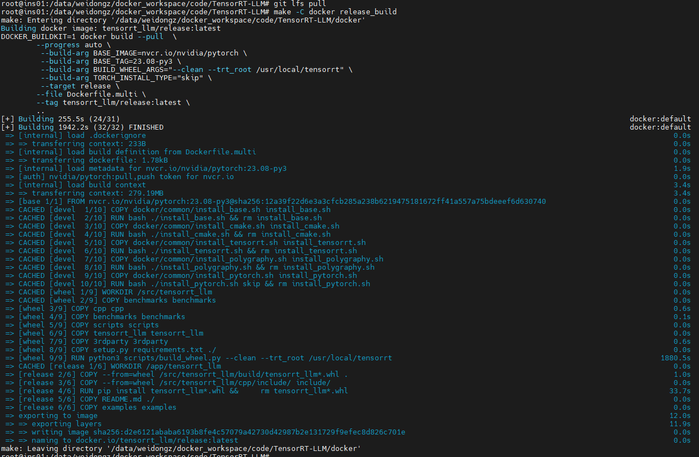
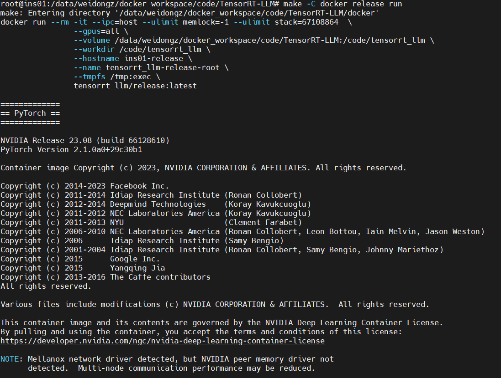

# TRT-LLM 安装

**[Product Information Delivery](https://apps.nvidia.com/PID)**

```
1105342     tensorrt_llm_july-release-v1.tar.gz
1105343     tensorrt_llm_backend_july-release-v1.tar.gz
1105773     TensorRT-9.0.0.2.Linux.x86_64-gnu.cuda-12.2.tar.gz
1106480     polygraphy-0.48.1-py2.py3-none-any.whl
```

## 安装参照：**[Installation](https://github.com/NVIDIA/TensorRT-LLM/blob/release/0.5.0/docs/source/installation.md)**
* 在主机或docker里运行都行，如下是我在主机运行的结果
* 代码下载：**[Fetch the Sources](https://github.com/NVIDIA/TensorRT-LLM/blob/release/0.5.0/docs/source/installation.md#fetch-the-sources)**
* 编译代码：**[Build TensorRT-LLM in One Step](https://github.com/NVIDIA/TensorRT-LLM/blob/release/0.5.0/docs/source/installation.md#build-tensorrt-llm-in-one-step)** (具体信息见附录)


## 运行docker

参照：**[Build TensorRT-LLM in One Step](https://github.com/NVIDIA/TensorRT-LLM/blob/release/0.5.0/docs/source/installation.md#build-tensorrt-llm-in-one-step)**

```
make -C docker release_run
```


<br><br>

## 附录

```
make -C docker release_build
make: Entering directory '/data/weidongz/docker_workspace/code/TensorRT-LLM/docker'
Building docker image: tensorrt_llm/release:latest
DOCKER_BUILDKIT=1 docker build --pull  \
        --progress auto \
         --build-arg BASE_IMAGE=nvcr.io/nvidia/pytorch \
         --build-arg BASE_TAG=23.08-py3 \
         --build-arg BUILD_WHEEL_ARGS="--clean --trt_root /usr/local/tensorrt" \
         --build-arg TORCH_INSTALL_TYPE="skip" \
         --target release \
        --file Dockerfile.multi \
        --tag tensorrt_llm/release:latest \
        ..
[+] Building 255.5s (24/31)                                                                                                                    docker:default
[+] Building 1942.2s (32/32) FINISHED                                                                                                          docker:default
 => [internal] load .dockerignore                                                                                                                        0.0s
 => => transferring context: 233B                                                                                                                        0.0s
 => [internal] load build definition from Dockerfile.multi                                                                                               0.0s
 => => transferring dockerfile: 1.78kB                                                                                                                   0.0s
 => [internal] load metadata for nvcr.io/nvidia/pytorch:23.08-py3                                                                                        1.9s
 => [auth] nvidia/pytorch:pull,push token for nvcr.io                                                                                                    0.0s
 => [internal] load build context                                                                                                                        3.4s
 => => transferring context: 279.19MB                                                                                                                    3.4s
 => [base 1/1] FROM nvcr.io/nvidia/pytorch:23.08-py3@sha256:12a39f22d6e3a3cfcb285a238b6219475181672ff41a557a75bdeeef6d630740                             0.0s
 => CACHED [devel  1/10] COPY docker/common/install_base.sh install_base.sh                                                                              0.0s
 => CACHED [devel  2/10] RUN bash ./install_base.sh && rm install_base.sh                                                                                0.0s
 => CACHED [devel  3/10] COPY docker/common/install_cmake.sh install_cmake.sh                                                                            0.0s
 => CACHED [devel  4/10] RUN bash ./install_cmake.sh && rm install_cmake.sh                                                                              0.0s
 => CACHED [devel  5/10] COPY docker/common/install_tensorrt.sh install_tensorrt.sh                                                                      0.0s
 => CACHED [devel  6/10] RUN bash ./install_tensorrt.sh && rm install_tensorrt.sh                                                                        0.0s
 => CACHED [devel  7/10] COPY docker/common/install_polygraphy.sh install_polygraphy.sh                                                                  0.0s
 => CACHED [devel  8/10] RUN bash ./install_polygraphy.sh && rm install_polygraphy.sh                                                                    0.0s
 => CACHED [devel  9/10] COPY docker/common/install_pytorch.sh install_pytorch.sh                                                                        0.0s
 => CACHED [devel 10/10] RUN bash ./install_pytorch.sh skip && rm install_pytorch.sh                                                                     0.0s
 => CACHED [wheel 1/9] WORKDIR /src/tensorrt_llm                                                                                                         0.0s
 => CACHED [wheel 2/9] COPY benchmarks benchmarks                                                                                                        0.0s
 => [wheel 3/9] COPY cpp cpp                                                                                                                             0.6s
 => [wheel 4/9] COPY benchmarks benchmarks                                                                                                               0.1s
 => [wheel 5/9] COPY scripts scripts                                                                                                                     0.0s
 => [wheel 6/9] COPY tensorrt_llm tensorrt_llm                                                                                                           0.0s
 => [wheel 7/9] COPY 3rdparty 3rdparty                                                                                                                   0.6s
 => [wheel 8/9] COPY setup.py requirements.txt ./                                                                                                        0.0s
 => [wheel 9/9] RUN python3 scripts/build_wheel.py --clean --trt_root /usr/local/tensorrt                                                             1880.5s
 => CACHED [release 1/6] WORKDIR /app/tensorrt_llm                                                                                                       0.0s
 => [release 2/6] COPY --from=wheel /src/tensorrt_llm/build/tensorrt_llm*.whl .                                                                          1.0s
 => [release 3/6] COPY --from=wheel /src/tensorrt_llm/cpp/include/ include/                                                                              0.0s
 => [release 4/6] RUN pip install tensorrt_llm*.whl &&     rm tensorrt_llm*.whl                                                                         33.7s
 => [release 5/6] COPY README.md ./                                                                                                                      0.0s
 => [release 6/6] COPY examples examples                                                                                                                 0.0s
 => exporting to image                                                                                                                                  12.0s
 => => exporting layers                                                                                                                                 11.9s
 => => writing image sha256:d2e6121ababa6193b8fe4c57079a42730d42987b2e131729f9efec8d826c701e                                                             0.0s
 => => naming to docker.io/tensorrt_llm/release:latest                                                                                                   0.0s
make: Leaving directory '/data/weidongz/docker_workspace/code/TensorRT-LLM/docker'

```