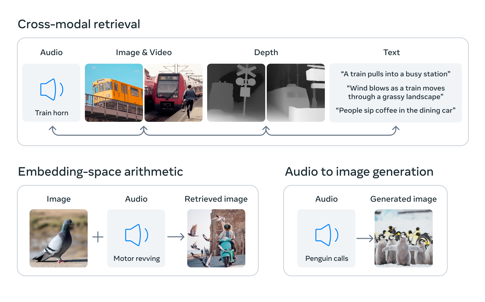

# 

## [ImageBind: Holistic AI learning across six modalities](https://ai.facebook.com/blog/imagebind-six-modalities-binding-ai/)

> When humans absorb information from the world, we innately use multiple senses, such as seeing a busy street and hearing the sounds of car engines. Today, we’re introducing an approach that brings machines one step closer to humans’ ability to learn simultaneously, holistically, and directly from many different forms of information — without the need for explicit supervision (the process of organizing and labeling raw data). We have built and are open-sourcing ImageBind, the first AI model capable of binding information from six modalities. The model learns a single embedding, or shared representation space, not just for text, image/video, and audio, but also for sensors that record depth (3D), thermal (infrared radiation), and inertial measurement units (IMU), which calculate motion and position. ImageBind equips machines with a holistic understanding that connects objects in a photo with how they will sound, their 3D shape, how warm or cold they are, and how they move.
>
> 当人类从世界吸收信息时，我们天生会使用多种感官，例如看到繁忙的街道和听到汽车引擎的声音。 今天，我们推出了一种方法，使机器更接近人类同时、整体和直接从许多不同形式的信息中学习的能力——不需要明确的监督（组织和标记原始数据的过程）。 我们已经构建并正在开源 ImageBind，这是第一个能够绑定来自六种模式的信息的人工智能模型。 该模型学习单个嵌入或共享表示空间，不仅适用于文本、图像/视频和音频，还适用于记录深度 (3D)、热（红外辐射）和惯性测量单元 (IMU) 的传感器，这 计算运动和位置。 ImageBind 使机器具备全面的理解力，将照片中的对象与它们的声音、3D 形状、它们的冷暖程度以及它们的移动方式联系起来。
>
> ImageBind can outperform prior specialist models trained individually for one particular modality, as described in our paper. But most important, it helps advance AI by enabling machines to better analyze many different forms of information together. For example, using ImageBind, Meta’s Make-A-Scene could create images from audio, such as creating an image based on the sounds of a rain forest or a bustling market. Other future possibilities include more accurate ways to recognize, connect, and moderate content, and to boost creative design, such as generating richer media more seamlessly and creating wider multimodal search functions.
>
> 如我们的论文所述，ImageBind 可以胜过针对一种特定模态单独训练的先前专家模型。 但最重要的是，它通过使机器能够更好地分析多种不同形式的信息来帮助推进人工智能。 例如，使用 ImageBind，Meta 的 Make-A-Scene 可以从音频创建图像，例如根据雨林或熙熙攘攘的市场的声音创建图像。 其他未来的可能性包括以更准确的方式识别、连接和调节内容，以及促进创意设计，例如更无缝地生成更丰富的媒体和创建更广泛的多模式搜索功能。
>
> ImageBind is part of Meta’s efforts to create multimodal AI systems that learn from all possible types of data around them. As the number of modalities increases, ImageBind opens the floodgates for researchers to try to develop new, holistic systems, such as combining 3D and IMU sensors to design or experience immersive, virtual worlds. ImageBind could also provide a rich way to explore memories — searching for pictures, videos, audio files or text messages using a combination of text, audio, and image.
>
> ImageBind 是 Meta 致力于创建多模态 AI 系统的一部分，该系统可以从周围所有可能类型的数据中学习。 随着模态数量的增加，ImageBind 为研究人员打开了尝试开发新的整体系统的闸门，例如结合 3D 和 IMU 传感器来设计或体验身临其境的虚拟世界。 ImageBind 还可以提供一种探索记忆的丰富方式——使用文本、音频和图像的组合来搜索图片、视频、音频文件或文本消息。
>
> In typical AI systems, there is a specific embedding (that is, vectors of numbers that can represent data and their relationships in machine learning) for each respective modality. ImageBind shows that it’s possible to create a joint embedding space across multiple modalities without needing to train on data with every different combination of modalities. This is important because it’s not feasible for researchers to create datasets with samples that contain, for example, audio data and thermal data from a busy city street, or depth data and a text description of a seaside cliff.
>
> 在典型的人工智能系统中，每个模态都有特定的嵌入（即可以表示数据及其在机器学习中的关系的数字向量）。 ImageBind 表明可以跨多种模态创建联合嵌入空间，而无需使用每种不同模态组合对数据进行训练。 这一点很重要，因为研究人员无法创建包含来自繁忙城市街道的音频数据和热数据或深度数据和海边悬崖文本描述的样本的数据集。
>
> Just as there have been exciting recent advances in generating images, videos, and audio from text (such as Make-A-Scene and Meta’s Make-A-Video), ImageBind’s multimodal capabilities could allow researchers to use other modalities as input queries and retrieve outputs in other formats. ImageBind is also an important step toward building machines that can analyze different kinds of data holistically, as humans do.
>
> 正如最近在从文本生成图像、视频和音频方面取得了令人兴奋的进展（例如 Make-A-Scene 和 Meta 的 Make-A-Video）一样，ImageBind 的多模式功能可以让研究人员使用其他模式作为输入查询和检索 以其他格式输出。 ImageBind 也是朝着构建能够像人类一样全面分析不同类型数据的机器迈出的重要一步。

> ImageBind is a multimodal model that joins a recent series of Meta's open source AI tools. This includes computer vision models like DINOv2, a new method that doesn’t require fine tuning training high-performance computer vision models, and Segment Anything (SAM) a universal segmentation model that can segment any object in any image, based on any user prompt. ImageBind complements these models as it focuses on multimodal representation learning. It tries to learn a single aligned feature space for multiple modalities, including, but not limited to, images and videos. In the future, ImageBind can leverage the powerful visual features from DINOv2 to further improve its capabilities.
>
> ImageBind 是一个多模态模型，加入了最近 Meta 的一系列开源 AI 工具。 这包括像 DINOv2 这样的计算机视觉模型，一种不需要微调训练高性能计算机视觉模型的新方法，以及 Segment Anything (SAM) 一种通用分割模型，可以根据任何用户提示分割任何图像中的任何对象 . ImageBind 补充了这些模型，因为它专注于多模态表示学习。 它尝试为多种模态学习单一对齐的特征空间，包括但不限于图像和视频。 未来，ImageBind 可以利用 DINOv2 强大的视觉功能进一步提高其能力。
>

### Learning a single embedding space by binding content with images

> Humans have the ability to learn new concepts from only a few examples. We can typically read a description of an animal and then recognize it in real life. We can also look at a photo of an unfamiliar model of a car and anticipate how its engine might sound. This is partly because a single image, in fact, can “bind” together an entire sensory experience. In the field of AI, however, as the number of modalities increases, the lack of multiple sensory data can limit standard multimodal learning, which relies on paired data. Ideally, a single joint embedding space — where many different kinds of data are distributed — could allow a model to learn visual features along with other modalities.

> Previously, learning such a joint embedding space for all modalities would require collecting all possible combinations of paired data — an infeasible feat.

> ImageBind circumvented this challenge by leveraging recent large-scale vision-language models and extending their zero-shot capabilities to new modalities just by using their natural pairing with images, such as video-audio and image-depth data, to learn a single joint embedding space. For the four additional modalities (audio, depth, thermal, and IMU readings), we use naturally paired self-supervised data.
>
> 人类有能力仅从几个例子中学习新概念。 我们通常可以阅读对动物的描述，然后在现实生活中认出它。 我们还可以查看一张不熟悉的汽车模型的照片，并预测其发动机的声音。 这部分是因为一张图片实际上可以将整个感官体验“绑定”在一起。 然而，在人工智能领域，随着模态数量的增加，多感官数据的缺乏会限制依赖配对数据的标准多模态学习。 理想情况下，一个单一的联合嵌入空间——其中分布着许多不同类型的数据——可以让模型学习视觉特征以及其他模态。

> 以前，为所有模态学习这样一个联合嵌入空间需要收集配对数据的所有可能组合——这是一项不可行的壮举。

> ImageBind 通过利用最近的大规模视觉语言模型并将它们的零镜头功能扩展到新模式来规避这一挑战，只需使用它们与图像的自然配对，例如视频音频和图像深度数据，来学习单个联合嵌入 空间。 对于另外四种模式（音频、深度、热和 IMU 读数），我们使用自然配对的自监督数据。
>
> Training image-text models has been extensively studied because of the abundance of images and co-occurring text on the internet. ImageBind uses the binding property of images, meaning they co-occur with a variety of modalities and can serve as a bridge to connect them, such as linking text to image using web data or linking motion to video using video data captured from wearable cameras with IMU sensors.
> 
> The visual representations learned from large-scale web data can be used as targets to learn features for different modalities. This allows ImageBind to align any modality that co-occurs with images, naturally aligning those modalities among themselves. Modalities with a strong correlation to images, such as thermal and depth, are easier to align. Modalities that are not visual, such as audio and IMU, have a weaker correlation. Consider that there are particular sounds, like a baby’s cries, that could accompany any number of visual contexts.
> 
> ImageBind shows that image-paired data is sufficient to bind together these six modalities. The model can interpret content more holistically, allowing the different modalities to “talk” to each other and find links without observing them together. For example, ImageBind can associate audio and text without seeing them together. This enables other models to “understand” new modalities without any resource-intensive training. ImageBind’s strong scaling behavior allows the model to substitute or enhance many AI models by enabling them to use other modalities. For instance, while Make-A-Scene can generate images by using text prompts, ImageBind could upgrade it to generate images using audio sounds, such as laughter or rain.
>
> 由于互联网上大量的图像和同时出现的文本，训练图像文本模型已被广泛研究。 ImageBind 使用图像的绑定属性，这意味着它们与各种模式同时出现，并且可以充当连接它们的桥梁，例如使用 Web 数据将文本链接到图像，或者使用从可穿戴相机捕获的视频数据将运动链接到视频 IMU 传感器。
> 
> 从大规模网络数据中学习的视觉表示可以用作学习不同模式特征的目标。 这允许 ImageBind 对齐与图像同时出现的任何模态，自然地在它们之间对齐这些模态。 与图像有很强相关性的模态，例如热和深度，更容易对齐。 音频和 IMU 等非视觉模式的相关性较弱。 考虑到有一些特定的声音，比如婴儿的哭声，可以伴随任何数量的视觉环境。
> 
> ImageBind 显示图像配对数据足以将这六种模式绑定在一起。 该模型可以更全面地解释内容，允许不同的模式相互“交谈”并找到链接，而无需一起观察它们。 例如，ImageBind 可以关联音频和文本，而无需同时看到它们。 这使其他模型无需任何资源密集型培训即可“理解”新模式。 ImageBind 强大的缩放行为允许模型通过使它们能够使用其他模式来替代或增强许多 AI 模型。 例如，虽然 Make-A-Scene 可以使用文本提示生成图像，但 ImageBind 可以将其升级为使用音频生成图像，例如笑声或雨声。

### ImageBind’s capabilities that outperform

> Image-aligned, self-supervised learning shows that the performance of our model can actually improve by using very few training examples. Our model has new emergent capabilities, or scaling behavior — that is, abilities that didn’t exist in smaller models but appear in larger versions. This might include recognizing which audio fits with a certain image or predicting the depth of a scene from a photo.
> 
> Our analysis shows that ImageBind’s scaling behavior improves with the strength of the image encoder. In other words, ImageBind’s ability to align modalities increases with the strength and size of the vision model. This suggests that larger vision models benefit nonvision tasks, such as audio classification, and the benefits of training such models go beyond computer vision tasks.
> 
> Among our experiments, we used the audio and depth encoders from ImageBind and compared them with prior work in zero-shot retrieval as well as audio and depth classification tasks.
>
> 图像对齐的自监督学习表明，我们的模型的性能实际上可以通过使用很少的训练示例来提高。 我们的模型具有新的紧急能力，或扩展行为——也就是说，在较小的模型中不存在但出现在较大版本中的能力。 这可能包括识别哪些音频适合特定图像或预测照片场景的深度。
> 
> 我们的分析表明，ImageBind 的缩放行为随着图像编码器的强度而提高。 换句话说，ImageBind 对齐模态的能力随着视觉模型的强度和大小而增加。 这表明更大的视觉模型有利于非视觉任务，例如音频分类，并且训练此类模型的好处超出了计算机视觉任务。
> 
> 在我们的实验中，我们使用了 ImageBind 的音频和深度编码器，并将它们与零镜头检索以及音频和深度分类任务中的先前工作进行了比较。
>
> We discovered that ImageBind features can be used for few-shot audio and depth classification tasks and can outperform prior methods tailored for those modalities. For example, ImageBind significantly outperforms Meta’s self-supervised AudioMAE model trained on Audioset and a supervised AudioMAE model fine-tuned on audio classification, with gains of approximately 40 percent accuracy in top-1 accuracy on ≤four-shot classification.
> 
> ImageBind also achieved new state-of-the-art performance on emergent zero-shot recognition tasks across modalities, even outperforming recent models that were trained to recognize concepts for that modality.
>
> 我们发现 ImageBind 特征可用于少镜头音频和深度分类任务，并且可以胜过为这些模式量身定制的先前方法。 例如，ImageBind 明显优于 Meta 在 Audioset 上训练的自监督 AudioMAE 模型和在音频分类上微调的监督 AudioMAE 模型，在≤四次分类上的 top-1 准确率提高了大约 40%。
> 
> ImageBind 还在跨模态的紧急零镜头识别任务上实现了新的最先进的性能，甚至优于经过训练以识别该模态概念的最新模型。

### The future of multimodal learning

> With the capability to use several modalities for input queries and retrieve outputs across other modalities, ImageBind shows new possibilities for creators. Imagine that someone could take a video recording of an ocean sunset and instantly add the perfect audio clip to enhance it, while an image of a brindle Shih Tzu could yield essays or depth models of similar dogs. Or when a model like Make-A-Video produces a video of a carnival, ImageBind can suggest background noise to accompany it, creating an immersive experience.
> 
> People could even segment and identify the objects in an image based on audio. This creates distinctive opportunities to create animations out of static images by combining them with audio prompts. For example, a creator could couple an image with an alarm clock and a rooster crowing, and use a crowing audio prompt to segment the rooster or the sound of an alarm to segment the clock and animate both into a video sequence.
> 
> While we explored six modalities in our current research, we believe that introducing new modalities that link as many senses as possible — like touch, speech, smell, and brain fMRI signals — will enable richer human-centric AI models.
> 
> There’s still a lot to uncover about multimodal learning. The AI research community has yet to effectively quantify scaling behaviors that appear only in larger models and understand their applications. ImageBind is a step toward evaluating them in a rigorous way and showing novel applications in image generation and retrieval.
> 
> We hope the research community will explore ImageBind and our accompanying published paper to find new ways to evaluate vision models and lead to novel applications.
>
> ImageBind 能够使用多种模式进行输入查询并检索其他模式的输出，为创作者展示了新的可能性。 想象一下，有人可以拍摄一段海洋日落的视频，并立即添加完美的音频剪辑来增强它，而斑纹西施犬的图像可以产生类似狗的论文或深度模型。 或者当像 Make-A-Video 这样的模型制作狂欢节视频时，ImageBind 可以建议伴随它的背景噪音，创造身临其境的体验。
> 
> 人们甚至可以根据音频分割和识别图像中的对象。 这创造了独特的机会，可以通过将静态图像与音频提示相结合来从静态图像中创建动画。 例如，创作者可以将图像与闹钟和公鸡打鸣结合起来，并使用打鸣的音频提示来分割公鸡或使用闹钟的声音来分割时钟并将两者制作成视频序列。
> 
> 虽然我们在当前的研究中探索了六种模式，但我们相信，引入连接尽可能多的感官（如触觉、语音、嗅觉和大脑 fMRI 信号）的新模式将使以人为中心的人工智能模型更加丰富。
> 
> 关于多模态学习，还有很多东西有待发现。 AI 研究界尚未有效量化仅出现在较大模型中的缩放行为并了解它们的应用。 ImageBind 是朝着以严格的方式评估它们并展示图像生成和检索中的新颖应用迈出的一步。
> 
> 我们希望研究界能够探索 ImageBind 和我们随附的已发表论文，以找到评估视觉模型并带来新应用的新方法。

  

## Paper: [IMAGEBIND: One Embedding Space To Bind Them All](https://arxiv.org/pdf/2305.05665.pdf)

### Implementation Details - Encoding modalities

> We use a Transformer architecture for all the modality encoders. We use the Vision Transformer (ViT) for images. Following [19], we use the same encoder for images and videos. We temporally inflate the patch projection layer of the ViT and use 2 frame video clips sampled from 2 seconds. We follow for encoding audio and convert a 2 second audio sampled at 16kHz into spectrograms using 128 mel spectrogram bins. As the spectrogram is also a 2D signal like an image, we use a ViT with a patch size of 16 and stride 10. We treat thermal images and depth images as one-channel images and also use a ViT to encode them. We follow to convert depth into disparity maps for scale invariance. We extract the IMU signal consisting of accelerometer and gyroscope measurements across the X, Y , and Z axes. We use 5 second clips resulting in 2K time step IMU readings which are projected using a 1D convolution with a kernel size of 8. The resulting sequence is encoded using a Transformer. Finally, we follow the text encoder design from CLIP.
>
> 我们对所有模态编码器使用 Transformer 架构。 我们对图像使用 Vision Transformer (ViT)。 在 [19] 之后，我们对图像和视频使用相同的编码器。 我们暂时膨胀 ViT 的补丁投影层，并使用从 2 秒采样的 2 帧视频剪辑。 我们遵循编码音频并使用 128 个梅尔频谱图箱将以 16kHz 采样的 2 秒音频转换为频谱图。 由于频谱图也是像图像一样的二维信号，因此我们使用补丁大小为 16 且步幅为 10 的 ViT。我们将热图像和深度图像视为单通道图像，并使用 ViT 对其进行编码。 我们遵循将深度转换为视差图以实现尺度不变性。 我们提取由 X、Y 和 Z 轴上的加速度计和陀螺仪测量值组成的 IMU 信号。 我们使用 5 秒的剪辑生成 2K 时间步长的 IMU 读数，这些读数使用内核大小为 8 的一维卷积进行投影。生成的序列使用 Transformer 进行编码。 最后，我们遵循 CLIP 的文本编码器设计。
>
> 