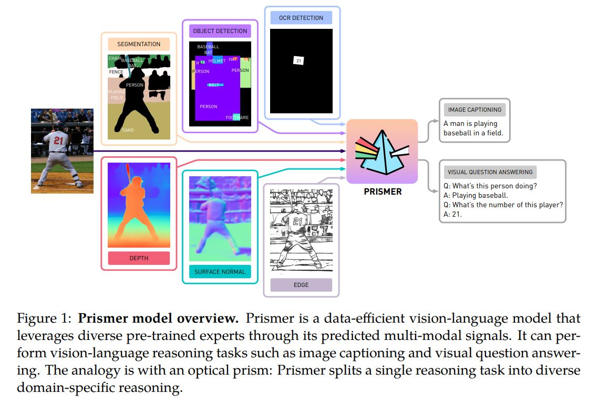
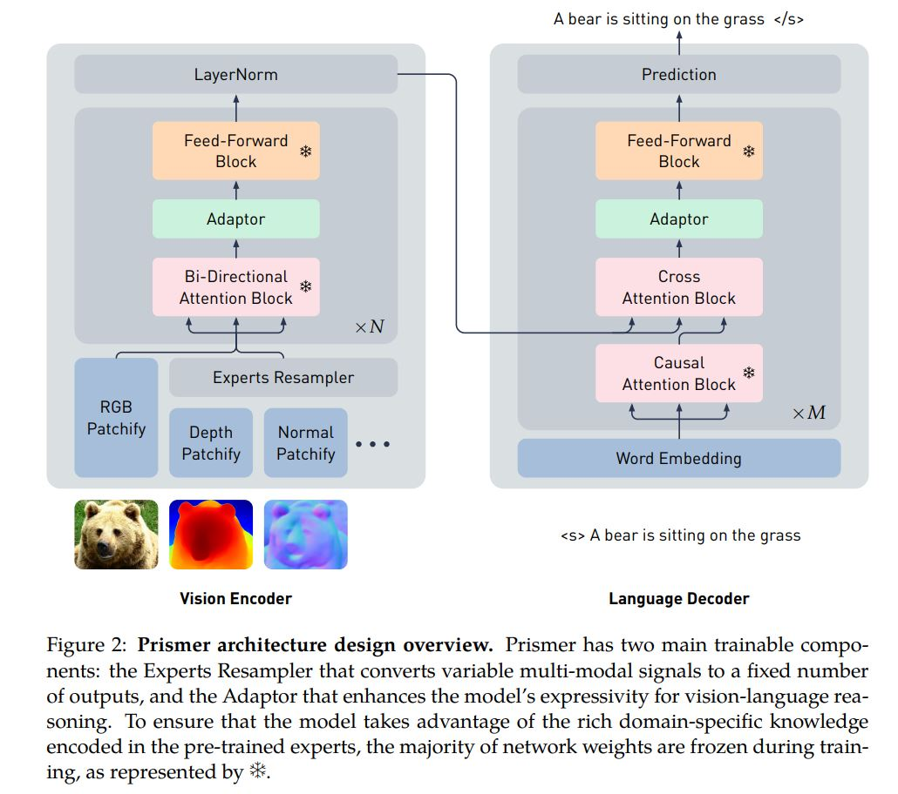
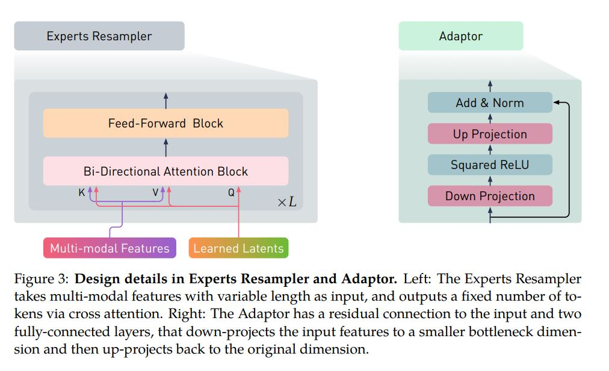
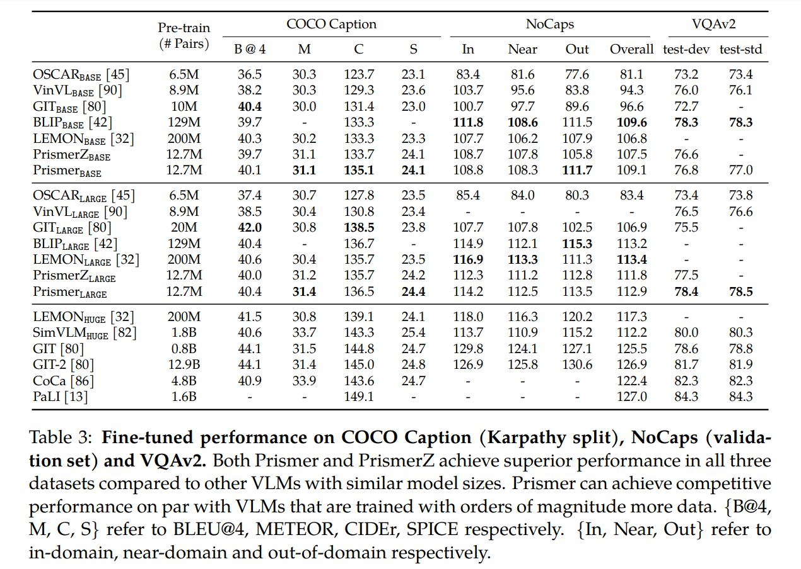
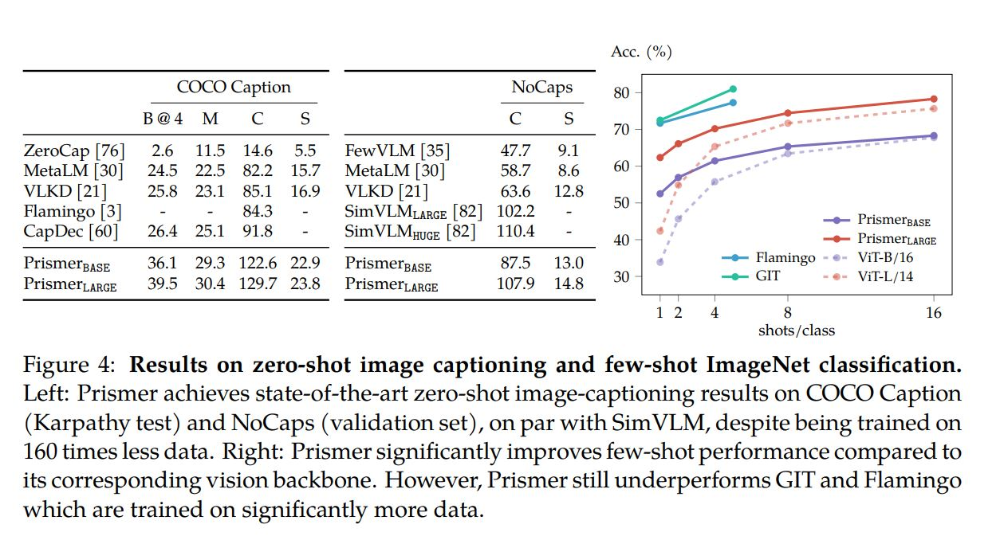
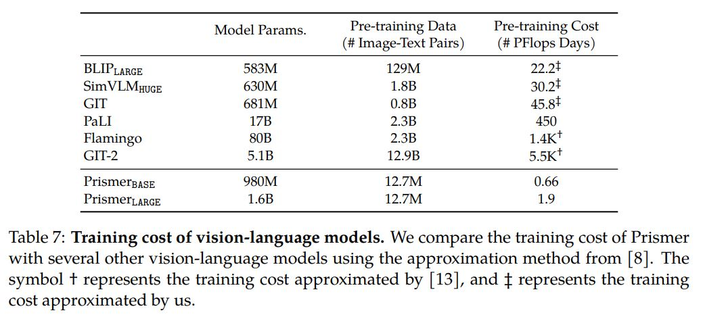

# [Prismer](https://arxiv.org/pdf/2303.02506.pdf)

github: [NVlabs/prismer](https://github.com/NVlabs/prismer)

## 环境配置

参照：[NVlabs/prismer](https://github.com/NVlabs/prismer)

github在构建环境的时候，写的并不详细，环境构建建议参照如下：

```
conda create --name prismer python=3.8
conda activate prismer

git clone https://github.com/NVlabs/prismer.git
cd prismer

conda install pytorch torchvision torchaudio pytorch-cuda=11.7 -c pytorch -c nvidia

pip install -r requirements.txt

```

<br>

## 个人见解
模型整体效果一般，和SOTA尚有差距。模型中应用了多种预训练的experts，如depth/normal/edge等，大量减少了训练参数，整体的训练速度很快，这也算是本文的亮点。但个人在这篇paper上不会投入更多精力。

<br>

## Paper

* **Model Overview**
    * Prismer 是一种数据高效的视觉语言模型，可通过其预测的多模态信号利用各种预训练的专家。 它可以执行视觉语言推理任务，例如图像字幕和视觉问答。 类比是光学棱镜：Prismer 将单个推理任务拆分为多个特定领域的推理。
    * 
    * Prismer is an encoder-decoder transformer model [78] that leverages a library of existing pre-trained experts. It consists of a vision encoder and an auto-regressive language decoder. The vision encoder takes an RGB image and its corresponding multi-modal labels as input (e.g. depth, surface normal, segmentation labels, predicted from the frozen pre-trained experts), and outputs a sequence of RGB and multi-modal features. The language decoder is then conditioned on these multimodal features via cross attention, and produces a sequence of text tokens.
    * **One of the key advantages of the Prismer model is its exceptional data efficiency during training. This is achieved by leveraging a combined power of strong domain-specific experts, resulting in a significant reduction in the number of GPU hours required to achieve comparable performance to other state-of-the-art vision-language models.**
    * Additionally, we also extend the vision encoder to accept multi-modal signals — this enables it to better capture semantics and information about the input image through the help of the generated multi-modal auxiliary knowledge. For example, we expect “text-reading” problems can be easily solved by leveraging an OCR detection expert; and “object-recognition” problems can be easily solved by leveraging an object detection expert.
    * 
    * **To link the multi-modal labels as well as the vision and language parts of Prismer, we insert two types of parameter-efficient trainable components: Experts Resampler and Adaptor. The Experts Resampler is used in the vision encoder to map a variable length of multi-modal signals to a sequence of multi-modal features with a fixed length. The Adaptors are inserted in each transformer layer of the vision and language parts of the model to better adapt the pre-trained experts to new tasks and modalities.**


<br>

* **Key Architectural Components**
    * Modality-Specific Convolutional Stem
    * Experts Resampler
    * Lightweight Adaptor
    * 

<br>

* **Training Objective**

<br>

* **Experiments**
  * 
  * 

<br>

* **Comparison of Training Cost**
    * Prismer is highly efficient in terms of the training cost. The largest model variant, PrismerLARGE, only requires **8 days of training on 32 NVIDIA V100 GPUs**. This is significantly more efficient than previous state-of-the-art VLMs such as **SimVLM [82] which requires 5 days of training on 2048 TPUv3**, **GIT-2 [80] which requires 1.5 months of training on 1500 NVIDIA A100s**, and **Flamingo [3] which requires 2 weeks of training on 1536 TPUv4**. 
    * 