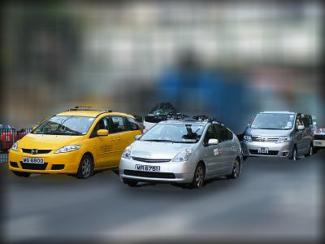

# 在Docker安装CV-CUDA并运行示例

## 下载镜像并启动镜像

* 下载TensorRT镜像：[TensorRT](https://catalog.ngc.nvidia.com/orgs/nvidia/containers/tensorrt)

    ```
    docker pull nvcr.io/nvidia/tensorrt:23.03-py3
    ```
* 下载完成后，启动镜像
    ```
    docker run --shm-size=10gb --gpus all -it --name TENSORRT_CVCUDA --net=host -p 7022:22 -p 7006:6006 -p 7064:6064 -p 7888:8888 -v /home/nvidia/weidong/docker/workspace:/workspace nvcr.io/nvidia/tensorrt:23.03-py3 bash
    ```


## 安装cvcuda

* 参照：[Installation](https://cvcuda.github.io/installation.html#pre-requisites)
  * [cv-cuda （cvcuda、nvcv）教程——Python安装](https://blog.csdn.net/u012863603/article/details/128647822)
  * CV-CUDA安装包下载地址：[CV-CUDA Release v0.2.1](https://github.com/CVCUDA/CV-CUDA/releases)
  * 根据需要下载依赖库，并将依赖库放到`/workspace`目录下：
    
    ```
    wget -c https://github.com/CVCUDA/CV-CUDA/releases/download/v0.2.1-alpha/nvcv-dev-0.2.1_alpha-cuda11-x86_64-linux.deb
    wget -c https://github.com/CVCUDA/CV-CUDA/releases/download/v0.2.1-alpha/nvcv-lib-0.2.1_alpha-cuda11-x86_64-linux.deb
    wget -c https://github.com/CVCUDA/CV-CUDA/releases/download/v0.2.1-alpha/nvcv-python3.8-0.2.1_alpha-cuda11-x86_64-linux.deb
    ```
  * 安装：参照：[Installation](https://cvcuda.github.io/installation.html#pre-requisites)
    ```
    dpkg -i nvcv-lib-0.2.1_alpha-cuda11-x86_64-linux.deb
    dpkg -i nvcv-dev-0.2.1_alpha-cuda11-x86_64-linux.deb
    dpkg -i nvcv-python3.8-0.2.1_alpha-cuda11-x86_64-linux.deb
    ```

## 安装其它库

* **pytorch**：https://pytorch.org/
  ```
  pip3 install torch torchvision torchaudio --index-url https://download.pytorch.org/whl/cu118
  ```

* **torchnvjpeg**:

<br>

## 下载CV-CUDA代码

```
https://github.com/CVCUDA/CV-CUDA.git
```

<br>

## 运行Demo

### 安装依赖
参照：[CV-CUDA Samples](https://github.com/CVCUDA/CV-CUDA/tree/release_v0.2.x/samples)


* **VPF**: [VideoProcessingFramework](https://github.com/NVIDIA/VideoProcessingFramework)

    * 可能遇到的问题：
        * 
        * 参考：[cmake can not find cuda](https://github.com/NVIDIA/VideoProcessingFramework/issues/16)
        * 
        ```
        export CUDACXX=/usr/local/cuda/bin/nvcc
        ```
    ```
    apt install -y \
            libavfilter-dev \
            libavformat-dev \
            libavcodec-dev \
            libswresample-dev \
            libavutil-dev\
            wget \
            build-essential \
            git

    # 这一步比较重要，否则可能报无法找到cuda的错误
    export PATH=/usr/local/cuda/bin:$PATH


    # pip3 install git+https://github.com/NVIDIA/VideoProcessingFramework

    cd /workspace/code/acclib/
    git clone https://github.com/NVIDIA/VideoProcessingFramework.git
    cd VideoProcessingFramework
    pip3 install .

    pip install src/PytorchNvCodec
    ```


* **torchnvjpeg**: https://github.com/itsliupeng/torchnvjpeg

    ```
    cd /workspace/code/acclib/
    git clone https://github.com/itsliupeng/torchnvjpeg.git
    torchnvjpeg/
    python setup.py bdist_wheel
    cd dist/
    pip install torchnvjpeg-0.1.0-cp38-cp38-linux_x86_64.whl
    ```
    * 可能遇到的问题：`ImportError: libc10.so: cannot open shared object file: No such file or directory`
      * [CV-CUDA NVIDIA GPU前后处理库入门](https://blog.csdn.net/qq_40734883/article/details/130052987)
      * 记得在加载torchnvjpeg之前导入torch的包，不然会报某些动态库找不到的错.

* **av: `ModuleNotFoundError: No module named 'av'`**: 
    ```
    pip install av==10.0.0
    ```

* **pyNvCodec: ModuleNotFoundError: No module named 'PyNvCodec'**
  * 如果遇到问题，可以参照VPF的安装


<br>

### 运行Demo
* https://github.com/CVCUDA/CV-CUDA/blob/release_v0.2.x/samples/segmentation/python/inference.py

```
cd /workspace/code/acclib/CV-CUDA/samples/segmentation/python

root@b7e37412e2ea:/workspace/code/acclib/CV-CUDA/samples/segmentation/python# python inference.py -i /workspace/data/Google_Street_View_camera_cars_in_Hong_Kong_2009.jpg  -o /workspace/data/ -c car
Processing batch 1 of 1
        Saving the overlay result for car class for to: /workspace/data/out_Google_Street_View_camera_cars_in_Hong_Kong_2009.jpg

```


