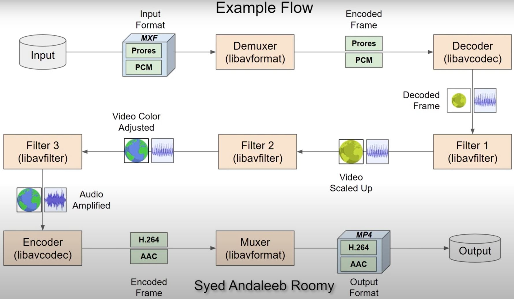

## [Using FFmpeg with NVIDIA GPU Hardware Acceleration](https://docs.nvidia.com/video-technologies/video-codec-sdk/pdf/Using_FFmpeg_with_NVIDIA_GPU_Hardware_Acceleration.pdf)

* FFmpeg is the most popular multimedia transcoding software and is used extensively for video
and audio transcoding. NVENC and NVDEC can be effectively used 

## [FFmpeg Architecture](https://www.youtube.com/watch?v=Oy4iM76Zi6g)

## [FFmpeg - The Ultimate Guide](https://img.ly/blog/ultimate-guide-to-ffmpeg/)

## [FFmpeg 结构与框架的理解](https://www.jianshu.com/p/0ac7f3135d77)

## [FFmpeg Documentation](https://ffmpeg.org/documentation.html)
* 官方文档，重点

## [leandromoreira/ffmpeg-libav-tutorial](https://github.com/leandromoreira/ffmpeg-libav-tutorial)
* 代码教程，star 8.7k

## [FFmpeg](https://wiki.archlinux.org/title/FFmpeg)

  
***
  

# 视频教程

## [FFmpeg 最最强大的视频工具 (转码/压缩/剪辑/滤镜/水印/录屏/Gif/...)](https://www.bilibili.com/video/BV1AT411J7cH/?spm_id_from=333.788.recommend_more_video.0&vd_source=2ef7e92f2d522c31939f486aea77a19e)

## [FFmpeg系列教程第2期](https://www.bilibili.com/video/BV1sL411x7ix/?spm_id_from=333.337.search-card.all.click&vd_source=2ef7e92f2d522c31939f486aea77a19e)

  
***
  

# FFmpeg-GPU-Demo

## [FFmpeg-GPU-Demo](https://github.com/NVIDIA/FFmpeg-GPU-Demo)

## [FFmpeg AI推理+图形渲染的可定制GPU管线](https://www.livevideostack.cn/news/ffmpeg-ai%E6%8E%A8%E7%90%86%E5%9B%BE%E5%BD%A2%E6%B8%B2%E6%9F%93%E7%9A%84%E5%8F%AF%E5%AE%9A%E5%88%B6gpu%E7%AE%A1%E7%BA%BF/)

